# AI-Opus 智能告警自愈系统设计文档

> 文档状态：V1 设计基线。
>
> 当前实现进度：Alertmanager webhook、原始事件持久化、告警归一化、两级去重、
> incident 初步归并已完成；诊断、审批、执行、验证、记忆和通知仍在规划中。

## 1. 项目概览

### 1.1 项目名称

**AI-Opus 智能告警自愈系统**（以下简称 AI-Opus）。

代码仓库当前 Go module 仍为 `oncall-agent`。产品名称和代码 module 的统一不属于本文档
变更范围，后续单独执行。

### 1.2 项目定位

AI-Opus 是一个面向 Prometheus 监控体系的告警诊断与有限自愈 Agent。系统接收
Alertmanager webhook，将原始告警转化为可去重、可归并、可诊断、可审批、可执行、
可验证和可复用的故障处理闭环。

V1 选择 Sub2API 网关系统作为目标业务，覆盖以下运行对象：

- Sub2API 网关进程或容器；
- PostgreSQL；
- Redis；
- 宿主机资源；
- 外部 AI Provider 依赖。

V1 优先支持 Docker Compose 部署；Systemd 和 Kubernetes 通过运行时适配器在后续版本加入。

系统不以“覆盖所有告警”为目标，而以“对一组可复现的典型故障完成可靠闭环”为目标。
告警消失不自动等于故障解决，命令执行成功也不自动等于修复成功，最终状态必须由独立
验证阶段确认。

### 1.3 目标用户

#### 开发者自身

- 使用真实系统验证告警工程、Agent 工程和安全执行能力；
- 将项目作为简历作品，展示 Go、可观测性、LLM Agent、可靠性和安全设计能力；
- 通过可复现故障实验积累诊断规则、运行手册和故障记忆。

#### 面试官与技术评审者

- 评估项目是否解决真实告警问题，而不是仅封装一次 LLM 调用；
- 评估告警身份、可靠消费、状态机、审批、幂等、验证和审计等工程深度；
- 评估系统在 Docker、Systemd 和 Kubernetes 之间的扩展边界；
- 评估设计取舍是否基于实际规模，而不是堆叠 Redis、MQ、向量数据库等组件。

### 1.4 成功标准

V1 的核心成功定义：

> 对 Sub2API 测试环境中的已定义故障，AI-Opus 能在权限边界内完成从告警接收到恢复验证
> 的处理闭环；不能安全自动处理的故障，必须给出有证据的诊断并进入审批或人工升级。

#### 功能成功标准

| 维度 | 验收标准 |
|---|---|
| 可靠接入 | Alertmanager 的 `firing` 和 `resolved` 事件能够鉴权、落库并异步处理 |
| 不丢告警 | 已写入 `raw_event` 的事件在进程异常退出后能够自动补账 |
| 去重 | 100 条完全重复告警只触发 1 次有效诊断，重复事件仍刷新存活时间 |
| 归并 | 同一业务故障产生的多条相关告警能够归入同一个 incident |
| 诊断 | RCA 至少引用一项真实证据，不能只输出通用建议 |
| 修复计划 | 生成结构化 Plan，包含动作、目标、理由、风险和预期结果 |
| 自动修复 | 至少 3 个低风险场景能够自动执行并验证恢复 |
| 审批 | 至少 2 个变更动作必须审批，未审批时不能执行 |
| 禁止动作 | 至少 1 个高风险动作被硬规则拒绝，LLM 不能绕过 |
| 失败闭环 | 验证失败最多重诊 2 次，之后停止自动操作并升级人工 |
| 故障记忆 | 只有验证成功且高置信度的案例可写入；同类故障命中时 0 次 LLM |
| 审计 | 每个 run 可回放证据、推理、计划、审批、执行和验证过程 |
| 可演示性 | 一条命令启动环境，一条命令注入故障，可观察完整处理链路 |

#### V1 故障测试集

| 场景 | 预期策略 |
|---|---|
| Sub2API 网关进程退出 | 满足依赖健康和限频条件时自动重启 |
| Sub2API `/health` 超时 | 收集网关、PostgreSQL、Redis 和宿主机证据后决定是否重启 |
| 网关 5xx 激增 | 区分网关自身、上游 Provider 和依赖故障 |
| 上游 Provider 大量 429 | 诊断限流或配额问题；切换路由需要审批 |
| PostgreSQL 不可用 | 禁止盲目重启网关，进入依赖故障处理 |
| PostgreSQL 连接池耗尽 | 给出限流或参数调整计划，变更需要审批 |
| Redis 不可用或高延迟 | 判断缓存/队列影响，修复动作需要审批 |
| 宿主机磁盘空间不足 | 给出占用证据；删除数据必须审批或禁止 |
| 配置错误导致网关启动失败 | 只诊断并升级人工，不执行重复重启 |

目标结果：所有场景均能正确形成 incident；至少 80% 场景给出正确故障方向；自动修复、
审批和禁止类场景必须 100% 遵守安全边界。

## 2. 技术栈

| 层 | V1 选型 | 状态 | 说明 |
|---|---|---|---|
| 语言 | Go 1.24 | 已使用 | 用于服务、worker、状态机和工具层 |
| HTTP | GoFrame v2 | 已使用 | 承载 webhook、查询和审批 API |
| 告警源 | Prometheus + Alertmanager | 已接入 | Alertmanager 负责分组、抑制、静默和推送 |
| 数据库 | MySQL 8 | 已使用 | 告警、incident、审批、记忆和审计统一存储 |
| ORM | GORM | 已使用 | 仅允许 `internal/store` 直接依赖 |
| Schema | 手工 SQL migration | 已使用 | 保证 ENUM、索引和约束可审查 |
| 可靠队列 | MySQL 状态表 + Go worker | 部分实现 | `raw_event` 已实现，`agent_run` 待实现 |
| Agent 主流程 | Go 显式状态机 | 规划中 | 保证状态持久化、恢复、幂等和可测试性 |
| LLM 推理 | CloudWeGo Eino ReAct | 规划中 | 仅负责 Evidence 到 RCA/Plan 的推理节点 |
| LLM 服务 | OpenAI 兼容 API | 规划中 | 模型、地址和密钥通过配置注入 |
| 监控查询 | Prometheus HTTP API | 规划中 | 即时查询、范围查询和 series 元数据 |
| 运行时工具 | Docker Adapter | 规划中 | V1 读取容器状态/日志，执行受控重启 |
| 通知 | 飞书或企业微信 webhook | 规划中 | 抽象为统一 Notifier 接口 |
| 本地环境 | Docker Compose | 已使用 | MySQL、Prometheus、Alertmanager、node_exporter |

V1 不引入 Redis、RabbitMQ/Kafka、Elasticsearch 或向量数据库。原因不是这些技术没有价值，
而是当前单实例、可审计、低吞吐场景由 MySQL 持久队列即可满足。达到明确的扩展触发条件后
再引入基础设施，见 8.3 和 11.3。

## 3. 架构总览

```mermaid
flowchart LR
    subgraph Target[Sub2API 目标系统]
        S[Sub2API 网关]
        PG[(PostgreSQL)]
        RD[(Redis)]
        UP[AI Provider]
        S --> PG
        S --> RD
        S --> UP
    end

    subgraph Observe[监控与告警]
        PE[Prometheus Exporters]
        P[Prometheus]
        AM[Alertmanager]
        PE --> P --> AM
    end

    subgraph DataPlane[AI-Opus 告警数据面]
        WH[Webhook API]
        RE[(raw_event)]
        IW[Ingest Worker]
        DD[归一化与两级去重]
        CO[Correlator]
        IN[(incident)]
        WH --> RE --> IW --> DD --> CO --> IN
    end

    subgraph ControlPlane[AI-Opus 诊断控制面]
        AR[(agent_run)]
        MEM{Memory Lookup}
        EV[Evidence Collector]
        RS[LLM Reasoner]
        GD[Guard 与 Policy]
        AR --> MEM
        MEM -->|miss| EV --> RS --> GD
        MEM -->|hit| GD
    end

    subgraph ActionPlane[执行与反馈]
        AU[L2 自动动作]
        AP[L3 人工审批]
        RJ[L4 禁止]
        EX[Runtime Adapter]
        VE[Verify]
        NT[Notify 与 Audit]
        FM[(fault_memory)]
        GD --> AU --> EX
        GD --> AP --> EX
        GD --> RJ --> NT
        EX --> VE
        VE --> NT
        VE --> FM
    end

    Target --> PE
    AM --> WH
    IN --> AR
```



系统分为四个边界：

1. **告警数据面**：可靠接收、归一化、去重和 incident 归并；
2. **诊断控制面**：记忆召回、证据收集、LLM 推理和规则纠偏；
3. **执行面**：权限分级、审批、运行时操作和结果验证；
4. **反馈面**：通知、审计、故障记忆写入和失败重诊。

摄入 worker 和诊断 worker 必须分离。LLM、外部 API 或审批等待不能阻塞 Alertmanager
告警摄入。

## 4. P0 — 告警核心（接入 + 去重 + incident 归并）

P0 建立可靠告警数据面，是后续 Agent 能力的前提。没有可靠数据面，LLM 诊断和自动修复
没有可信输入。

### 4.1 告警接入与可靠处理

入口：`POST /webhook/alertmanager`。

处理顺序：

1. 校验请求方法和 Bearer Token；
2. 读取并校验 JSON；
3. 原文写入 `raw_event(status=pending)`；
4. 非阻塞唤醒 ingest worker；
5. 返回 HTTP 202；
6. worker 按 ID 顺序消费 pending 事件；
7. 处理成功标记 `processed`，不可恢复的输入错误标记 `failed`；
8. 数据库或事务错误保留 `pending`，等待下一轮补账。

`raw_event` 是持久事实队列，进程内 channel 只负责唤醒，不承担可靠性。

### 4.2 告警归一化与两级去重

每条 Alertmanager 告警归一化为内部 `NormalizedAlert`，包含 source、name、status、labels、
annotations、时间、severity、fingerprint 和 alert hash。

身份分为三层：

| 身份 | 回答的问题 | 计算依据 |
|---|---|---|
| `fingerprint` | 是否为同一个告警对象 | 选定 labels 排序后做 SHA-256 |
| `alert_hash` | 同一个告警的内容是否完全重复 | 状态、标签、注解等做 MD5，排除时间字段 |
| `group_key` | 多条告警是否属于同一个故障事件 | 配置 labels + 时间窗口 |

去重结果：

- `new`：新 fingerprint，追加 `alert` 并创建 `last_alert`；
- `partial`：fingerprint 相同、hash 不同，追加历史并更新当前快照；
- `full`：fingerprint 和 hash 都相同，不追加历史，只刷新 `last_seen`。

`firing` 和 `resolved` 不参与 fingerprint，因此同一告警恢复时能够更新同一条当前快照。

### 4.3 Incident 归并与生命周期

Correlator 使用 `group_key + 时间窗口` 查找开放 incident：

- 窗口内存在 `candidate/firing` incident：加入该 incident；
- 不存在：创建 `candidate`；
- 成员数达到 `min_alerts`：转换为 `firing`，且只产生一次促发事件；
- full duplicate：不增加成员，只延长开放 incident 的存活时间；
- 所有成员 resolved：incident 转为 `resolved`（规划中）。

`alert`、`last_alert`、`incident`、`incident_alert` 和 `raw_event` 状态必须在同一数据库事务中
提交，避免出现“告警已处理但 incident 未建立”的裂缝。

## 5. P1 — Agent 诊断与报告

P1 的目标是把 firing incident 转换为有证据、可解释、可审计的 RCA 和结构化修复计划，
本阶段默认不执行生产变更。

### 5.1 诊断任务与严重度分流

incident 从 candidate 进入 firing 时创建 `agent_run(status=pending)`。诊断 worker 独立扫描：

- `critical/high`：完整诊断，最多 8 个推理步骤；
- `warning`：轻量诊断，最多 3 个推理步骤；
- `info/low`：只记录和通知，不调用 LLM；
- 人工重诊：创建新的 run，并通过 `retry_of` 关联前一次结果。

严重度来自告警标签和规则，不由 LLM 任意重写。severity 决定诊断深度，工具安全等级决定
动作能否执行，两者不得混用。

### 5.2 Evidence Collector

证据由代码预先收集，不浪费 LLM 步数：

- incident 成员和 `last_alert` 快照；
- `generatorURL` 中 PromQL 在告警时刻前后窗口的回放；
- Sub2API `/health`、请求量、5xx、延迟和上游状态；
- PostgreSQL 连通性、连接数、等待和慢查询摘要；
- Redis ping、延迟、内存和连接数；
- 宿主机 CPU、内存、磁盘和网络；
- Docker 容器状态与受限日志片段。

单个 collector 失败不应让整个 Evidence 构建失败，但必须在审计中记录缺失证据。所有证据
需要限制时间范围、点数、输出长度和超时时间。

### 5.3 Reasoner 与结构化输出

Reasoner 使用 Eino ReAct 调用 OpenAI 兼容模型，只挂载 L1 只读工具。输出契约：

```json
{
  "rca": "PostgreSQL 连接池耗尽导致网关请求排队并产生 5xx",
  "confidence": "high",
  "evidence_refs": ["prom:gateway_5xx", "pg:active_connections"],
  "plan": {
    "action": "adjust_connection_limit",
    "target": {
      "runtime": "docker",
      "kind": "service",
      "name": "sub2api"
    },
    "reason": "当前连接池上限低于并发负载",
    "risk": "medium",
    "expected_result": "连接等待下降，5xx 恢复到阈值以下"
  }
}
```

Reasoner 不直接执行修复。JSON 解析失败最多重试一次；仍失败则 run 标记失败并通知人工。

### 5.4 诊断报告与通知

报告至少包含：

- incident 标识、标题、严重度和影响对象；
- 触发告警与去重/归并结果；
- RCA、置信度和关键证据；
- 建议动作、目标、风险和预期结果；
- 自动执行、等待审批、拒绝或只通知的决策；
- run 链接或查询标识。

通知失败不能回滚已经完成的诊断，但必须记录失败并支持重试。

## 6. P2 — 权限审批、执行与验证

### 6.1 动作安全分级

| 等级 | 含义 | 处理方式 | 示例 |
|---|---|---|---|
| L1 | 只读诊断 | 自动执行 | 查询 Prometheus、读容器状态、读日志 |
| L2 | 低风险、可逆、小影响面修复 | 满足全部护栏后自动执行 | 单实例网关受控重启 |
| L3 | 有状态或影响业务的变更 | 必须人工审批 | 切换上游、调整连接池、修改限流 |
| L4 | 不可逆或影响面不可控 | 永远禁止 | 删除数据库、清空 Redis、执行任意 shell |

L2 自动动作必须同时满足：白名单、真实 target、影响范围受限、限频、全局开关开启、非
dry-run、可验证。任一条件不满足时降级到 L3 或人工处理。

### 6.2 Guard 与 Policy

Plan 进入执行面前必须经过确定性规则：

- `target` 必须来自告警标签、服务清单或运行时实时查询；
- PostgreSQL/Redis 异常时，禁止把重启网关当成默认修复；
- 配置错误、凭据错误、镜像不存在等场景禁止重复重启；
- 同一 target/action 在时间窗口内限制执行次数；
- 动作参数必须通过 schema 和范围校验；
- L4 动作注册即拒绝；
- Guard 改写和拒绝结果必须写入 `agent_run_step`。

### 6.3 审批生命周期

L3 动作创建 `approval(status=pending)`，绑定 `incident_id`、`run_id`、tool、args、reason 和
过期时间。审批状态机：

```text
pending → approved → executed
       ↘ denied
       ↘ expired
approved → failed
```

审批 API 使用与 webhook 相同级别的认证保护。重复 approve/deny 必须幂等，状态已决时返回
冲突。执行前必须再次校验 tool、args、target 和当前资源状态，审批不能替代执行时校验。

### 6.4 Runtime Adapter 与执行

核心 Plan 使用平台无关动作，例如 `restart_workload`，由适配器翻译为具体操作：

```text
RuntimeAdapter
├── DockerAdapter（V1）
│   ├── InspectContainer
│   ├── ReadContainerLogs
│   └── RestartContainer
├── SystemdAdapter（后续）
│   ├── StatusService
│   ├── ReadJournal
│   └── RestartService
└── KubernetesAdapter（后续）
    ├── GetWorkload / GetEvents / GetPodLogs
    ├── RolloutRestart
    ├── Scale
    └── Rollback
```

执行器只能调用注册表中的显式动作，不提供任意 shell 直通。每个工具必须定义安全等级、
超时、最大输出、参数 schema 和 handler。

### 6.5 验证与失败重诊

执行成功只表示命令完成。Verify 需要检查：

- Sub2API `/health` 恢复；
- 原始告警表达式恢复到阈值内；
- 5xx、延迟或依赖错误是否改善；
- Alertmanager 是否收到对应 resolved；
- 是否出现新的副作用告警。

验证失败且重试次数小于 2 时创建新的 `agent_run(retry_of=上次 run)`，注入上次失败计划和
失败原因。达到上限后停止自动执行并升级人工。

## 7. P3 — 故障记忆与平台扩展

### 7.1 故障记忆

V1 使用精确指纹记忆，不使用向量数据库：

```text
fault_fingerprint = md5(group_key + alert_name)[:12]
```

规则：

1. 只有执行成功、验证通过且 `confidence=high` 的案例可以写入；
2. guard 改写过或多次重诊后才成功的案例不自动写入高置信记忆；
3. 命中必须同时满足高置信度和 TTL；
4. 命中后复用 Plan，但安全等级、审批和验证不能绕过；
5. memory hit 验证失败时立即降级为 low，并进入完整重诊；
6. 已审批命令结果写入 `fault_cmd_history`，未命中记忆时可作为历史证据注入。

向量检索未来只作为“相似案例参考”，不能直接触发自动执行。

### 7.2 Kubernetes 扩展

加入 Kubernetes 时保持 Alert、Incident、Evidence、Plan、Policy、Verify 等核心概念不变，
新增 Kubernetes 证据收集器和 Runtime Adapter：

- 从 labels 解析 cluster、namespace、workload、pod；
- 收集 Pod 状态、Events、日志、OwnerReference 和资源用量；
- target 必须能映射到真实 API Server 对象；
- Deployment、StatefulSet、DaemonSet 使用不同动作和审批规则；
- 多集群身份必须进入 group key 和审计上下文；
- Kubernetes 修复动作仍遵守 L1-L4 权限模型。

### 7.3 管理与分析能力

P3 可增加：

- incident、agent run、approval 和 memory 查询页面；
- 高频故障、平均恢复时间和自动修复成功率统计；
- Runbook FULLTEXT 检索；
- 失败案例人工标注与记忆降级；
- Docker/Systemd/Kubernetes 运行时能力矩阵。

## 8. 数据模型

### 8.1 MySQL 表设计

当前 schema 包含十张核心表：

| 表 | 职责 | 关键约束 |
|---|---|---|
| `raw_event` | webhook 原文与可靠消费状态 | `pending/processed/failed` 索引 |
| `alert` | 告警历史，追加写 | `(fingerprint, received_at)` 索引 |
| `last_alert` | 每个 fingerprint 的当前快照 | fingerprint 主键 |
| `incident` | 聚合后的故障事件 | group key + 开放状态索引 |
| `incident_alert` | incident 成员关系 | `(incident_id, fingerprint)` 联合主键 |
| `agent_run` | 诊断任务和一次执行尝试 | status 队列索引、`retry_of` |
| `agent_run_step` | 每一步审计 | `(run_id, seq)` 索引 |
| `approval` | 变更审批单 | run、状态和过期时间 |
| `fault_memory` | 已验证故障记忆 | 12 位故障指纹主键 |
| `fault_cmd_history` | 已审批命令历史 | `(fingerprint, created_at)` 索引 |

状态关系：

```text
raw_event: pending → processed | failed
incident: candidate → firing → acknowledged → resolved
agent_run: pending → running → succeeded | failed
approval: pending → approved | denied | expired → executed | failed
```

后续 migration 需要补充外键或业务层一致性检查时，必须评估历史数据和删除语义，不使用
GORM `AutoMigrate` 隐式修改生产 schema。

### 8.2 缓存设计

V1 不增加独立 Redis。短生命周期缓存仅用于非权威数据，例如：

- Prometheus series 元数据，进程内缓存 1 至 5 分钟；
- 同一次 run 内重复工具调用结果；
- 静态 Runbook 内容解析结果。

告警、审批、执行状态、限频和记忆不能只放进程内缓存，必须持久化到 MySQL。缓存失效时
允许性能下降，不允许改变安全决策。

### 8.3 队列设计与演进条件

V1 不使用 RabbitMQ、Kafka 或 Redis Streams：

- `raw_event.status=pending` 是摄入队列；
- `agent_run.status=pending` 是诊断队列；
- `approval.status=approved` 可作为执行 worker 的待处理集合；
- worker 使用数据库行锁、条件更新和幂等状态迁移保证单次领取。

达到以下任一条件后再评估独立 MQ：

- 需要多个服务实例并行消费和独立扩缩容；
- 告警吞吐使数据库轮询成为明确瓶颈；
- 同一事件需要广播给多个独立消费者；
- 需要跨地域投递、长期积压或独立重试队列；
- 数据库队列延迟无法满足性能目标。

MQ 只替换任务传递机制，MySQL 仍保存权威业务状态和审计记录。

## 9. 错误处理与边界场景

### 9.1 告警可靠性保障

- webhook 未成功落库时返回 4xx/5xx，不返回 202；
- channel 满时只丢唤醒信号，不丢数据库事件；
- 输入错误标 failed，避免坏事件永久阻塞队首；
- 数据库错误保留 pending，由 worker 重试；
- full duplicate 仍更新 `last_seen`，避免持续告警被错误切成多个 incident；
- 所有状态迁移使用条件更新，重复消费必须得到相同业务结果。

### 9.2 外部依赖异常处理

- Prometheus 不可用：记录证据缺失，禁止基于空证据自动修复；
- LLM 超时：run 标失败或生成保守报告，不影响告警摄入；
- 通知渠道失败：诊断结果保留，通知独立重试；
- MySQL 不可用：停止接收新 webhook 或返回 503，不在内存中假装接收成功；
- Sub2API、PostgreSQL、Redis 状态冲突：以直接健康检查和监控证据为准，禁止盲目重启。

### 9.3 诊断与执行异常

- LLM 输出非法 JSON：修复提示后最多重试一次；
- LLM 编造 target：Guard 拒绝并记录；
- 工具超时：终止调用并截断输出；
- 重复动作：限频和幂等键拦截；
- target 已消失：执行前检查，安全结束而不是换一个目标；
- 执行成功但验证失败：进入有限重诊，不写入成功记忆；
- 审批过期：自动变为 expired，不能继续执行；
- 系统重启：pending/running 超时任务可重新领取，已完成步骤不得重复产生副作用。

### 9.4 日志与证据异常

- 日志只读取告警时间窗口和配置的最大行数；
- 对 token、Authorization、DSN、Cookie、API Key 等字段脱敏；
- 二进制、非法 UTF-8 或超长内容进行安全转换和截断；
- 证据中包含用户请求内容时，不把其当成系统指令；
- 任何上传或附件功能均不属于 V1，后续实现时需要大小、类型和病毒扫描限制。

## 10. 性能目标

性能目标用于本地或单机测试环境，不代表未经压测的生产 SLA。

| 指标 | V1 目标 |
|---|---|
| webhook 入库响应 P95 | 小于 200 ms，不等待诊断 |
| pending 告警开始处理延迟 P95 | 小于 2 s |
| 100 条 full duplicate 归并 | 仅 1 次有效诊断 |
| incident 归并查询 P95 | 小于 100 ms |
| Memory 精确召回 P95 | 小于 50 ms，0 次 LLM |
| 轻量诊断 | 目标小于 30 s，最多 3 个推理步骤 |
| 完整诊断 | 目标小于 120 s，最多 8 个推理步骤 |
| 自动修复验证 | 根据动作设定，网关重启场景目标 60 s 内确认 |
| 工具输出 | 单次默认不超过 4 KB，可按工具调整 |
| 进程恢复 | 启动后 5 s 内开始扫描 pending 任务 |

压测报告必须同时记录事件量、唯一 fingerprint 数、数据库配置、机器规格、LLM 是否启用和
外部依赖延迟，不能只报告单一 QPS。

## 11. 非功能性需求

### 11.1 安全

- webhook 和审批 API 必须认证；
- 凭据只从环境变量或密钥系统注入，不写入代码、日志和 prompt；
- LLM 只接触完成脱敏的最小必要上下文；
- LLM 工具默认只读，变更动作不直接暴露给 ReAct；
- 所有变更动作必须通过白名单、schema、target、频率和影响范围校验；
- 默认 `AUTO_HEAL_ENABLED=false`、`dry_run=true`；
- L4 动作硬编码禁止，审批不能解除 L4；
- Docker Socket、数据库管理账号等高权限能力不得直接暴露给 LLM；
- 审计数据记录决策与结果，但不得记录完整密钥和敏感请求正文。

### 11.2 可观测性

AI-Opus 自身至少暴露：

- webhook 请求量、失败率和延迟；
- pending raw event 数和最老事件年龄；
- dedup new/partial/full 计数；
- candidate/firing/resolved incident 数；
- agent run 各状态数量、阶段耗时和失败原因；
- LLM 调用次数、token、延迟和解析失败；
- 工具调用次数、超时和截断；
- approval pending/expired/executed 数；
- 自动修复成功率、验证失败率和人工升级数；
- memory 命中率和失效次数。

日志必须携带 `raw_event_id`、`incident_id`、`run_id`、`approval_id` 等关联字段，支持从告警
入口追踪到最终结果。

### 11.3 可扩展性

- `Correlator` 使用接口隔离，未来可替换为拓扑或规则引擎；
- `EvidenceCollector` 可按数据源增加 Prometheus、日志、数据库和 K8s 实现；
- `RuntimeAdapter` 隔离 Docker、Systemd 和 Kubernetes；
- `Notifier` 隔离飞书、企业微信等渠道；
- `LLM Provider` 使用 OpenAI 兼容接口，模型可配置；
- `Memory Store` 先精确查询，未来可增加语义检索旁路；
- MySQL 队列达到瓶颈后可替换为独立 MQ，但不改变业务状态模型。

系统首先保持模块化单体。只有明确出现独立扩缩容、故障隔离或团队边界时才拆分服务，
不为了展示技术栈预先微服务化。

### 11.4 测试

测试分为五层：

1. **纯函数测试**：fingerprint、hash、severity、group key、路由和 Guard；
2. **数据库集成测试**：事务回滚、去重、incident、状态条件更新和 worker 领取；
3. **HTTP 测试**：鉴权、错误码、落库先行和审批幂等；
4. **适配器测试**：Prometheus、Docker、通知和 LLM 使用 fake server 或受控测试环境；
5. **故障演练测试**：对 Sub2API 测试环境注入故障，验证告警、诊断、执行和恢复闭环。

每次代码变更至少通过：

```bash
go test ./...
go build ./...
go vet ./...
```

自动修复功能上线前必须完成 dry-run 演练、目标校验测试、重复执行测试、进程中断恢复测试和
失败验证测试。未经验证的动作不得标记为自动修复能力。
