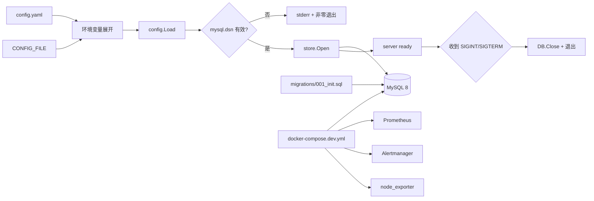

# Day1 实现文档：仓库奠基与可运行基础设施

> 本文对应 `oncall-agent-开发SPEC.md` 的 D01。目标不是完成告警处理，而是把空目录建设成一个可以加载配置、连接 MySQL、执行初始化 schema、启动开发依赖的 Go 工程。
>
> 当前提交：`00222ef D01: establish oncall agent foundation`

## 1. Day1 做了什么

Day1 只解决基础设施问题，形成后续 D02-D14 的稳定边界：

- 初始化 Go module 和仓库目录；
- 从 YAML 加载配置，并展开 `${ENV_NAME}` 环境变量；
- 缺少 `MYSQL_DSN` 时启动立即失败；
- 用一份手动 SQL migration 创建十张 MySQL 8 表；
- 用 GORM 定义十张表的 Go 映射；
- 提供 server 启动入口和 graceful shutdown；
- 用 Docker Compose 启动 MySQL、Prometheus、Alertmanager、node_exporter；
- 为后续 webhook、归一化、去重、诊断预留包边界。

Day1 **没有实现**以下功能：

- Alertmanager webhook 路由；
- Alertmanager payload 解析；
- 指纹、哈希、两级去重；
- worker、incident 关联和 `cmd/simulate` 造数；
- LLM、工具调用、审批、IM 通知。

这些属于 D02 及后续人日。`cmd/simulate` 当前只打印“D03 前尚未接入摄入链路”，避免用假逻辑冒充功能。

## 2. 先看整体数据流

Day1 的运行链路很短：



重要边界：Day1 的 server 还不是 HTTP 服务。它只验证“配置正确、数据库可连接、进程能保持运行并优雅退出”。D03 才会在这个入口上加入 `/webhook/alertmanager`。

## 3. 目录结构与职责

```text
.
├── cmd/
│   ├── server/main.go       # 配置、数据库、信号生命周期
│   └── simulate/main.go     # D03 前的明确提示入口
├── internal/
│   ├── api/                 # HTTP handler，Day1 只有包骨架
│   ├── ingest/              # 归一化、指纹、去重，Day1 只有包骨架
│   ├── incident/            # incident 状态机，Day1 只有包骨架
│   ├── diagnose/            # 诊断流水线，Day1 只有包骨架
│   ├── llm/                 # LLM 工厂和 Reasoner，Day1 只有包骨架
│   ├── tools/               # 工具注册表，Day1 只有包骨架和依赖 pin
│   ├── approval/            # 审批生命周期，Day1 只有包骨架
│   ├── memory/              # fault memory，Day1 只有包骨架
│   ├── notify/              # IM 通知，Day1 只有包骨架
│   ├── config/              # Config、Load、默认值、校验
│   └── store/               # 唯一允许接触 GORM 的边界
├── migrations/
│   └── 001_init.sql         # 十张表的手动 migration
├── config.example.yaml      # 不含真实凭据的完整配置示例
├── docker-compose.dev.yml   # MySQL + Prometheus + Alertmanager + node_exporter
├── prometheus.yml
├── alertmanager.yml
├── go.mod / go.sum
└── .gitignore
```

`internal/store` 是数据库边界。其他 internal 包不应该直接 import `gorm.io/gorm`，否则数据库细节会泄漏到业务层，后续很难测试和替换。

## 4. Go module 与依赖

`go.mod` 的关键声明：

```go
module oncall-agent

go 1.24
```

Day1 使用的直接依赖：

| 依赖 | 版本 | 用途 |
|---|---:|---|
| `gorm.io/gorm` | `v1.31.2` | ORM 核心 |
| `gorm.io/driver/mysql` | `v1.6.0` | MySQL GORM driver |
| `gorm.io/datatypes` | `v1.2.7` | 映射 MySQL JSON 字段 |
| `gopkg.in/yaml.v3` | `v3.0.1` | 解析 YAML |
| `github.com/gogf/gf/v2` | `v2.10.2` | 方案锁定的后续 HTTP 框架依赖 |

GoFrame 目前没有进入运行时路径。`internal/tools/tools.go` 使用：

```go
//go:build tools

package tools

import _ "github.com/gogf/gf/v2/frame/g"
```

`tools` build tag 的作用是让 `go mod tidy` 保留这项后续依赖，但不让 Day1 为了“锁定依赖”而提前编译或启动 GoFrame 路由。实际运行路径仍使用 Go 标准库的信号和进程控制。

## 5. 配置加载：从文件到有效 Config

核心函数是：

```go
func Load(path string) (Config, error)
```

实现位于 `internal/config/config.go`。

### 5.1 加载顺序

`Load` 按以下顺序执行：

1. 检查配置文件路径不为空；
2. `os.ReadFile` 读取 YAML；
3. 先解析成 `yaml.Node`；
4. 递归遍历 YAML 节点中的字符串标量；
5. 把 `${ENV_NAME}` 替换为环境变量；
6. 将展开后的节点 decode 到带默认值的 `Config`；
7. 校验 `mysql.dsn` 与全部数值字段边界；
8. 返回 `Config` 或错误。

`expandEnvironment()` 在 decode 和 `validate()` 之前执行，因此配置文件中出现的每一个 `${ENV_NAME}` 都必须能由 `os.LookupEnv` 找到；`validate()` 在此之后校验 `mysql.dsn` 非空，并逐项校验数值边界（见 5.3）。

使用 YAML 节点而不是直接对整个文件做字符串替换，有两个好处：

- 只处理真正的 YAML 字符串值，不误改注释和格式文本；
- 可以保留 YAML 的整数、布尔值、数组和对象类型。

环境变量匹配规则是：

```text
${[A-Za-z_][A-Za-z0-9_]*}
```

### 5.2 fail-fast 的两种错误

配置变量未设置：

```text
config: environment variable MYSQL_DSN is not set
```

变量存在但展开为空，或者配置直接写空 DSN：

```text
config: mysql.dsn is required; set MYSQL_DSN or mysql.dsn
```

server 不会继续尝试连接数据库，也不会回退到 SQLite。这样配置错误会在进程启动阶段暴露，而不是等第一条告警到来后才暴露。

### 5.3 默认值

默认值在 decode 前创建，再由 YAML 覆盖。Day1 默认了非敏感的运行参数：

| 配置 | 默认值 |
|---|---:|
| `server.port` | `8080` |
| `correlate.window_minutes` | `15` |
| `correlate.min_alerts` | `1` |
| `diagnose.budget.full_steps` | `8` |
| `diagnose.budget.light_steps` | `3` |
| `memory.ttl_seconds` | `3600` |
| `memory.cmd_history_inject` | `5` |
| `approval.ttl_minutes` | `30` |
| `tools.prometheus.base_url` | `http://127.0.0.1:9090` |
| `tools.prometheus.range_minutes` | `15` |
| `tools.prometheus.max_points` | `300` |

密钥、DSN、IM webhook 不设置默认真实值。`config.example.yaml` 中的占位符是必需的环境变量引用，不是可选项：

```yaml
server:
  auth_token: "${AUTH_TOKEN}"
mysql:
  dsn: "${MYSQL_DSN}"
llm:
  roles:
    reasoner:
      api_key: "${ARK_KEY}"
notify:
  im:
    webhook: "${IM_WEBHOOK}"
```

`expandEnvironment()` 会在 `validate()` 之前遍历所有 YAML 字符串，并对每个占位符调用 `os.LookupEnv`。因此直接加载完整的 `config.example.yaml` 时，以下变量都必须存在：`AUTH_TOKEN`、`MYSQL_DSN`、`ARK_KEY`、`CLS_TOPIC`、`MYSQL_RO_DSN`、`IM_WEBHOOK`。任一变量未设置，`Load` 就会返回环境变量错误。

`validate()` 的职责：环境变量展开成功后，它要求 `mysql.dsn` 非空，并校验全部数值字段的边界。若使用只包含 `mysql.dsn: ${MYSQL_DSN}` 的 D01 最小配置，则只需要提供 `MYSQL_DSN`；这和直接加载包含全部占位符的完整示例不是同一场景。

数值边界覆盖（写 0 或负数一律启动失败）：`server.port`（1–65535）、`correlate.window_minutes`/`min_alerts`、`diagnose.budget.full_steps`/`light_steps`、`diagnose.evidence.timeout_seconds`/`log_max_lines`、`memory.ttl_seconds`（`cmd_history_inject` 允许 0，不允许负）、`approval.ttl_minutes`/`l2_rate_window_minutes`/`l2_max_per_window`（`verify_delay_seconds` 允许 0，不允许负）、`tools.prometheus.range_minutes`/`max_points`、`tools.docker.restart_max_per_hour`（`restart_min_interval_seconds` 允许 0）、`llm.roles.*.max_tokens`。时长类字段另有上限，防止换算成 `time.Duration` 溢出。

这条边界是后补的：这些字段最初只有默认值没有校验，配置写 0 时的运行时表现是"立即超时 / 审批立即过期 / 跳过 Verify / 诊断没有预算"——全都是静默失效，看日志也看不出是配置写错了。

### 5.4 配置测试学什么

`internal/config/config_test.go` 覆盖三件事：

1. `${MYSQL_DSN}` 能展开，且默认值生效；
2. 缺失/空环境变量不会静默启动；
3. 错误信息不包含测试 DSN 中的密码片段。

学习时可以先读测试，再反向读实现。这是 Go 中很常见的“先看可观察行为，再看内部实现”的阅读方法。

## 6. 十张表：为什么这样分层

migration 位于 `migrations/001_init.sql`。它只负责建表，不负责插入数据，也不使用 GORM `AutoMigrate`。

### 6.1 表按业务职责分组

| 分组 | 表 | 主要职责 |
|---|---|---|
| 摄入 | `raw_event` | 保留 webhook 原文，支持后续 pending 补账 |
| 摄入 | `alert` | 每次归一化告警的 append-only 明细 |
| 摄入 | `last_alert` | 每个 fingerprint 的当前快照，去重查询入口 |
| 聚合 | `incident` | 多条告警归并后的事件生命周期 |
| 聚合 | `incident_alert` | incident 与 fingerprint 的关联表 |
| 记忆 | `fault_memory` | 已验证的 RCA 和修复计划 |
| 记忆 | `fault_cmd_history` | 审批执行过的命令历史 |
| 执行 | `approval` | L2 变更动作的审批状态机 |
| 诊断 | `agent_run` | 一次诊断运行，也是后续诊断 worker 的队列项 |
| 诊断 | `agent_run_step` | 一次 run 内每个阶段的可回放审计记录 |

### 6.2 `raw_event`、`alert`、`last_alert` 的区别

这是 Day1 最重要的数据建模点。

#### `raw_event`：先保原文

```text
webhook 请求 -> raw_event(status=pending) -> 后台处理
```

原始事件先落库，目的是让 HTTP 接收和后续处理解耦。进程在处理过程中崩溃时，可以扫描 `status='pending'` 的事件重新处理，而不是依赖内存中的请求。

#### `alert`：追加历史

`alert` 每收到一条归一化告警就追加一行，不通过 UPDATE 修改历史。它保存：

- `fingerprint`：同一故障指纹；
- `alert_hash`：用于 full dedup；
- `status`：`firing` 或 `resolved`；
- `labels`、`annotations`：JSON；
- `starts_at`、`received_at`：时间信息。

#### `last_alert`：当前状态快照

`last_alert` 以 `fingerprint` 为主键，只保存每个指纹当前的状态：

- 上一条 `alert_id`；
- 上一条 `alert_hash`；
- 当前状态和严重度；
- 首次出现、最近出现时间；
- `firing_count`；
- 关联的 `incident_id`。

查询当前告警时直接查 `last_alert`，不用扫描整个 append-only 的 `alert` 历史表。这也是后续 D02/D03 做两级去重的基础。

### 6.3 incident 与关联表

`incident` 记录聚合后的生命周期：

```text
candidate -> firing -> acknowledged -> resolved
```

当前 schema 中的关键字段：

- `group_key`：后续 Correlator 的分组键；
- `alerts_count`：成员告警数量；
- `severity`：成员最大严重度；
- `started_at` / `last_seen_at` / `resolved_at`：时间窗口和生命周期。

`incident_alert` 使用联合主键：

```text
PRIMARY KEY (incident_id, fingerprint)
```

同一个 fingerprint 不会在同一个 incident 中重复关联。

### 6.4 记忆、审批和审计

`fault_memory` 保存可复用的诊断案例，`fingerprint CHAR(12)` 是后续 D13 的故障记忆键。它不把 RCA 文本放进 fingerprint，因为记忆查询发生在 LLM 诊断之前。

`approval` 预留完整状态：

```text
pending -> approved / denied / expired
approved -> executed / failed
```

`agent_run` 记录一次诊断的总状态，`agent_run_step` 记录每个阶段的输入、输出和错误。后续流水线可以把 evidence、llm、tool、guard、approval、verify 分别写成 step，而不是只保存一段无法回放的最终文本。

## 7. GORM 映射：数据库边界如何实现

所有模型位于 `internal/store/models.go`。

### 7.1 显式 TableName

每个模型都定义自己的 `TableName()`：

```go
func (RawEvent) TableName() string { return "raw_event" }
func (AgentRunStep) TableName() string { return "agent_run_step" }
```

这样数据库表名不依赖 GORM 默认的复数化规则，SQL 名称和 Go 映射始终明确对应。

### 7.2 类型映射

| SQL 类型 | Go 类型 |
|---|---|
| `BIGINT` | `uint64` |
| `TINYINT` | `uint8` |
| `INT` | `int` |
| `VARCHAR` / `CHAR` / `TEXT` | `string` 或 `*string` |
| `DATETIME(3)` | `time.Time` 或 `*time.Time` |
| `JSON NOT NULL` | `datatypes.JSON` |
| `JSON NULL` | `*datatypes.JSON` |
| 可空 BIGINT | `*uint64` |

可空列使用指针，例如：

```go
ResultJSON *datatypes.JSON `gorm:"column:result_json;type:json"`
FinishedAt *time.Time      `gorm:"column:finished_at"`
```

这样可以区分数据库中的 `NULL` 和一个非空 JSON/时间值，不会把所有 NULL 都误读成零值。

### 7.3 不使用 AutoMigrate

`internal/store/store.go` 中的 `Open` 只创建连接：

```go
func Open(dsn string) (*DB, error) {
    if strings.TrimSpace(dsn) == "" {
        return nil, errors.New("store: mysql DSN is required")
    }

    db, err := gorm.Open(mysql.Open(dsn), &gorm.Config{})
    if err != nil {
        return nil, fmt.Errorf("store: open MySQL: %w", err)
    }
    return &DB{DB: db}, nil
}
```

schema 由 `migrations/001_init.sql` 管理，原因是：

- SQL 中的 ENUM、索引、字段长度和 JSON 类型可审查；
- 生产环境不会因为程序启动而隐式改表；
- migration 可以明确执行、回放和验收；
- GORM 只负责运行时映射，不负责改变数据库结构。

`DB.Close()` 通过 GORM 取出底层 `sql.DB` 并关闭连接池：

```go
sqlDB, err := db.DB.DB()
if err != nil {
    return fmt.Errorf("store: access SQL database: %w", err)
}
return sqlDB.Close()
```

## 8. server 启动与优雅退出

`cmd/server/main.go` 的生命周期是：

```text
读取 CONFIG_FILE
    ↓
config.Load
    ↓
store.Open
    ↓
打印 server ready
    ↓
等待 SIGINT / SIGTERM
    ↓
DB.Close
```

配置路径规则：

- 设置 `CONFIG_FILE`：使用该路径；
- 未设置 `CONFIG_FILE`：使用当前目录的 `config.yaml`。

失败统一通过 `run() error` 返回到 `main()`：

```go
func main() {
    if err := run(); err != nil {
        fmt.Fprintf(os.Stderr, "oncall-agent server: %v\n", err)
        os.Exit(1)
    }
}
```

代码没有使用 `log.Fatal` 或 `panic`。这样调用方可以控制错误处理，测试也可以验证退出行为。

信号处理使用标准库：

```go
ctx, stop := signal.NotifyContext(
    context.Background(),
    os.Interrupt,
    syscall.SIGTERM,
)
defer stop()

fmt.Fprintln(os.Stdout, "oncall-agent: server ready")
<-ctx.Done()
return db.Close()
```

Day1 的实测是：server 使用 Docker MySQL 成功启动，收到 `SIGTERM` 后退出码为 `0`。

## 9. Docker 开发环境

`docker-compose.dev.yml` 固定四个服务：

| 服务 | 镜像 | 端口 | 作用 |
|---|---|---:|---|
| `mysql` | `mysql:8.0` | `3306` | 业务数据库 |
| `prometheus` | `prom/prometheus:v2.54.1` | `9090` | 后续 PromQL 查询和黄金指标 |
| `alertmanager` | `prom/alertmanager:v0.27.0` | `9093` | 后续告警 webhook 来源 |
| `node-exporter` | `prom/node-exporter:v1.8.2` | `9100` | 开发环境指标源 |

MySQL 使用命名卷 `oncall-mysql-data` 保存数据，并配置 `mysqladmin ping` healthcheck。Prometheus 和 Alertmanager 使用仓库内只读挂载的配置文件。

Alertmanager 当前 receiver 指向未来的本地服务入口：

```yaml
url: "http://host.docker.internal:8080/webhook/alertmanager"
send_resolved: true
```

`send_resolved: true` 很重要：后续 D03/D05 需要收到 resolved 告警来关闭当前告警状态和 incident。

### 9.1 启动环境

```bash
docker compose -f docker-compose.dev.yml up -d
docker compose -f docker-compose.dev.yml ps
```

### 9.2 执行 migration

Day1 不引入 migration 框架，手动执行：

```bash
docker compose -f docker-compose.dev.yml exec -T mysql \
  mysql -uroot -poncall-root oncall < migrations/001_init.sql
```

查看表：

```bash
docker compose -f docker-compose.dev.yml exec -T mysql \
  mysql -uroot -poncall-root -N -B oncall -e 'SHOW TABLES'
```

预期恰好十张表。生产环境不要把密码写在命令行；这里的 `oncall-root` 是 Compose 文件中的本地开发默认值，只用于本地联调。

### 9.3 检查服务就绪

```bash
curl -fsS http://127.0.0.1:9090/-/ready
curl -fsS http://127.0.0.1:9093/-/ready
curl -fsS -o /dev/null http://127.0.0.1:9100/metrics
```

## 10. Day1 验收记录

以下命令已在当前环境执行并通过：

```bash
go mod tidy
go build ./...
go vet ./...
go test ./...
```

配置行为已验证：

- 缺少 `MYSQL_DSN` 时，server 非零退出；
- 错误包含配置字段信息；
- 错误不输出 DSN 密码；
- 使用无效数据库地址时，连接错误返回而不是 panic。

Docker live 验收已验证：

- 四个容器全部启动；
- MySQL healthcheck 为 `healthy`；
- migration 后 `SHOW TABLES` 数量为 `10`；
- `last_alert` 主键为 `fingerprint`；
- `incident_alert` 主键为 `(incident_id, fingerprint)`；
- `agent_run_step` 存在 `(run_id, seq)` 索引；
- Prometheus、Alertmanager readiness 通过；
- node_exporter metrics 可访问；
- server 连接 Docker MySQL 后可正常启动和退出。

## 11. 建议的学习顺序

按下面顺序阅读，认知负担最低：

### 第一步：先读测试

文件：`internal/config/config_test.go`

先回答：

- 配置输入是什么？ 不会
- 哪些默认值必须存在？ Mysql
- 缺失 DSN 的 observable behavior 是什么？ 记录日志，停止运行
- 测试如何防止错误信息泄露密码？ 使用 set.env?

### 第二步：读配置实现

文件：`internal/config/config.go`

重点看：

- `Config` 结构如何对应 `config.example.yaml`；
- `defaultConfig()` 为什么在 `Decode` 之前调用；
- `expandEnvironment()` 如何递归遍历 YAML 节点，并在 `validate()` 前要求所有出现的 `${ENV}` 都能找到；
- `validate()` 为什么把"密钥必填"交给 `${ENV}` 展开，自己只管 `mysql.dsn` 非空和数值边界。

### 第三步：从 SQL 反推 Go struct

先读：`migrations/001_init.sql`

再读：`internal/store/models.go`

对照每一张表：

- 主键是否一致；
- 可空列是否用了指针；
- JSON 是否用了 `datatypes.JSON`；
- `TableName()` 是否和 SQL 表名一致；
- 联合主键是否在 GORM tag 中表达。

### 第四步：读连接生命周期

文件：`internal/store/store.go`、`cmd/server/main.go`

画出：

```text
main -> config.Load -> store.Open -> wait signal -> DB.Close
```

然后亲自执行一次：

```bash
go run ./cmd/simulate
go test ./internal/config
go build ./cmd/server
```

### 第五步：观察 Docker 与数据库

```bash
docker compose -f docker-compose.dev.yml ps
docker compose -f docker-compose.dev.yml exec -T mysql \
  mysql -uroot -poncall-root oncall -e 'SHOW CREATE TABLE last_alert'
```

把 SQL 主键、索引和 Go struct 的 tag 一一对上。

## 12. 适合自己的练习题

1. 把 `mysql.dsn` 改成空字符串，观察错误与环境变量未设置时有什么区别。
2. 在配置文件中新增一个普通字符串 `${FOO}`，设置 `FOO` 后确认它能被展开。
3. 删除 `last_alert` 的主键，思考为什么后续 fingerprint 查询和 upsert 会失去稳定边界。
4. 把 `Approval.ResultJSON` 改成非指针，分析数据库 NULL 会怎样映射到 Go。
5. 给 `RawEvent` 加一个临时字段，但不修改 SQL，运行测试并观察 ORM 映射风险。
6. 思考为什么 Day1 不能直接在启动时调用 `AutoMigrate`，而要保留手动 SQL migration。
7. 预读 D02：设计 `NormalizedAlert` 时，哪些字段来自 Alertmanager，哪些字段应该由代码计算？

## 13. Day1 的核心结论

Day1 的价值不是“写了十张表”，而是建立了三个不会轻易改变的边界：

1. **配置边界**：配置文件负责结构，环境变量负责敏感值，启动阶段 fail-fast；
2. **数据边界**：原始事件、历史告警、当前快照、incident、诊断审计分别存储；
3. **依赖边界**：只有 `internal/store` 接触 GORM，业务包以后通过明确的接口使用数据。

后续功能都应在这三个边界上增加行为，而不是把 webhook、去重、LLM 和数据库操作重新揉进一个入口文件。
