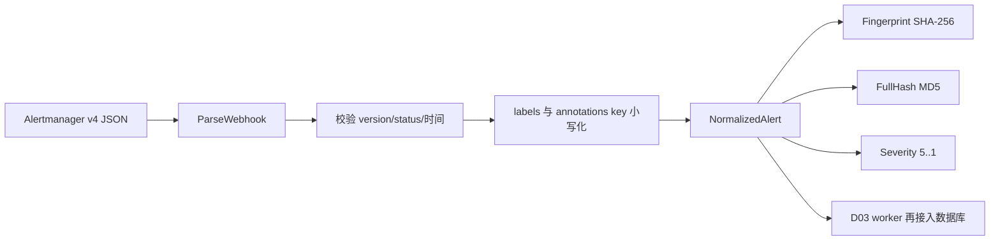

# Day2 实现文档：告警归一化与纯函数指纹

> 本文对应 `oncall-agent-开发SPEC.md` 的 D02。目标是把 Alertmanager v4
> webhook payload 转成稳定的 `NormalizedAlert`，并完成指纹、完整哈希和严重度
> 计算。D02 不接 HTTP、不访问数据库、不启动 worker。
>
> 当前提交：`1adb83f D02: normalize alerts and compute fingerprints`

## 1. Day2 做了什么

Day2 建立了摄入链路中最重要的纯函数边界：输入是一段 JSON，输出是结构化告警；
数据库和网络都不参与计算。

实现内容：

- `ParseWebhook`：解析 Alertmanager v4 payload；
- 统一 status、labels、annotations 和时间字段的表示；
- 计算基于 labels 的 SHA-256 fingerprint；
- 计算用于 full dedup 的 MD5 alert hash；
- 将 severity label 映射为 5 到 1 的整数；
- 用 table-driven tests 验证顺序无关、状态变化、缺失字段和非法输入。

Day2 没有实现：

- `/webhook/alertmanager` HTTP 路由；
- `raw_event` 落库和 202 响应；
- `alert` / `last_alert` 写入；
- full dedup、partial dedup worker；
- `cmd/simulate` 造数和重启补账。

这些属于 D03。D02 只提供 D03 可以直接调用的无副作用计算函数。

## 2. 先看整体数据流



`ParseWebhook` 本身不接收配置和当前时间，因此有两个明确边界：

1. 它使用默认 `severity` label；D03 读取配置后，需要调用 `Severity` 重新计算；
2. 它不填写 `ReceivedAt`，调用方在真正接收或处理告警时填写该时间。

这样做可以让同一个 payload 在单测中得到稳定结果，不因为 `time.Now()` 产生隐式差异。

## 3. 代码位置与职责

```text
internal/ingest/
├── doc.go                 # 包说明
├── types.go               # NormalizedAlert 和常量
├── webhook.go             # Alertmanager payload 解析
├── fingerprint.go         # Fingerprint、FullHash
├── severity.go            # Severity 映射
├── webhook_test.go        # payload 解析测试
├── fingerprint_test.go    # 指纹与哈希测试
└── severity_test.go       # severity 映射测试
```

`internal/ingest` 不导入 GORM，也不依赖 `internal/store`。D02 的核心逻辑可以在没有
MySQL、Docker 或 HTTP server 的环境中直接测试。

## 4. `NormalizedAlert`：从外部格式到内部格式

类型定义位于 `internal/ingest/types.go`。

| 字段 | Go 类型 | 来源或计算方式 | 作用 |
|---|---|---|---|
| `Source` | `string` | 固定为 `alertmanager` | 对应后续 `alert.source` |
| `Name` | `string` | `labels["alertname"]` | 告警名称 |
| `Status` | `string` | alert status，标准化为 `firing` / `resolved` | 生命周期状态 |
| `Labels` | `map[string]string` | payload labels，key 转小写 | 指纹和关联的主要输入 |
| `Annotations` | `map[string]string` | payload annotations，key 转小写 | 描述、摘要、runbook 等上下文 |
| `StartsAt` | `time.Time` | RFC3339 时间解析 | 告警开始时间 |
| `EndsAt` | `time.Time` | RFC3339 时间解析 | resolved 时间；空值保持零值 |
| `GeneratorURL` | `string` | payload `generatorURL` | 后续 D07 回放 PromQL 的入口 |
| `Severity` | `int` | `Severity(labels, labelName)` | 5=critical，1=low |
| `Fingerprint` | `string` | SHA-256 | partial dedup 的稳定身份 |
| `AlertHash` | `string` | MD5 `FullHash` | full dedup 的内容身份 |
| `ReceivedAt` | `time.Time` | D03 接收/处理时填写 | FullHash 明确排除该字段 |

### 4.1 哪些字段来自 payload，哪些字段由代码计算

可以按两类记忆：

```text
payload 原始字段：status / labels / annotations / startsAt / endsAt / generatorURL
代码派生字段：Source / Name / Severity / Fingerprint / AlertHash / ReceivedAt
```

`Name` 虽然没有单独的 payload 字段，但它直接取自 `labels.alertname`；
`ReceivedAt` 不是 Alertmanager 的事件时间，而是系统收到事件的时间，不能混用。

### 4.2 为什么 labels 和 annotations 的 key 要小写化

不同发送方可能使用不同大小写的 key。归一化后：

```text
AlertName -> alertname
Summary   -> summary
```

后续代码可以稳定读取 `labels["alertname"]`、`annotations["summary"]`，也避免同一个
逻辑字段因为 key 大小写不同而得到不同结果。value 不做大小写转换，因为 label value
本身可能区分大小写。

## 5. `ParseWebhook` 的解析规则

公开函数：

```go
func ParseWebhook(payload []byte) ([]NormalizedAlert, error)
```

最小调用示例：

```go
payload := []byte(`{
  "version": "4",
  "alerts": [{
    "status": "firing",
    "labels": {"alertname": "HighCPU", "severity": "critical"},
    "annotations": {"summary": "CPU is high"},
    "startsAt": "2026-08-17T10:00:00Z",
    "endsAt": "0001-01-01T00:00:00Z",
    "generatorURL": "http://prometheus:9090/graph?g0.expr=vector(1)"
  }]
}`)

alerts, err := ingest.ParseWebhook(payload)
if err != nil {
    // 记录阶段错误，不打印密钥或完整敏感配置
}
```

### 5.1 顶层格式校验

当前实现要求：

- payload 不能是空白内容；
- JSON 必须可以解码；
- `version` 必须等于字符串 `"4"`；
- `alerts` 必须存在；
- `alerts` 中每条告警的 status 必须是 `firing` 或 `resolved`。

版本缺失也会被拒绝。原因是 D02 只承诺 Alertmanager v4 格式，不能把未知来源的
相似 JSON 当成生产告警写入 D03。

### 5.2 status 处理

标准 payload 在每条 alert 上带有 `status`。实现还支持在 alert status 缺失时使用
顶层 `status` 作为回退值，最后统一输出小写的标准值：

```text
firing   -> firing
resolved -> resolved
其他值   -> error
```

不把未知 status 默认为 firing。默认 firing 会把输入错误伪装成真实告警，后续可能
错误触发 incident。

### 5.3 labels 和 annotations 缺失

缺失的 `labels` 或 `annotations` 会归一化为空 map，而不是让代码解引用 nil 或返回
空指针。这样可以安全处理不完整 payload：

```go
alert.Labels      // 非 nil 的空 map
alert.Annotations // 非 nil 的空 map
alert.Name        // ""
alert.Severity    // 默认 3
```

这不代表数据库一定接受空名称。`alert.name` 的持久化约束属于 D03，D03 可以在落库前
决定是否拒绝缺失 `alertname` 的事件。

### 5.4 时间处理

`startsAt` 和 `endsAt` 使用 `time.RFC3339Nano` 解析，并统一转换为 UTC。

- 空时间字符串保留 `time.Time{}` 零值；
- 非法时间返回带有 `alerts[index]` 和字段名的错误；
- Alertmanager 常见的
  `0001-01-01T00:00:00Z` 会解析为零时间，通常表示告警尚未结束。

`StartsAt`、`EndsAt` 不参与 `FullHash`。否则同一告警的时间变化会破坏 full dedup。

## 6. Fingerprint：回答“是不是同一个告警对象”

公开函数：

```go
func Fingerprint(labels map[string]string, fields []string) string
```

它返回 64 个十六进制字符的 SHA-256 结果。

### 6.1 默认模式：全部 labels

当 `fields` 为空时，函数收集全部 label key，按字典序排序，再按稳定格式拼接：

```text
alertname=HighCPU\0instance=node-1\0service=payments\0
```

最后对这段字节序列计算 SHA-256。Go map 的遍历顺序不参与结果，因此下面两组输入
得到相同 fingerprint：

```go
map[string]string{
    "instance": "node-1",
    "alertname": "HighCPU",
}

map[string]string{
    "alertname": "HighCPU",
    "instance": "node-1",
}
```

### 6.2 选择模式：只使用配置字段

当 `fields` 非空时，当前实现只保留 labels 中实际存在、并且出现在 fields 中的 key。
支持以下两种写法：

```yaml
fingerprint_fields:
  - service
  - alertname
```

```yaml
fingerprint_fields:
  - labels.service
  - labels.alertname
```

`labels.` 前缀会被去掉，字段随后仍按 key 排序；重复字段只计算一次。

必须注意当前实现的边界：如果配置字段在某条告警上全部缺失，参与拼接的 key 会为空，
结果退化为对空字符串计算 SHA-256。不同告警若都缺失这些字段，可能共享同一个
fingerprint。这个行为没有在 D02 提交中隐式增加回退规则；D03 接入配置时必须明确
采用配置校验、缺失字段编码或其他稳定策略，不能让该情况悄悄进入 dedup。

### 6.3 为什么 firing 和 resolved 共享 fingerprint

Fingerprint 只取 labels，不取 status。因此同一规则的 firing 和 resolved 通知共享
fingerprint：

```text
firing   + 相同 labels -> fingerprint X
resolved + 相同 labels -> fingerprint X
```

这正是后续 D03 识别“同一告警已解除”的基础。状态变化会反映在 `FullHash`，而不是
反映在 fingerprint。

## 7. FullHash：回答“内容是否完全相同”

公开函数：

```go
func FullHash(a NormalizedAlert) string
```

它返回 32 个十六进制字符的 MD5 结果。当前 canonical payload 包含：

- `Source`；
- `Name`；
- `Status`；
- `Severity`；
- `Labels`；
- `Annotations`；
- `GeneratorURL`；
- `Fingerprint`。

明确不包含：

- `StartsAt`；
- `EndsAt`；
- `ReceivedAt`；
- `AlertHash` 自身。

最后一项必须排除，否则计算 `AlertHash` 时会出现自引用。

`encoding/json` 对 string-key map 使用稳定的 key 排序，因此 labels 和 annotations 的
map 插入顺序不会改变 FullHash。状态或内容变化会改变 FullHash：

```text
相同 labels + firing   -> hash A
相同 labels + resolved -> hash B
```

这正好对应方案中的两级去重语义：

```text
相同 fingerprint + 相同 alert_hash -> full duplicate
相同 fingerprint + 不同 alert_hash -> partial duplicate
不同 fingerprint                  -> 新告警
```

D02 只负责计算 hash；“与 `last_alert` 上一条 hash 比较”以及更新快照属于 D03。

## 8. Severity：把文本等级变成可比较的数值

公开函数：

```go
func Severity(labels map[string]string, severityLabel string) int
```

映射表：

| label value | 数值 |
|---|---:|
| `critical` | 5 |
| `error` / `high` | 4 |
| `warning` / `medium` | 3 |
| `info` | 2 |
| `low` | 1 |
| 缺失或未知 | 3 |

比较时会去除首尾空格并忽略 value 大小写。`severityLabel` 也会按小写 key 查找，
因此可以支持配置中的自定义字段：

```go
level := ingest.Severity(alert.Labels, "priority")
```

`ParseWebhook` 没有配置参数，所以默认使用 `severity`。D03 读取
`cfg.Ingest.SeverityLabel` 后，应在落库前重新计算 `Severity`，并重新计算依赖它的
`AlertHash`。

## 9. D03 接入边界

D03 worker 处理完 `ParseWebhook` 后，推荐按以下顺序应用配置和接收时间：

```go
alerts, err := ingest.ParseWebhook(payload)
if err != nil {
    return err
}

for i := range alerts {
    alerts[i].Fingerprint = ingest.Fingerprint(
        alerts[i].Labels,
        cfg.Ingest.FingerprintFields,
    )
    alerts[i].Severity = ingest.Severity(
        alerts[i].Labels,
        cfg.Ingest.SeverityLabel,
    )
    alerts[i].ReceivedAt = time.Now().UTC()
    alerts[i].AlertHash = ingest.FullHash(alerts[i])
}
```

顺序有两个原因：

1. fingerprint 和 severity 使用最终配置，而不是 parser 的默认值；
2. `ReceivedAt` 不进入 FullHash，所以可以在 hash 前或后填写，但统一在最终归一化阶段
   填写更容易理解和持久化。

接着才进入 D03 的数据库事务：

```text
raw_event(pending)
    -> ParseWebhook
    -> 应用 fingerprint/severity/received_at
    -> FullHash
    -> 查 last_alert
    -> 判断 full/partial/new
    -> 写 alert 与 last_alert
```

D02 不应把这些数据库步骤倒灌回 `internal/ingest`，否则纯函数边界会被破坏。

## 10. 测试与验收

D02 的测试位于 `internal/ingest`，核心用例包括：

| 测试 | 防止的回归 |
|---|---|
| `TestParseWebhook` | 标准字段归一化、labels 缺失、非法 JSON、版本、时间和状态错误 |
| `TestParseWebhookUsesTopLevelStatusAsFallback` | alert status 缺失时的顶层状态回退 |
| `TestFingerprintIsIndependentOfLabelOrder` | Go map 顺序影响 fingerprint |
| `TestFingerprintCanSelectAndSortFields` | 字段筛选、`labels.` 前缀和未选择字段变化 |
| `TestFiringAndResolvedAlertsShareFingerprint` | resolved 被错误当成新 fingerprint |
| `TestFullHashIgnoresTimestampFields` | 时间字段导致 full hash 漂移 |
| `TestSeverity` | 5..1 映射和未知值默认 warning |
| `TestSeverityUsesConfiguredLabel` | 自定义 severity label 不生效 |

执行 D02 验收：

```bash
go test ./internal/ingest
```

已完成的仓库级检查：

```bash
go test ./...
go build ./...
go vet ./...
```

D02 不需要 MySQL 或 Docker 验收，因为实现不访问数据库和外部服务。

## 11. 建议的学习顺序

### 第一步：先读测试

先读：

```text
internal/ingest/webhook_test.go
internal/ingest/fingerprint_test.go
internal/ingest/severity_test.go
```

先回答：

- 哪些错误由 `ParseWebhook` 返回，哪些缺失字段会使用零值或默认值？
- 为什么 label key 顺序不能影响 fingerprint？
- 为什么 firing/resolved 的 fingerprint 相同，但 FullHash 不同？
- 为什么时间字段可以进入 `NormalizedAlert`，却不能进入 FullHash？
- 为什么 `ReceivedAt` 不应该由 parser 直接调用 `time.Now()`？

### 第二步：读数据结构

文件：`internal/ingest/types.go`

重点看：

- payload 字段和派生字段如何分开；
- `time.Time` 如何表示 starts/ends/received 三类时间；
- `Fingerprint` 与 `AlertHash` 为什么同时存在；
- `Source` 为什么在没有 source 参数的 parser 中固定为 `alertmanager`。

### 第三步：读解析实现

文件：`internal/ingest/webhook.go`

建议沿着下面的顺序读：

```text
json.Unmarshal
    -> version/alerts 校验
    -> status 标准化
    -> 时间解析
    -> labels/annotations key 小写化
    -> 构造 NormalizedAlert
    -> 计算派生字段
```

然后修改测试 payload，分别观察：

- 删除 `labels`；
- 删除 alert 的 `status` 但保留顶层 `status`；
- 将 `startsAt` 改成非法字符串；
- 将 `version` 改成 `3`。

### 第四步：读两个 hash 函数

文件：`internal/ingest/fingerprint.go`

对照阅读：

1. `fingerprintKeys`：决定哪些 label 进入 fingerprint；
2. `Fingerprint`：决定字符串如何拼接和哈希；
3. `FullHash`：决定哪些归一化字段参与完整内容身份；
4. `canonicalLabels`：避免 nil map 被 JSON 编码为 `null`。

### 第五步：读 severity 映射

文件：`internal/ingest/severity.go`

重点理解：

- severity 是可配置 label 的 value，不是 alert status；
- 未知值默认 warning=3，而不是默认 info；
- parser 默认使用 `severity`，配置化重算由后续接入层负责。

## 12. 适合自己的练习题

1. 给同一组 labels 调换 JSON key 顺序，确认 fingerprint 不变。
2. 修改一个未被 `fingerprint_fields` 选中的 label，确认选择模式下 fingerprint 不变。
3. 修改一个被选中的 label，确认 fingerprint 改变。
4. 将 firing payload 改成 resolved，确认 fingerprint 不变而 FullHash 改变。
5. 修改 `StartsAt`、`EndsAt`、`ReceivedAt`，确认 FullHash 不变。
6. 将 `severity` 改成 `priority`，调用 `Severity(labels, "priority")` 验证自定义字段。
7. 构造 labels 全部缺失配置字段的告警，观察当前 `Fingerprint` 是否退化为空输入哈希，思考 D03 应采用配置校验、固定缺失字段编码还是其他策略。
8. 给 `ParseWebhook` 增加一个非字符串 labels value，观察 JSON 类型错误如何返回。
9. 解释为什么 D03 必须先应用最终 severity/fingerprint 配置，再把 alert 写入 `alert` 和 `last_alert`。

## 13. Day2 的核心结论

Day2 建立了三条后续功能必须遵守的边界：

1. **格式边界**：只接受明确的 Alertmanager v4 payload，外部字段先归一化再进入业务流程；
2. **身份边界**：fingerprint 表示同一告警对象，FullHash 表示同一告警内容，两者不能混用；
3. **纯函数边界**：解析、指纹、完整哈希和严重度计算不访问数据库、不依赖网络，能够独立测试。

D03 的 webhook、落库和 worker 只负责接收、持久化和比较这些结果，不应重新实现一套
解析或哈希逻辑。
