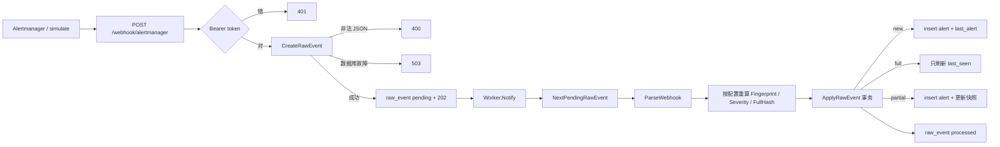

# Day3 实现文档：webhook 落库、去重 worker 与 simulate

> 本文对应 `oncall-agent-开发SPEC.md` 的 D03。目标是把 Alertmanager v4
> webhook 可靠写入 `raw_event`，异步完成 D02 归一化、两级去重和
> `alert`/`last_alert` 持久化，并把 `cmd/simulate` 改成同格式的造数客户端。
>
> 当前提交：`72551af D03: ingest webhook events and deduplicate`
> 当前 tag：`v0.1-m0`

## 1. Day3 做了什么

Day3 把 D02 的纯函数接到真实入口上：HTTP 先落原文，worker 再按配置重算身份并写库。

实现内容：

- `POST /webhook/alertmanager`：Bearer 鉴权，原文写入 `raw_event(pending)` 后立即 202；
- 进程内 worker：MySQL pending 是事实队列，channel 只负责唤醒；
- 启动时和运行中持续扫描 pending，按 `raw_event.id` 顺序处理；
- 两级去重：new / full / partial，全部发生在同一个事务里；
- `alert.generator_url` 持久化，留给 D07 回放 PromQL；
- `cmd/simulate` 走同一 webhook，支持 `-n`、`-dup`、`-resolved`。

Day3 没有实现：

- incident 聚合（D04）；
- incident 状态机和查询 API（D05）；
- 诊断 worker、LLM、审批、通知。

这些属于 D04 及以后。D03 只保证“告警进得来、不丢、能去重、能重放”。

## 2. 先看整体数据流



HTTP 路径只做三件事：鉴权、落原文、唤醒 worker。解析、指纹和去重都不在请求线程里。

这样做的原因：

1. Alertmanager 的 webhook 超时很短，解析和写 `last_alert` 不能堵在 202 之前；
2. 进程崩溃后，pending 行还在 MySQL 里，重启可以补账；
3. 同一份 payload 可以被审计：`raw_event.payload` 是原文，`alert` 是归一化后的历史。

## 3. 代码位置与职责

```text
cmd/server/main.go                 # 加载配置、开库、启动 worker、注册路由、关停
cmd/simulate/main.go               # Alertmanager v4 造数客户端
cmd/simulate/main_test.go          # payload 重复率、resolved 哈希、Bearer 请求
internal/api/alertmanager.go       # webhook 鉴权、落库、唤醒
internal/api/alertmanager_test.go  # 401 / 400 / 503 / 202
internal/ingest/worker.go          # pending 补账、配置重算、失败分类
internal/ingest/worker_test.go     # 顺序、重试、指纹字段缺失、积压
internal/store/store.go            # CreateRawEvent / NextPending / ApplyRawEvent
internal/store/store_test.go       # new/full/partial 事务与回滚
migrations/002_alert_generator_url.sql
```

包边界没有变：

- `internal/api` 不解析告警，不写 `alert` / `last_alert`；
- `internal/ingest` 不直接 import GORM，通过 `pendingEventStore` 接口访问存储；
- `internal/store` 是唯一碰数据库的包。

`store.AlertInput` 存在，是为了避免 `store` import `ingest` 形成循环。字段与 `NormalizedAlert` 一一对应，不是第二套身份算法。

## 4. HTTP 边界：先落库，再 202

公开入口：

```text
POST /webhook/alertmanager
Authorization: Bearer ${AUTH_TOKEN}
```

处理顺序固定：

1. 只接受 POST，其他方法 405；
2. `Authorization` 必须精确等于 `Bearer <token>`，否则 401，且不写库；
3. 读完整 body；
4. `CreateRawEvent`：空内容或非法 JSON 返回 `store.ErrInvalidRawEvent` → 400；
5. 数据库插入失败 → 503，发送方可以重试；
6. 插入成功后 `Notify()`，再写 202。

handler 不调用 `ParseWebhook`。格式错误会先变成 pending，再由 worker 标 failed。这是有意的：HTTP 只保证“原文被审计”，不保证“内容合法”。

token 比较用 `crypto/subtle.ConstantTimeCompare`，响应和日志都不回显 token。

## 5. pending 是事实队列

第一版 worker 用容量 128 的 channel 传 `raw_event.id`。队列满时 HTTP 仍返回 202，但运行中不再扫描 pending，超过 128 条就会滞留，后续事件还可能乱序。

当前实现改成：

```text
MySQL raw_event(pending)  = 事实队列和顺序来源
wake channel 容量 1       = 唤醒信号，多次 Notify 合并
1 秒 ticker               = 漏唤醒或瞬时错误后的补账
```

`NextPendingRawEvent` 始终取 `status='pending'` 且 `id` 最小的一行。因此：

- 积压 200 条不会丢；
- 后到的事件不会插队到更早的 pending 前面；
- `kill -9` 后重启，只要行还是 pending，就会被重新处理。

`ReceivedAt` 取 `raw_event.created_at`，不是 `time.Now()`。否则重启补账会把旧告警伪装成刚收到，错误刷新 `last_seen`，后续 15 分钟关联窗口会漂。

## 6. 处理一条 raw event

`Worker.process` 的顺序：

```text
ParseWebhook(payload)
    -> 每条告警校验 alertname / startsAt
    -> 配置 fingerprint_fields 全部缺失则拒绝
    -> ReceivedAt = raw_event.created_at
    -> Fingerprint / Severity / FullHash 按配置重算
    -> ApplyRawEvent(整批 AlertInput)
```

输入错误和存储错误分开：

| 情况 | 结果 |
|---|---|
| 非法 v4、缺 `alertname`、缺 `startsAt`、配置指纹字段全缺 | `raw_event.status=failed`，不再自动重试 |
| `ApplyRawEvent` 数据库瞬时失败 | 事务回滚，行保持 pending，ticker 再试 |
| 整批成功 | 所有 alert 写入和 `processed` 同一事务提交 |

多告警 payload 不能“前半批已写、后半批失败还标 processed”。`ApplyRawEvent` 先锁 pending 行，再逐条 `applyAlert`，最后才改 status。任一步失败，整批回滚。

## 7. 两级去重：new / full / partial

比较对象永远是 `last_alert` 里该 fingerprint 的上一行，不扫 `alert` 历史。

| 判定 | 条件 | 写库 |
|---|---|---|
| new | 没有快照 | insert `alert` + insert `last_alert`，`firing_count=1` |
| full | 同 fingerprint 且同 `alert_hash` | 不插 `alert`，只刷新 `last_seen` |
| partial | 同 fingerprint 但 hash 不同 | insert `alert`，更新快照的 hash/status/severity/`alert_id`/`last_seen`，`firing_count++` |

full 仍刷新 `last_seen`，是为了防止 Alertmanager `repeat_interval` 重发时关联窗口断掉。内容没变，但“还在 firing”这个事实要续期。

partial 覆盖 firing → resolved。fingerprint 不含 status，所以解除通知打到同一行快照上，只改状态和内容哈希。

`firing_count` 在 partial 时加一，full 时不加。SPEC 的验收口径是：`simulate -n 100 -dup 0.6` 后 `last_alert` 行数 = 去重后指纹数；同一内容的重复只续窗，不把计数当成“又 firing 了一次新内容”。

## 8. 配置重算和指纹字段缺失

D02 的 `ParseWebhook` 不读配置：fingerprint 用全部 labels，severity 用默认 label `severity`。D03 worker 必须按 `config.Ingest` 重算后再落库。

Day2 已经写明：如果 `fingerprint_fields` 在某条告警上全部缺失，`Fingerprint` 会退化成对空串哈希，不同告警可能并成同一个身份。D03 的处理是拒绝，不是静默合并：

```text
配置了 fingerprint_fields
    且这条告警一个选中字段都没有
    -> raw_event failed
    -> 不写 alert / last_alert
```

默认配置 `fingerprint_fields: []` 仍用全部 labels，simulate 走这条路径。

## 9. generatorURL 为什么现在就要落库

D07 要从 `generatorURL` 里取出 PromQL，按 firing 时刻 ±15min 回放。D03 如果不存这个字段，后续无法从 `alert` 行可靠找回表达式。

`raw_event` 和 `alert` 也没有外键。只把 URL 留在原文 JSON 里，D07 无法按 fingerprint 直接定位。所以 `migrations/002_alert_generator_url.sql` 给 `alert` 加了 `generator_url`，worker 把它写进 `AlertInput`。

这份 migration 可重复执行。现有库需要先跑 002，再启动当前 server。

## 10. simulate：和生产走同一入口

```bash
AUTH_TOKEN="$AUTH_TOKEN" go run ./cmd/simulate -n 100 -dup 0.6
AUTH_TOKEN="$AUTH_TOKEN" go run ./cmd/simulate -n 100 -dup 0.6 -resolved
```

参数：

| 参数 | 默认 | 含义 |
|---|---|---|
| `-url` | `http://127.0.0.1:8080/webhook/alertmanager` | 生产 webhook |
| `-token` | `$AUTH_TOKEN` | Bearer token，flag 优先 |
| `-n` | 1 | 告警条数，必须 > 0 |
| `-dup` | 0 | 重复率，`[0,1]` |
| `-resolved` | false | 发解除批次 |

payload 是严格 Alertmanager v4：`version=4`、每条有 status/labels/annotations/RFC3339 时间，`generatorURL` 固定为：

```text
http://127.0.0.1:9090/graph?g0.expr=vector(1)
```

`-n 100 -dup 0.6` 先造 40 组唯一 labels，剩余 60 条复用这些组合。所以 `last_alert` 应有 40 行。`-resolved` 用相同 labels、改 status、写 `endsAt`，因此 fingerprint 不变、FullHash 变，走 partial。

simulate 不直连数据库。非 202 以非零退出，错误摘要不含 token。

## 11. 进程生命周期

`cmd/server` 启动顺序：

```text
Load(config)
    -> auth_token 非空
    -> store.Open
    -> worker.Start   # 先确认能读 pending，再开消费循环并 Notify
    -> GoFrame 监听 /webhook/alertmanager
    -> 打印 server ready
```

关停顺序：停 HTTP → 取消 worker context → `Wait()` → 关数据库。HTTP 启动失败也会先停 worker，避免 goroutine 泄漏。

`go run` 被 SIGTERM 时，包装进程的退出码不一定是 0；独立编译出的二进制正常退出码是 0。验证关停时用编译产物，不要只看 `go run`。

## 12. 建议的学习顺序

### 第一步：对照三张表

文件：`migrations/001_init.sql`、`migrations/002_alert_generator_url.sql`

先分清职责：

```text
raw_event   = 原文信封，pending / processed / failed
alert       = 归一化后的追加历史，只 INSERT
last_alert  = 每个 fingerprint 的当前快照，去重只打这里
```

然后看 002 为什么把 `generator_url` 加在 `alert` 上，而不是指望以后从 raw JSON 反查。

### 第二步：读 HTTP handler

文件：`internal/api/alertmanager.go`

沿着状态码走：

```text
非 POST -> 405
错 token -> 401
非法 JSON -> 400
数据库故障 -> 503
落库成功 -> Notify + 202
```

再读 `alertmanager_test.go`：鉴权失败不能有任何写库或唤醒。

### 第三步：读 worker

文件：`internal/ingest/worker.go`

重点不是 channel，是这三行语义：

1. `NextPendingRawEvent` 决定顺序；
2. `reject` 只处理输入错误；
3. `ApplyRawEvent` 失败时返回 error，不改 failed。

对照 `worker_test.go`：

- ID 2 先入库、ID 1 后入库，处理顺序仍是 1 → 2；
- 第一次 Apply 失败，第二次成功，事件不会变 failed；
- 配置了 `service` 但 labels 没有该字段，直接 failed；
- 200 条积压全部被消费。

### 第四步：读去重事务

文件：`internal/store/store.go` 的 `ApplyRawEvent` / `applyAlert`

建议自己在纸上走三条输入：

1. 全新 fingerprint； 加入	
2. 完全相同的第二条；完全相同更新时间，指纹相同更新一下 alter
3. 相同 labels，status 改成 resolved。 

然后看 `store_test.go` 的断言：full 不增加 `alert` 行，partial 增加一行且 `firing_count=2`，事务失败时 raw event 仍是 pending、alert 行数为 0。

### 第五步：读 simulate

文件：`cmd/simulate/main.go`

算一遍 `-n 100 -dup 0.6`：

```text
unique = 100 - round(100 * 0.6) = 40
前 40 条各自不同 instance
后 60 条 instance = i % 40
```

再确认 resolved 批次只改 status 和 `endsAt`，不改 labels。

## 13. 适合自己的练习题

1. 用错误 token POST，确认 HTTP 401 且 `raw_event` 行数不变。
2. POST 一段非法 JSON，确认 400；POST 合法 JSON 但让 MySQL 不可达，确认 503。
3. 写入一条 pending 后立刻停进程，再启动，确认该行变成 processed，且 `alert.received_at` 等于原来的 `raw_event.created_at`。
4. 连续发两条内容完全相同的 firing，确认 `alert` 仍是 1 行，`last_seen` 被刷新，`firing_count` 仍是 1。
5. 再发相同 labels 的 resolved，确认 `alert` 变成 2 行，`last_alert.status=resolved`，`firing_count=2`。
6. 配置 `fingerprint_fields: [service]`，发送没有 `service` label 的告警，确认 raw event failed，且没有 last_alert。
7. `simulate -n 100 -dup 0.6`，查询 `last_alert` 行数是否为 40。
8. 解释为什么 HTTP handler 不能在返回 202 之前调用 `ParseWebhook`。
9. 解释为什么 full duplicate 也必须更新 `last_seen`。
10. 解释为什么 `ApplyRawEvent` 失败时不能把 raw event 标成 failed。

## 14. Day3 的核心结论

Day3 建立了三条后续功能必须遵守的边界：

1. **可靠性边界**：202 只表示原文已经进 `raw_event`。最终处理靠 pending 补账，不靠内存队列容量。
2. **身份边界**：fingerprint 回答“是不是同一个告警对象”，alert hash 回答“内容有没有变”。去重只和 `last_alert` 的上一行比。
3. **事务边界**：一条 raw event 里的全部告警，要么一起变成 processed，要么全部回滚后保持 pending。输入错误和存储错误不能走同一条失败路径。

D04 的 correlator 应该消费已经去重后的 `last_alert` / `alert`，不要再解析 webhook，也不要再发明一套 fingerprint。
