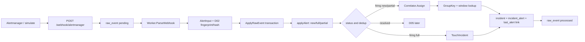

# Day4 实现文档：Correlator、incident 聚合与事务接入

> 本文对应 `oncall-agent-开发SPEC.md` 的 D04。目标是把 D03 已归一化的 firing 告警按配置分组，归并到 `incident`，维护成员、计数、严重度和时间窗口，并在达到阈值时把 candidate 提升为 firing。
>
> D04 不重新解析 webhook，不重新计算 fingerprint，也不在 `ApplyRawEvent` 提交后另开事务写 incident。D05 的 resolved 传播、incident 查询 API、`agent_run` 和诊断分流仍未实现。

## 1. Day4 做了什么

Day4 把 D03 的告警去重结果接到 incident 聚合层。核心变化：

- 新增 `GroupKey` 纯函数，按 `correlate.group_by` 的顺序读取 label；字段缺失时回退到 `name:<alertname>`；
- `ApplyRawEvent` 增加事务内 hook，alert、last_alert、incident、incident_alert 和 raw_event 状态一起提交或一起回滚；
- 在同一分组且窗口内复用 `candidate`/`firing` incident，窗口外创建新的 candidate；
- 用 `incident_alert(incident_id, fingerprint)` 联合主键实现成员幂等；
- `alerts_count` 只统计实际新增的 fingerprint，severity 取成员最大值；
- 成员数达到 `min_alerts` 时执行 candidate → firing，并只返回一次 `Promoted`；
- full duplicate 不增加成员，只刷新已关联 incident 的 `last_seen_at`；
- 每次成功归并都回写 `last_alert.incident_id`；
- worker 继续只解析一次 payload，使用已经计算好的 fingerprint、severity 和 hash；
- `cmd/simulate` 为每条告警增加固定 `service: payments`，可以真实覆盖 `group_by: [labels.service]` 路径。

没有新增 migration。`migrations/001_init.sql` 已包含 `incident`、`incident_alert`、`last_alert.incident_id` 和所需索引。

## 2. 先看整体数据流



HTTP 仍然只做鉴权、原文落库和唤醒 worker。解析、指纹、去重和 incident 聚合全部在异步 worker 的数据库事务中完成。

这样设计解决了一个具体故障窗口：如果先把 raw event 标成 `processed`，再单独调用 Correlator，进程可能在两次提交之间退出，重启时 pending 队列已经没有这条事件，最终会出现“有 alert、没有 incident”。D04 把关联 hook 放在 `ApplyRawEvent` 提交前，避免这个裂缝。

## 3. 代码位置与职责

```text
cmd/server/main.go                    # 将 cfg.Correlate 接入 Worker
cmd/simulate/main.go                  # 为造数告警补 service label
cmd/simulate/main_test.go             # v4 payload、40 个 fingerprint、service label
internal/config/config.go             # correlate 参数默认值和边界校验
internal/config/config_test.go         # window/min_alerts/溢出校验
internal/ingest/correlate.go          # GroupKey、Correlator.Assign
internal/ingest/correlate_test.go     # GroupKey、Assign 转发、窗口溢出
internal/ingest/worker.go             # ApplyRawEvent hook 和 D04 分支
internal/ingest/worker_test.go        # Assign、Touch、resolved、配置分组
internal/store/store.go               # 事务 hook、incident 持久化和锁
internal/store/store_test.go           # MySQL 事务、窗口、幂等、回滚
migrations/001_init.sql                # 已有 incident 及成员表结构
```

包边界保持不变：

- `internal/api` 不解析告警，不写 `alert`、`last_alert` 或 `incident`；
- `internal/ingest` 只依赖 `store` 的窄接口，不导入 GORM；
- `internal/store` 是唯一直接依赖 GORM 的业务包；
- `cmd/server` 只负责组装配置、数据库、worker 和 HTTP 生命周期。

## 4. GroupKey：分组身份不是 fingerprint

公开纯函数：

```go
func GroupKey(alert CorrelationInput, cfg config.CorrelateConfig) string
```

`CorrelationInput` 是 D03 已经归一化的最小视图：

```go
type CorrelationInput struct {
    Fingerprint string
    Name        string
    Labels      map[string]string
    Severity    int
    ObservedAt  time.Time
}
```

规则固定如下：

1. 遍历 `cfg.GroupBy`，保留配置顺序；
2. 对字段名执行 `TrimSpace`，去掉可选的 `labels.` 前缀；
3. 任一字段为空、对应 label 缺失或 label 值为空，整条 key 回退为 `name:<alert.Name>`；
4. 所有字段存在时，用英文逗号连接 label value；
5. `group_by` 为空时直接使用 `name:<alert.Name>`；
6. 不排序、不哈希、不复用 `Fingerprint` 的“空字段=全部 labels”语义。

示例：

| 配置 | labels | 结果 |
|---|---|---|
| `[labels.service]` | `service=payments` | `payments` |
| `[service]` | `service=payments` | `payments` |
| `[labels.zone, service]` | `zone=prod, service=payments` | `prod,payments` |
| `[labels.service]` | 缺少 `service` | `name:HighCPU` |
| `[]` | 任意 | `name:HighCPU` |

数据库查询使用 `BINARY group_key = BINARY ?`，保持 `GroupKey` 的精确字符串语义。否则 `incident.group_key` 继承的 `utf8mb4_0900_ai_ci` 会把大小写不同或尾部空格不同的 key 当成相同值。

## 5. ApplyRawEvent：在一个事务里接入 D04

`internal/store` 新增事务边界类型：

```go
type IncidentInput struct {
    GroupKey    string
    Fingerprint string
    Name        string
    Severity    int
    ObservedAt  time.Time
}

type IncidentAssignment struct {
    IncidentID uint64
    Status     string
    Created    bool
    Promoted   bool
}

type IncidentTx interface {
    AssignIncident(context.Context, IncidentInput, time.Duration, int) (IncidentAssignment, error)
    TouchIncident(context.Context, uint64, time.Time, int) error
}

type AlertApplyResult struct {
    Input AlertInput
    Dedup DedupResult
    Last  LastAlert
}

type RawEventApplyHook func(context.Context, IncidentTx, AlertApplyResult) error
```

`ApplyRawEvent` 当前签名：

```go
func (db *DB) ApplyRawEvent(
    ctx context.Context,
    rawEventID uint64,
    inputs []AlertInput,
    processedAt time.Time,
    hook RawEventApplyHook,
) ([]AlertApplyResult, error)
```

事务顺序：

```text
锁定 pending raw_event
    -> 对每条 AlertInput 执行 applyAlert
    -> 调用 D04 hook
    -> 全部成功后更新 raw_event.status=processed
    -> 提交
```

`hook == nil` 时仍然只执行 D03 的 alert/last_alert 写入，供已有 store 调用方使用。

任一环节失败都会回滚：

- 新建的 alert；
- 更新或新建的 last_alert；
- incident；
- incident_alert；
- candidate → firing 状态变化；
- raw_event 的 processed 状态。

输入错误仍走原来的 `MarkRawEventFailed` 路径；数据库错误或 D04 hook 错误保持 `pending`，由 worker ticker 重试。不能把存储失败伪装成不可重试的输入错误。

`AlertApplyResult.Last` 让 worker 能区分 full duplicate 是否已有 `incident_id`。new/partial 通过 `AssignIncident` 建立或刷新关联；full 只对已有 incident 调 `TouchIncident`。

## 6. Incident 归并规则

### 6.1 开放 incident 选择

`AssignIncident` 只选择满足以下条件的最新记录：

```sql
BINARY group_key = BINARY ?
AND status IN ('candidate', 'firing')
AND last_seen_at >= observed_at - window
ORDER BY last_seen_at DESC, id DESC
LIMIT 1
FOR UPDATE
```

窗口边界包含等于 cutoff 的记录。`ObservedAt` 来自 `raw_event.created_at`，不是处理时刻，因此重启补账不会把旧告警伪装成新告警。

当前实现依赖单 ingest worker 保证“同一时刻没有开放行时不会并发双建”。已有 incident 使用行锁串行更新；没有额外引入 advisory lock、缓存或新唯一索引。

### 6.2 新建和归并

没有匹配 incident 时，先创建：

```text
status       = candidate
alerts_count = 0
severity     = 当前告警 severity
title        = {group_key}: {首条告警 name}
started_at   = ObservedAt
last_seen_at = ObservedAt
```

随后所有路径都执行同一套成员逻辑：

1. 以 `(incident_id, fingerprint)` 插入 `incident_alert`；
2. 使用 `ON CONFLICT DO NOTHING` 保证幂等；
3. 只有实际新增成员时才 `alerts_count++`；
4. `severity = max(旧值, 当前值)`；
5. `last_seen_at = max(旧值, ObservedAt)`；
6. 更新 `last_alert.incident_id`。

因此：

- 相同 fingerprint 的 partial 不会重复成为成员；
- full duplicate 不会增加成员或计数；
- 低严重度告警不会降低 incident severity；
- 乱序事件不会把 incident 的时间倒退；
- `alerts_count` 等于成员表中唯一 fingerprint 数，不等于 alert 历史行数，也不等于 `firing_count`。

### 6.3 candidate 促发

成员链接和计数更新后，如果原状态是 candidate 且 `alerts_count >= min_alerts`，则更新为 firing，并返回：

```go
IncidentAssignment{Promoted: true}
```

已是 firing 的 incident 不重复返回促发事件。`min_alerts=1` 时，新建 incident 在第一条 firing 告警完成同一事务内直接进入 firing。

D04 只记录促发日志，不创建 `agent_run`；诊断队列和 severity route 属于 D05。

### 6.4 full heartbeat

full duplicate 只刷新 `last_alert.last_seen`，但长期 firing 告警还需要续 incident 窗口。worker 在 full 且 `last_alert.incident_id` 非空时调用：

```go
TouchIncident(ctx, incidentID, observedAt, severity)
```

`TouchIncident` 只更新开放 candidate/firing incident 的 `last_seen_at` 和最大 severity：

- 不插入 `incident_alert`；
- 不增加 `alerts_count`；
- 不创建新 incident；
- incident 已关闭或指针为空时幂等 no-op。

促发日志在 `ApplyRawEvent` 成功返回后才输出，避免事务最终回滚时产生误导日志。

## 7. Worker 接入路径

`Worker.process` 的顺序仍是：

```text
ParseWebhook
    -> 校验 alertname / startsAt / fingerprint 字段
    -> 以 raw_event.created_at 设置 ReceivedAt
    -> 计算 Fingerprint / Severity / FullHash 一次
    -> 构造 []store.AlertInput
    -> ApplyRawEvent(..., hook)
```

hook 的分支：

| D03 结果 | alert status | D04 行为 |
|---|---|---|
| new | firing | `Correlator.Assign` |
| partial | firing | `Correlator.Assign`，成员操作幂等 |
| full | firing | 已有 incident 时 `TouchIncident` |
| new/full/partial | resolved | 不进入 D04，留给 D05 |

worker 构造器现在接收完整 correlate 配置：

```go
func NewWorker(
    db *store.DB,
    ingestCfg config.IngestConfig,
    correlateCfg config.CorrelateConfig,
    logger *log.Logger,
) *Worker
```

`cmd/server/main.go` 使用 `cfg.Correlate` 构造 worker；HTTP handler 和 `cmd/simulate` 不直接依赖 Correlator。

## 8. simulate：覆盖真实分组路径

每条模拟告警的 labels 包含：

```json
{
  "alertname": "SimulatedAlert",
  "instance": "node-0",
  "service": "payments",
  "severity": "critical"
}
```

在默认 `fingerprint_fields: []` 下，`instance` 参与唯一 fingerprint，`service` 让配置：

```yaml
correlate:
  group_by: [labels.service]
  window_minutes: 15
  min_alerts: 3
```

可以把三条不同 fingerprint 的告警归到同一个 incident。

常用命令：

```bash
AUTH_TOKEN="$AUTH_TOKEN" go run ./cmd/simulate -n 100 -dup 0.6
AUTH_TOKEN="$AUTH_TOKEN" go run ./cmd/simulate -n 3 -dup 0
```

simulate 仍然只通过 webhook 发送，不直连数据库；非 202 或网络错误返回非零退出码，错误输出不包含 token。

## 9. 测试覆盖

### 9.1 配置和纯函数

`internal/config/config_test.go` 覆盖：

- 默认 window=15、min_alerts=1；
- window 为 0/负数时拒绝；
- min_alerts 为 0/负数时拒绝；
- window 超过 `time.Duration` 可表示范围时拒绝。

`internal/ingest/correlate_test.go` 覆盖：

- `service` 与 `labels.service` 等价；
- 配置顺序决定拼接顺序；
- 缺失/空 label 和空 group_by 回退 `name:`；
- Correlator 把已归一化字段、窗口和阈值转发给 store；
- 直接构造超大窗口时拒绝，避免 duration 溢出。

### 9.2 Worker

`internal/ingest/worker_test.go` 保留 D03 的顺序、重试、拒绝和积压测试，并新增：

- firing 告警进入 Assign；
- 配置 `group_by: [labels.service]` 时得到 `payments` group key；
- full duplicate 只进入 Touch；
- resolved 告警不进入 D04。

### 9.3 MySQL 集成

`internal/store/store_test.go` 使用 `TEST_MYSQL_DSN` 控制是否运行 MySQL 集成测试，覆盖：

- new/full/partial 去重；
- 三条同组告警在窗口内归并到一个 incident；
- min_alerts=3 时前两条保持 candidate，第三条只促发一次；
- severity 取最大值；
- full/partial 不重复增加成员；
- cutoff 边界归并，超过 MySQL `DATETIME(3)` 的最小可表示精度 1ms 后新建；
- 大小写和尾空格不同的 group key 不合并；
- hook 在已写入 incident/member/last_alert 后失败时，所有 D03+D04 数据和 raw_event 状态一起回滚。

### 9.4 simulate 和全仓验证

`cmd/simulate/main_test.go` 覆盖：

- Alertmanager v4 payload；
- service label；
- `-n 100 -dup 0.6` 产生 40 个唯一 fingerprint；
- resolved 与 firing fingerprint 相同、hash 不同；
- Bearer 请求和 202 响应。

本次实际执行并通过：

```bash
go test ./...
go build ./...
go vet ./...

TEST_MYSQL_DSN='oncall:oncall-pass@tcp(127.0.0.1:3306)/oncall?parseTime=true&loc=UTC' \
  go test -count=1 ./internal/store

go test -count=1 ./internal/config ./internal/ingest ./cmd/simulate
```

MySQL 集成测试前确认了 Compose 中的 MySQL healthy，并应用了已有的 `migrations/001_init.sql` 和 `migrations/002_alert_generator_url.sql`。

## 10. 真实端到端验收

使用临时配置：

```yaml
server:
  port: 18081
  auth_token: ${D04_AUTH_TOKEN}
mysql:
  dsn: ${MYSQL_DSN}
ingest:
  fingerprint_fields: []
  severity_label: severity
correlate:
  group_by: [labels.service]
  window_minutes: 15
  min_alerts: 3
```

启动 server 后连续发送两批：

```bash
AUTH_TOKEN="$D04_AUTH_TOKEN" \
  go run ./cmd/simulate \
  -url http://127.0.0.1:18081/webhook/alertmanager \
  -n 3 -dup 0
```

实际观测结果：

```text
49  payments  firing  5  3
49  firing  3
processed
processed
401
```

含义：

- 第一批创建 `payments` incident；
- incident 状态为 firing，severity=5，alerts_count=3；
- 第二批重复发送后仍是同一 incident，成员数保持 3；
- 两条 raw event 都处理为 processed；
- 错误 token 返回 HTTP 401。

上述端到端测试使用的 raw event、alert、last_alert、incident 和 incident_alert 数据已清理，避免污染开发库。

## 11. 建议的学习顺序

### 第一步：先看 schema 和已有 D03 数据模型

文件：`migrations/001_init.sql`、`internal/store/models.go`

先分清：

```text
raw_event       = 原文信封和可靠队列
alert           = append-only 告警历史
last_alert      = fingerprint 当前快照
incident        = 分组后的生命周期
incident_alert  = incident 成员唯一关系
```

特别看 `incident_alert` 的联合主键，以及 `last_alert.incident_id` 为什么不能替代成员表。

### 第二步：读 GroupKey

文件：`internal/ingest/correlate.go`

自己走以下输入：

1. `group_by=[labels.service]`，labels 有 service；
2. `group_by=[service]`，labels 有 service；
3. labels 缺 service；
4. `group_by=[]`；
5. 两个分组值顺序不同。

重点是：GroupKey 是分组键，不是告警 fingerprint，也不应该调用 `Fingerprint`。

### 第三步：读 ApplyRawEvent hook

文件：`internal/store/store.go` 的 `ApplyRawEvent`、`applyAlert`。

沿着事务走：

```text
raw_event FOR UPDATE
    -> applyAlert
    -> RawEventApplyHook
    -> raw_event processed
    -> commit
```

然后想象 hook 在 `incident_alert` 插入后返回错误，确认为什么 alert、last_alert、incident、member 和 raw_event 必须全部回滚。

### 第四步：读 AssignIncident

文件：`internal/store/store.go` 的 `transactionIncidentTx.AssignIncident`。

重点检查：

- candidate/firing 和时间窗口过滤；
- cutoff 等于边界时仍可复用；
- `ON CONFLICT DO NOTHING` 的 `RowsAffected`；
- severity 和 last_seen 的 max 语义；
- candidate → firing 只返回一次 Promoted；
- group key 的 BINARY 精确比较。

### 第五步：读 worker hook

文件：`internal/ingest/worker.go` 的 `process`。

注意 worker 不重新解析、不重新计算身份：

```text
ParseWebhook 一次
    -> AlertInput
    -> DedupResult
    -> firing new/partial: Assign
    -> firing full: Touch
    -> resolved: D05
```

### 第六步：读集成测试和实际命令

先运行：

```bash
TEST_MYSQL_DSN="$MYSQL_DSN" go test -count=1 ./internal/store
```

再看测试如何证明：

1. `alerts_count` 等于唯一成员数；
2. 同 fingerprint 不重复插入成员；
3. 窗口边界和窗口外行为不同；
4. hook 失败后 raw event 仍是 pending；
5. 配置的 service group key 能从 worker 传到 store。

## 12. Day4 的核心结论

Day4 建立了三条后续功能必须遵守的边界：

1. **输入边界**：Correlator 只能消费 D03 已归一化的 `AlertInput`，不能重新解析 webhook 或发明第二套 fingerprint。
2. **事务边界**：alert 去重、incident 归并、成员链接、last_alert 指针和 raw_event processed 必须在同一事务中完成。
3. **生命周期边界**：D04 只负责 candidate/firing 的归并、阈值促发和 firing heartbeat；resolved 传播、诊断队列和 API 属于 D05。

下一阶段读取 D05 时，应该从已完成的 `incident` 状态和 `last_alert.incident_id` 接着做，而不是把 webhook 摄入逻辑重新接一遍。
