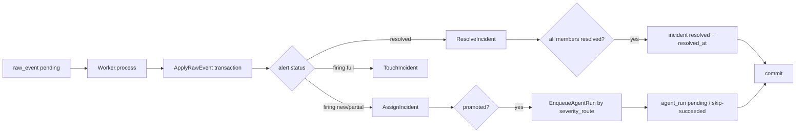

# Day5 实现文档：Incident 生命周期、查询 API 与诊断分流

> 本文对应 `oncall-agent-开发SPEC.md` 的 D05 和 `docs/14-day-plan/day05-incident-lifecycle.md`。目标：补齐 incident 的 resolved 生命周期，提供查询 API，并把 firing incident 按 severity route 落成持久化诊断队列。
>
> D05 不消费诊断队列（agent_run 的消费 worker 属于 D09），不做证据收集、LLM 推理、审批和执行。

## 1. Day5 做了什么

Day5 在 D04 的归并结果上补三块：

- **resolved 传播**：resolved 告警顺着 `last_alert.incident_id` 找到所属 incident，仅当全部成员的 last_alert 快照都 resolved 时把 incident 关单（resolve_on=ALL），写 `resolved_at`；
- **诊断分流**：incident 促发（candidate → firing）的同一事务里，按 `diagnose.severity_route` 落一行 `agent_run`——`full`/`light` 落 `pending` 等 D09 消费，`skip` 直接落 `succeeded` 供统计；
- **查询 API**：`GET /api/v1/incidents?status=`、`GET /api/v1/incidents/{id}`（含成员视图）、`POST /api/v1/incidents/{id}/diagnose`（手动重诊，落 `retry_of=NULL` 的 pending run）。

没有新增 migration。`agent_run` 表结构在 `migrations/001_init.sql` 已就绪。

## 2. 数据流



resolved 传播和促发入队都在 `ApplyRawEvent` 事务里：alert 快照更新、incident 关单、agent_run 入队同生共死，重启重放不会留下"incident firing 但没有队列行"的裂缝。

## 3. 代码位置与职责

```text
internal/store/store.go            # IncidentTx 扩展 + D05 查询方法
internal/store/store_test.go       # resolved 传播、入队回滚、查询方法集成测试
internal/incident/incident.go      # SeverityName / RouteMode / NewQueueRun 纯逻辑
internal/incident/incident_test.go # 分流映射单测
internal/ingest/worker.go          # hook 接 resolved 传播和促发入队
internal/ingest/worker_test.go     # D05 hook 分支单测
internal/api/incident.go           # 三个 incident API
internal/api/incident_test.go      # 鉴权/过滤/404/重诊单测
cmd/server/main.go                 # severity_route 注入 worker，注册 API 路由
```

包边界：

- `internal/incident` 只做不碰库的纯判断（severity → mode），DB 读写全在 `internal/store`；
- `internal/api` 只读查询 + 手动重诊落 run，不改告警或执行状态；
- 摄入 worker 与诊断队列解耦：worker 只落 `agent_run` 行，不消费（GC-07）。

## 4. resolved 传播（resolve_on=ALL）

`IncidentTx.ResolveIncident(ctx, id, observedAt) (bool, error)`：

1. incident 不存在或已不在 `candidate`/`firing` → 幂等 no-op，返回 false；
2. `incident_alert JOIN last_alert` 统计未 resolved 成员数，>0 → 保持开放；
3. 全部 resolved → `status=resolved, resolved_at=observedAt`，返回 true。

幂等性：

- 重放同一 resolved 事件：incident 已关单，no-op，`resolved_at` 不被改写；
- 关单 UPDATE 带 `status IN ('candidate','firing')` 条件，并发下不会覆盖人工 acknowledged；
- resolved 告警不创建新 incident、不延长开放事件时间窗（worker hook 在 status != firing 分支里只做传播）。

## 5. severity 分流

`internal/incident` 提供三个纯函数：

```go
SeverityName(severity int) string                 // 5→critical … 1→low，未知回退 warning
RouteMode(severity int, route map[string]string) string // 配置缺条目/非法值回退 light
NewQueueRun(incidentID uint64, mode string, now time.Time) store.AgentRun
```

分流规则：

| incident severity | route 配置 | mode | agent_run 状态 |
|---|---|---|---|
| critical(5)/high(4) | full | full | pending |
| warning(3) | light | light | pending |
| info(2)/low(1) | skip | skip | succeeded（直接终态，供统计） |

severity 取 incident 当前级别（成员最大值，`IncidentAssignment.Severity`），不是触发告警的单条级别。

促发只发生一次（candidate → firing），所以自动入队也只发生一次；后续成员挂载不重复落 run。

## 6. 查询 API

三个端点都走与 webhook 相同的 Bearer 鉴权：

| 端点 | 行为 |
|---|---|
| `GET /api/v1/incidents?status=` | status 空返回全部；非空精确过滤；按 id 倒序稳定排序 |
| `GET /api/v1/incidents/{id}` | incident 本体 + 成员视图（fingerprint、告警名、当前 status/severity、挂载时间）；不存在回 404 |
| `POST /api/v1/incidents/{id}/diagnose` | 手动重诊：落 `retry_of=NULL`、`status=pending` 的 run；不存在回 404 |

手动重诊的模式仍按 severity route 计算，但 `skip` 被覆盖为 `light`：skip 的语义是"自动分流不值得花 LLM"，人显式触发说明要看诊断结论；用 light 最小预算而不是 full。

成员视图是 `incident_alert JOIN last_alert JOIN alert`：成员关系来自 incident_alert，当前状态来自 last_alert 快照，告警名来自 last_alert 指向的当前版本 alert。

## 7. 测试覆盖

### 7.1 纯逻辑（internal/incident）

- SeverityName 五级映射 + 未知级别回退 warning；
- RouteMode 全路由命中、配置缺条目/非法值/nil 回退 light；
- NewQueueRun：skip → succeeded 且 finished_at 落值；其余 → pending 且 retry_of 为空。

### 7.2 Worker（internal/ingest）

- resolved 且挂了 incident → 调用 ResolveIncident，不进 Assign/Touch；
- resolved 没挂 incident → 不触发传播；
- 促发时按 route 落 run：critical → full/pending；info → skip/succeeded。

### 7.3 MySQL 集成（internal/store）

`TestIncidentResolvePropagationAndAgentRunQueue`：

- min_alerts=1 促发后 agent_run 持久化为 pending；
- 只 resolved 一个成员 → incident 保持 firing、resolved_at 为空；
- 全部 resolved → 关单，resolved_at 取 resolved 告警接收时间；
- 重放 resolved → 不重复关单，resolved_at 不变；
- 促发入队后 hook 失败 → incident 和 agent_run 一起回滚。

`TestIncidentQueryMethods`：

- ListIncidents 的 status 过滤命中/不命中、全量列表；
- GetIncident 命中与 ErrIncidentNotFound；
- ListIncidentMembers 返回成员快照状态与告警名；
- CreateAgentRun 落 pending run，缺字段拒绝。

### 7.4 API（internal/api）

- 三个端点无 token/错 token 都 401；
- 列表 status 过滤透传；
- 详情含成员；404 与非法 id 400；
- 手动重诊落 pending run（retry_of 为空）；skip 级别手动重诊覆盖为 light；不存在的 incident 回 404；
- 错误方法 405；GET 列表不落 run（只读）。

## 8. 真实端到端验收

临时配置：`group_by=[labels.service]`、`min_alerts=3`、默认 severity_route。启动 server 后：

1. `simulate -n 3 -dup 0` → incident firing（severity=5, alerts_count=3）+ `agent_run(mode=full, status=pending, retry_of=NULL)`；
2. `GET /api/v1/incidents?status=firing` 返回该 incident；`GET /api/v1/incidents/{id}` 返回 3 个成员及其当前状态；不存在的 id 回 404；
3. `simulate -n 1 -resolved`（只 resolved 一个成员）→ incident 保持 firing；
4. `simulate -n 3 -resolved`（全部 resolved）→ incident resolved，`resolved_at` 落值；agent_run 不新增；
5. `POST /api/v1/incidents/{id}/diagnose` → 201，`mode=full, status=pending, retry_of=null`；错误 token 回 401。

验收后已清理本次产生的 raw_event / alert / last_alert / incident / incident_alert / agent_run 数据。

本次实际执行并通过：

```bash
go test ./...        # 含 TEST_MYSQL_DSN 的 store 集成测试
go build ./...
go vet ./...
```

## 9. Day5 的边界结论

1. **生命周期边界**：incident 自动关单只有"全部成员 resolved"一条路；acknowledged 等人工状态不被自动流转覆盖。
2. **队列边界**：agent_run 就是诊断队列，D05 只写不读；D09 的诊断 worker 消费 `status=pending` 行，两个 worker 互不阻塞（GC-07）。
3. **API 边界**：查询 API 只读；唯一写路径是手动重诊落 pending run，它不触发 LLM、不改告警。
