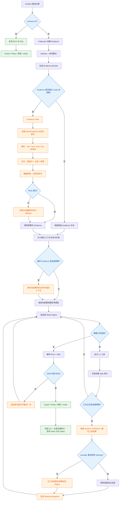

# AI-Opus 上下文压缩机制设计

> 文档状态：设计提案，尚未实现。
> 适用范围：`internal/config`、`internal/llm`、`internal/diagnose`。
> 目标：先让思考模型可正确调用，再对单次诊断内的工作记忆做分层压缩；不改变 Guard、Policy、审批和 Verify。

## 1. 背景

当前诊断链路把 Evidence 直接渲染成文本，作为一条 User Message 交给 Eino ReAct Agent：

```text
system prompt
  + Evidence.Render()
  + ReAct 过程中累计的 assistant / tool messages
  + 契约解析失败时的错误输出与重试提示
```

当前已经存在长度保护，但没有真正的上下文压缩：

| 位置 | 当前机制 | 性质 |
|---|---|---|
| `internal/diagnose/evidence.go` | 每个 EvidenceItem 最多 2048 rune | 单项截断 |
| `internal/tools/registry.go` | 工具输出默认最多 4096 rune | 单次输出截断 |
| `internal/diagnose/pipeline.go` | 审计 step 最多 1024 rune | 落库截断 |
| `internal/llm/reasoner.go` | full 最多 8 步，light 最多 3 步 | 轮次上限 |
| `internal/memory` | memory hit 跳过 Evidence 和 LLM | 调用绕过 |

这些机制能够防止单项数据无限增长，但存在四个问题：

1. **按头截断可能丢失关键尾部信息。** 日志最后的错误、指标窗口末端状态、JSON 后半部分可能直接消失。
2. **缺少整份上下文预算。** 当前 7 个 collector 可以各自接近 2048 rune，单项合法不代表总量合理。
3. **ReAct 历史线性增长。** 每轮工具结果会进入后续模型请求，长工具结果可能被重复发送多次。
4. **思考模型还不能正确接入。** 部分 OpenAI 兼容网关在 thinking 模式下要求多轮对话回传 `content[].thinking` / `reasoning`；当前适配器需要显式处理该协议。

已有验收记录表明，正常诊断尚未触及模型窗口上限。压缩必须按阈值触发，不能让正常的小上下文经过无意义的改写。

本文中的“记忆压缩”不是 `fault_memory`。两者必须分开：

| 名称 | 作用范围 | 当前状态 | 本文是否改动 |
|---|---|---|---|
| `fault_memory` | 跨 incident 的长期故障记忆 | 已实现 Lookup / Commit / Demote | 不改写入门槛和召回规则 |
| 工作记忆 | 单次 Diagnose 内的 ReAct 轨迹 | 尚未实现 | 本文新增压缩 |

思考内容只作为当前推理协议的一部分回传，不直接作为 RCA、Plan、IM 报告或长期故障记忆写入。长期记忆只保存可验证事实、证据引用、结论和执行结果。

## 2. 设计目标

### 2.1 必须满足

1. 为每个 LLM 角色增加思考开关、思考等级、总 completion 预算和 thinking / reasoning 回传协议。
2. 为 Evidence、ReAct 历史和短期工作记忆建立可配置的总预算。
3. Evidence Pack 和工具 digest 由确定性代码完成；诊断热路径默认不增加额外 summarizer LLM 调用。
4. 保留告警身份、真实目标名、时间、状态、错误和关键数值。
5. 思考模型的 reasoning 内容在协议要求的范围内原样回传；不得把必需的 reasoning / signature 截断或改写。
6. 小于预算的上下文保持原样，不改变正常诊断行为。
7. 压缩只影响发送给模型的文本和短期工作记忆，不降低审计、Guard、Policy、审批和 Verify 的安全要求。
8. 压缩过程可观测，能够解释压缩前后长度、思考 token 和总 token 成本。
9. 相同输入产生相同的结构化压缩结果，方便测试、回放和问题定位。

### 2.2 非目标

V1 不处理以下问题：

- 不引入向量数据库或 RAG；
- 不把诊断流程改成多轮聊天；
- 不对原始 Evidence 先做一次 LLM 摘要；
- 不把原始 thinking / chain-of-thought 写入 `fault_memory` 或 IM 报告；
- 不改变 `fault_memory` 的召回和写入规则；
- 不改变工具权限、安全等级、Guard 或 Policy；
- 不为了压缩新增 `get_evidence_item` 一类懒加载工具；
- 不在 provider 要求原样回传 reasoning 时做不安全的消息替换；
- 不追求精确适配每个模型的 tokenizer，先使用 rune 预算和模型 usage 作为双重指标。

## 3. 核心原则

### 3.1 压缩不等于截断

截断只保留文本开头；压缩应根据数据类型保留诊断价值：

- 指标保留当前值、最小值、最大值、异常点数和最后若干点；
- 日志保留错误行、首部环境信息和尾部最新状态；
- 告警快照保留对象身份、状态、标签和时间；
- 正常依赖状态收成一行；
- 缺失或失败的 collector 必须保留错误，不得因压缩消失；
- 已完成的工具观察收成结构化事实，而不是散文摘要。

### 3.2 安全信息优先于描述性信息

以下内容不得被普通压缩策略删除：

1. incident ID、group key、alert name；
2. `container`、`service`、`instance`、`job` 等真实目标标签；
3. firing / resolved 状态和关键时间；
4. collector 的 `status`、`source`、`error`；
5. 工具名、工具参数摘要、工具成功或失败状态；
6. `truncated`、`compacted` 等不完整性标记；
7. provider 要求回传的 thinking / reasoning / signature。

### 3.3 不改变可信边界

压缩前后继续遵守现有边界：

- Evidence 正文仍是不可信外部数据；
- `Sanitize` 必须在内容进入模型前执行；
- Markdown 围栏逃逸处理继续生效；
- LLM 仍只能调用 `Registry.ForLLM()` 导出的 L1 工具；
- Plan 仍必须经过 Guard、Policy、审批和 Verify；
- Policy 的 `KnownTargets` 继续读取数据库中的告警标签，不依赖压缩文本；
- thinking 内容不得改写 RCA、Plan、target 或安全等级。

### 3.4 思考协议优先于压缩

思考模型接入后，消息历史不再只是普通文本。部分网关把上一轮 thinking 当作后续请求的协议字段。压缩如果删除或改写这些字段，会直接导致 400，而不是“上下文变短”。

因此：

```text
协议字段：thinking / reasoning / signature  → 原样回传，不压缩
可见字段：工具结果、日志、指标 JSON       → 可以压缩
结论字段：RCA / Plan / MemorySnapshot      → 结构化保存，不保存原始思考过程
```

## 4. 总体方案

压缩只发生在模型输入侧，完整证据和工具调用仍然保留在审计与数据库中。整体流程如下：



图中有三条相互配合的压缩路径：

1. **Evidence Pack**：处理初始证据，按数据类型结构化收口；
2. **ReAct History Compact**：处理旧工具消息，在协议允许时替换为 digest；
3. **Working Memory Compression**：把已经完成的推理段压缩成事实、假设、决策和未决问题，供新的推理段继续使用。

三条路径都遵循同一条边界：压缩失败可以回退，但不能让诊断进程崩溃；压缩不会改变 Guard、Policy、审批和 Verify。

| 层 | 处理对象 | 触发时机 | 处理方式 |
|---|---|---|---|
| Evidence Pack | 初始证据 | Evidence 总长度超过模式预算 | 按证据类型结构化收口 |
| ReAct History Compact | 已消费过的旧工具结果 | 历史超过预算或达到指定步数 | 旧结果替换为确定性 digest；provider 要求时保留协议消息 |
| Working Memory Compression | 已完成推理段的事实、假设、决策和未决问题 | 推理段达到步数或上下文水位 | 生成结构化 MemorySnapshot，开启新的推理段 |

思考模型接入是压缩的前置条件，不是第四层压缩。没有正确的 thinking 回传，历史压缩会直接把请求打坏。

## 5. 思考模型接入

### 5.1 当前缺口

`internal/config.RoleConfig` 当前只有：

```go
type RoleConfig struct {
    BaseURL   string `yaml:"base_url"`
    APIKey    string `yaml:"api_key"`
    Model     string `yaml:"model"`
    MaxTokens int    `yaml:"max_tokens"`
}
```

`internal/llm.Factory.Build` 只把 `MaxTokens` 传给 Eino OpenAI 适配器。真实部署已经证明：带 thinking 的模型会在多轮工具调用时要求回传上一轮思考内容，否则返回 400。

Eino 当前依赖已经具备部分能力，但不能直接当协议完成：

| 能力 | 当前依赖中的位置 | 对 AI-Opus 的含义 |
|---|---|---|
| `ReasoningEffort` | `openai.ChatModelConfig` | 可以按角色配置思考强度 |
| `MaxCompletionTokens` | `openai.ChatModelConfig` | 思考 token 计入总 completion，不能只配 `max_tokens` |
| `schema.Message.ReasoningContent` | Eino schema | 可以把 reasoning 文本保存在消息对象里 |
| `RequestPayloadModifier` / `ResponseMessageModifier` | Eino OpenAI option | 适配非标准网关字段 |
| `content[].thinking` 原样回传 | 当前适配器未覆盖当前网关协议 | 必须在项目内补一层 thinking adapter |

### 5.2 角色配置

建议把思考参数放进每个角色，而不是全局开关。reasoner 需要思考；summarizer 默认关闭。

```yaml
llm:
  roles:
    reasoner:
      base_url: "https://your-openai-compatible-endpoint"
      api_key: "${ARK_KEY}"
      model: "your-thinking-model"
      max_tokens: 2048
      thinking:
        enabled: true
        protocol: openai_compatible
        effort: medium          # none | low | medium | high
        max_completion_tokens: 8192
        echo_required: true     # 后续请求必须回传上一轮 thinking
        budget_tokens: 4096     # 可选；provider 不支持则忽略
    summarizer:
      base_url: "https://your-openai-compatible-endpoint"
      api_key: "${ARK_KEY}"
      model: "your-model"
      max_tokens: 1024
      thinking:
        enabled: false
        protocol: openai_compatible
        effort: none
        max_completion_tokens: 1024
        echo_required: false
```

字段语义：

| 字段 | 作用 |
|---|---|
| `enabled` | 是否向 provider 声明启用思考 |
| `protocol` | 请求/响应字段映射。第一版只支持 `openai_compatible` |
| `effort` | 思考强度。映射到 `reasoning_effort` 或 provider 等价字段 |
| `max_completion_tokens` | 可见输出 + 思考 token 的总上限 |
| `echo_required` | 后续请求是否必须回传上一轮 thinking / reasoning |
| `budget_tokens` | 可选思考预算。provider 不识别则启动期记录 warning，不 fail-fast |

校验规则：

- `enabled=false` 时，`effort` 必须是 `none` 或空；
- `enabled=true` 时，`max_completion_tokens` 必须大于 `max_tokens`；
- `effort` 只允许 `none/low/medium/high`；
- `protocol` 未知值启动失败；
- `echo_required=true` 且适配器无法回传 thinking 时，Reasoner 启动失败，不允许带着会 400 的配置上线。

### 5.3 请求与响应映射

`Factory.Build` 需要按角色生成思考参数，而不是只传 `MaxTokens`。

```text
RoleConfig.thinking
    -> openai.ChatModelConfig.ReasoningEffort
    -> openai.ChatModelConfig.MaxCompletionTokens
    -> ExtraFields / RequestPayloadModifier   # 非标准网关字段
    -> ResponseMessageModifier                # 从原始响应提取 thinking
```

第一版协议映射：

| 方向 | OpenAI 兼容字段 | 网关可能字段 | 内部保存位置 |
|---|---|---|---|
| 请求 | `reasoning_effort` | `thinking`、`enable_thinking`、`thinking_budget` | `RoleConfig.thinking` |
| 响应 | `reasoning_content` | `content[].thinking`、`reasoning` | `schema.Message.ReasoningContent` 与 Extra |
| 回传 | assistant 消息中的 reasoning | 上一轮 `content[].thinking` | 原始 assistant 消息，不经 digest |

thinking adapter 必须同时做三件事：

1. 发出思考参数；
2. 从原始响应提取 thinking / reasoning / signature；
3. 在后续请求中按 provider 要求回传。

只加 `reasoning_effort`、不回传 thinking，不能算思考模型接入完成。

### 5.4 对压缩的硬约束

`echo_required=true` 时，压缩层不得删除或改写：

- assistant 消息中的 `ReasoningContent`；
- Extra 中的 thinking / signature；
- 对应的 tool_call 身份（id、name、arguments）；
- 最近一次尚未被模型消费完的工具结果。

可以压缩的只有：

- 旧工具结果正文；
- 已被 MemorySnapshot 覆盖的早期观察；
- 重复的指标 JSON 和日志正文。

如果某条消息同时包含“必须回传的 thinking”和“可压缩的长工具结果”，只压缩工具结果，thinking 原样保留。

### 5.5 审计

思考内容可以进入内部审计，但默认不进入 IM 报告和 `fault_memory`。

建议记录：

```text
thinking_enabled=true effort=medium echo_required=true
completion_tokens=812 reasoning_tokens=540 output_tokens=272
thinking_echoed=true compacted=false
```

原始 thinking 文本如需落库，必须：

- 经过 `Sanitize`；
- 按审计预算截断；
- 明确标记 `kind=llm, name=thinking`；
- 不得作为 RCA 或 Plan 的替代品。

## 6. 第一层：Evidence Pack

### 6.1 触发规则

先完成现有的采集、脱敏和单项安全限长，再计算整份 Evidence 的 rune 数：

```text
rendered_runes <= mode_budget
    => 使用当前 Evidence.Render()，文本保持不变

rendered_runes > mode_budget
    => 执行 Evidence Pack
```

建议初始配置：

```yaml
diagnose:
  context:
    evidence_full_max_runes: 12000
    evidence_light_max_runes: 6000
    critical_item_min_runes: 1024
    normal_item_max_runes: 1536
    log_head_lines: 20
    log_tail_lines: 80
    metric_last_points: 8
```

这些数值是第一版运行值，不是长期固定标准。上线后根据 `tokens_in` 和诊断质量调整。

### 6.2 Evidence 分类

当前 collector 按诊断价值分为三类：

| 优先级 | Collector | 压缩要求 |
|---|---|---|
| Critical | AlertSnapshot | 优先保留完整；不得删除告警名、标签、状态、时间和目标名 |
| Important | PromReplay、GoldenMetrics、Sub2API、PostgreSQL、Redis | 结构化保留状态、关键值和异常 |
| Supporting | Docker 日志及其他大文本 | 提取错误行并采用头尾保留 |

优先级不是可信等级，只决定超预算时的空间分配顺序。

### 6.3 装箱算法

Evidence Pack 使用稳定的两阶段算法。

#### 阶段一：生成候选表示

每个 EvidenceItem 同时生成两种表示：

- `Full`：当前 Render 使用的正文；
- `Compact`：按证据类型生成的确定性摘要。

Compact 生成失败时，不让诊断失败，回退到现有 `tools.Truncate`。

#### 阶段二：按预算装箱

1. 写入固定头部和“不可信外部数据”声明；
2. Critical 项优先使用 Full；
3. Important 项按顺序尝试 Full，放不下则使用 Compact；
4. Supporting 项默认使用 Compact，预算足够时再升级为 Full；
5. 每项至少保留标题、source、status、error 和压缩标记；
6. Critical 项仍超预算时采用头尾截断，禁止只切头；
7. 最终结果不得超过模式预算；
8. 结果为空或缺少 AlertSnapshot 时返回错误，不把无事实上下文交给模型。

伪代码：

```text
pack(items, budget):
    reserve metadata
    candidates = build full/compact forms

    include critical items first
    include important items second
    include supporting items last

    when full does not fit:
        use compact
    when compact does not fit:
        use minimal status line

    validate critical fields
    return packed text + stats
```

### 6.4 各类证据的压缩方式

#### AlertSnapshot

保留：

- incident ID、group key、severity、status；
- 告警名；
- fingerprint；
- `container/service/instance/job` 等目标标签；
- starts_at、last_seen、firing_count；
- annotations 中的 description/summary，但允许限长。

删除或降级：

- 重复标签；
- 多成员之间完全相同的公共字段；
- 对诊断和目标校验无意义的长 annotations。

示例：

```text
incident=42 group=payments status=firing severity=critical
alerts=3
- High5xx target=container/sub2api instance=10.0.0.8:8080 status=firing last_seen=...
- PostgresWaiting target=service/postgres status=firing last_seen=...
common_labels: env=test, job=sub2api
```

#### PromReplay 与 GoldenMetrics

对时间序列保留：

- PromQL；
- series labels；
- 样本时间范围；
- 样本数量；
- first、last、min、max；
- 最大值发生时间；
- 非零点数或超过阈值的点数；
- 最后 N 个点。

不应继续使用“序列化 JSON 后切前 2048 rune”的方式，因为这种方式容易丢失窗口末端和峰值。

示例：

```text
query=rate(http_requests_total{status=~"5.."}[5m])
range=10:00:00Z..10:30:00Z samples=121
first=0.02 last=8.41 min=0.00 max=12.63 max_at=10:24:15Z
non_zero=86
last_points=[10:28=7.98, 10:29=8.13, 10:30=8.41]
```

#### Sub2API、PostgreSQL、Redis

优先转成稳定字段，而不是保留完整响应：

```text
sub2api: status=degraded http=500 latency_ms=2301 error="db timeout"
postgres: reachable=true active=13 waiting=12 max_connections=100
redis: reachable=true ping_ms=3 memory_bytes=3390000 clients=18
```

如果数据源失败，错误必须原样经过 `Sanitize` 后保留：

```text
postgres: status=error error="connection refused"
```

#### Docker 日志

压缩顺序：

1. 匹配 error、fatal、panic、timeout、refused、oom、killed 等错误行；
2. 保留前 `log_head_lines` 行，覆盖进程启动和环境信息；
3. 保留后 `log_tail_lines` 行，覆盖最新状态；
4. 去除连续完全重复行，记录重复次数；
5. 中间省略部分显示 `omitted_lines=N`；
6. 所有内容继续作为不可信文本放入围栏。

错误关键词只用于选行，不能直接作为 RCA 或 Guard 判断依据。

### 6.5 输出标记

被压缩的 EvidenceItem 必须显式标记：

```text
- compacted: true
- original_runes: 4096
- packed_runes: 786
- strategy: metric_summary | log_head_tail | status_line | fallback_truncate
```

模型能够据此判断证据是否完整，审计也能解释遗漏来源。

## 7. 第二层：ReAct History Compact

### 7.1 问题

Eino ReAct 会把工具调用和工具结果加入消息历史。后续每次请求都会重新发送旧历史。即使单个工具结果已经限制为 4096 rune，8 步 full 模式仍可能形成明显重复成本。思考模型开启后，历史还会附带 thinking 内容，重复成本更高。

### 7.2 触发规则

满足任一条件时压缩旧工具消息：

1. 已执行工具调用数大于等于 `compact_after_tool_calls`；
2. 当前历史 rune 数超过 `react_history_max_runes`；
3. 旧工具结果包含 `…[truncated]`，说明原文已经不完整，继续重复发送价值较低。

建议初始配置：

```yaml
diagnose:
  context:
    react_history_max_runes: 12000
    compact_after_tool_calls: 4
    keep_recent_tool_results: 2
    tool_digest_max_runes: 512
```

light 模式通常只有 3 步，不应因默认配置频繁触发。

### 7.3 保留规则

永不压缩：

- System Message；
- 初始 Evidence User Message；
- 当前待响应的用户 / 工具消息；
- 最近 `keep_recent_tool_results` 条完整工具结果；
- 契约修复提示；
- `echo_required=true` 时，所有仍需回传的 thinking / reasoning / signature。

允许压缩：

- 更早的 Tool Message 正文；
- 与后续查询重复且已经失去时效性的结果；
- 超长、已截断的旧结果。

### 7.4 Tool Digest 格式

Digest 由代码根据工具返回 JSON 或文本生成，不调用 summarizer：

```text
[compacted tool result]
tool=prom_range_query
args={query="...", start="...", end="..."}
status=ok
summary=series=2 samples=242 min=0 max=12.63 last=8.41
original_runes=4096 truncated=true
```

工具失败时保留：

```text
[compacted tool result]
tool=prom_instant_query
status=error
error="prometheus request timed out after 10s"
```

Digest 必须保留工具名、参数摘要、结果状态和关键值，否则模型可能重复执行同一个无效查询。

### 7.5 接入位置

优先在 `internal/llm` 的模型包装层接入，而不是修改每个工具：

```text
OpenAI ChatModel
    <- thinkingAdapter          # 解析/回传 thinking
    <- usageModel
    <- compactingModel          # 只压缩允许压缩的消息副本
    <- Eino react.Agent
```

`compactingModel` 在每次请求模型前检查消息列表，只修改本次发送副本，不修改：

- Eino 内部工具执行状态；
- `stepRecorder`；
- `agent_run_step` 审计记录；
- 原始工具输出的运行时结果；
- 需要回传的 thinking 字段。

如果 Eino 当前版本无法在模型包装层安全修改消息，则第一阶段只实现 Evidence Pack 和 thinking 回传，ReAct History Compact 延后，不能通过修改 SDK 源码强行接入。

`echo_required=true` 且无法证明 thinking 会被完整回传时，禁止启用历史压缩。

## 8. 第三层：Working Memory Compression

### 8.1 问题

Evidence Pack 和 Tool Digest 解决的是“文本太长”。思考模型接入后，真正膨胀的是单次诊断内的工作记忆：

```text
Evidence
  + 多轮工具观察
  + 每轮 thinking
  + 被推翻的假设
  + 未完成的验证
```

如果只切工具结果，模型会丢失“已经排除了什么、下一步要验证什么”。如果把全部 thinking 留下来，上下文会迅速被思考过程占满。

因此需要一层**结构化工作记忆**，而不是把旧对话交给 summarizer 改写成散文。

### 8.2 MemorySnapshot

工作记忆压缩的产出是 `MemorySnapshot`，不是自然语言摘要。

```go
type MemorySnapshot struct {
    IncidentID uint64
    RunID      uint64
    Seq        int
    Facts      []MemoryFact
    Hypotheses []MemoryHypothesis
    Decisions  []MemoryDecision
    OpenQuestions []string
    CompactedFrom []string // 被覆盖的 step / tool_call id
}

type MemoryFact struct {
    Source    string // evidence item 或 tool name
    Claim     string // 可验证观察，不含建议
    Value     string
    Timestamp string
    Ref       string // 证据标题或 tool_call id
}

type MemoryHypothesis struct {
    Text   string
    Status string // open | supported | rejected
    Why    string
}

type MemoryDecision struct {
    Action string // continue | query | none
    Target string
    Why    string
}
```

示例：

```text
# Working Memory
facts:
- source=docker status=oom_killed exit=137 restart_count=3 ref=docker
- source=prom_replay query=container_memory_usage last=high max_at=10:24:15Z ref=prom_replay
hypotheses:
- postgres saturation: rejected; waiting=12 but no error and alert is vector(1)
- container OOM: supported; exit=137 and oom_killed
decisions:
- next=confirm memory limit vs usage; action=none until verified
open_questions:
- memory limit of sub2api
compacted_from: [tool:prom_range_query#1, tool:prom_series_meta#1]
```

硬规则：

- Fact 只能来自 Evidence 或工具结果，不能来自 thinking 文本；
- Hypothesis 可以来自模型判断，但必须带 `supported/rejected/open`；
- Decision 不能提升安全等级，不能把 L2/L3 写成可自动执行；
- Snapshot 必须经过 `Sanitize`；
- Snapshot 超长时按 Fact > 未决问题 > 已拒绝假设 > 已支持假设 的顺序保留。

### 8.3 触发规则

满足任一条件时生成新的 MemorySnapshot，并开启新的推理段：

1. 当前推理段工具调用数达到 `memory_compact_after_tool_calls`；
2. 当前发送给模型的历史超过 `working_memory_max_runes`；
3. 思考 token 累计超过 `thinking.budget_tokens` 的一定比例，且已经有可沉淀的事实。

建议初始配置：

```yaml
diagnose:
  context:
    working_memory_max_runes: 4000
    memory_compact_after_tool_calls: 4
    keep_recent_tool_results: 2
    snapshot_max_runes: 2000
```

新推理段的输入固定为：

```text
system prompt
  + packed Evidence
  + 最新 MemorySnapshot
  + 最近 keep_recent_tool_results 条完整工具结果
  + 如 echo_required=true：上一轮必须回传的 thinking 协议消息
```

旧的长工具结果和已被覆盖的早期思考过程不再进入新段。完整轨迹仍写在 `agent_run_step`。

### 8.4 生成方式

第一版用代码从已有结构生成 Snapshot，不新增 LLM 调用：

| 来源 | 写入 Snapshot 的内容 |
|---|---|
| Evidence Pack | 告警身份、目标、collector 状态、关键指标 |
| Tool Digest / 原始工具结果 | 查询、关键数值、错误 |
| 当前 Plan 草稿或中间 JSON | 仅当字段合法时写入 Decision |
| thinking | 不写入 Fact；最多提取“下一步要查什么”到 OpenQuestions，且必须能被后续工具验证 |

禁止的做法：

- 把 thinking 原文塞进 Snapshot；
- 让 summarizer 先读全部历史再写一段自然语言；
- 用 Snapshot 替换 Guard / Policy 的输入；
- 把 Snapshot 当作 `fault_memory` 的写入来源。

如果后续要使用已配置的 `summarizer` 角色，只能填充 OpenQuestions 的措辞，不能生成 Fact，不能改变 target，不能在热路径成为压缩成功的前提。summarizer 失败时回退代码生成的 Snapshot。

### 8.5 与 fault_memory 的边界

```text
Working Memory Snapshot
    -> 只存在于当前 Diagnose
    -> 帮助同一 run 的后续推理段继续工作

fault_memory
    -> 只在 Verify 通过且 confidence=high 时 Commit
    -> 下次同类故障 0 次 LLM
```

两者不能合并。Snapshot 里的假设和未决问题没有经过 Verify，不能当成可复用修复经验。

## 9. 契约解析重试

当前模型输出不符合 JSON 契约时，会追加：

- 上一次 Assistant 原文；
- “只输出合法 JSON”的 User 提示；

然后再次调用 ReAct Agent。

第一版压缩机制不改变这条语义，但必须满足：

1. 上一次错误输出按 `tool_digest_max_runes` 类似预算限长；
2. `echo_required=true` 时，错误输出中的 thinking / reasoning 仍按协议回传，不得只保留截断后的可见文本；
3. 重试时继续使用已经压缩过的历史和最新 MemorySnapshot，不恢复全部旧工具结果；
4. token 统计继续跨重试累计，并单独累计 reasoning tokens；
5. 解析失败不能触发 summarizer。

后续可以把“契约修复”拆成无工具的单次模型调用，避免重新进入 ReAct；该优化不属于第一版压缩交付。

## 10. 配置设计

建议同时扩展 `llm.roles.*.thinking` 和 `diagnose.context`：

```yaml
llm:
  roles:
    reasoner:
      max_tokens: 2048
      thinking:
        enabled: true
        protocol: openai_compatible
        effort: medium
        max_completion_tokens: 8192
        echo_required: true
        budget_tokens: 4096
    summarizer:
      max_tokens: 1024
      thinking:
        enabled: false
        protocol: openai_compatible
        effort: none
        max_completion_tokens: 1024
        echo_required: false

diagnose:
  context:
    enabled: true

    evidence_full_max_runes: 12000
    evidence_light_max_runes: 6000
    critical_item_min_runes: 1024
    normal_item_max_runes: 1536

    log_head_lines: 20
    log_tail_lines: 80
    metric_last_points: 8

    react_history_max_runes: 12000
    compact_after_tool_calls: 4
    keep_recent_tool_results: 2
    tool_digest_max_runes: 512

    working_memory_max_runes: 4000
    memory_compact_after_tool_calls: 4
    snapshot_max_runes: 2000
```

配置校验要求：

- 所有 rune / line / point 上限必须大于 0；
- `critical_item_min_runes <= evidence_light_max_runes`；
- `keep_recent_tool_results >= 1`；
- `compact_after_tool_calls > keep_recent_tool_results`；
- `memory_compact_after_tool_calls > keep_recent_tool_results`；
- `thinking.enabled=true` 时，`max_completion_tokens` 必须大于 `max_tokens`；
- `thinking.echo_required=true` 时，适配器必须声明支持 thinking 回传，否则启动失败；
- `diagnose.context.enabled=false` 时完整回退当前行为，但思考参数仍然生效；
- 不增加新的外部服务。`summarizer` 角色继续可选，不作为压缩成功前提。

## 11. 建议代码边界

### 11.1 配置与模型工厂

建议修改：

```text
internal/config/config.go
internal/llm/factory.go
internal/llm/thinking.go
internal/llm/thinking_test.go
```

职责：

- 解析角色级 thinking 配置；
- 映射 `ReasoningEffort` / `MaxCompletionTokens` / ExtraFields；
- 从原始响应提取 thinking；
- 在后续请求中按协议回传；
- 启动期校验 `echo_required` 与适配器能力是否匹配。

### 11.2 Evidence 层

建议新增：

```text
internal/diagnose/context_pack.go
internal/diagnose/context_pack_test.go
```

建议接口：

```go
type ContextBudget struct {
    MaxRunes             int
    CriticalItemMinRunes int
    NormalItemMaxRunes   int
    LogHeadLines         int
    LogTailLines         int
    MetricLastPoints     int
}

type CompressionStats struct {
    Triggered      bool
    OriginalRunes  int
    PackedRunes    int
    CompactedItems int
    Strategies     map[string]int
}

type PackedEvidence struct {
    Text  string
    Stats CompressionStats
}

func PackEvidence(e Evidence, budget ContextBudget) (PackedEvidence, error)
```

`Evidence.Render()` 保持当前行为，作为未触发压缩和关闭开关时的稳定基线。不要直接把 `Render()` 改成永远压缩，否则小上下文也会发生语义漂移。

### 11.3 LLM 工作记忆层

建议新增：

```text
internal/llm/context_compactor.go
internal/llm/context_compactor_test.go
internal/llm/working_memory.go
internal/llm/working_memory_test.go
```

职责：

- 计算消息历史长度；
- 识别旧 Tool Message 与必须回传的 thinking 消息；
- 生成工具 digest；
- 从 Evidence 和工具结果生成 MemorySnapshot；
- 保留 system、Evidence、最近结果和协议字段；
- 返回副本和压缩统计。

`Reasoner` 只负责组装和启用，不包含具体压缩规则。

### 11.4 Pipeline 接入

`Pipeline.Run` 在 `ev.Render()` 后调用 Evidence Pack：

```text
BuildForIncident
    -> Render
    -> 超预算时 PackEvidence
    -> 注入 retry context / command history
    -> 最终预算检查
    -> Reasoner.Diagnose
         -> thinking adapter
         -> ReAct
         -> 超预算时 Compact + MemorySnapshot
```

重诊上下文和命令历史应参与最终总预算。优先级建议：

1. AlertSnapshot；
2. 当前 collector 错误和异常；
3. 上一轮 verify 失败原因；
4. 当前指标摘要；
5. 上一轮 RCA / Plan；
6. 历史命令。

历史命令预算不足时从最旧记录开始删除，不能截断 JSON 到非法结构。

## 12. 审计与指标

### 12.1 agent_run_step

不需要新增数据库枚举。使用现有 step 记录压缩信息：

- `kind=evidence, name=collect`：记录 Evidence Pack 统计；
- `kind=llm, name=reason`：记录 ReAct 历史压缩次数、思考 token 和总 token；
- `kind=llm, name=working_memory`：记录 Snapshot 生成、覆盖的 tool_call 和是否回传 thinking；
- 工具 step 继续记录实际工具调用，不因消息压缩减少。

示例审计输出：

```text
compression_triggered=true original_runes=15842 packed_runes=11973 compacted_items=3
strategies=metric_summary:2,log_head_tail:1
thinking_enabled=true effort=medium reasoning_tokens=540 echoed=true
snapshot_facts=4 hypotheses=2 open_questions=1
```

### 12.2 Prometheus 指标

建议新增低基数指标：

```text
oncall_context_compression_total{layer="evidence|react|memory",mode="full|light"}
oncall_context_original_runes{layer="evidence|react|memory",mode="full|light"}
oncall_context_packed_runes{layer="evidence|react|memory",mode="full|light"}
oncall_context_compaction_fallback_total{layer="evidence|react|memory"}
oncall_llm_reasoning_tokens_total{role="reasoner|summarizer"}
oncall_llm_thinking_echo_failure_total{role="reasoner|summarizer"}
```

不要把 incident ID、工具名、collector 名放进指标 label，细节写 step 审计，避免高基数。

现有 `agent_run.tokens_in/tokens_out` 继续作为最终成本依据。思考 token 如能从 usage 中拆出，单独累计，不覆盖原字段。

## 13. 失败与降级策略

压缩是成本保护，不能成为诊断新的单点故障。思考协议是正确性前提，不能静默降级成“看起来能跑”。

| 失败场景 | 处理 |
|---|---|
| 某项专用压缩器解析失败 | 回退头尾截断，标记 `strategy=fallback_truncate` |
| 整体 Pack 失败 | 回退当前 `Evidence.Render()` + 单项 2048 rune 行为 |
| Critical 内容单独超过总预算 | 头尾保留并显式标记，不只切头 |
| ReAct digest 失败 | 保留该条原工具结果，尝试压缩其他旧结果 |
| Snapshot 生成失败 | 保留最近完整工具结果，不开启新推理段 |
| 压缩后 Evidence 为空 | 终止诊断并记录错误，不能让模型无证据猜测 |
| thinking 回传失败 | 当前 Diagnose 失败；不得继续带着残缺 thinking 请求 |
| `echo_required=true` 但适配器不支持 | 启动期 fail-fast |
| 配置非法 | 启动期 fail-fast |

回退到当前行为时必须记录 metric 和 step，不能静默。thinking 回传失败不得伪装成普通压缩失败。

## 14. 测试要求

### 14.1 思考模型

必须覆盖：

1. `thinking.enabled=false` 时请求不带思考参数；
2. `enabled=true` 时请求包含 `reasoning_effort` 或协议声明的等价字段；
3. `max_completion_tokens` 生效，且大于 `max_tokens`；
4. 响应中的 `reasoning_content` / `content[].thinking` 被保存到消息对象；
5. `echo_required=true` 时，下一轮请求包含上一轮 thinking；
6. thinking 缺失或被改写时请求失败，而不是继续调用；
7. 思考 token 被累计，且不覆盖 `tokens_in/tokens_out` 原语义；
8. 配置非法时启动失败，错误文本不含 API key。

### 14.2 Evidence Pack 单元测试

必须覆盖：

1. 小于预算时输出与当前 `Evidence.Render()` 完全一致；
2. 大于预算时输出不超过预算；
3. AlertSnapshot 中的告警名和真实 target 不丢失；
4. collector 的 error / missing 状态不丢失；
5. 指标摘要包含 first、last、min、max 和时间；
6. 日志保留错误行、首部和尾部，连续重复行被收口；
7. 正文中的 ``` 不能逃逸不可信围栏；
8. token、DSN、密码等内容在 Compact 输出中仍被脱敏；
9. 相同输入输出稳定；
10. 专用压缩失败时正确回退并标记。

### 14.3 ReAct 历史压缩与工作记忆

必须覆盖：

1. system 和 Evidence 消息不被替换；
2. 最近 N 条工具结果保持完整；
3. 更旧工具结果被替换成包含工具名、参数、状态和关键值的 digest；
4. 工具错误信息保留；
5. `echo_required=true` 时 thinking / signature 不被 digest 替换；
6. MemorySnapshot 只包含可验证 Fact，不含原始 thinking；
7. 新推理段不再发送已被 Snapshot 覆盖的旧工具正文；
8. 小于预算时消息列表不变；
9. 压缩只修改发送副本，不修改 recorder 中的实际结果；
10. 契约重试继续累计 token 和 reasoning tokens；
11. light 模式正常三步路径默认不触发压缩。

### 14.4 行为回归

对现有故障场景分别使用压缩开 / 关、思考开 / 关运行：

- 容器 OOM；
- Sub2API health 超时；
- 5xx 激增；
- PostgreSQL 不可用或 waiting 连接异常；
- Redis 不可用；
- Prometheus 缺失的降级诊断；
- 配置错误禁止重启；
- memory hit 0 次 LLM。

验收重点不是要求 RCA 文案逐字一致，而是以下行为一致：

- 根因方向；
- confidence 档位不出现无依据提升；
- Plan action 和 target；
- Guard 决策；
- Policy / 审批决策；
- memory hit 仍为 `tokens_in=0`；
- 思考模型多轮工具调用不再因缺失 thinking 而 400。

## 15. 验收标准

第一版完成时必须满足：

1. reasoner 可通过配置启用思考模型，并把思考参数送到 provider；
2. `echo_required=true` 时，多轮工具调用能回传上一轮 thinking，不再出现当前网关的 400；
3. 当前未超预算的诊断输入保持原样；
4. 超预算 Evidence 能稳定压到模式预算内；
5. 工作记忆压缩后，新推理段仍保留告警身份、真实目标、错误状态、关键时间和关键数值；
6. 压缩热路径默认不产生额外 LLM 请求；
7. 原始 thinking 不进入 `fault_memory`、IM 报告和 RCA/Plan；
8. 压缩前后 Guard、Policy、审批和 Verify 安全边界不变；
9. ReAct 旧工具结果被压缩后，完整工具调用仍可从 step 审计回放；
10. 压缩触发、原始长度、压缩后长度、思考 token 和 fallback 均可观测；
11. 在构造的长 Evidence / 多工具调用用例中，`tokens_in` 相对当前行为明显下降；
12. `memory_hit` 路径不进入压缩逻辑，继续保持 0 次 LLM；
13. 压缩器异常时回退当前行为，诊断进程不崩溃；thinking 回传失败则明确报错。

## 16. 实施顺序

### 阶段一：思考模型接入

- 扩展 `RoleConfig.thinking`；
- 映射 `ReasoningEffort` 和 `MaxCompletionTokens`；
- 实现 thinking 提取与回传；
- 用真实 thinking 模型做一次多轮工具调用验收；
- 未完成前不得对 `echo_required=true` 的模型启用历史压缩。

这是后续所有压缩的前置条件。

### 阶段二：只增加观测

- 记录 Evidence、ReAct 历史和工作记忆的 rune 数；
- 记录每次 run 的 prompt / completion / reasoning token；
- 不改变输入内容；
- 用真实故障集确定预算是否合理。

### 阶段三：Evidence Pack

- 实现总预算和 collector 专用压缩；
- 先解决指标切头和日志尾部丢失；
- 加入配置开关和完整回归测试。

### 阶段四：工作记忆压缩

- 确认 thinking 回传已经稳定；
- 压缩旧工具结果，保留最近结果和协议字段；
- 生成 MemorySnapshot，开启新的推理段；
- 对 full 模式和多工具调用场景做真实思考模型验证。

### 阶段五：契约重试优化

- 评估把 JSON 契约修复拆成无工具调用；
- 避免解析失败后重新进入完整 ReAct；
- 该阶段独立验收，不与基础压缩一起上线。

## 17. 最终决策

AI-Opus 的上下文压缩采用以下路线：

1. **先让思考模型可正确调用，再压缩历史。** 没有 thinking 回传，压缩会把请求打坏。
2. **先限制总量，再按数据类型压缩。**
3. **Evidence 用代码结构化 Pack，不调用 summarizer。**
4. **ReAct 只压缩旧工具结果；system、初始 Evidence、最近结果和必需的 thinking 不动。**
5. **工作记忆压成 MemorySnapshot，保存事实、假设、决策和未决问题，不保存原始思考过程。**
6. **小上下文保持原样，超过阈值才触发。**
7. **完整事实留在数据库和 step 审计中，压缩只作用于模型输入。**
8. **安全边界独立于上下文压缩，任何压缩结果都不能绕过 Guard、Policy、审批和 Verify。**
9. **`fault_memory` 仍然只在 Verify 通过后写入，工作记忆不得晋升为长期记忆。**

该设计解决的是思考模型接入、诊断输入增长和单次诊断内的重复 token 成本，不把系统改造成聊天记忆或 RAG 系统。
