# 当前系统架构

> 本文按当前源码、数据库迁移和运行配置整理。源码是事实基准；部分早期设计文档仍描述“诊断、审批、执行尚未实现”，不应作为当前运行状态依据。
>
> 系统形态：**模块化单体 + MySQL 持久队列/审计 + React 嵌入式控制台**。

## 1. 架构结论

- 一个 `oncall-agent` Go 进程同时承载 HTTP、静态前端、SSE 和 6 类后台 worker；同一业务库只运行一个 server，不允许新旧进程重叠消费。
- MySQL 是 AI-Opus 的唯一权威业务库，也是摄入、诊断、审批执行、恢复验证和对话的持久队列。
- Prometheus、Alertmanager、blackbox-exporter 属于观测与告警侧。
- PostgreSQL、Redis、Sub2API 属于被监控目标及其依赖，不是 AI-Opus 自身的存储。
- React 控制台必须先构建，再通过 `go:embed` 嵌入本次 Go 构建，同源提供。
- LLM 只负责基于证据生成 RCA/Plan 或回答只读问题；写操作只能由版本化的处置规则（`observe / manual / auto`）授权，并经过 Guard、Policy、（manual 时）人工审批、Executor、Verify。
- 每个请求都解析为服务端确定的身份：机器令牌（Alertmanager/CI）、操作人的个人令牌，或由个人令牌换取的签名会话 Cookie（写请求另需 CSRF 头）。角色为 viewer / operator / admin；没有匿名访问。
- 生产部署形态（Agent 由 systemd 运行、独立监控栈）见 [deploy/README.md](../deploy/README.md)；下文拓扑是本地开发 Compose。

## 2. 运行时部署拓扑

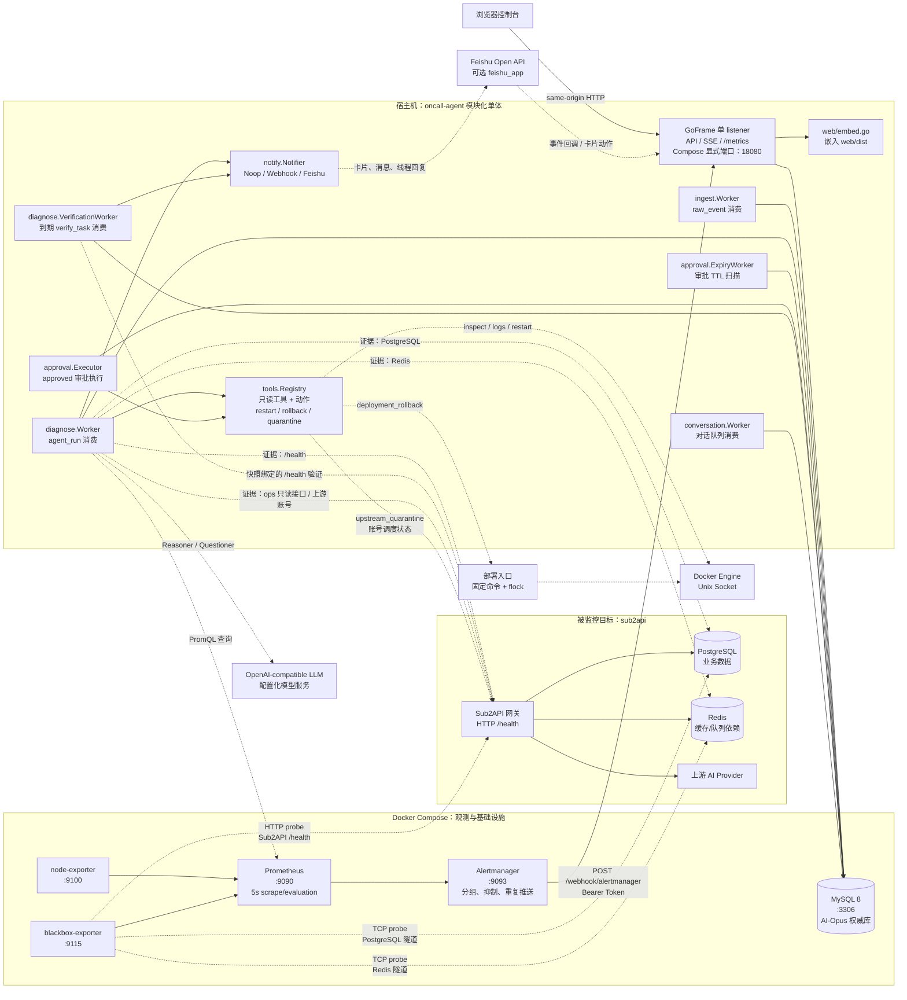

### 运行边界

| 部分 | 当前实现 |
|---|---|
| `oncall-agent` | 跑在宿主机，不在 `docker-compose.dev.yml` 中 |
| HTTP | GoFrame 单 listener；独立默认 `127.0.0.1:8080`，Compose 显式覆盖 `0.0.0.0:18080` |
| MySQL | Compose 容器，AI-Opus 自身唯一业务数据库 |
| Prometheus | `:9090`，抓 node-exporter 和 blackbox |
| Alertmanager | `:9093`，向宿主机发送 Alertmanager webhook |
| blackbox | 探测目标 HTTP 健康状态和 PostgreSQL/Redis TCP 连通性 |
| PostgreSQL / Redis | 由 Sub2API 使用，AI-Opus 只读采集证据 |
| Docker | 通过 Unix socket 读取容器并执行受控动作；socket 缺失时能力降级 |
| sub2api 管理接口 | 采集器只调用只读 ops 接口；`upstream_quarantine` 只写账号调度状态；管理员密钥只在服务端配置 |
| 部署入口 | `deployment_rollback` 以参数数组调用固定发布命令，与 CI/CD 共用 `flock` 锁 |
| LLM | OpenAI 兼容接口，凭据只来自服务端配置 |
| Feishu | 可选出向通知和入向回调 |

独立运行省略 `server.listen_addr` 时默认只绑定回环。Compose 的 Alertmanager 访问 `host.docker.internal:18080`，必须显式使用容器可达的监听地址；示例 `0.0.0.0` 必须配合宿主防火墙限制**整个 listener**（包括不带鉴权的 `/metrics`），不是只隐藏首页。`web.base_url` 只控制启用/链接；访问控制来自令牌与角色。Sub2API 示例的 `8080` 是被监控服务，与这里显式使用 `18080` 的 oncall-agent 不同。

依据：`docker-compose.dev.yml`、`prometheus.yml`、`alertmanager.yml`、`blackbox.yml`、`config.example.yaml`、`internal/config/config.go:defaultConfig`、`cmd/server/main.go:run`。

## 3. 代码分层与模块依赖

```mermaid
flowchart TB
    subgraph entry["组合根与入口"]
        BOOT["cmd/server/main.go<br/>加载配置、连接 DB、组装依赖、启动 workers、绑定路由"]
        SIM["cmd/simulate/main.go<br/>生产格式 Alertmanager 测试注入"]
        REPLAYCMD["cmd/replay<br/>冻结回放一次诊断"]
        EXPORTER["cmd/sub2api-exporter<br/>ops 接口 → Prometheus"]
    end

    subgraph edge["边界层"]
        API["internal/api<br/>HTTP Handler、DTO、Bearer 校验、SSE、静态资源"]
        WEB["web/src<br/>React 控制台"]
    end

    subgraph workers["异步运行时"]
        INGW["internal/ingest.Worker<br/>raw_event"]
        DIAGW["internal/diagnose.Worker<br/>agent_run"]
        EXPW["internal/approval.ExpiryWorker<br/>审批 TTL"]
        EXECW["internal/approval.Executor<br/>approved approval"]
        VERIFYW["internal/diagnose.VerificationWorker<br/>due verify_task"]
        CONVW["internal/conversation.Worker<br/>conversation_message"]
    end

    subgraph domain["业务控制面"]
        ING["internal/ingest<br/>解析、指纹、去重、归并"]
        INC["internal/incident<br/>纯规则、ExecutionContext / PlanHash"]
        PIPE["internal/diagnose.Pipeline<br/>memory → evidence → LLM → Guard → Policy → notify"]
        VERIFY["internal/diagnose.Verifier<br/>单次有界只读健康检查"]
        APPROVAL["internal/approval<br/>Policy、审批状态机、执行器"]
        MEMORY["internal/memory<br/>fault_memory 召回/写回/降级"]
        CONV["internal/conversation<br/>对话入队、上下文、回答持久化"]
    end

    subgraph adapters["适配器与安全工具"]
        LLM["internal/llm<br/>Factory、Reasoner、Questioner、ModelSwitcher"]
        TOOLS["internal/tools<br/>Registry、Prometheus、Docker、Loki"]
        NOTIFY["internal/notify<br/>Webhook / Feishu / Noop"]
    end

    subgraph persistence["持久化与观测"]
        STORE["internal/store<br/>唯一数据库访问边界"]
        DB[("MySQL<br/>状态、队列、审计、控制室")]
        EVENTS["internal/eventlog<br/>事件类型定义"]
        METRICS["internal/metrics<br/>进程计数器与 gauges"]
        MIG["migrations/*.sql<br/>手工 schema"]
    end

    BOOT --> API
    BOOT --> INGW
    BOOT --> DIAGW
    BOOT --> EXPW
    BOOT --> EXECW
    BOOT --> VERIFYW
    BOOT --> CONVW

    WEB --> API
    API --> STORE
    API --> APPROVAL
    API --> CONV
    API --> LLM
    API --> METRICS

    INGW --> ING
    ING --> INC
    ING --> STORE
    STORE --> INC

    DIAGW --> PIPE
    PIPE --> MEMORY
    PIPE --> LLM
    PIPE --> TOOLS
    PIPE --> APPROVAL
    PIPE --> NOTIFY
    PIPE --> STORE

    EXECW --> APPROVAL
    EXECW --> TOOLS
    EXECW --> STORE

    VERIFYW --> VERIFY
    VERIFYW --> STORE
    VERIFYW --> NOTIFY

    CONVW --> CONV
    CONVW --> LLM
    CONVW --> TOOLS
    CONVW --> NOTIFY
    CONVW --> STORE

    APPROVAL --> STORE
    MEMORY --> STORE
    NOTIFY --> STORE
    EVENTS -.-> STORE

    STORE --> DB
    MIG -.手工执行.-> DB
    ING -.-> METRICS
    DIAGW -.-> METRICS
    EXECW -.-> METRICS
```

### 模块职责

| 模块 | 当前职责 |
|---|---|
| `cmd/server` | 唯一组合根；所有依赖在这里组装 |
| `internal/config` | YAML AST 环境变量展开、KnownFields 严格解码、监听/验证默认值与启动前校验 |
| `internal/api` | GoFrame 适配器、HTTP 路由、DTO 脱敏、身份与角色（机器令牌 / 个人令牌 / 会话 Cookie + CSRF）、SSE、自动处置与复盘接口 |
| `internal/ingest` | Alertmanager v4 解析、fingerprint、alert hash、severity、去重、归并 |
| `internal/incident` | 不依赖 store 的归并/生命周期/路由纯规则；ExecutionContext、PlanHash、FaultFingerprint 与重诊规则 |
| `internal/diagnose` | Evidence（含发布记录与上游账号采集）、诊断快照、Pipeline、Guard、按检查项的 Verifier 和持久验证/观察 Worker |
| `internal/llm` | OpenAI 兼容模型工厂、Eino ReAct、只读 Questioner、模型切换；计划契约由已启用动作定义生成 |
| `internal/topology` | 依赖拓扑：主服务节点由 `service` 生成，其余节点和边来自 `topology` 配置（启动时校验）；节点状态经 Registry 的 `docker_inspect` / `prom_instant_query` 读取，firing 告警按 component → container → service 标签映射到节点，15 秒缓存 |
| `internal/grafana` | 看板 JSON（`dashboards/`）编进二进制；Grafana 从同一目录 provisioning，控制台监控页渲染同一份 |
| `internal/tools` | 只读工具（Prometheus、Docker、Loki）注册、统一超时、脱敏、输出截断；动作定义与实现（Prepare / Execute / Reconcile）：`docker_restart`、`deployment_rollback`、`upstream_quarantine` |
| `internal/sub2api` | sub2api 管理接口客户端（只读 ops、账号调度）与业务探针 |
| `internal/approval` | 规则授权（Authority / Policy）、审批 CAS、审批 TTL、执行器（领取复验、回执、对账） |
| `internal/memory` | 精确故障指纹记忆；高置信 TTL 召回、写回和降级 |
| `internal/conversation` | Web/Feishu 共用的对话队列、上下文组装、回答持久化 |
| `internal/notify` | Provider 无关通知接口；Noop、传统 webhook、Feishu |
| `internal/store` | 唯一 GORM/MySQL 边界；统一 RequestRun 准入，CompleteRun/FinishExecution/FinalizeVerification 事务与审计；RemediationState（急停、规则阻断、预算、服务互斥）、变更记录、复盘与效果报表 |
| `internal/eventlog` | 事件类型常量；事件实际由各业务模块通过 store 写入 |
| `internal/metrics` | 进程内 counter/gauge，暴露 `/metrics` |
| `web` | Vite 产物通过 `go:embed` 嵌入 Go 服务；产物不入库，需先 `npm run build` |
| `cmd/simulate` | 走同一个 webhook 入口注入测试告警 |
| `cmd/retire-approvals` | 停机备份后的显式旧审批退役；不由 server 启动时自动执行 |
| `cmd/replay` | 用诊断快照冻结回放：工具只返回录制内容，未录制查询明确返回缺失，动作只计划不执行 |
| `cmd/sub2api-exporter` | 把 sub2api 只读 ops 接口转换为 Prometheus 指标（业务错误率、上游账号、可选业务探针） |

## 4. 告警接入、去重与 Incident 归并

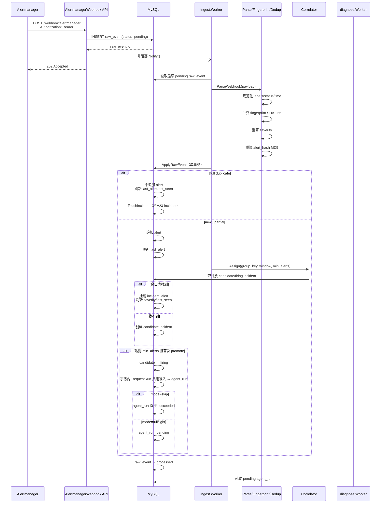

### 三层身份模型

| 身份 | 用途 | 算法/来源 |
|---|---|---|
| `fingerprint` | 判断是不是同一个告警对象 | 选定 labels 排序后 SHA-256 |
| `alert_hash` | 判断同一对象内容是否完全重复 | 状态、labels、annotations 规范化后 MD5 |
| `group_key` | 判断多条告警是否属于同一故障 | `correlate.group_by` labels + 时间窗口 |

### `resolved` 路径

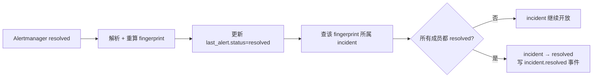

当前行为：

- `firing` 和 `resolved` 共用同一个 fingerprint。
- 完全重复的 firing 不生成新的诊断。
- 完全重复仍刷新 `last_seen`，避免持续告警因重复推送被切成多个 Incident。
- 数据库事务失败时 `raw_event` 保持 `pending`，等待下一轮重试。
- 输入本身不可恢复时，`raw_event` 标记 `failed`，不会永久堵住队首。

依据：`internal/ingest/worker.go:78-319`、`internal/ingest/webhook.go:27-133`、`internal/ingest/fingerprint.go:12-90`、`internal/ingest/correlate.go:47-101`、`internal/store/rawevent.go:114-220`。

## 5. 诊断、Guard、Policy、审批、执行、验证闭环

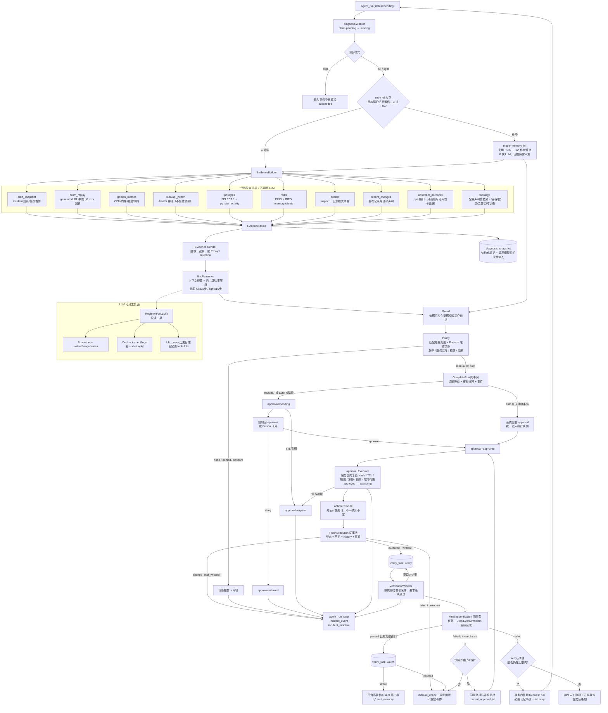

### Pipeline 实际阶段

`diagnose.Pipeline.Run` 的当前顺序：

1. `LoadTarget`：读取 Incident、成员、当前告警。
2. `memory.Lookup`：仅首次诊断查记忆，重诊不查；命中也照常采集当前证据，记忆只提供候选处置。
3. `EvidenceBuilder.BuildForIncident`：执行各 collector（告警快照、Prometheus 回放与黄金指标、sub2api、PostgreSQL、Redis、Docker、发布记录、上游账号），每项记录采集状态；部分失败不能被一个 ok 隐藏。
4. `SaveDiagnosisSnapshot`：结构化证据落库；调用模型**之前**再写入完整脱敏输入、模型、提示词摘要和工具/动作定义，写不进去就失败、不发布计划。
5. `Reasoner.Diagnose`：Eino ReAct，只能调用只读工具；计划只能选择已启用动作并填写其声明的参数，非法 JSON 最多重试一次。工具调用与上下文裁剪记录随后写入快照。
6. `Guard`：依据结构化证据校验动作前提（目标身份、容器状态、发布时序与迁移、上游错误集中度等），可覆盖 LLM 计划。
7. `Policy`：匹配处置规则，调用动作的 `Prepare` 冻结目标、修订、执行前状态、检查项和补偿，决定 `none / denied / observe / approval / auto`。
8. `Service.Prepare`：只准备不可变审批草稿，不独立写审批。
9. `CompleteRun`：Run 的 RCA/Plan/终态、审批快照与相关事件同事务发布。
10. `NotifyReporter`：提交后发送通知，失败不回滚已提交的诊断。

阶段开始事件、普通步骤和工具步骤写入错误均传播并阻止发布可执行审批。

依据：`internal/diagnose/pipeline.go:Run/withStep/recordToolSteps`、`internal/diagnose/evidence.go`、`internal/diagnose/guard.go`、`internal/approval/policy.go:Decide`、`internal/store/runstep.go:CompleteRun`、`internal/store/diagnosis_snapshot.go`。

### 安全闸门

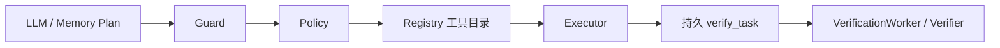

- LLM 只能看到 `Registry.ForLLM()` 导出的只读工具；动作从不作为工具暴露给 ReAct。
- `Guard` 会拦截无真实目标身份的动作（例如依据匿名 OOM 重启健康目标），配置错误、镜像不存在、凭据错误等根因会禁止重启类动作并升级人工。
- `docker_restart` 的目标在拓扑证据中直接 `depends_on` 的节点确认 `down` 或 `missing` 时，Guard 升级人工（依赖故障时重启下游无效）；`unknown` 不拦截，避免 Prometheus 故障卡住所有处置。
- 只有 `remediation.rules` 能授权写操作：规则列出动作、覆盖的告警、模式与预算；firing 成员必须全部属于该服务且在规则覆盖的告警内。`observe` 只记录本会采取的动作。
- `auto` 在维护窗口、规则被阻断、同一事件已执行过主要动作或监控数据不可用时降级为 `manual`；急停、服务正在处置、预算耗尽或动作拒绝准备时直接拒绝。模型置信度不授予执行权。
- `incident.PlanHash = SHA256(canonicalJSON(tool_name, args, execution_context))`；版本 3 快照固定规则 ID/版本/模式、动作版本、目标身份与修订、执行前状态、证据引用、故障成员、验证检查项与参数、补偿和有效期。Hash 是内容绑定，不是身份签名。
- 领取在服务锁（`service_lock` 行）内复验 Hash、TTL、规则版本、急停、预算、阻断与故障范围，同一服务同时只有一个执行、排队补偿或验证中的处置。动作执行前再读对象修订，与快照不一致即不写。
- Web/飞书展示同一快照的目标及身份、规则与模式、检查项、补偿、reason、plan_hash、expires_at；只有完整的 `manual` 快照可以批准，不把模型 risk 当权限。

### 独立恢复验证与准入

- `FinishExecution` 按回执提交：`written` 进入 `executed` 并同事务创建 `verify_task`；`not_written` 记 `aborted`（无动作、无验证）；执行出错时先 `Reconcile` 读取目标，结果未知记 `failed` + `manual_check`。Executor 不等待健康检查。
- `Verifier` 按快照检查项采样（容器实例、健康、业务探针、发布 digest、错误率、账号调度状态等）。数据不足、查询失败、没有真实请求样本都不是通过；健康检查与 Collector 共用 `health.go`，不跟随重定向。
- Worker 每秒消费到期任务，默认每 10 秒观察、300 秒窗口、单次最多 5 秒、连续 3 次通过（这些是待演练校准的初值）。未到终点则持久化下次检查，不 sleep 等待窗口。通过后进入观察阶段（默认 1800 秒），连续不健康判为复发。
- `FinalizeVerification` 同事务写任务、Step/Event/Problem、必要记忆变化、补偿入队与重诊。成功记忆在稳定（无观察窗口时为通过）后写入；不可判定不降级记忆、不自动重诊；通过也不直接把 Incident 改为 resolved，Incident 仍由告警成员恢复驱动。
- 执行失败、验证失败/不可判定、复发和“动作错误”复盘都会阻断该规则的新自动执行，直到管理员复位；阻断由持久事件和复位事件计算。
- 告警促发、`/diagnose`、Web `/rediagnose` 和验证重诊共用 `RequestRun`/事务内函数：锁 Incident、要求 firing、拒绝活跃 Run/审批/验证阶段；人工有 60 秒冷却（按 `run.queued`），自动最多两次（按 `retry_of` 链）。人工冲突返回 409，冷却返回 429 与 Retry-After。观察阶段不阻塞新的诊断。
- 执行结果提交失败只重试持久化，不重新调用动作；重启时中断的 executing 按目标实际状态对账（written / not_written / unknown），不重放。已提交执行只恢复验证；只读领取 30 秒超时可回队，终态提交比较 claimed_at，重启不延长 deadline。

依据：`internal/store/runrequest.go`、`internal/store/execution.go`、`internal/store/verification.go`、`internal/diagnose/verification_worker.go`、`internal/incident/execution.go`。

## 6. Web 控制室、SSE 与 Feishu 协同

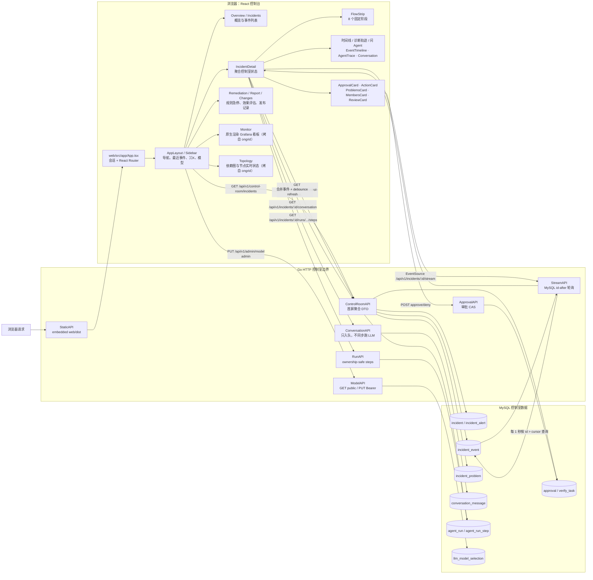

### Web 当前行为

- `web/src/app/App.tsx` 先检查会话，未登录显示 `Login`（个人令牌换取 HttpOnly 会话 Cookie，令牌不进任何浏览器存储）；登录后由 React Router 分页：
  - `/` → `Overview`（触发中事件、待审批、自动处置状态、30 天无人介入恢复率）
  - `/incidents` → `Incidents`（按服务端状态筛选 + 本页文本过滤）
  - `/incidents/<id>` → `IncidentDetail`（诊断报告、处理流程、时间线/诊断轨迹/问 Agent 三个标签，右侧审批、最近变更、当前问题、告警成员、复盘标注）
  - `/remediation` → 处置规则、急停/复位、控制记录；`/report` → 效果评估与待复盘队列；`/changes` → 发布记录与「标记健康」
  - `/monitor` → `Monitor`（按需加载）：用 `PanelGrid` / `PromQLPanel`（recharts）原生渲染 `internal/grafana/dashboards` 的四个看板，支持时间范围、自定义窗口和自动刷新；Incident 详情的“监控”按钮打开事件前后各 30 分钟。代码拷自 ongrid（AGPL-3.0，见 NOTICE）
  - `/topology` → `Topology`（按需加载）：`TopologyGraph`（@xyflow/react + dagre）画依赖图，节点颜色表示状态、带告警数；侧栏列出节点，选中后显示容器事实、告警、关系和监控链接；`?incident=ID` 高亮该事件告警映射到的节点（Incident 详情的“拓扑”按钮）。每 15 秒刷新。代码拷自 ongrid（AGPL-3.0，见 NOTICE）
- 侧栏每 30 秒拉一次最近 50 个 Incident，供导航徽标、最近事件和 ⌘K 快速跳转使用；各页面需要筛选时自己查询服务端。
- `IncidentDetail` 首屏读取控制室聚合、run steps 和对话历史。
- 诊断结论与对话用 Markdown 渲染：不启用原始 HTML、去掉图片、链接新窗口且无 opener；step 输入输出在浏览器侧再按敏感键名脱敏一次。
- `EventSource` 连接后端 SSE，后端按 MySQL `incident_event.id` 做游标轮询。
- 前端收到事件后合并去重，并触发延迟刷新。
- 重诊经统一准入入队，补充证据/提问入对话队列；审批决定同步事务提交，变更执行异步消费。
- `pending_approval` 用于裁决，`latest_action` 展示最近审批的回执、补偿、验证与观察阶段，终态不会随待审批列表清空而消失。旧版无快照记录展示未知，不伪造过去的验证结果。
- 执行、补偿、`verify.*`（含 `verify.stable/recurred`）和 `review.recorded` 等事件驱动刷新；`GET /api/v1/approvals/:id` 返回同一验证摘要，不暴露验证 URL。
- `request-evidence` 复用 conversation 队列，不在 HTTP handler 中直接采证据或调用 Docker。
- `FlowStrip` 固定展示（点击节点切到诊断轨迹并展开对应 step）：

```text
alert → evidence → reasoner → guard → policy → approval → execute → verify
```

### Feishu 链路

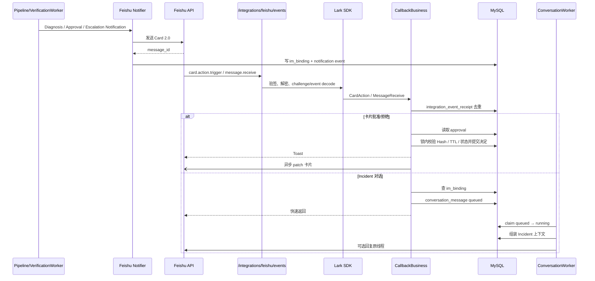

当前 Feishu 回调只有在 `notify.im.provider == "feishu_app"` 时才由 `main.go` 绑定。

## 7. API 面

“任一身份”包括机器令牌；viewer < operator < admin。控制台相关端点只在启用 Web 时注册。

| 路径 | 当前鉴权 | 作用 |
|---|---|---|
| `POST /webhook/alertmanager` | 机器令牌 | Alertmanager v4 告警入队 |
| `GET /api/v1/incidents`、`/api/v1/incidents/:id` | 任一身份 | Incident 列表、详情和成员 |
| `POST /api/v1/incidents/:id/diagnose` | operator 或机器令牌 | 统一准入的人工诊断（含冷却） |
| `GET /debug/evidence/:id` | admin 或机器令牌 | 查看渲染后的证据 |
| `GET /metrics` | 无鉴权 | Prometheus 文本指标 |
| `GET /api/v1/approvals...` | 任一身份 | 列表/详情与验证摘要 |
| `POST /api/v1/approvals/:id/approve\|deny` | operator | 需 plan_hash、reason |
| `GET /api/v1/admin/model` / `PUT` | 任一身份 / admin | 当前模型；切换模型 |
| `/api/v1/remediation`、`/remediation/report` | 任一身份 | 规则状态、控制记录；效果报表 |
| `POST /api/v1/remediation/stop\|resume`、`/rules/:rule/reset` | admin | 急停、解除、复位规则阻断（必须填写原因） |
| `/api/v1/incidents/:id/reviews` | 读任一身份；写 operator | 复盘标注 |
| `/api/v1/changes`、`/changes/:id/verify` | 读任一身份；登记 operator 或机器令牌；确认健康 operator | 发布记录 |
| `/api/v1/session` | 个人令牌 / 会话 | 登录、当前身份、登出 |
| `GET /api/v1/observability/dashboards`、`/dashboards/:uid` | viewer（不含机器令牌） | 编进二进制的看板定义 |
| `POST /api/v1/prometheus/query_range` | viewer（不含机器令牌） | 监控页的 PromQL 区间查询代理，表达式 ≤ 4 KB，30 秒超时 |
| `GET /api/v1/topology?incident=` | viewer（不含机器令牌） | 依赖图与节点状态；带 `incident` 时另返回该事件告警映射到的节点 |
| `/api/v1/control-room/model` | 任一身份 | 当前模型和 allowlist |
| `/api/v1/control-room/incidents`、`/incidents/:id/control-room`、`/events`、`/problems`、`/runs...`、`/stream`、`/conversation` | 任一身份 | 控制室读取与 SSE |
| `POST /api/v1/incidents/:id/questions\|rediagnose\|request-evidence` | operator | 提问、重诊、补充证据入队 |
| `POST /integrations/feishu/events` | Lark SDK 验签解密 | Feishu 事件和卡片回调 |
| `/`、`/*path` | 无 | 嵌入式 React 静态资源（登录页） |

路由绑定集中在 `cmd/server/main.go:run`。

## 8. Worker 与队列

| Worker | 持久队列/状态 | 运行方式 | 恢复行为 |
|---|---|---|---|
| `ingest.Worker` | `raw_event.status=pending` | 非阻塞唤醒 + 1 秒 ticker | 启动扫描 pending；单 goroutine 按 ID 消费 |
| `diagnose.Worker` | `agent_run.status=pending` | 定时轮询 | 启动和运行中将超时 `running` 重新放回 pending |
| `approval.ExpiryWorker` | `approval.status=pending/approved` | 默认每分钟扫描 | 过期审批转 `expired` 并写事件/问题 |
| `approval.Executor` | `approval.status=approved`（含排队补偿） | 默认每秒轮询；MySQL `GET_LOCK` 保证单个活动执行器 | 启动时按目标实际状态对账中断的 `executing`；不自动重放外部动作 |
| `diagnose.VerificationWorker` | `verify_task.status=pending` 且到期（verify / watch 阶段） | 每秒处理一个到期任务 | 启动及循环回收超时 running；取消/读库错误保留可恢复领取，deadline 不变 |
| `conversation.Worker` | `conversation_message.status=queued` | 定时轮询 | 超时 `running` 消息重新入队 |

系统不使用 RabbitMQ、Kafka、Redis Streams 或独立任务服务。MySQL 行锁、条件更新和幂等状态迁移承担队列可靠性；这不等于支持多实例，也不保证外部动作与 MySQL 的 exactly-once。

## 9. MySQL 数据模型

空库按 001–014 顺序迁移后共有 24 张表（含两张已弃用、尚未 DROP 的 Web 会话表）：

- `001_init.sql`：10 张核心表
- `005_control_room.sql`：7 张控制室/会话表
- `007_llm_model_selection.sql`：1 张模型选择表
- `008_deprecate_web_session.sql`：标记两张会话表弃用，不删除
- `009_approval_execution_context.sql`：审批快照（其 simulated 终态已不再产生）
- `010_verify_task.sql`：1 张持久验证任务表
- `011_queue_admission_indexes.sql`：统一准入/队列查询索引
- `012_verify_consecutive_passes.sql`：验证连续通过计数
- `013_diagnosis_snapshot.sql`：1 张可回放诊断快照表
- `014_remediation.sql`：审批的服务/规则/补偿关联与操作回执、验证观察阶段，以及 `service_lock`、`control_event`、`change_event`、`review` 4 张表

下面关系是**业务逻辑关系**。当前 SQL 没有声明外键，图中的关系不是数据库 FK 约束。

### 9.1 告警、Incident、诊断、审批核心表

```mermaid
erDiagram
    raw_event {
        BIGINT id PK
        VARCHAR source
        JSON payload
        ENUM status
        TEXT error
        DATETIME created_at
        DATETIME processed_at
    }

    alert {
        BIGINT id PK
        CHAR64 fingerprint
        CHAR32 alert_hash
        VARCHAR source
        VARCHAR name
        TINYINT severity
        ENUM status
        JSON labels
        JSON annotations
        TEXT generator_url
        DATETIME starts_at
        DATETIME received_at
    }

    last_alert {
        CHAR64 fingerprint PK
        BIGINT alert_id
        CHAR32 alert_hash
        ENUM status
        TINYINT severity
        DATETIME first_seen
        DATETIME last_seen
        INT firing_count
        BIGINT incident_id
    }

    incident {
        BIGINT id PK
        VARCHAR group_key
        ENUM status
        TINYINT severity
        INT alerts_count
        VARCHAR title
        DATETIME started_at
        DATETIME last_seen_at
        DATETIME resolved_at
    }

    incident_alert {
        BIGINT incident_id PK
        CHAR64 fingerprint PK
        DATETIME linked_at
    }

    agent_run {
        BIGINT id PK
        BIGINT incident_id
        ENUM mode
        ENUM status
        BIGINT retry_of
        TEXT rca_text
        JSON plan_json
        INT tokens_in
        INT tokens_out
        DATETIME started_at
        DATETIME finished_at
    }

    agent_run_step {
        BIGINT id PK
        BIGINT run_id
        INT seq
        ENUM kind
        VARCHAR name
        JSON input_json
        JSON output_json
        TEXT error
        DATETIME started_at
        DATETIME finished_at
    }

    approval {
        BIGINT id PK
        BIGINT incident_id
        BIGINT run_id
        VARCHAR service
        VARCHAR rule_id
        BIGINT parent_approval_id
        VARCHAR tool_name
        JSON args_json
        CHAR64 plan_hash
        JSON execution_context
        TEXT reason
        ENUM status
        DATETIME expires_at
        VARCHAR decided_by
        JSON result_json
        VARCHAR operation_id
        DATETIME operation_started_at
        DATETIME created_at
        DATETIME decided_at
        TEXT decision_reason
        VARCHAR decision_source
    }

    verify_task {
        BIGINT approval_id PK
        ENUM status
        ENUM phase
        INT consecutive_passes
        INT consecutive_failures
        DATETIME next_check_at
        DATETIME deadline_at
        DATETIME claimed_at
        DATETIME last_checked_at
        JSON last_result_json
        DATETIME created_at
        DATETIME finished_at
    }

    fault_memory {
        CHAR12 fingerprint PK
        VARCHAR group_key
        VARCHAR alert_name
        TEXT rca_text
        JSON plan_json
        ENUM confidence
        INT hits
        DATETIME first_seen
        DATETIME last_used
        DATETIME last_success
        INT ttl_sec
    }

    fault_cmd_history {
        BIGINT id PK
        CHAR12 fingerprint
        VARCHAR tool_name
        JSON args_json
        VARCHAR result_brief
        BIGINT approval_id
        DATETIME created_at
    }

    raw_event ||--o{ alert : "逻辑处理产生"
    alert }o--|| last_alert : "fingerprint 当前快照"
    last_alert ||--o{ incident_alert : "成员快照"
    incident ||--o{ incident_alert : "Incident 成员"
    incident ||--o{ agent_run : "诊断队列"
    agent_run ||--o{ agent_run_step : "步骤审计"
    agent_run ||--o{ approval : "动作申请"
    approval ||--o{ fault_cmd_history : "执行结果"
    approval ||--o| verify_task : "真实执行的恢复验证"
    approval |o--o{ approval : "parent_approval_id 补偿"
    fault_memory ||--o{ fault_cmd_history : "同故障指纹"
```

### 9.2 控制室、对话、集成与模型表

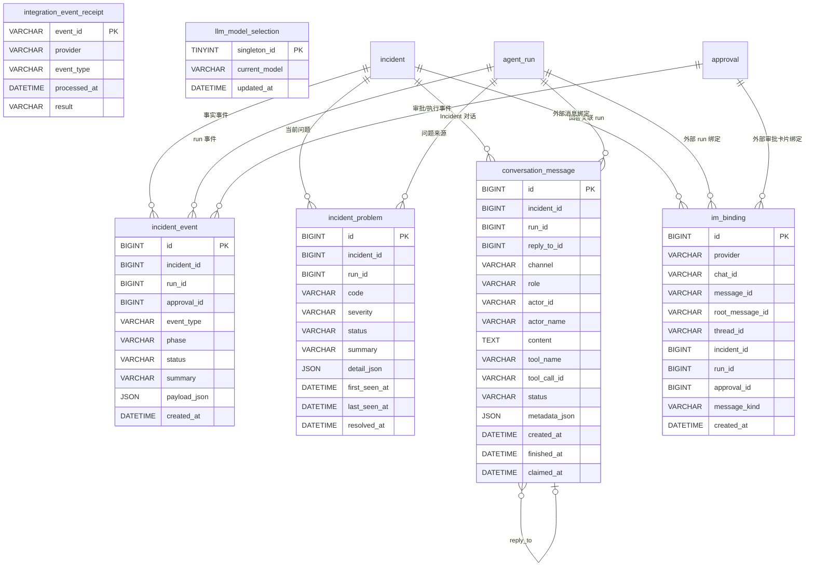

### 9.3 自动处置与可回放数据

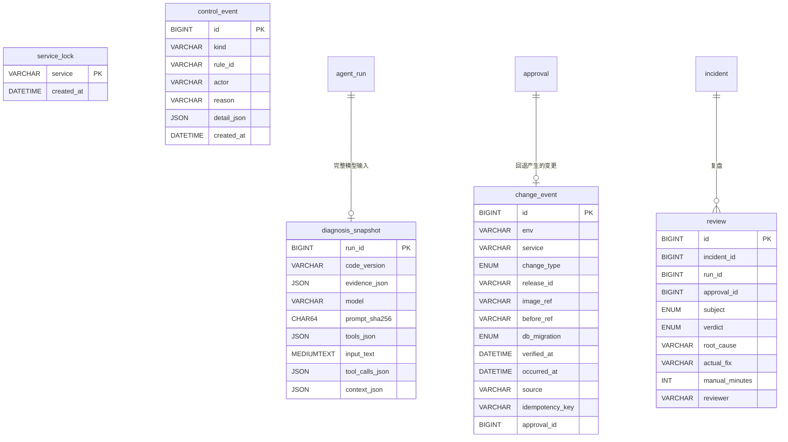

- `control_event` 只追加：急停/解除、规则复位和启动时加载的规则发布。急停状态和规则阻断都由事件计算，没有第二套计数表。
- `change_event` 由 CI/人工登记发布、由 `deployment_rollback` 记录回退；只有人工确认健康（`verified_at`）的发布能作为回退目标。配置和密钥正文不入库。
- `review` 区分诊断评价（关联 run）与动作评价（关联 approval）；`unknown` 不算正确，动作评价为错误会阻断规则。

### 数据模型中的实际缺口

当前 `raw_event` 没有 `incident_id`，`incident_event` 也没有 `raw_event_id`。因此数据库能稳定回放：

```text
incident → run → step → approval → execution → verify
```

但不能在 schema 层直接保存：

```text
raw_event → incident
```

这与部分设计文档中“按 raw_event_id 贯穿全链路”的描述不一致。

依据：`migrations/001_init.sql` 至 `014_remediation.sql`、`internal/store/models.go`。

## 10. 状态机

| 对象 | 当前状态路径 |
|---|---|
| `raw_event` | `pending → processed` 或 `pending → failed` |
| `incident` | 枚举包含 `candidate/firing/acknowledged/resolved`；主链主要为 `candidate → firing → resolved` |
| `agent_run` | `pending → running → succeeded/failed` |
| 重诊 run | 通过 `retry_of` 串成 run 链，自动重诊上限为 2 |
| `approval` | `pending → approved/denied/expired`；`approved → executing/expired`；`executing → executed/aborted/failed`；补偿审批以 `approved` 入队（`parent_approval_id` 指向原动作） |
| `verify_task` | verify 阶段 `pending → running → passed/failed/inconclusive`；有观察窗口时 `passed` 进入 watch 阶段 `→ stable/recurred`；未到终点或领取超时 `running → pending` |
| `conversation_message` | `queued → running → completed/failed`；租约超时可重新入队 |
| `fault_memory` | `high` 命中验证失败后降为 `low`，后续不再召回 |
| `llm_model_selection` | 单例行保存当前模型 ID，不保存 URL、密钥或 token |

## 11. 配置与启用条件

| 能力 | 当前配置 | 实际效果 |
|---|---|---|
| MySQL | `mysql.dsn: ${MYSQL_DSN}` | 必须配置，否则启动失败 |
| LLM Reasoner | 需配置有效角色与模型 | 配置缺失时 `diagnose.Worker` 不启动 |
| Web 控制台 | `web.base_url` 非空，或 provider 为 `feishu_app` | `webEnabled=true`，绑定控制台路由与登录 |
| Web 鉴权 | `web.operators`（个人令牌只存 SHA-256）+ `server.auth_token`（机器身份） | 启用控制台时至少一名操作人；会话 Cookie 12 小时，写请求需 CSRF 头 |
| Feishu | 选择 `notify.im.provider: feishu_app` | 启用时需完整配置；不回退 Noop，回调验签不保护 Web |
| 被监控服务 | `service`（名称、环境、容器、健康地址、管理密钥、探针、发布入口） | 唯一目标描述；缺管理密钥时不采集上游账号、`upstream_quarantine` 不可用；缺 `release` 时发布回退不可用 |
| 处置规则 | `remediation.rules` + `rules_version`，默认无规则 | 无规则时不产生任何写操作；修改规则即新的规则版本，旧快照失效 |
| HTTP 监听 | `server.listen_addr` 默认 `127.0.0.1` | Compose 显式 `0.0.0.0:18080`，全 listener 必须限制可信来源 |
| 恢复验证 | `remediation.verification` 默认 interval/window/timeout/passes/watch=`10/300/5/3/1800` | `0 < timeout < interval < window` 且 timeout < 30 秒；规则可单独延长验证窗口 |
| 严格配置 | YAML AST 展开后 `KnownFields(true)` | 未知/删除字段、多文档或无效时长拒绝启动 |
| Prometheus | 默认本机 `9090` | 证据和黄金指标查询使用该地址 |
| Docker socket | 默认 `/var/run/docker.sock` | socket 不存在时跳过 Docker 工具和证据 |
| Loki | `tools.loki.base_url`，示例为本机 `3100` | 留空不注册 `loki_query`；模型只能按 `service` 标签查询，窗口和行数受 `max_window_minutes` / `max_lines` 限制 |
| Web 前端产物 | `web/dist/` 不入库 | 必须先 `npm run build` 再编译 Go；`.gitkeep` 不是可用控制台 |

## 12. 安全与可靠性不变量

### 12.1 入站与队列

- webhook 先写 `raw_event(pending)`，再返回 202；内存 channel 只负责唤醒。
- 输入错误标记 `failed`，数据库错误保留 `pending`。
- worker 启动时扫描 pending，进程重启后可补账。
- 领取使用行锁和条件更新，避免重复消费。

### 12.2 LLM 边界

- LLM 只接收脱敏、截断后的证据。
- LLM 只能调用只读工具；动作从不作为工具暴露。
- LLM 输出不是权限结论。
- 上下文窗口配置在 `llm.models[].context_window_tokens`，随模型切换；DeepSeek 示例值为 1000000，未指定模型窗口时应用缺省值为 131072（不是对供应商容量的保证）。诊断在同一锁内取得客户端与窗口快照，扣除 `max_tokens` 输出预留及 512 协议余量。旧 `diagnose.budget.context_tokens` 已删除，配置加载会拒绝该字段。
- 每次请求估算系统提示、工具定义、Evidence 和完整消息历史：ASCII 约 3 字符/Token，非 ASCII 约 2 UTF-8 字节/Token，初始增加 20% 余量；根据本次诊断各轮实际 `prompt_tokens` 对低估偏差向上校准，保留 10% 余量。分母使用实际发送的压缩后输入，校准不跨模型或诊断共享。它是启发式估算，不是精确 tokenizer、累计费用上限或网关容量认证。
- 输入超过可用额度的 80% 时，仅压缩旧工具结果：Prometheus 数值序列保留标签、首尾点、最小/最大点与样本数；Docker 日志对连续相同行保存原文和次数。中间指标样本的省略有显式标记，不能据摘要推断完整波形或异常持续时间。
- 初始证据、最近一批完整工具交互、assistant reasoning 和协议元数据保持原样；不新增摘要模型调用。压缩只作用于发送副本，原始 ReAct 历史和已有审计截断规则不变。压缩后仍超过预算则报错，不继续删除受保护事实。
- 默认 full/light 图步数上限为 32/16，诊断含契约重试总超时为 3 分钟；配置文件显式设置的旧步数仍然生效。只读 Questioner 仍复用 light 步数，尚未接入本次诊断上下文压缩。
- 诊断的 full/light 预算限制图执行步数（模型与工具批次各占一步），不等于单个工具调用次数；最后可用模型轮次禁用工具调用，基于已有证据输出结论。工具批次仍可并行，调用日志使用互斥保护。
- 成功诊断的 LLM 步骤记录 `context_compactions`、最近一次输入估算的压缩前后值和累计估算节省量；同时记录最后一轮 `actual_prompt` 和供后续估算使用的 `estimate_factor`；实际总 Token 仍取模型 usage 累加，二者分开解释。
- 诊断 Plan 的 action 只接受 `none` 或已启用的动作，`params` 只接受该动作声明的参数；提示词与解析白名单来自同一份动作定义。目标、镜像 digest、阈值和补偿由可信配置与 `Prepare` 确定，授权仍由 Policy 校验。
- 非法 JSON 或非法 action 最多重试一次；最后一轮仍请求工具则失败，不执行越预算的工具。
- 工具统一设置超时和最大输出。

### 12.3 变更动作

- 所有动作必须存在于 Registry，并由处置规则授权；`observe` 不产生写操作。
- 审批 Hash 绑定 `tool_name + args + execution_context`，快照不可变；裁决和领取时复验。
- 同一服务同时只有一个执行、排队补偿或验证中的处置；同一事件首版最多一个主要动作和一个预先冻结的补偿。
- Run 结论与审批原子发布，执行回执与验证任务原子提交，验证终态与审计/记忆/补偿/必要重诊原子提交。
- 外部动作与 MySQL 无法组成一个事务，不宣称 exactly-once：执行前持久化操作标识，中断后按目标实际状态对账；结果未知升级人工，不自动重放。
- 执行、验证、观察、Incident 恢复是不同事实；不可判定不写成功记忆、不降级记忆，也不自动重诊。
- IM 通知在提交后发送，不保证必达。

### 12.4 敏感数据

- DSN、token、API key、Cookie 和 Authorization 不应进入日志、数据库摘要或 Prompt。
- Web DTO 不直接暴露完整 `PlanJSON`、工具参数和外部执行结果。
- Feishu 卡片只携带有限引用和展示字段，不传可执行参数和凭据。

## 13. 当前漂移与风险点

1. **单实例**：启动对账只支持一个活动执行器，不宣称高可用；Agent 与 sub2api 同宿主机时，宿主机整体失联依赖外部心跳发现。
2. **Alertmanager 凭据需要对齐**：Alertmanager 的 Bearer 凭据必须与 `server.auth_token` 一致，否则 webhook 会返回 401。
3. **开发 Compose 未抓取 oncall-agent `/metrics`**：生产监控栈（`deploy/monitoring`）已抓取；开发配置只有 node-exporter 和 blackbox job。
4. **部分外部写入没有版本条件**：sub2api 账号调度状态写入前读取并比较，读写之间仍有竞态窗口，结果中记录这一限制。
5. **平台外人工操作不可完全观测**：报表区分“无已记录人工介入”和“抽查确认无人介入”。
6. **原始告警到 Incident 缺少数据库直接关联**：`raw_event_id` 没有进入 `incident_event` 或后续状态表。
7. **部分旧文档已过时**：以源码和本文为准。

## 14. 代码依据索引

| 主题 | 主要文件 |
|---|---|
| 服务启动与依赖组装 | `cmd/server/main.go` |
| HTTP 路由 | `cmd/server/main.go:run` |
| 配置与默认值 | `internal/config/config.go`、`config.example.yaml` |
| 告警解析/指纹/归并 | `internal/ingest/*.go` |
| 摄入事务与队列 | `internal/ingest/worker.go`、`internal/store/rawevent.go`、`internal/store/incident.go` |
| 诊断 Pipeline | `internal/diagnose/pipeline.go` |
| Evidence collectors | `internal/diagnose/collector_*.go`、`internal/diagnose/evidence.go` |
| LLM 与工具权限 | `internal/llm/*.go`、`internal/tools/*.go` |
| Guard/Policy/审批/执行 | `internal/diagnose/guard.go`、`internal/approval/*.go` |
| 动作实现 | `internal/tools/action*.go`、`internal/sub2api/*.go` |
| 规则状态/变更/复盘/报表 | `internal/store/remediation.go`、`internal/store/change.go`、`internal/store/report.go`、`internal/api/remediation.go` |
| 执行契约/纯规则 | `internal/incident/execution.go`、`internal/incident/merge.go`、`internal/incident/retry.go` |
| Verify/重诊准入 | `internal/diagnose/verify.go`、`internal/diagnose/verification_worker.go`、`internal/store/verification.go`、`internal/store/runrequest.go` |
| 控制室/SSE/对话 | `internal/api/controlroom.go`、`internal/api/stream.go`、`internal/conversation/*.go` |
| Feishu 回调 | `internal/notify/feishu/*.go`、`internal/api/feishu_callback.go` |
| 数据模型 | `migrations/*.sql`、`internal/store/models.go` |
| 前端控制台 | `web/src/app/App.tsx`、`web/src/pages/IncidentDetail.tsx`、`web/src/components/incident/`、`web/src/api.ts` |
| 部署与告警 | `docker-compose.dev.yml`、`prometheus.yml`、`alerts.yml`、`alertmanager.yml`、`blackbox.yml`；生产见 `deploy/` |

## 15. 升级与验证边界

已有数据库升级必须先停 server/外部写入并备份，再执行：

```bash
MYSQL_DSN=... go run ./cmd/retire-approvals -apply
```

该离线命令支持 migration 009 前/后：只退役旧 pending/approved（expired + 事件）和结果未知的旧 executing（failed + manual_check），不改现代快照、不补造历史验证。之后离线迁移到 014（执行快照升级到版本 3，旧快照在领取时失效）、按新配置结构重写配置、先构建前端再构建 Go。启动检查只读，遇到未退役的旧活跃审批拒绝启动，不代替维护命令。详细流程与回退见[执行安全升级说明](execution-trust-upgrade.md)。

CI 从独立空 MySQL 执行全部迁移，使用显式 `TEST_MYSQL_DSN` 运行 `go test -count=1 -race ./...`，另用两个新库显式运行 empty/legacy 升级测试，避免其模式门控被跳过；事务故障注入通过条件 trigger + SIGNAL，应用测试账号需 TRIGGER，binlog trust 仅在可丢弃 CI 实例由 root 设置。保留 gofmt/vet/build 和前端 typecheck/build/交互门禁。

浏览器交互测试使用拦截 API，不是 live-backend 全链路验收。历史单测通过记录不能证明本轮执行安全的验收已完成；[原设计](execution-trust-design.md)的 T1–T17、迁移与真实故障实验仍需各自执行并记录，不从调度默认值推导实际 resolved 延迟。
