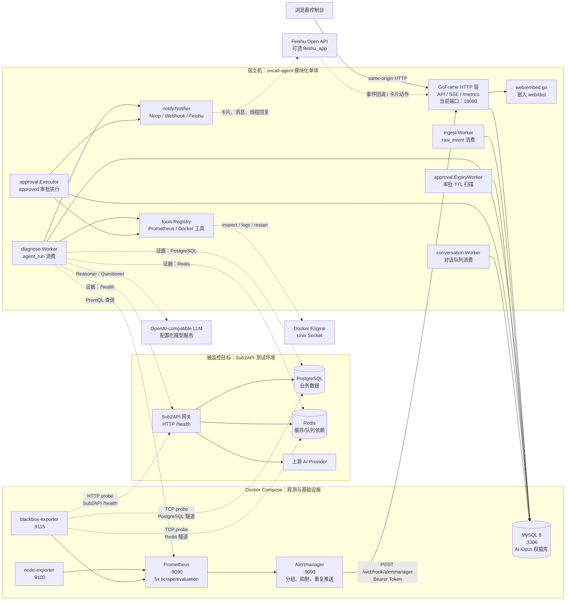
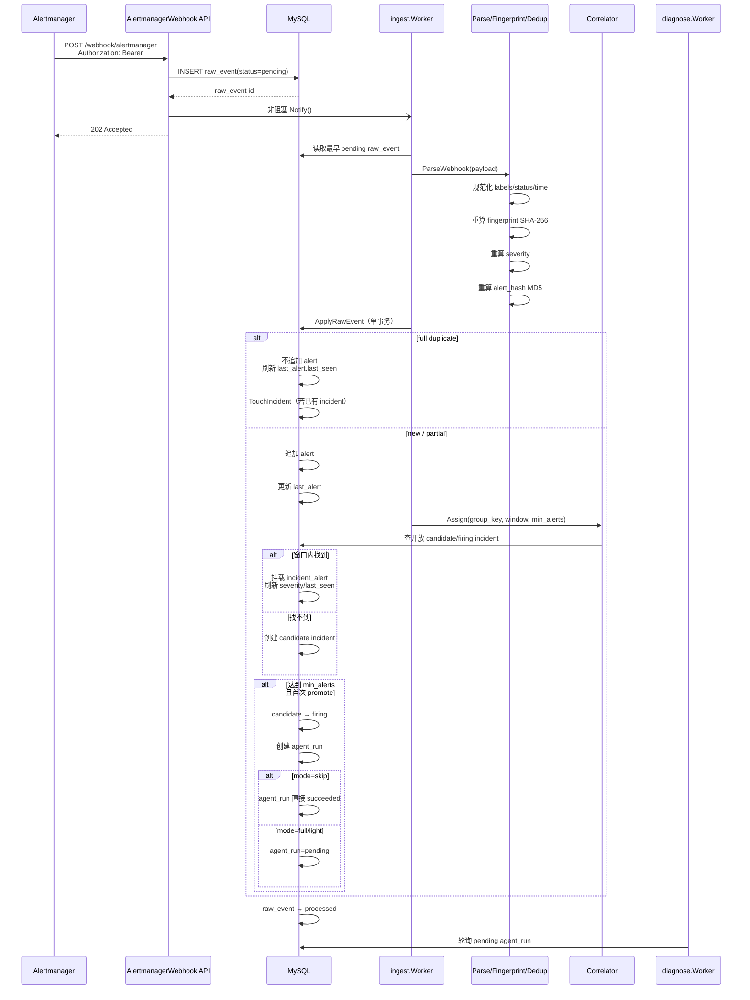
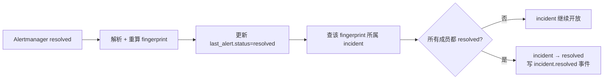
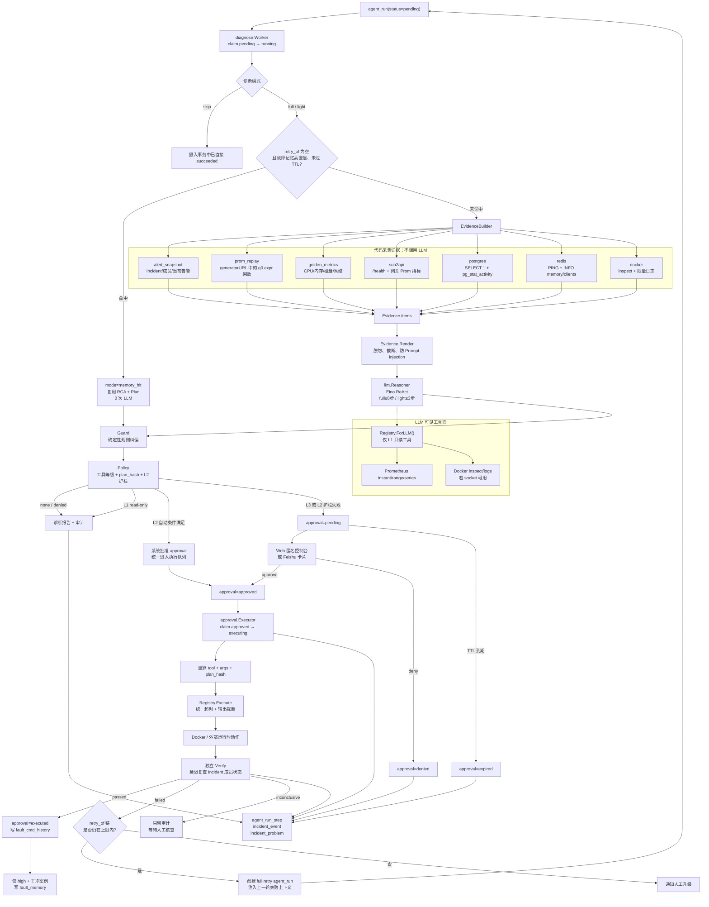
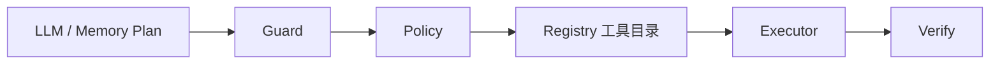
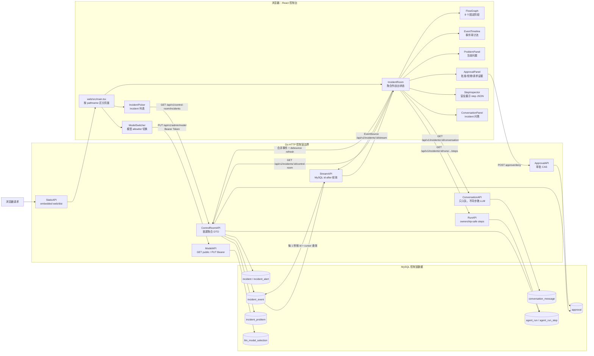
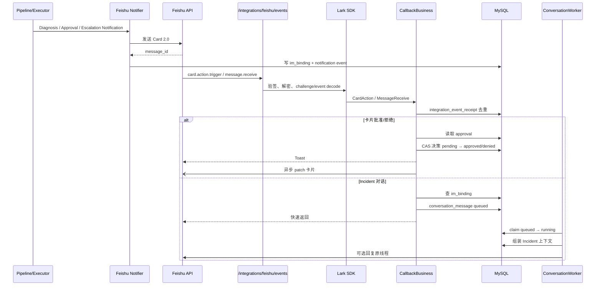
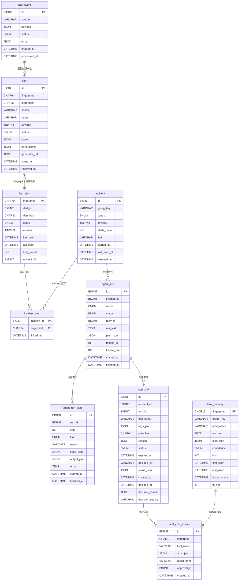
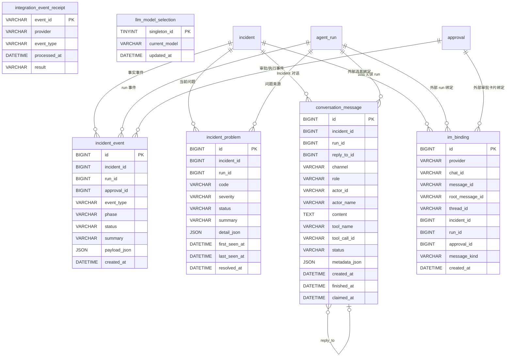

# 当前系统架构

> 本文按当前源码、数据库迁移和运行配置整理。源码是事实基准；部分早期设计文档仍描述“诊断、审批、执行尚未实现”，不应作为当前运行状态依据。
>
> 系统形态：**模块化单体 + MySQL 持久队列/审计 + React 嵌入式控制台**。

## 1. 架构结论

- 一个 `oncall-agent` Go 进程同时承载 HTTP、静态前端、SSE 和 5 类后台 worker。
- MySQL 是 AI-Opus 的唯一权威业务库，也是摄入、诊断、审批执行的持久队列。
- Prometheus、Alertmanager、blackbox-exporter 属于观测与告警侧。
- PostgreSQL、Redis、Sub2API 属于被监控目标及其依赖，不是 AI-Opus 自身的存储。
- React 控制台构建后通过 `go:embed` 嵌入 Go 服务，同源提供。
- LLM 只负责基于证据生成 RCA/Plan 或回答只读问题；变更动作必须经过 Guard、Policy、Approval、Executor、Verify。
- 控制台是**显式的匿名公开操作面**：没有登录、会话或 CSRF，`api.Console` 是唯一的身份来源，控制台上的所有读写一律记为 `anonymous`。曾经存在但从未接入路由的 OAuth/Session 实现已于 2026-08-24 删除。

## 2. 运行时部署拓扑



### 运行边界

| 部分 | 当前实现 |
|---|---|
| `oncall-agent` | 跑在宿主机，不在 `docker-compose.dev.yml` 中 |
| HTTP | GoFrame，当前配置端口为 `18080` |
| MySQL | Compose 容器，AI-Opus 自身唯一业务数据库 |
| Prometheus | `:9090`，抓 node-exporter 和 blackbox |
| Alertmanager | `:9093`，向宿主机发送 Alertmanager webhook |
| blackbox | 探测目标 HTTP 健康状态和 PostgreSQL/Redis TCP 连通性 |
| PostgreSQL / Redis | 由 Sub2API 使用，AI-Opus 只读采集证据 |
| Docker | 通过 Unix socket 读取容器并执行受控动作；socket 缺失时能力降级 |
| LLM | OpenAI 兼容接口，凭据只来自服务端配置 |
| Feishu | 可选出向通知和入向回调 |

依据：`docker-compose.dev.yml`、`prometheus.yml`、`alertmanager.yml`、`blackbox.yml`、`config.yaml`、`cmd/server/main.go:42-239`。

## 3. 代码分层与模块依赖

```mermaid
flowchart TB
    subgraph entry["组合根与入口"]
        BOOT["cmd/server/main.go<br/>加载配置、连接 DB、组装依赖、启动 workers、绑定路由"]
        SIM["cmd/simulate/main.go<br/>生产格式 Alertmanager 测试注入"]
    end

    subgraph edge["边界层"]
        API["internal/api<br/>HTTP Handler、DTO、Bearer 校验、SSE、静态资源"]
        WEB["web/src<br/>React 控制台"]
    end

    subgraph workers["异步运行时"]
        INGW["internal/ingest.Worker<br/>raw_event"]
        DIAGW["internal/diagnose.Worker<br/>agent_run"]
        EXPW["internal/approval.ExpiryWorker<br/>审批 TTL"]
        EXECW["internal/approval.Executor<br/>approved approval"]
        CONVW["internal/conversation.Worker<br/>conversation_message"]
    end

    subgraph domain["业务控制面"]
        ING["internal/ingest<br/>解析、指纹、去重、归并"]
        INC["internal/incident<br/>严重度路由、run 初始化"]
        PIPE["internal/diagnose.Pipeline<br/>memory → evidence → LLM → Guard → Policy → notify"]
        VERIFY["internal/diagnose.Verifier<br/>独立恢复验证"]
        RETRY["internal/diagnose.RetryScheduler<br/>重诊与人工升级"]
        APPROVAL["internal/approval<br/>Policy、审批状态机、执行器"]
        MEMORY["internal/memory<br/>fault_memory 召回/写回/降级"]
        CONV["internal/conversation<br/>对话入队、上下文、回答持久化"]
    end

    subgraph adapters["适配器与安全工具"]
        LLM["internal/llm<br/>Factory、Reasoner、Questioner、ModelSwitcher"]
        TOOLS["internal/tools<br/>Registry、Prometheus、Docker"]
        NOTIFY["internal/notify<br/>Webhook / Feishu / Noop"]
    end

    subgraph persistence["持久化与观测"]
        STORE["internal/store<br/>唯一数据库访问边界"]
        DB[("MySQL<br/>状态、队列、审计、控制室")]
        EVENTS["internal/eventlog<br/>事件类型定义"]
        METRICS["internal/metrics<br/>进程计数器与 gauges"]
        MIG["migrations/*.sql<br/>手工 schema"]
    end

    BOOT --> API
    BOOT --> INGW
    BOOT --> DIAGW
    BOOT --> EXPW
    BOOT --> EXECW
    BOOT --> CONVW

    WEB --> API
    API --> STORE
    API --> APPROVAL
    API --> CONV
    API --> LLM
    API --> METRICS

    INGW --> ING
    ING --> INC
    ING --> STORE
    INC --> STORE

    DIAGW --> PIPE
    PIPE --> MEMORY
    PIPE --> LLM
    PIPE --> TOOLS
    PIPE --> APPROVAL
    PIPE --> NOTIFY
    PIPE --> STORE

    EXECW --> APPROVAL
    EXECW --> TOOLS
    EXECW --> VERIFY
    EXECW --> MEMORY
    EXECW --> RETRY
    EXECW --> STORE

    CONVW --> CONV
    CONVW --> LLM
    CONVW --> TOOLS
    CONVW --> NOTIFY
    CONVW --> STORE

    APPROVAL --> STORE
    MEMORY --> STORE
    VERIFY --> STORE
    RETRY --> STORE
    NOTIFY --> STORE
    EVENTS -.-> STORE

    STORE --> DB
    MIG -.手工执行.-> DB
    ING -.-> METRICS
    DIAGW -.-> METRICS
    EXECW -.-> METRICS
```



### 模块职责

| 模块 | 当前职责 |
|---|---|
| `cmd/server` | 唯一组合根；所有依赖在这里组装 |
| `internal/config` | YAML 读取、环境变量展开、启动前校验、默认值 |
| `internal/api` | GoFrame 适配器、HTTP 路由、DTO 脱敏、Bearer/匿名鉴权、SSE |
| `internal/ingest` | Alertmanager v4 解析、fingerprint、alert hash、severity、去重、归并 |
| `internal/incident` | severity → `full/light/skip` 路由；构造诊断队列行 |
| `internal/diagnose` | Evidence、Pipeline、Guard、Verify、Retry |
| `internal/llm` | OpenAI 兼容模型工厂、Eino ReAct、只读 Questioner、模型切换 |
| `internal/tools` | 工具注册、等级控制、统一超时、输出截断、Prometheus/Docker 适配 |
| `internal/approval` | Policy 判定、审批 CAS、审批 TTL、执行队列、执行结果 |
| `internal/memory` | 精确故障指纹记忆；高置信 TTL 召回、写回和降级 |
| `internal/conversation` | Web/Feishu 共用的对话队列、上下文组装、回答持久化 |
| `internal/notify` | Provider 无关通知接口；Noop、传统 webhook、Feishu |
| `internal/store` | 唯一 GORM/MySQL 边界；所有业务状态和审计写入 |
| `internal/eventlog` | 事件类型常量；事件实际由各业务模块通过 store 写入 |
| `internal/metrics` | 进程内 counter/gauge，暴露 `/metrics` |
| `web` | Vite 产物通过 `go:embed` 嵌入 Go 服务；产物不入库，需先 `npm run build` |
| `cmd/simulate` | 走同一个 webhook 入口注入测试告警 |

## 4. 告警接入、去重与 Incident 归并



### 三层身份模型

| 身份 | 用途 | 算法/来源 |
|---|---|---|
| `fingerprint` | 判断是不是同一个告警对象 | 选定 labels 排序后 SHA-256 |
| `alert_hash` | 判断同一对象内容是否完全重复 | 状态、labels、annotations 规范化后 MD5 |
| `group_key` | 判断多条告警是否属于同一故障 | `correlate.group_by` labels + 时间窗口 |

### `resolved` 路径



当前行为：

- `firing` 和 `resolved` 共用同一个 fingerprint。
- 完全重复的 firing 不生成新的诊断。
- 完全重复仍刷新 `last_seen`，避免持续告警因重复推送被切成多个 Incident。
- 数据库事务失败时 `raw_event` 保持 `pending`，等待下一轮重试。
- 输入本身不可恢复时，`raw_event` 标记 `failed`，不会永久堵住队首。

依据：`internal/ingest/worker.go:78-319`、`internal/ingest/webhook.go:27-133`、`internal/ingest/fingerprint.go:12-90`、`internal/ingest/correlate.go:47-101`、`internal/store/rawevent.go:114-220`。

## 5. 诊断、Guard、Policy、审批、执行、验证闭环



### Pipeline 实际阶段

`diagnose.Pipeline.Run` 的当前顺序：

1. `LoadTarget`：读取 Incident、成员、当前告警。
2. `memory.Lookup`：仅首次诊断查记忆，重诊不查。
3. `EvidenceBuilder.BuildForIncident`：顺序执行 7 类 collector。
4. `Evidence.Render`：统一脱敏、截断、引用隔离。
5. `Reasoner.Diagnose`：Eino ReAct，非法 JSON 最多重试一次。
6. `Guard`：确定性规则覆盖 LLM 计划。
7. `Policy`：决定 `none / denied / approval / auto_l2`。
8. `NotifyReporter`：通知失败单独记录，不回滚诊断终态。
9. `CompleteRun`：run 状态和最终事件短事务提交。

依据：`internal/diagnose/pipeline.go:110-283`、`internal/diagnose/evidence.go:15-152`、`internal/diagnose/guard.go:26-95`、`internal/approval/policy.go:92-184`。

### 安全闸门



- LLM 只能看到 `Registry.ForLLM()` 导出的 L1 工具。
- L2/L3/L4 变更动作不会直接暴露给 ReAct。
- `Guard` 会拦截无真实 target 的动作。
- 配置错误、镜像不存在、凭据错误等根因会禁止重启类动作并升级人工。
- L2 自动执行必须同时满足全局开关、非 dry-run、目标白名单、可信 target 来源、单对象影响范围、可验证结果和限频条件。
- L4 永远拒绝，审批不能解除。
- 执行前重新计算 `plan_hash`，审批单被篡改时拒绝执行。
- Verify 不把“命令调用成功”当作“故障恢复成功”。

## 6. Web 控制室、SSE 与 Feishu 协同



### Web 当前行为

- `web/src/main.tsx` 没有 React Router，只用 pathname 判断：
  - `/` → `IncidentPicker`
  - `/incidents/<id>` → `IncidentRoom`
- `IncidentRoom` 首屏读取控制室聚合、run steps 和对话历史。
- `EventSource` 连接后端 SSE，后端按 MySQL `incident_event.id` 做游标轮询。
- 前端收到事件后合并去重，并触发延迟刷新。
- 重诊、补充证据、提问、审批都是异步入队。
- `request-evidence` 复用 conversation 队列，不在 HTTP handler 中直接采证据或调用 Docker。
- `FlowGraph` 固定展示：

```text
alert → evidence → reasoner → guard → policy → approval → execute → verify
```

### Feishu 链路



当前 Feishu 回调只有在 `notify.im.provider == "feishu_app"` 时才由 `main.go` 绑定。

## 7. API 面

| 路径 | 当前鉴权 | 作用 |
|---|---|---|
| `POST /webhook/alertmanager` | Bearer | Alertmanager v4 告警入队 |
| `GET /api/v1/incidents` | Bearer | 自动化 Incident 列表 |
| `GET /api/v1/incidents/:id` | Bearer | Incident 详情和成员 |
| `POST /api/v1/incidents/:id/diagnose` | Bearer | 手动创建诊断 run |
| `GET /debug/evidence/:id` | Bearer | 查看渲染后的证据 |
| `GET /metrics` | 无鉴权 | Prometheus 文本指标 |
| `/api/v1/approvals...` | Bearer 或匿名控制台 | 审批列表、approve、deny |
| `/api/v1/admin/model` | Bearer | 管理端切换模型 |
| `/api/v1/control-room/model` | 控制室公开读 | 当前模型和 allowlist |
| `/api/v1/control-room/incidents` | 匿名控制台 | 控制室 Incident 列表 |
| `/api/v1/incidents/:id/control-room` | 匿名控制台 | 作战台首屏聚合 |
| `/api/v1/incidents/:id/events` | 匿名控制台 | 事件分页 |
| `/api/v1/incidents/:id/problems` | 匿名控制台 | 当前问题 |
| `/api/v1/incidents/:id/runs...` | 匿名控制台 | run/step 历史 |
| `/api/v1/incidents/:id/stream` | 匿名控制台 | SSE |
| `/api/v1/incidents/:id/conversation` | 匿名控制台 | 对话历史 |
| `/api/v1/incidents/:id/questions` | 匿名控制台 | 提问入队 |
| `/api/v1/incidents/:id/rediagnose` | 匿名控制台 | 重诊入队 |
| `/api/v1/incidents/:id/request-evidence` | 匿名控制台 | 补充证据请求入队 |
| `POST /integrations/feishu/events` | Lark SDK 验签解密 | Feishu 事件和卡片回调 |
| `/`、`/*path` | 无 | 嵌入式 React 静态资源 |

路由绑定集中在 `cmd/server/main.go:242-287`。

## 8. Worker 与队列

| Worker | 持久队列/状态 | 运行方式 | 恢复行为 |
|---|---|---|---|
| `ingest.Worker` | `raw_event.status=pending` | 非阻塞唤醒 + 1 秒 ticker | 启动扫描 pending；单 goroutine 按 ID 消费 |
| `diagnose.Worker` | `agent_run.status=pending` | 定时轮询 | 启动和运行中将超时 `running` 重新放回 pending |
| `approval.ExpiryWorker` | `approval.status=pending/approved` | 默认每分钟扫描 | 过期审批转 `expired` 并写事件/问题 |
| `approval.Executor` | `approval.status=approved` | 默认每秒轮询 | 启动时回收中断的 `executing`；不自动重放外部动作 |
| `conversation.Worker` | `conversation_message.status=queued` | 定时轮询 | 超时 `running` 消息重新入队 |

系统不使用 RabbitMQ、Kafka、Redis Streams 或独立任务服务。MySQL 行锁、条件更新和幂等状态迁移承担队列可靠性。

## 9. MySQL 数据模型

当前 migration 逻辑上共有 18 张表：

- `001_init.sql`：10 张核心表
- `005_control_room.sql`：7 张控制室/会话表
- `007_llm_model_selection.sql`：1 张模型选择表

下面关系是**业务逻辑关系**。当前 SQL 没有声明外键，图中的关系不是数据库 FK 约束。

### 9.1 告警、Incident、诊断、审批核心表



### 9.2 控制室、对话、集成与模型表



### 数据模型中的实际缺口

当前 `raw_event` 没有 `incident_id`，`incident_event` 也没有 `raw_event_id`。因此数据库能稳定回放：

```text
incident → run → step → approval → execution → verify
```

但不能在 schema 层直接保存：

```text
raw_event → incident
```

这与部分设计文档中“按 raw_event_id 贯穿全链路”的描述不一致。

依据：`migrations/001_init.sql`、`migrations/005_control_room.sql`、`migrations/007_llm_model_selection.sql`、`internal/store/models.go`。

## 10. 状态机

| 对象 | 当前状态路径 |
|---|---|
| `raw_event` | `pending → processed` 或 `pending → failed` |
| `incident` | 枚举包含 `candidate/firing/acknowledged/resolved`；主链主要为 `candidate → firing → resolved` |
| `agent_run` | `pending → running → succeeded/failed` |
| 重诊 run | 通过 `retry_of` 串成 run 链，自动重诊上限为 2 |
| `approval` | `pending → approved/denied/expired`；`approved → executing → executed/failed` |
| `conversation_message` | `queued → running → completed/failed`；租约超时可重新入队 |
| `fault_memory` | `high` 命中验证失败后降为 `low`，后续不再召回 |
| `llm_model_selection` | 单例行保存当前模型 ID，不保存 URL、密钥或 token |

## 11. 当前配置下的启用状态

| 能力 | 当前配置 | 实际效果 |
|---|---|---|
| MySQL | `mysql.dsn: ${MYSQL_DSN}` | 必须配置，否则启动失败 |
| LLM Reasoner | 已配置 `glm-5` | `diagnose.Worker` 会启动 |
| Web 控制台 | `web.base_url` 非空，或 provider 为 `feishu_app` | `webEnabled=true`，组装 `api.Console` |
| Web 鉴权 | 无 | 控制台读写使用固定 `anonymous` 身份；没有登录、会话或 CSRF |
| Feishu | `notify.im.provider` 未启用 | 不绑定 Feishu callback；通知通常回退 Noop |
| `approval.dry_run` | 未配置，默认 `true` | 默认不执行真实 Docker 变更 |
| `approval.auto_execute_l2` | 未配置，默认 `false` | L2 自动路径默认关闭 |
| Docker allowlist | 未配置，默认为空 | 没有默认可自动重启目标 |
| Prometheus | 配置为本机 Prometheus | 证据和黄金指标查询使用该地址 |
| Docker socket | 配置为独立 Unix socket | socket 不存在时跳过 Docker 工具和证据 |
| Web 前端产物 | `web/dist/` 不入库 | 未跑 `npm run build` 时后端照常启动，静态资源全 404 |

## 12. 安全与可靠性不变量

### 12.1 入站与队列

- webhook 先写 `raw_event(pending)`，再返回 202；内存 channel 只负责唤醒。
- 输入错误标记 `failed`，数据库错误保留 `pending`。
- worker 启动时扫描 pending，进程重启后可补账。
- 领取使用行锁和条件更新，避免重复消费。

### 12.2 LLM 边界

- LLM 只接收脱敏、截断后的证据。
- LLM 只能调用 L1 只读工具。
- LLM 输出不是权限结论。
- 非法 JSON 最多重试一次。
- 工具统一设置超时和最大输出。

### 12.3 变更动作

- 所有动作必须存在于 Registry。
- L2 自动执行需要完整护栏；任一条件失败则降级审批。
- 审批绑定 `tool_name + args_json + plan_hash`。
- 执行前重新计算 hash，内容变化即拒绝。
- 执行成功后还必须独立 Verify。
- Verify 不可判定时不写成功记忆，也不自动重诊。

### 12.4 敏感数据

- DSN、token、API key、Cookie 和 Authorization 不应进入日志、数据库摘要或 Prompt。
- Web DTO 不直接暴露完整 `PlanJSON`、工具参数和外部执行结果。
- Feishu 卡片只携带有限引用和展示字段，不传可执行参数和凭据。

## 13. 当前漂移与风险点

1. **控制台是公开操作面**：`webEnabled` 后无任何鉴权；能访问服务端口的请求方可以查看、提问、重诊、请求证据和审批，审计一律记为 `anonymous`。这是明确的设计选择（见 `docs/design-review.md` B1 补记），要鉴权需要重新实现。
2. **Alertmanager 凭据需要对齐**：Alertmanager 配置文件中的固定凭据必须与服务端环境变量一致，否则 webhook 会返回 401。
3. **当前 Compose 未抓取 oncall-agent `/metrics`**：Prometheus 配置只有 node-exporter 和 blackbox job。
4. **默认是演练模式**：`dry_run=true`、`auto_execute_l2=false`，且 Docker allowlist 为空。
5. **原始告警到 Incident 缺少数据库直接关联**：`raw_event_id` 没有进入 `incident_event` 或后续状态表。
6. **部分旧文档已过时**：当前实现已经包含诊断、审批、执行、Verify、Memory、控制室、SSE 和对话队列。

## 14. 代码依据索引

| 主题 | 主要文件 |
|---|---|
| 服务启动与依赖组装 | `cmd/server/main.go` |
| HTTP 路由 | `cmd/server/main.go:242-287` |
| 配置与默认值 | `internal/config/config.go`、`config.yaml` |
| 告警解析/指纹/归并 | `internal/ingest/*.go` |
| 摄入事务与队列 | `internal/ingest/worker.go`、`internal/store/rawevent.go`、`internal/store/incident.go` |
| 诊断 Pipeline | `internal/diagnose/pipeline.go` |
| Evidence collectors | `internal/diagnose/collector_*.go`、`internal/diagnose/evidence.go` |
| LLM 与工具权限 | `internal/llm/*.go`、`internal/tools/*.go` |
| Guard/Policy/审批/执行 | `internal/diagnose/guard.go`、`internal/approval/*.go` |
| Verify/重诊 | `internal/diagnose/verify.go`、`internal/diagnose/retry.go` |
| 控制室/SSE/对话 | `internal/api/controlroom.go`、`internal/api/stream.go`、`internal/conversation/*.go` |
| Feishu 回调 | `internal/notify/feishu/*.go`、`internal/api/feishu_callback.go` |
| 数据模型 | `migrations/*.sql`、`internal/store/models.go` |
| 前端控制台 | `web/src/main.tsx`、`web/src/pages/IncidentRoom.tsx`、`web/src/api.ts` |
| 部署与告警 | `docker-compose.dev.yml`、`prometheus.yml`、`alerts.yml`、`alertmanager.yml`、`blackbox.yml` |

## 15. 核验记录

已核验：

```text
go list ./...
```

识别到 18 个 Go 包，覆盖 server、simulate、全部 internal 模块和 `web`。
（2026-08-24 起 `internal/auth` 已删除，包数由 19 降为 18。）

已运行核心模块单元测试：

```text
go test ./internal/ingest ./internal/incident ./internal/approval \
  ./internal/diagnose ./internal/tools ./internal/conversation ./internal/api
```

结果：全部通过。
