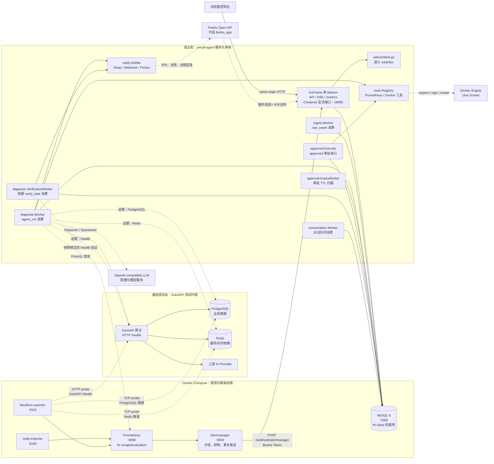
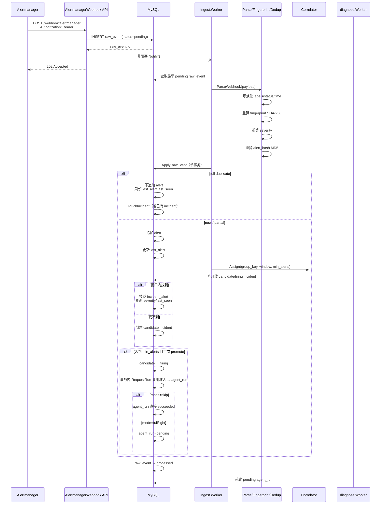
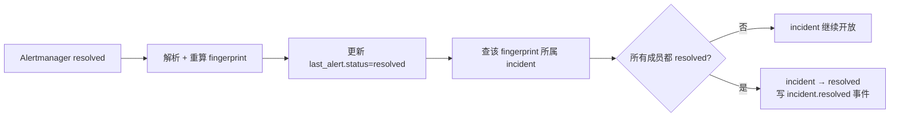
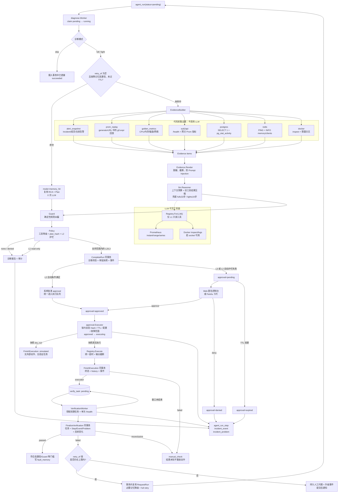
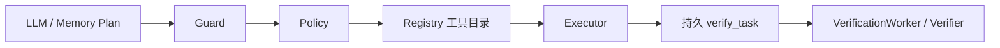
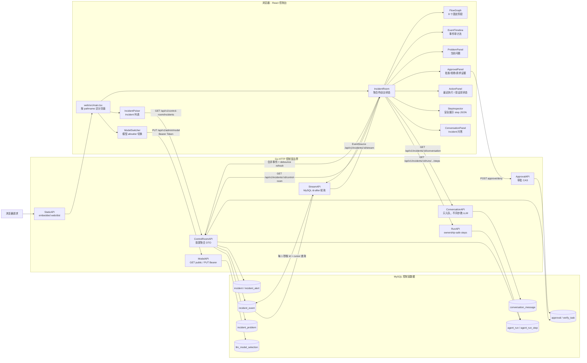
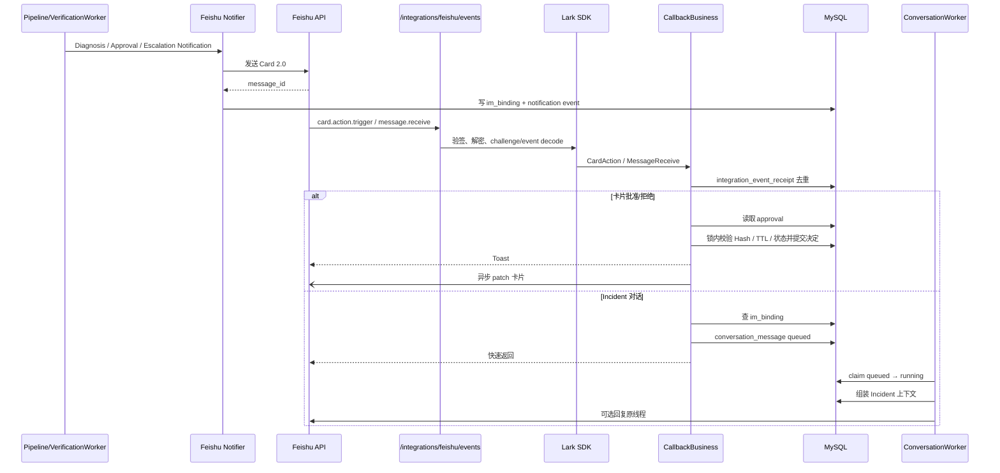
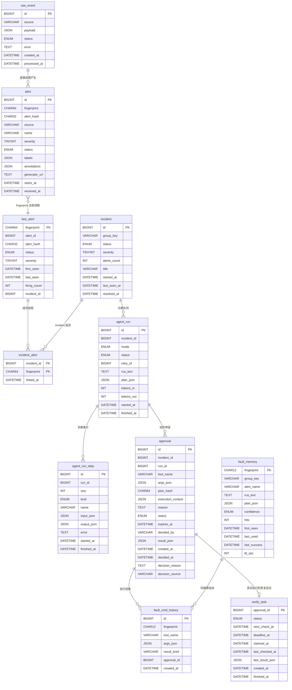
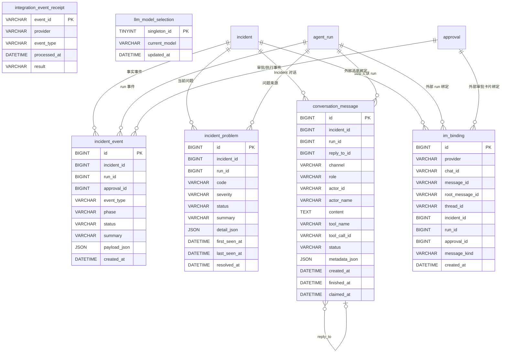

# 当前系统架构

> 本文按当前源码、数据库迁移和运行配置整理。源码是事实基准；部分早期设计文档仍描述“诊断、审批、执行尚未实现”，不应作为当前运行状态依据。
>
> 系统形态：**模块化单体 + MySQL 持久队列/审计 + React 嵌入式控制台**。

## 1. 架构结论

- 一个 `oncall-agent` Go 进程同时承载 HTTP、静态前端、SSE 和 6 类后台 worker；同一业务库只运行一个 server，不允许新旧进程重叠消费。
- MySQL 是 AI-Opus 的唯一权威业务库，也是摄入、诊断、审批执行、恢复验证和对话的持久队列。
- Prometheus、Alertmanager、blackbox-exporter 属于观测与告警侧。
- PostgreSQL、Redis、Sub2API 属于被监控目标及其依赖，不是 AI-Opus 自身的存储。
- React 控制台必须先构建，再通过 `go:embed` 嵌入本次 Go 构建，同源提供。
- LLM 只负责基于证据生成 RCA/Plan 或回答只读问题；变更动作必须经过 Guard、Policy、Approval、Executor、Verify。
- 控制台是**显式的匿名公开操作面**：没有登录、会话或 CSRF，`api.Console` 是唯一的身份来源，控制台上的所有读写一律记为 `anonymous`。曾经存在但从未接入路由的 OAuth/Session 实现已于 2026-08-24 删除。

## 2. 运行时部署拓扑



### 运行边界

| 部分 | 当前实现 |
|---|---|
| `oncall-agent` | 跑在宿主机，不在 `docker-compose.dev.yml` 中 |
| HTTP | GoFrame 单 listener；独立默认 `127.0.0.1:8080`，Compose 显式覆盖 `0.0.0.0:18080` |
| MySQL | Compose 容器，AI-Opus 自身唯一业务数据库 |
| Prometheus | `:9090`，抓 node-exporter 和 blackbox |
| Alertmanager | `:9093`，向宿主机发送 Alertmanager webhook |
| blackbox | 探测目标 HTTP 健康状态和 PostgreSQL/Redis TCP 连通性 |
| PostgreSQL / Redis | 由 Sub2API 使用，AI-Opus 只读采集证据 |
| Docker | 通过 Unix socket 读取容器并执行受控动作；socket 缺失时能力降级 |
| LLM | OpenAI 兼容接口，凭据只来自服务端配置 |
| Feishu | 可选出向通知和入向回调 |

独立运行省略 `server.listen_addr` 时默认只绑定回环。Compose 的 Alertmanager 访问 `host.docker.internal:18080`，必须显式使用容器可达的监听地址；示例 `0.0.0.0` 必须配合宿主防火墙限制**整个 listener**，包括匿名写接口与 `/metrics`，不是只隐藏首页。`web.base_url` 只控制启用/链接，不提供访问控制；飞书验签/白名单与 Bearer 自动化入口也不等于 Web 受保护。匿名控制台没有个人身份或授权保证。Sub2API 示例的 `8080` 是被监控服务，与这里显式使用 `18080` 的 oncall-agent 不同。

依据：`docker-compose.dev.yml`、`prometheus.yml`、`alertmanager.yml`、`blackbox.yml`、`config.example.yaml`、`internal/config/config.go:defaultConfig`、`cmd/server/main.go:run`。

## 3. 代码分层与模块依赖

```mermaid
flowchart TB
    subgraph entry["组合根与入口"]
        BOOT["cmd/server/main.go<br/>加载配置、连接 DB、组装依赖、启动 workers、绑定路由"]
        SIM["cmd/simulate/main.go<br/>生产格式 Alertmanager 测试注入"]
    end

    subgraph edge["边界层"]
        API["internal/api<br/>HTTP Handler、DTO、Bearer 校验、SSE、静态资源"]
        WEB["web/src<br/>React 控制台"]
    end

    subgraph workers["异步运行时"]
        INGW["internal/ingest.Worker<br/>raw_event"]
        DIAGW["internal/diagnose.Worker<br/>agent_run"]
        EXPW["internal/approval.ExpiryWorker<br/>审批 TTL"]
        EXECW["internal/approval.Executor<br/>approved approval"]
        VERIFYW["internal/diagnose.VerificationWorker<br/>due verify_task"]
        CONVW["internal/conversation.Worker<br/>conversation_message"]
    end

    subgraph domain["业务控制面"]
        ING["internal/ingest<br/>解析、指纹、去重、归并"]
        INC["internal/incident<br/>纯规则、ExecutionContext / PlanHash"]
        PIPE["internal/diagnose.Pipeline<br/>memory → evidence → LLM → Guard → Policy → notify"]
        VERIFY["internal/diagnose.Verifier<br/>单次有界只读健康检查"]
        APPROVAL["internal/approval<br/>Policy、审批状态机、执行器"]
        MEMORY["internal/memory<br/>fault_memory 召回/写回/降级"]
        CONV["internal/conversation<br/>对话入队、上下文、回答持久化"]
    end

    subgraph adapters["适配器与安全工具"]
        LLM["internal/llm<br/>Factory、Reasoner、Questioner、ModelSwitcher"]
        TOOLS["internal/tools<br/>Registry、Prometheus、Docker"]
        NOTIFY["internal/notify<br/>Webhook / Feishu / Noop"]
    end

    subgraph persistence["持久化与观测"]
        STORE["internal/store<br/>唯一数据库访问边界"]
        DB[("MySQL<br/>状态、队列、审计、控制室")]
        EVENTS["internal/eventlog<br/>事件类型定义"]
        METRICS["internal/metrics<br/>进程计数器与 gauges"]
        MIG["migrations/*.sql<br/>手工 schema"]
    end

    BOOT --> API
    BOOT --> INGW
    BOOT --> DIAGW
    BOOT --> EXPW
    BOOT --> EXECW
    BOOT --> VERIFYW
    BOOT --> CONVW

    WEB --> API
    API --> STORE
    API --> APPROVAL
    API --> CONV
    API --> LLM
    API --> METRICS

    INGW --> ING
    ING --> INC
    ING --> STORE
    STORE --> INC

    DIAGW --> PIPE
    PIPE --> MEMORY
    PIPE --> LLM
    PIPE --> TOOLS
    PIPE --> APPROVAL
    PIPE --> NOTIFY
    PIPE --> STORE

    EXECW --> APPROVAL
    EXECW --> TOOLS
    EXECW --> STORE

    VERIFYW --> VERIFY
    VERIFYW --> STORE
    VERIFYW --> NOTIFY

    CONVW --> CONV
    CONVW --> LLM
    CONVW --> TOOLS
    CONVW --> NOTIFY
    CONVW --> STORE

    APPROVAL --> STORE
    MEMORY --> STORE
    NOTIFY --> STORE
    EVENTS -.-> STORE

    STORE --> DB
    MIG -.手工执行.-> DB
    ING -.-> METRICS
    DIAGW -.-> METRICS
    EXECW -.-> METRICS
```



### 模块职责

| 模块 | 当前职责 |
|---|---|
| `cmd/server` | 唯一组合根；所有依赖在这里组装 |
| `internal/config` | YAML AST 环境变量展开、KnownFields 严格解码、监听/验证默认值与启动前校验 |
| `internal/api` | GoFrame 适配器、HTTP 路由、DTO 脱敏、Bearer/匿名鉴权、SSE |
| `internal/ingest` | Alertmanager v4 解析、fingerprint、alert hash、severity、去重、归并 |
| `internal/incident` | 不依赖 store 的归并/生命周期/路由纯规则；ExecutionContext、PlanHash、FaultFingerprint 与重诊规则 |
| `internal/diagnose` | Evidence、Pipeline、Guard、单次 Verifier 和持久验证队列 Worker |
| `internal/llm` | OpenAI 兼容模型工厂、Eino ReAct、只读 Questioner、模型切换 |
| `internal/tools` | 工具注册、等级控制、统一超时、输出截断、Prometheus/Docker 适配 |
| `internal/approval` | Policy 判定、审批 CAS、审批 TTL、执行队列、执行结果 |
| `internal/memory` | 精确故障指纹记忆；高置信 TTL 召回、写回和降级 |
| `internal/conversation` | Web/Feishu 共用的对话队列、上下文组装、回答持久化 |
| `internal/notify` | Provider 无关通知接口；Noop、传统 webhook、Feishu |
| `internal/store` | 唯一 GORM/MySQL 边界；统一 RequestRun 准入，CompleteRun/FinishExecution/FinalizeVerification 事务与审计 |
| `internal/eventlog` | 事件类型常量；事件实际由各业务模块通过 store 写入 |
| `internal/metrics` | 进程内 counter/gauge，暴露 `/metrics` |
| `web` | Vite 产物通过 `go:embed` 嵌入 Go 服务；产物不入库，需先 `npm run build` |
| `cmd/simulate` | 走同一个 webhook 入口注入测试告警 |
| `cmd/retire-approvals` | 停机备份后的显式旧审批退役；不由 server 启动时自动执行 |

## 4. 告警接入、去重与 Incident 归并



### 三层身份模型

| 身份 | 用途 | 算法/来源 |
|---|---|---|
| `fingerprint` | 判断是不是同一个告警对象 | 选定 labels 排序后 SHA-256 |
| `alert_hash` | 判断同一对象内容是否完全重复 | 状态、labels、annotations 规范化后 MD5 |
| `group_key` | 判断多条告警是否属于同一故障 | `correlate.group_by` labels + 时间窗口 |

### `resolved` 路径



当前行为：

- `firing` 和 `resolved` 共用同一个 fingerprint。
- 完全重复的 firing 不生成新的诊断。
- 完全重复仍刷新 `last_seen`，避免持续告警因重复推送被切成多个 Incident。
- 数据库事务失败时 `raw_event` 保持 `pending`，等待下一轮重试。
- 输入本身不可恢复时，`raw_event` 标记 `failed`，不会永久堵住队首。

依据：`internal/ingest/worker.go:78-319`、`internal/ingest/webhook.go:27-133`、`internal/ingest/fingerprint.go:12-90`、`internal/ingest/correlate.go:47-101`、`internal/store/rawevent.go:114-220`。

## 5. 诊断、Guard、Policy、审批、执行、验证闭环



### Pipeline 实际阶段

`diagnose.Pipeline.Run` 的当前顺序：

1. `LoadTarget`：读取 Incident、成员、当前告警。
2. `memory.Lookup`：仅首次诊断查记忆，重诊不查。
3. `EvidenceBuilder.BuildForIncident`：顺序执行 7 类 collector。
4. `Evidence.Render`：统一脱敏、截断、引用隔离。
5. `Reasoner.Diagnose`：Eino ReAct，非法 JSON 最多重试一次。
6. `Guard`：确定性规则覆盖 LLM 计划。
7. `Policy`：决定 `none / denied / approval / auto_l2`。
8. `Service.Prepare`：只准备不可变审批草稿，不独立写审批。
9. `CompleteRun`：Run 的 RCA/Plan/终态、审批快照与相关事件同事务发布。
10. `NotifyReporter`：提交后发送通知，失败不回滚已提交的诊断。

阶段开始事件、普通步骤和工具步骤写入错误均传播并阻止发布可执行审批。

依据：`internal/diagnose/pipeline.go:Run/withStep/recordToolSteps`、`internal/diagnose/evidence.go`、`internal/diagnose/guard.go`、`internal/approval/policy.go:Decide`、`internal/store/runstep.go:CompleteRun`。

### 安全闸门



- LLM 只能看到 `Registry.ForLLM()` 导出的 L1 工具。
- L2/L3/L4 变更动作不会直接暴露给 ReAct。
- `Guard` 会拦截无真实 target 的动作。
- 配置错误、镜像不存在、凭据错误等根因会禁止重启类动作并升级人工。
- 人工/自动变更都只支持白名单 Sub2API 单容器 `docker_restart`，firing 成员必须属于该目标的 `Sub2APIDown`；Slow、依赖故障、混合范围或无可靠验证绑定直接拒绝计划。
- 支持范围通过后，L2 自动路径再检查全局开关、非 dry-run 与限频；未通过才降级人工。L4 永远拒绝，审批不能解除。
- `incident.PlanHash = SHA256(canonicalJSON(tool_name, args, execution_context))`；快照固定 Registry 安全等级、dry-run、目标/URL、成员与验证时长。Hash 是内容绑定，不是身份签名。
- 裁决比较预期 Hash、实际内容、状态和 TTL；执行领取还检查当前配置/白名单、安全开关、Incident firing 与故障范围。配置漂移不改写旧快照，也不把旧任务转向新地址。
- Web/飞书展示同一快照的 target、scope、safety_level、dry_run、reason、plan_hash、expires_at；缺少决策信息不能批准，不把模型 risk 当权限。

### 独立恢复验证与准入

- `FinishExecution` 先提交 `executed` 与 `verify_task`，Executor 不等待健康检查；`simulated` 无真实动作、无验证、无成功记忆。
- `Verifier.Check` 与 Collector 共用 `health.go` 的 HTTP 判定，不跟随重定向。2xx 表示健康，非 2xx 表示不健康，无法请求/读取表示无可靠观测；仅适用于上述支持故障。
- Worker 每秒消费到期任务，默认每 10 秒观察、120 秒窗口、单次最多 5 秒（这些不是实测恢复时间）。未到终点则持久化下次检查，不 sleep 等待窗口；只有截止前的健康观测能 passed，截止时只有新鲜的先前不健康观测能 failed，否则 inconclusive。
- `FinalizeVerification` 同事务写任务、Step/Event/Problem、必要记忆变化与重诊。不可判定不降级记忆、不自动重诊；通过也不直接把 Incident 改为 resolved，Incident 仍由告警成员恢复驱动。
- 告警促发、Bearer `/diagnose`、Web `/rediagnose` 和验证重诊共用 `RequestRun`/事务内函数：锁 Incident、要求 firing、拒绝活跃 Run/审批/验证周期；人工有 60 秒冷却（按 `run.queued`），自动最多两次（按 `retry_of` 链）。人工冲突返回 409，冷却返回 429 与 Retry-After。
- 执行结果提交失败只重试持久化，不重新调用工具；重启时未知 executing 标 failed + manual_check。已提交执行只恢复验证；只读领取 30 秒超时可回队，终态提交比较 claimed_at，重启不延长 deadline。

依据：`internal/store/runrequest.go`、`internal/store/execution.go`、`internal/store/verification.go`、`internal/diagnose/verification_worker.go`、`internal/incident/execution.go`。

## 6. Web 控制室、SSE 与 Feishu 协同



### Web 当前行为

- `web/src/main.tsx` 没有 React Router，只用 pathname 判断：
  - `/` → `IncidentPicker`
  - `/incidents/<id>` → `IncidentRoom`
- `IncidentRoom` 首屏读取控制室聚合、run steps 和对话历史。
- `EventSource` 连接后端 SSE，后端按 MySQL `incident_event.id` 做游标轮询。
- 前端收到事件后合并去重，并触发延迟刷新。
- 重诊经统一准入入队，补充证据/提问入对话队列；审批决定同步事务提交，变更执行异步消费。
- `pending_approval` 用于裁决，`latest_action` 展示最近审批的执行/验证事实，终态不会随待审批列表清空而消失。旧版无快照记录展示未知，不伪造过去的演练/验证结果。
- `execution.simulated`、`verify.queued/started/checked/passed/failed/inconclusive` 等事件驱动刷新；`GET /api/v1/approvals/:id` 返回同一验证摘要，不暴露验证 URL。
- `request-evidence` 复用 conversation 队列，不在 HTTP handler 中直接采证据或调用 Docker。
- `FlowGraph` 固定展示：

```text
alert → evidence → reasoner → guard → policy → approval → execute → verify
```

### Feishu 链路



当前 Feishu 回调只有在 `notify.im.provider == "feishu_app"` 时才由 `main.go` 绑定。

## 7. API 面

| 路径 | 当前鉴权 | 作用 |
|---|---|---|
| `POST /webhook/alertmanager` | Bearer | Alertmanager v4 告警入队 |
| `GET /api/v1/incidents` | Bearer | 自动化 Incident 列表 |
| `GET /api/v1/incidents/:id` | Bearer | Incident 详情和成员 |
| `POST /api/v1/incidents/:id/diagnose` | Bearer | 统一准入的人工诊断（含冷却） |
| `GET /debug/evidence/:id` | Bearer | 查看渲染后的证据 |
| `GET /metrics` | 无鉴权 | Prometheus 文本指标 |
| `/api/v1/approvals...` | Bearer 或匿名控制台 | 列表/详情与验证摘要；approve/deny 需 plan_hash、reason |
| `/api/v1/admin/model` | Bearer | 管理端切换模型 |
| `/api/v1/control-room/model` | 控制室公开读 | 当前模型和 allowlist |
| `/api/v1/control-room/incidents` | 匿名控制台 | 控制室 Incident 列表 |
| `/api/v1/incidents/:id/control-room` | 匿名控制台 | 作战台首屏聚合 |
| `/api/v1/incidents/:id/events` | 匿名控制台 | 事件分页 |
| `/api/v1/incidents/:id/problems` | 匿名控制台 | 当前问题 |
| `/api/v1/incidents/:id/runs...` | 匿名控制台 | run/step 历史 |
| `/api/v1/incidents/:id/stream` | 匿名控制台 | SSE |
| `/api/v1/incidents/:id/conversation` | 匿名控制台 | 对话历史 |
| `/api/v1/incidents/:id/questions` | 匿名控制台 | 提问入队 |
| `/api/v1/incidents/:id/rediagnose` | 匿名控制台 | 重诊入队 |
| `/api/v1/incidents/:id/request-evidence` | 匿名控制台 | 补充证据请求入队 |
| `POST /integrations/feishu/events` | Lark SDK 验签解密 | Feishu 事件和卡片回调 |
| `/`、`/*path` | 无 | 嵌入式 React 静态资源 |

路由绑定集中在 `cmd/server/main.go:run`。

## 8. Worker 与队列

| Worker | 持久队列/状态 | 运行方式 | 恢复行为 |
|---|---|---|---|
| `ingest.Worker` | `raw_event.status=pending` | 非阻塞唤醒 + 1 秒 ticker | 启动扫描 pending；单 goroutine 按 ID 消费 |
| `diagnose.Worker` | `agent_run.status=pending` | 定时轮询 | 启动和运行中将超时 `running` 重新放回 pending |
| `approval.ExpiryWorker` | `approval.status=pending/approved` | 默认每分钟扫描 | 过期审批转 `expired` 并写事件/问题 |
| `approval.Executor` | `approval.status=approved` | 默认每秒轮询 | 启动时回收中断的 `executing`；不自动重放外部动作 |
| `diagnose.VerificationWorker` | `verify_task.status=pending` 且到期 | 每秒处理一个到期任务 | 启动及循环回收超时 running；取消/读库错误保留可恢复领取，deadline 不变 |
| `conversation.Worker` | `conversation_message.status=queued` | 定时轮询 | 超时 `running` 消息重新入队 |

系统不使用 RabbitMQ、Kafka、Redis Streams 或独立任务服务。MySQL 行锁、条件更新和幂等状态迁移承担队列可靠性；这不等于支持多实例，也不保证外部动作与 MySQL 的 exactly-once。

## 9. MySQL 数据模型

空库按 001–011 顺序迁移后共有 19 张表（含两张已弃用、尚未 DROP 的 Web 会话表）：

- `001_init.sql`：10 张核心表
- `005_control_room.sql`：7 张控制室/会话表
- `007_llm_model_selection.sql`：1 张模型选择表
- `008_deprecate_web_session.sql`：标记两张会话表弃用，不删除
- `009_approval_execution_context.sql`：审批快照与 simulated 终态
- `010_verify_task.sql`：1 张持久验证任务表
- `011_queue_admission_indexes.sql`：统一准入/队列查询索引

下面关系是**业务逻辑关系**。当前 SQL 没有声明外键，图中的关系不是数据库 FK 约束。

### 9.1 告警、Incident、诊断、审批核心表



### 9.2 控制室、对话、集成与模型表



### 数据模型中的实际缺口

当前 `raw_event` 没有 `incident_id`，`incident_event` 也没有 `raw_event_id`。因此数据库能稳定回放：

```text
incident → run → step → approval → execution → verify
```

但不能在 schema 层直接保存：

```text
raw_event → incident
```

这与部分设计文档中“按 raw_event_id 贯穿全链路”的描述不一致。

依据：`migrations/001_init.sql` 至 `011_queue_admission_indexes.sql`、`internal/store/models.go`。

## 10. 状态机

| 对象 | 当前状态路径 |
|---|---|
| `raw_event` | `pending → processed` 或 `pending → failed` |
| `incident` | 枚举包含 `candidate/firing/acknowledged/resolved`；主链主要为 `candidate → firing → resolved` |
| `agent_run` | `pending → running → succeeded/failed` |
| 重诊 run | 通过 `retry_of` 串成 run 链，自动重诊上限为 2 |
| `approval` | `pending → approved/denied/expired`；`approved → executing/expired`；`executing → executed/simulated/failed` |
| `verify_task` | `pending → running → passed/failed/inconclusive`；未到终点或领取超时 `running → pending` |
| `conversation_message` | `queued → running → completed/failed`；租约超时可重新入队 |
| `fault_memory` | `high` 命中验证失败后降为 `low`，后续不再召回 |
| `llm_model_selection` | 单例行保存当前模型 ID，不保存 URL、密钥或 token |

## 11. 配置与启用条件

| 能力 | 当前配置 | 实际效果 |
|---|---|---|
| MySQL | `mysql.dsn: ${MYSQL_DSN}` | 必须配置，否则启动失败 |
| LLM Reasoner | 需配置有效角色与模型 | 配置缺失时 `diagnose.Worker` 不启动 |
| Web 控制台 | `web.base_url` 非空，或 provider 为 `feishu_app` | `webEnabled=true`，组装 `api.Console` |
| Web 鉴权 | 无 | 控制台读写使用固定 `anonymous` 身份；没有登录、会话或 CSRF |
| Feishu | 选择 `notify.im.provider: feishu_app` | 启用时需完整配置；不回退 Noop，回调验签不保护 Web |
| `approval.dry_run` | 未配置，默认 `true` | 默认不执行真实 Docker 变更 |
| `approval.auto_execute_l2` | 未配置，默认 `false` | L2 自动路径默认关闭 |
| Docker allowlist | 未配置时默认为空 | 无可批准的重启目标；示例配置需显式列出目标 |
| HTTP 监听 | `server.listen_addr` 默认 `127.0.0.1` | Compose 显式 `0.0.0.0:18080`，全 listener 必须限制可信来源 |
| 独立验证 | `diagnose.verification` 默认 interval/window/timeout=`10/120/5` 秒 | `0 < timeout < interval < window` 且 timeout < 30 秒；不复用 evidence 超时 |
| 严格配置 | YAML AST 展开后 `KnownFields(true)` | 未知/删除字段、多文档或无效时长拒绝启动 |
| Prometheus | 默认本机 `9090` | 证据和黄金指标查询使用该地址 |
| Docker socket | 默认 `/var/run/docker.sock` | socket 不存在时跳过 Docker 工具和证据 |
| Web 前端产物 | `web/dist/` 不入库 | 必须先 `npm run build` 再编译 Go；`.gitkeep` 不是可用控制台 |

## 12. 安全与可靠性不变量

### 12.1 入站与队列

- webhook 先写 `raw_event(pending)`，再返回 202；内存 channel 只负责唤醒。
- 输入错误标记 `failed`，数据库错误保留 `pending`。
- worker 启动时扫描 pending，进程重启后可补账。
- 领取使用行锁和条件更新，避免重复消费。

### 12.2 LLM 边界

- LLM 只接收脱敏、截断后的证据。
- LLM 只能调用 L1 只读工具。
- LLM 输出不是权限结论。
- 上下文窗口配置在 `llm.models[].context_window_tokens`，随模型切换；DeepSeek 示例值为 1000000，未指定模型窗口时应用缺省值为 131072（不是对供应商容量的保证）。诊断在同一锁内取得客户端与窗口快照，扣除 `max_tokens` 输出预留及 512 协议余量。旧 `diagnose.budget.context_tokens` 已删除，配置加载会拒绝该字段。
- 每次请求估算系统提示、工具定义、Evidence 和完整消息历史：ASCII 约 3 字符/Token，非 ASCII 约 2 UTF-8 字节/Token，初始增加 20% 余量；根据本次诊断各轮实际 `prompt_tokens` 对低估偏差向上校准，保留 10% 余量。分母使用实际发送的压缩后输入，校准不跨模型或诊断共享。它是启发式估算，不是精确 tokenizer、累计费用上限或网关容量认证。
- 输入超过可用额度的 80% 时，仅压缩旧工具结果：Prometheus 数值序列保留标签、首尾点、最小/最大点与样本数；Docker 日志对连续相同行保存原文和次数。中间指标样本的省略有显式标记，不能据摘要推断完整波形或异常持续时间。
- 初始证据、最近一批完整工具交互、assistant reasoning 和协议元数据保持原样；不新增摘要模型调用。压缩只作用于发送副本，原始 ReAct 历史和已有审计截断规则不变。压缩后仍超过预算则报错，不继续删除受保护事实。
- 默认 full/light 图步数上限为 32/16，诊断含契约重试总超时为 3 分钟；配置文件显式设置的旧步数仍然生效。只读 Questioner 仍复用 light 步数，尚未接入本次诊断上下文压缩。
- 诊断的 full/light 预算限制图执行步数（模型与工具批次各占一步），不等于单个工具调用次数；最后可用模型轮次禁用工具调用，基于已有证据输出结论。工具批次仍可并行，调用日志使用互斥保护。
- 成功诊断的 LLM 步骤记录 `context_compactions`、最近一次输入估算的压缩前后值和累计估算节省量；同时记录最后一轮 `actual_prompt` 和供后续估算使用的 `estimate_factor`；实际总 Token 仍取模型 usage 累加，二者分开解释。
- 诊断 Plan 的 action 只接受 `none` 或 `docker_restart`，未支持的变更写为人工建议；注册、目标与审批仍由 Policy 校验。
- 非法 JSON 或非法 action 最多重试一次；最后一轮仍请求工具则失败，不执行越预算的工具。
- 工具统一设置超时和最大输出。

### 12.3 变更动作

- 所有动作必须存在于 Registry。
- 目标/验证范围不合法直接拒绝，只有通过共同前置条件的 L2 才可按自动护栏降级人工。
- 审批 Hash 绑定 `tool_name + args + execution_context`，快照不可变；裁决和执行前复验。
- Run 结论与审批原子发布，执行成功与验证任务原子提交，验证终态与审计/记忆/必要重诊原子提交。
- 执行、验证、Incident 恢复是不同事实；不可判定不写成功记忆、不降级记忆，也不自动重诊。
- IM 通知在提交后发送，不保证必达；结果未知的外部动作不自动重放。

### 12.4 敏感数据

- DSN、token、API key、Cookie 和 Authorization 不应进入日志、数据库摘要或 Prompt。
- Web DTO 不直接暴露完整 `PlanJSON`、工具参数和外部执行结果。
- Feishu 卡片只携带有限引用和展示字段，不传可执行参数和凭据。

## 13. 当前漂移与风险点

1. **可信网络匿名操作面**：控制台可达即具有读写操作权限，审计记为 `anonymous`，不提供个人身份保证；必须限制整个 listener。
2. **Alertmanager 凭据需要对齐**：Alertmanager 配置文件中的固定凭据必须与服务端环境变量一致，否则 webhook 会返回 401。
3. **当前 Compose 未抓取 oncall-agent `/metrics`**：Prometheus 配置只有 node-exporter 和 blackbox job。
4. **默认是演练模式**：`dry_run=true`、`auto_execute_l2=false`，且 Docker allowlist 为空。
5. **原始告警到 Incident 缺少数据库直接关联**：`raw_event_id` 没有进入 `incident_event` 或后续状态表。
6. **部分旧文档已过时**：当前实现已经包含诊断、审批、执行、Verify、Memory、控制室、SSE 和对话队列。

## 14. 代码依据索引

| 主题 | 主要文件 |
|---|---|
| 服务启动与依赖组装 | `cmd/server/main.go` |
| HTTP 路由 | `cmd/server/main.go:run` |
| 配置与默认值 | `internal/config/config.go`、`config.example.yaml` |
| 告警解析/指纹/归并 | `internal/ingest/*.go` |
| 摄入事务与队列 | `internal/ingest/worker.go`、`internal/store/rawevent.go`、`internal/store/incident.go` |
| 诊断 Pipeline | `internal/diagnose/pipeline.go` |
| Evidence collectors | `internal/diagnose/collector_*.go`、`internal/diagnose/evidence.go` |
| LLM 与工具权限 | `internal/llm/*.go`、`internal/tools/*.go` |
| Guard/Policy/审批/执行 | `internal/diagnose/guard.go`、`internal/approval/*.go` |
| 执行契约/纯规则 | `internal/incident/execution.go`、`internal/incident/merge.go`、`internal/incident/retry.go` |
| Verify/重诊准入 | `internal/diagnose/verify.go`、`internal/diagnose/verification_worker.go`、`internal/store/verification.go`、`internal/store/runrequest.go` |
| 控制室/SSE/对话 | `internal/api/controlroom.go`、`internal/api/stream.go`、`internal/conversation/*.go` |
| Feishu 回调 | `internal/notify/feishu/*.go`、`internal/api/feishu_callback.go` |
| 数据模型 | `migrations/*.sql`、`internal/store/models.go` |
| 前端控制台 | `web/src/main.tsx`、`web/src/pages/IncidentRoom.tsx`、`web/src/api.ts` |
| 部署与告警 | `docker-compose.dev.yml`、`prometheus.yml`、`alerts.yml`、`alertmanager.yml`、`blackbox.yml` |

## 15. 升级与验证边界

已有数据库升级必须先停 server/外部写入并备份，再执行：

```bash
MYSQL_DSN=... go run ./cmd/retire-approvals -apply
```

该离线命令支持 migration 009 前/后：只退役旧 pending/approved（expired + 事件）和结果未知的旧 executing（failed + manual_check），不改现代快照、不补造历史验证。之后迁移到 011、清理已删除配置键、先构建前端再构建 Go。启动检查只读，遇到未退役的旧活跃审批拒绝启动，不代替维护命令。详细流程与回退见[执行安全升级说明](execution-trust-upgrade.md)。

CI 从独立空 MySQL 执行全部 001–011，使用显式 `TEST_MYSQL_DSN` 运行 `go test -count=1 -race ./...`，另用两个新库显式运行 empty/legacy 升级测试，避免其模式门控被跳过；事务故障注入通过条件 trigger + SIGNAL，应用测试账号需 TRIGGER，binlog trust 仅在可丢弃 CI 实例由 root 设置。保留 gofmt/vet/build 和前端 typecheck/build/交互门禁。

浏览器交互测试使用拦截 API，不是 live-backend 全链路验收。历史单测通过记录不能证明本轮执行安全的验收已完成；[原设计](execution-trust-design.md)的 T1–T17、迁移与真实故障实验仍需各自执行并记录，不从调度默认值推导实际 resolved 延迟。
