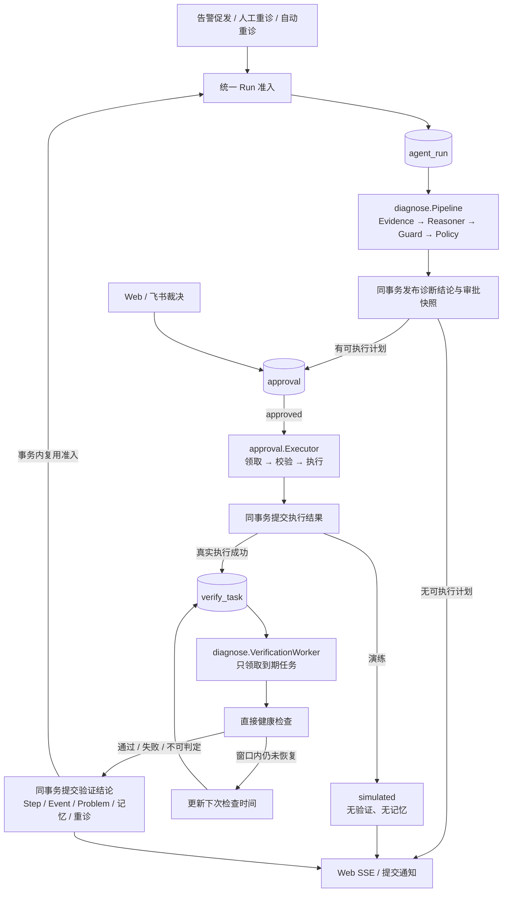

# oncall-agent 执行安全与恢复验证设计

> **状态：已实现并通过本地隔离验收；尚未向业务环境发布。**
> 范围假设：承接本轮架构分析，本文设计下一阶段的执行闭环改造，不重复编写系统现状总览。
> 代码基线：`2323cdd` + 当前工作区，包含 `internal/incident` 纯规则提取等未提交改动。
> D1–D6 已按本文实施，T1–T17 的逐项证据见 [实施与验收记录](execution-trust-verification.md)；本文保留原方案及实施前历史问题，不把历史代码位置当作现状。
>
> **后续演进（2026-09-25）**：[生产自动处置实施方案](production-auto-remediation-plan.md)取代了本文的部分决定——`dry_run` 与 L1–L4 等级被处置规则的 `observe / manual / auto` 取代，匿名控制台被个人令牌与角色取代，Docker allowlist 并入唯一的 `service` 配置，单一重启动作扩展为动作契约，执行快照升级到版本 3。本文描述的审批 Hash、持久验证队列、准入与中断恢复原则仍然有效；现状以源码和[当前架构](current-architecture.md)为准。

## 1. 范围与前提

### 1.1 与其他文档的关系

| 文档 | 职责 |
|---|---|
| [current-architecture.md](current-architecture.md) | 当前系统全貌；涉及最新重构时，以源码为准 |
| [ai-opus-system-design.md](ai-opus-system-design.md) | 早期 V1 设计基线，不据其进度描述判断现状 |
| [design-review.md](design-review.md) | 已发现的问题与历史取舍，不直接等同于本次改造方案 |
| [web-feishu-control-room-design.md](web-feishu-control-room-design.md) | Web/飞书控制室原始设计 |
| 本文 | 下一阶段采用什么方案、改哪里、如何迁移、如何验收 |

### 1.2 保留的前提

1. **模块化单体、单实例运行。** 同一业务库只运行一个 server；升级采用先停旧进程、再启新进程，不滚动重叠运行。
2. **MySQL 是唯一业务状态与持久队列来源。** 不增加 Redis、MQ、工作流引擎或向量库。
3. **控制台继续是可信网络中的匿名操作面。** 本文不恢复已删除的 OAuth/Session，不宣称提供用户级授权或个人身份追责。
4. **LLM 只能调用 L1 只读工具。** 自动与人工批准的变更都通过同一个 Executor。
5. **本轮收窄修复范围。** 新的自动恢复判据只覆盖 `Sub2APIDown` 与已配置 Sub2API 容器的 `docker_restart`，不把一个 `/health` 结果泛化为所有故障都已修复。

前提 1 和 3 是部署限制，不是代码已实现的实例锁或身份认证。非可信网络部署、多实例运行不适用本方案。

### 1.3 目标与非目标

**目标**

- 审批者能看清目标、影响范围、安全等级和演练模式；执行内容与批准内容一致。
- 执行器不再等待恢复验证，恢复通知延迟不直接被判成修复失败。
- 执行、验证、Incident 状态分别表达，不用一个“成功”代替全部事实。
- 重启后不重复执行结果不明的变更；已持久化的验证任务可以恢复。
- 所有诊断入口共用准入规则；验证结果、后续重诊和记忆变更可靠落库。

**非目标**

- 多租户、账号体系、OAuth、RBAC、多实例调度。
- 任意命令、多动作 Plan、Kubernetes/Systemd 执行能力。
- 通用健康规则 DSL、token 级流式输出、全量 Event Sourcing。
- 保证外部动作与 MySQL 之间的 exactly-once，或保证 IM 消息必达。

## 2. 实施前的实现与改造理由【历史基线】

| 现状 | 实际影响 | 源码依据 |
|---|---|---|
| 控制台启用后，审批可使用固定 `anonymous` 身份 | 网络可达性就是实际操作权限 | `internal/api/approval.go:ApprovalAPI.authenticate`；`internal/api/dto.go:Console.Actor` |
| 前端期待 target/risk/dry_run，后端 ApprovalDTO 未提供 | 审批所需信息被静默隐藏 | `internal/api/dto.go:approvalDTO`；`web/src/components/ApprovalPanel.tsx:ApprovalPanel` |
| PlanHash 只绑定 tool 与 args，dry_run 来自执行器全局配置 | 审批展示与执行模式缺少不可变绑定 | `internal/approval/policy.go:PlanHash`；`internal/approval/executor.go:Executor.executeOne` |
| Executor 内联等待 Verify，随后才写 executed | 一张审批的等待占住整个执行队列；等待中崩溃会被视为执行中断 | `internal/approval/executor.go:Executor.executeOne`；`internal/store/execution.go:RecoverExecutingApprovals` |
| Verify 延迟一次后只读成员 last_alert 状态 | 尚未收到 resolved 不能证明目标仍不健康 | `internal/diagnose/verify.go:Verifier.check` |
| Web 手动重诊直接创建 Run | 绕过自动重诊已有的活跃任务检查 | `cmd/server/main.go:incidentActionService.Rediagnose`；`internal/store/agentrun.go:CreateRetryAgentRun` |
| 部分 Pipeline 审计写入错误被忽略 | 业务继续推进时可能缺少关键记录 | `internal/diagnose/pipeline.go:Pipeline.appendStartedEvent`、`Pipeline.appendStepRecord` |

时序事实仅限配置：`prometheus.yml` 全局抓取/评估间隔为 5 秒，`alerts.yml` 的规则组间隔为 10 秒，`alertmanager.yml` 的 group_interval 为 30 秒，示例 Verify 延迟为 30 秒。**这些配置不足以推出固定恢复通知耗时，本文不采用旧评审中的 70–100 秒估算，也不把规则的 `for` 直接计入恢复延迟。**

## 3. 关键设计决策【方案】

| 编号 | 唯一采用的方案 | 主要取舍 |
|---|---|---|
| D1 | 保留可信网络匿名控制台，明确监听地址与暴露范围 | 不增加账号复杂度，但不提供个人身份保证 |
| D2 | 审批保存执行上下文快照，Web/飞书使用同一内容 | 增加一个快照字段，换取展示、审批、执行一致 |
| D3 | 对已支持故障使用直接健康检查，在有界窗口内多次观察 | 不依赖 resolved 的到达速度，但不扩大判据适用范围 |
| D4 | 执行结果先持久化，同事务创建 `verify_task`；独立 Worker 验证 | 增加一张任务表，不增加中间件或组合状态 |
| D5 | 所有 Run 创建共用事务准入；人工重诊增加冷却间隔 | 拒绝重复处理周期，不允许堆积相互冲突的计划 |
| D6 | 关键状态与审计原子提交，通知作为提交后的附属动作 | 数据库故障时停止推进，不以“尽量成功”掩盖记录缺失 |

## 4. Module 职责与主流程【方案】



- `approval.Executor` 只负责变更动作及执行结果，不再依赖 Verifier、RetryScheduler 或 memoryWriter。
- `diagnose.VerificationWorker` 负责验证调度，复用现有重诊与记忆规则；不持有变更工具调用入口。
- `diagnose.Verifier` 只做一次有超时的只读检查，不 sleep、不改审批状态、不调用 LLM。
- `store` 负责事务、CAS 和查询；`incident` 继续承载纯规则，保持 `store → incident` 的依赖方向。
- Web/飞书负责输入与展示，不复制审批或验证规则。

已实现的事务接口契约如下：

| Interface | 调用者必须知道的契约 |
|---|---|
| `RequestRun(ctx, request)` | 原子检查准入并入队；返回创建结果或结构化冲突，不允许先查后插 |
| `CompleteRun(ctx, completion)` | 扩展现有提交批次，将 Run 结论、必要审批及事件一起发布 |
| `FinishExecution(ctx, completion)` | 执行终态、命令历史、事件及必要 verify_task 同批提交；不再次调用外部动作 |
| `FinalizeVerification(ctx, completion)` | 条件更新任务，并同批提交审计、问题、记忆变更和必要重诊；重复完成不重复生效 |

同一事务内的摄入、重诊、验证路径复用 store 内部事务函数，不互相开启嵌套事务，也不增加一层仅转发参数的 Module。

实施约束：`RequestRun`、`CompleteRun`、`ClaimApprovalExecution`、`FinishExecution`、`FinalizeVerification` 采用事务级 `READ COMMITTED`，防止锁前身份查询固定旧读视图；父 Incident 行锁仍是并发串行化关口，不改 MySQL 全局/会话默认值。摄入在同一事务挂载成员，已关联指纹的内容变化还须先锁原 Incident，不能因重新分组绕过旧成员的安全读取。

## 5. D1 / D2：访问前提与审批契约【方案】

### 5.1 访问前提

- 保留**一个 HTTP listener**：Webhook、传统 API、控制台、SSE、飞书回调与 `/metrics` 共用监听地址和端口；不增加第二套 HTTP 服务。
- 增加 `server.listen_addr`，默认 `127.0.0.1`，仅适用于直接从宿主机访问的独立运行方式。`web.base_url` 保留控制台启用与链接用途，不是监听地址或访问控制。
- **Compose 联调必须显式覆盖监听配置。** Alertmanager 从容器访问 `host.docker.internal:18080`，不能依赖回环地址可达。单 listener 应绑定容器可达的宿主地址；本地开发可采用下面的显式配置，但须用宿主防火墙限制到受控来源，不能据此暴露公网：

```yaml
server:
  listen_addr: "0.0.0.0"
  port: 18080
```

- README 的 Compose 快速开始、示例 server 端口、curl 地址与 Alertmanager webhook 已统一使用 18080；单独运行若选择其他端口，调用方必须同步修改。
- 快照示例中的 `verification.base_url` 指向被监控的 Sub2API 网关（示例为 8080），不是 oncall-agent 的监听端口。
- 网络规则必须限制**整个 listener**，不能只隐藏首页而留下匿名写接口。共享 listener 本身不提供“Webhook 对外、控制台对内”的隔离。
- Web 继续记 `decided_by=anonymous`、`decision_source=web`。填写姓名只能作为备注，不能被当成已认证身份。
- Bearer 自动化入口与飞书验签/操作者白名单保持；不得把飞书校验通过等同于 Web 已受保护。
- `/metrics` 与控制台都不得直接暴露公网；采集端只从同一受控网络访问。
- 将来若要非可信网络访问，必须单独重开身份与授权决策，不在本文中假装问题已解决。

### 5.2 不可变执行快照

保留 `tool_name`、`args_json`、`plan_hash`，新增 `approval.execution_context JSON`。创建审批时一次性确定：

```json
{
  "safety_level": "L2",
  "dry_run": false,
  "verification": {
    "kind": "sub2api_http_health",
    "target_name": "sub2api",
    "base_url": "http://127.0.0.1:8080",
    "member_fingerprints": ["<本次支持的故障成员指纹>"],
    "interval_seconds": 10,
    "window_seconds": 120,
    "timeout_seconds": 5
  }
}
```

- 目标来自经过校验的 Plan；`safety_level` 来自 Registry，不采用模型自报的 `Plan.risk` 作为许可，也不在审批决策区展示模型的 risk 字段。
- verification 由服务端配置和支持的故障类型生成；LLM、浏览器、飞书回调不能提交 URL 或探测规则。
- URL 只接受配置中的 HTTP(S) 地址，不含 userinfo/凭据，检查时不跟随重定向。原始地址不放入浏览器 DTO 或卡片。
- 演练审批也记录模式，不从执行时的全局配置反推“当时批准了什么”。
- 新 PlanHash 唯一算法为 `SHA256(canonicalJSON(tool_name, args, execution_context))`；JSON 键序和空白不能影响结果。Hash 是内容绑定，不是身份认证或抵御数据库管理员的签名。
- 审批后不修改上述内容。目标、模式或验证绑定改变，需要重新诊断和创建新审批。
- **配置漂移不重定向旧任务。** 领取执行前及每次探测前，对快照目标重新检查当前容器白名单、目标配置和规范化后的 base_url 一致性。目标被移出白名单、工具等级变化、地址不合法或配置已指向其他地址时：执行前拒绝推进；执行后验证置 inconclusive 并要求人工核查。历史仍展示原快照，绝不改用新地址探测旧审批。
- 验证调度时长使用已批准的快照；新配置中的时长仅作用于新审批，不重置存量任务的观察窗口。

### 5.3 Web / 飞书统一展示与裁决

待审批 DTO 的必填字段：`tool_name`、`target`、`scope`、`safety_level`、`dry_run`、`reason`、`plan_hash`、`expires_at`。例如：

```json
{
  "id": 42,
  "status": "pending",
  "tool_name": "docker_restart",
  "target": "container/sub2api",
  "scope": "single_container",
  "safety_level": "L2",
  "dry_run": false,
  "reason": "自动执行关闭，转人工审批",
  "plan_hash": "<快照内容哈希>",
  "expires_at": "2026-08-24T12:30:00Z"
}
```

`target` 从 args 投影，`scope` 从当前只支持单容器动作推导，`safety_level/dry_run` 从 execution_context 投影，不再保存第二份展示字段。Web 的类型、转换与审批面板一起将旧 `risk` 字段改成 `safety_level`，标签为“工具安全等级”，不保留两套字段别名。飞书卡片使用同一快照投影，并显式显示演练模式。

- Web/自动化 `POST /api/v1/approvals/{id}/approve|deny` 请求体统一携带 `plan_hash` 与 `reason`；飞书继续携带不可变引用。
- Service 在持有审批行锁的事务中比较预期 Hash、实际内容 Hash、状态和 TTL；过期、已决或 Hash 不符返回冲突，不覆盖原裁决。
- 待审批记录缺少必填决策信息时，前端显示错误并禁用批准；后端同样拒绝，不能只靠前端按钮。
- 执行领取前复验快照完整性、Hash、工具注册等级、目标白名单、配置绑定及当前全局安全开关，并确认 Incident 仍为 firing、没有超出快照范围的新故障成员。全部通过才进入 executing；陈旧计划原子置 expired 并记录原因。允许范围收紧或全局切到 dry-run 时，不把已批准的真实执行偷偷变成演练，也不继续使用旧计划。
- 快照是 dry-run 时，即使全局后来允许真实执行，也只能演练。
- TTL 由存储层领取事务统一判定。领取已提交为 executing 后，不再因返回时跨过到期时间而把任务遗留；执行器继续完成该已领取动作及结果提交。

## 6. D3 / D4：执行与验证分离【方案】

### 6.1 两个事实、两套状态

```text
approval:
  pending → approved / denied / expired
  approved → executing / expired
  executing → executed / simulated / failed

verify_task:
  pending → running → passed / failed / inconclusive
                └→ pending（下次检查尚未到终点）
  running → pending（只读检查领取超时，允许恢复）
```

新增 `simulated` 是独立的执行结果，不是验证组合状态。**不增加 `executed_pending_verify`。** UI 直接组合两张记录：

| 执行事实 | 验证事实 | 展示 |
|---|---|---|
| executed | pending/running | 已执行，等待恢复验证 |
| executed | passed | 已执行，目标健康检查通过 |
| executed | failed | 已执行，观察窗口内未恢复 |
| executed | inconclusive | 已执行，恢复情况未知，需要人工核查 |
| simulated | 无任务 | 演练完成，未执行真实变更 |
| failed | 无任务 | 执行失败或结果未知，查看原因与人工核查要求 |

`agent_run.succeeded` 仍只代表诊断完成。`incident.resolved` 继续由告警成员恢复驱动；验证通过不直接改 Incident 状态。允许展示“目标健康检查通过，告警状态尚未同步”。

控制室读模型同步扩展：保留 `pending_approval` 供裁决，新增 `latest_action` 投影最近一张审批的执行与验证事实，不限于 pending 状态。`GET /api/v1/approvals/{id}` 返回同一验证摘要：任务状态、最近检查时间、窗口终点及脱敏原因；没有任务时区分演练的“不适用”和旧版记录的“未知”，不新增独立查询入口。
无任务的明确语义：可信 pending/approved/executing 为 `not_started`；simulated/denied/expired/failed 为 `not_applicable`。失败或结果未知仍需人工检查，不适用不代表恢复。旧/不可验证快照，以及现代 executed 缺失必要任务，保持 `unknown`。流程图按当前 Run 的持久化审批/验证任务投影，不使用普通 Step 完成或已滚出事件窗口的旧结论推断恢复。
新增 `execution.simulated`、`verify.queued`、`verify.started`、`verify.checked` 事件，与对应状态/观测同事务提交；终态沿用 `verify.passed/failed/inconclusive`。后端事件类型与前端 `subscribeIncident` 的事件列表同批更新，以驱动聚合视图刷新。

### 6.2 支持范围与单次检查

首版只生成一种 `VerificationSpec`：对受控 Sub2API 的 `/health` 进行 HTTP GET，与当前 `sub2apiCollector.collectHealth` 的可达性检查保持一致。把现有请求逻辑收敛成可复用的内部函数，由 Collector 和 Verifier 共用，不复制两套 HTTP 判定。

- 可执行计划限定为配置允许的 Sub2API 单容器 restart；当前 firing 成员必须都属于该目标的 `Sub2APIDown`。
- 遇到 `Sub2APISlow`、PostgreSQL/Redis 告警、其他目标或混合故障，Policy 保留诊断并要求人工处理，不创建本轮无法可靠验证的执行计划。
- 返回 2xx 是本故障类型的健康信号；非 2xx 是不健康信号；连接/读取失败、超时、错误配置等是无法取得可靠观测。
- 一次 2xx 只能证明这个健康检查通过，不证明吞吐、延迟或所有依赖恢复。不得把同一判据用于上述不支持的故障类型。
- `last_alert` 作为辅助观测，不因为尚未 resolved 覆盖直接健康结果；检查过程中发现新出现的不支持告警时，转人工核查，不自动写记忆或继续重试。

### 6.3 验证调度与终态

初始建议参数：每 10 秒检查一次，窗口 120 秒，每次请求最多 5 秒。这些是**待故障实验校准的默认值，不是实测恢复时间**。

1. 执行成功提交时创建 pending 验证任务；窗口从该持久化执行结果时刻开始，首次检查立即到期。
2. Worker 每秒查询 `status=pending AND next_check_at<=now`，按到期时间领取；未到期任务不阻塞其他任务。
3. 每次只做一次有超时的读取；只有截止前完成的健康观测可以准备 passed 终态。不健康或无法观测且窗口未结束，则落观测与下次检查时间并返回消费循环，不 sleep 等待。
4. 窗口结束时，最后一次截止前的观测必须是不健康且距当前不超过一个检查间隔，才可 failed；缺少新鲜观测、调度积压导致过期或数据不足等归 inconclusive，不能拿旧观测判定当前失败。
5. 请求时限取配置超时与窗口剩余时间的较小值；检查跨越截止时刻，不接受迟到结果。正常停机导致检查取消时，任务保留可恢复状态而非直接定为 inconclusive；恢复后仍使用原 deadline，届时没有新鲜结论才转人工核查。
6. 首次进入终态时，在同一事务写验证步骤、事件、问题及后续业务变化；任务已经终结时，不重复产生副作用。配置漂移、不支持的新故障等明确不可验证条件可提前进入 inconclusive；不可判定不触发自动重诊或坏记忆降级。

### 6.4 执行与验证的崩溃恢复

| 崩溃/失败位置 | 持久状态 | 恢复动作 |
|---|---|---|
| 领取提交前 | approved | 可以重新领取，尚未允许外部调用 |
| executing 已提交，外部结果尚未持久化 | executing | 标 failed + manual_check；不自动重放，无法证明动作未发生 |
| 真实动作成功但执行结果事务失败 | executing | 当前进程只重试结果提交，不重调工具；重启后按结果未知处理 |
| executed 与 verify_task 同事务提交后 | executed + pending | 继续验证，不重放变更，也不把 executed 改成 failed |
| 健康检查中途退出或领取超时 | executed + running task | 回收只读验证任务，重新检查 |
| 验证终态事务失败 | 原任务仍未终结 | 重试数据库提交/重新取得新鲜观测，不重复外部变更 |
| 终态已提交，IM 通知失败 | 终态、问题和后续任务已落库 | 记录通知失败，不回滚结论、不重复创建重诊 |

即便区分了执行和验证，也无法消除“动作已发生但数据库未记录”的窗口。这里选择保守停机核查，而不是宣称 exactly-once。

`FinishExecution` 的数据库重试必须幂等：同一审批的相同终态、结果与任务已经提交时返回“已完成”，不重复追加命令历史、事件或验证任务；内容不同则返回冲突。一次结果提交失败不能被调用方解释成“工具执行失败后再执行一次”。

执行结果最多保存 8 KiB；过长结果保留规范化内容的 SHA-256 摘要而不是同一个通用省略值，以免不同结果被误认为幂等重提。

## 7. D5：统一诊断准入【方案】

把告警促发、传统 `/diagnose`、Web `/rediagnose` 和验证失败重诊收敛到同一套规则。原 `CreateRetryAgentRun` 的父 Incident 行锁模式保留；不直接拿自动重试接口承接人工请求，因为人工请求没有 `retry_of`。

准入事务按以下顺序执行：

1. 锁定 Incident。新人工/自动重诊只接受 firing；resolved/acknowledged 不启动新处理周期。告警促发在同事务晋级 firing 后入队。
2. 检查是否已有 pending/running Run、pending/approved/executing 审批或 pending/running 验证任务。任一存在则拒绝新的处理周期；补充证据的只读对话不受此限制。
3. 人工重诊检查 60 秒冷却。时间来自最近持久化 `run.queued` 事件，不使用领取时会被改写的 `agent_run.started_at`。
4. 自动重诊校验父 Run 属于同一 Incident，并沿 `retry_of` 计算最多两次预算。链路缺失或读取失败则拒绝推进，不能当成一条新链。
5. 原子写 Run 与 run.queued；自动路径同时写 retry.scheduled。拒绝时不写队列记录。

人工冷却只限制人工入口；自动路径由预算和活跃周期限制，不受手工冷却影响。验收/调用行为：

- 人工重复请求返回 `409 active_processing`，附相关 Run/Approval 引用；冷却中返回 `429 cooldown` 与 Retry-After。
- 自动重复申请返回未创建，不另建并行任务。
- 有待审批计划时，用户先拒绝旧计划，再请求重诊；本轮不增加“强制覆盖审批”入口。
- failed 验证的任务终态、记忆降级和后续 Run 在同一事务推进，因此既不会被自己的 running task 阻塞，也不会出现验证已结束但重诊永久丢失。
- 当前仍是单实例；这些事务规则不等于已经支持多实例租约与任务抢占。

## 8. D6：审计与后续动作提交语义【方案】

### 8.1 必须传播的错误

| 提交点 | 必须同批持久化的内容 | 失败行为 |
|---|---|---|
| 诊断阶段开始/完成 | 对应开始事实，或 Step + 完成事件 + Problem | 返回错误、停止本轮后续推进，不生成可执行审批 |
| 诊断结论发布 | Run RCA/Plan/终态 + 审批快照（如有）+ 相关事件 | 全部回滚；避免审批已可执行而 Run 结论尚未保存 |
| 审批决定、执行领取 | 状态 CAS + 对应事实事件 | 回滚；领取未提交不得调用工具 |
| 执行结果 | 终态 + 有界结果 + 命令历史 + 事件 + 必要 verify_task | 不重调工具；保留结果未知的恢复语义 |
| 验证终态 | 任务状态 + Step/Event/Problem + 必要记忆写回/降级 + 必要重诊 | 全部回滚；不可只完成任务再 best-effort 排后续工作 |

`Pipeline.appendStartedEvent`、`appendStepRecord` 和 `recordToolSteps` 改为返回 error，所有调用方显式传播；工具步骤任一批次写入失败，也必须停止发布可执行审批。不只是加日志后继续审批。原 `CompleteRun` 批次扩展发布审批，报告通知移动到提交之后。

验证成功仍沿用现有记忆门槛：非重诊、非 memory_hit、高置信且 Guard 未改写。Guard 结果缺失时不视为“未改写”。失败的 memory_hit 才降级对应记忆；执行报错或 inconclusive 不证明记忆错误。

超出重诊预算时，同事务打开持久化人工处理问题并写 escalation.required；是否成功发出飞书通知不决定人工处理需求是否存在。

### 8.2 可附属失败的操作

- IM 发送与卡片更新：在业务提交之后执行，失败尽力写 notification.failed，并记录日志/指标；不得撤销审批或重做外部动作。
- 非业务计数指标：失败不能改变业务结论。
- SSE：只读取已经提交的事件；连接失败依靠 Last-Event-ID 续传，不维护第二份权威状态。

本轮不保证每个工具 token 实时可见，也不新增通知 Outbox。关键失败事实以 MySQL 和控制室为准。

## 9. 数据模型、配置与迁移【方案】

### 9.1 最小数据变化

**approval**

- 新增 `execution_context JSON NULL`：新审批必须非空；NULL 只允许表示迁移前的历史记录。
- status ENUM 增加 `simulated`，保持现有字段含义，不增加验证组合状态。
- target/safety_level/scope/dry_run 的展示值均由快照投影，不重复存列。

**verify_task**

| 字段 | 含义 |
|---|---|
| `approval_id BIGINT PRIMARY KEY` | 一张审批最多一个验证任务；Run/Incident 通过 approval 关联，不重复存 |
| `status` | pending / running / passed / failed / inconclusive |
| `next_check_at DATETIME(3)` | 下次到期时间 |
| `deadline_at DATETIME(3)` | 固定观察窗口终点，恢复时不重新起算 |
| `claimed_at DATETIME(3) NULL` | 当前只读检查的领取时间 |
| `last_checked_at DATETIME(3) NULL` | 最近完成观测的时间 |
| `last_result_json JSON NULL` | 有界、脱敏的观测及原因，不保存原始响应全文 |
| `created_at / finished_at` | 执行结果提交时刻 / 验证终结时刻 |

查询索引：`(status, next_check_at, approval_id)` 与 `(status, claimed_at)`。审批执行/过期队列补 `(status, expires_at, id)`；统一准入补 `agent_run(incident_id,status,id)`、`approval(incident_id,status)` 以及 `incident_event(incident_id,event_type,id)`。

验证领取沿用 conversation 的 `claimed_at + CAS + 超时回队` 模式。首版领取上限 30 秒，必须大于单次请求超时；完成更新额外比较本次 claimed_at，旧检查不能覆盖已经重新领取的任务。时间值统一 UTC 毫秒精度。回收逻辑在消费循环周期执行，而非只在启动时执行。

### 9.2 配置收敛

| 配置 | 处理 |
|---|---|
| `server.listen_addr` | 新增，默认 127.0.0.1 |
| `approval.verify_delay_seconds` | 删除，由有界验证调度替代；加载旧键时明确报错，不静默忽略 |
| `diagnose.verification.interval_seconds` | 新增，建议默认 10 |
| `diagnose.verification.window_seconds` | 新增，建议默认 120 |
| `diagnose.verification.timeout_seconds` | 新增，建议默认 5；独立于证据采集超时配置，避免调整 PostgreSQL 等采集时长时改变验证租约约束 |
| `approval.dry_run` | 保留：创建快照时决定模式，执行时仍作为禁止真实变更的安全开关 |

验证 kind、支持的故障类型、重诊次数和人工冷却首版由代码固定，不配置化成通用规则系统。上述验证时长在审批创建时固化进 execution_context；校验必须满足 `0 < timeout < interval < window`、`timeout < 30s`。

严格配置解码采用一条路径：保留现有 YAML AST 环境变量展开，将展开后的节点编码为 YAML，再用启用 `KnownFields(true)` 的 `yaml.Decoder` 解码到默认 Config，替换当前 `document.Decode`。这样未知字段和已删除字段统一在启动期报错，不为旧 verify_delay_seconds 增加兼容开关。

### 9.3 发布迁移

已新增 `009_approval_execution_context.sql`、`010_verify_task.sql`、`011_queue_admission_indexes.sql`，历史迁移不改写；离线退役与只读启动检查使用 `cmd/retire-approvals -apply|-check`。升级、备份、回退步骤见 [离线升级说明](execution-trust-upgrade.md)。

1. 暂停外部写入口，等待在途调用结束，停止旧 server；备份数据库。存在结果不明的 executing 审批时先人工核查，不为了升级强行改成 executed。
2. 迁移前 pending/approved 审批统一转 expired 并追加迁移失效事件，重新诊断后才能获得新 Hash；结果不明的 executing 按 failed + manual_check 留痕。
3. 执行新增 schema 与索引迁移；更新配置并清理旧 verify_delay_seconds。
4. 不为历史 executed 自动补建验证任务，不重算历史 Hash，也不猜测过去是否 dry-run。历史缺字段展示“旧版记录，执行上下文未知”，没有批准入口。
5. 构建前端再构建 Go 二进制，以 dry-run 验证新契约和事件链后，才允许显式开启真实动作。
6. 回退必须停止新进程并恢复同一备份点的数据库与旧配置/二进制；回退会丢失该点之后的数据，需人工决策。禁止旧二进制消费新模式审批；不维护两套 Hash 算法或后台双写兼容路径。

## 10. 实施阶段与清理要求【方案】

| 阶段 | 交付 | 同步移除的旧路径 |
|---|---|---|
| A：审批内容可信 | 执行快照、Hash、DTO、Web/飞书裁决契约、监听地址 | 仅凭审批 ID 批准、从全局配置推测历史执行模式 |
| B：执行/验证分离 | verify_task、到期消费、直接探测、原子结果提交、控制室双状态 | Executor 内联 Verify/sleep、verifyAdapter、演练仍记 executed |
| C：准入与审计闭环 | 统一 RequestRun、冷却、预算、终态与后续动作原子提交 | 手工 CreateAgentRun 旁路、忽略关键审计错误、审批先于诊断结果发布 |
| D：故障实验与发布 | 并发/崩溃测试、真实依赖实验、迁移演练、更新现状文档 | 旧配置和已失效文档说明；不保留平行实现 |

阶段可以分提交评审，但同一生产版本必须满足共同不变量；不得上线“新 DTO + 旧执行模式”，或“任务已终结 + 后续重诊仍可能丢失”的中间状态。

## 11. 验收标准【已通过本地隔离验收】

| 编号 | 可重复测试 | 通过条件 |
|---|---|---|
| T1 | 启动与 Compose 联调测试 | 独立运行默认只绑定回环；显式 Compose 配置可从容器向 18080 Webhook 投递并获得 202；未知/已删除配置键被拒绝 |
| T2 | DTO / 卡片契约测试 | pending 审批包含目标、范围、safety_level 及明确布尔 dry_run；不使用模型 risk；缺字段不能批准 |
| T3 | Hash 与裁决集成测试 | 改 target/模式/验证绑定后旧 Hash 被拒；仅改变 JSON 键序不影响 Hash；Web/飞书并发仅一次裁决成功 |
| T4 | 模式与目标配置漂移测试 | 演练不升级为真实调用；全局 dry-run 或目标绑定变化阻止存量真实审批执行；执行后目标绑定变化得到 inconclusive，不请求新地址 |
| T5 | 执行与验证隔离及读模型测试 | 一张审批等待恢复时另一个 Incident 的审批可执行；latest_action 与 SSE 展示执行/验证双状态，不因 pending_approval 为空而丢失结果 |
| T6 | HTTP 健康观测测试 | 503→窗口内 2xx 得 passed，即使 resolved 尚未到达；持续新鲜 503 到窗口终点得 failed |
| T7 | 不可判定测试 | 无新鲜观测、领取积压过期等得 inconclusive；不降级记忆、不自动重诊；迟到 2xx 不改成 passed |
| T8 | 判据范围测试 | Slow/依赖故障/混合告警不能仅凭 health 2xx 通过自动恢复路径；探测 URL 不接受用户输入或重定向；执行前已恢复或范围变化不调用工具 |
| T9 | 执行结果故障注入 | executed 与 verify_task 一起出现或一起不出现；重复提交不追加第二份历史/事件/任务，外部工具调用次数仍为一次 |
| T10 | 重启恢复测试 | 已持久化执行只恢复验证；未持久化的 executing 标人工核查，绝不自动重放 |
| T11 | 只读任务回收测试 | 正常停机取消与 stale running 均可恢复；旧 claimed_at 无法完成新领取；观察窗口不因重启延长 |
| T12 | 准入 MySQL 并发测试 | 同 Incident 的多个人工/自动请求最多创建一个处理周期；冷却返回 429；待审批或待验证期间拒绝新 Run |
| T13 | 重诊预算测试 | 首诊后最多两次自动重诊；链断裂不刷新预算；超限留下持久人工问题 |
| T14 | 事务与审计故障注入 | 开始事件、普通步骤或工具步骤批次写入失败，均不能发布可执行审批；验证完成、记忆变化、必要重诊原子提交且重复调用不重复生效 |
| T15 | 演练与历史记录测试 | 演练终态为 simulated，无 verify_task、无成功记忆；旧记录标未知，不伪造恢复结果 |
| T16 | 完整发布演练 | 空库顺序迁移和旧数据迁移均通过；前端构建进入新 Go 二进制；真实故障实验记录执行时间、探测时间及 resolved 到达时间 |
| T17 | 超时配置独立性测试 | 调大 evidence.timeout_seconds 不改变验证请求超时；verification 的 timeout/interval/window 独立校验，领取上限仍大于其 timeout |

纯规则和 HTTP 适配使用单测/httptest；行锁、CAS、事务回滚和队列恢复必须使用独立 MySQL 测试库，不能以 mock 代替。前端增加契约/交互断言，至少验证字段缺失、双状态、过期冲突和重复提交。

T1–T17 已按相应范围验证，逐项测试名称、命令、证据与边界见 [验收记录](execution-trust-verification.md)。CI 已配置实际 MySQL 与前端门禁，但未运行 GitHub 托管任务；本地通过不冒充托管 CI 结果。

## 12. 风险、取舍与结论【方案】

- **匿名访问风险仍存在。** 本轮解决执行内容与结果可信，不解决操作者身份可信；可信网络限制不可省略。
- **外部副作用存在不确定窗口。** 结果不明宁可人工核查，不自动重复 restart。
- **单实例仍是限制。** 不把新的只读任务领取机制宣传成多副本执行安全。
- **健康判据刻意收窄。** 先验证一个真实故障类型，再以具体案例扩充，不先建设通用规则平台。
- **MySQL 成为明确的推进关口。** 库不可用时不继续创建或执行变更；这是安全取舍，不用内存队列绕过。
- **通知仍为附属反馈。** 业务事实先落库；本轮不保证飞书消息必达。

**推荐结论：保留单体与 MySQL，让审批内容不可变、执行与验证分离、诊断准入统一、关键结果原子提交。只增加执行上下文快照和一张验证任务表，不增加新基础设施。**

实施保留三个已采纳的业务取舍：可信网络匿名操作、首版只覆盖 Sub2APIDown、短维护窗口退役旧待审批计划。未来改变这些前提时须重新评审，不保留并行兼容路径。
