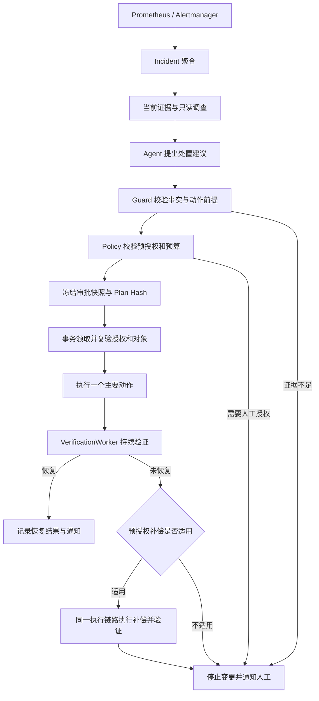

# oncall-agent：sub2api 生产自动处置实施方案

> 2026-09-26 修订：执行回执、迁移跨越、执行前容量、配置撤权、采样新鲜度、观察连续性和永久失败报文已修复；增加持久通知与自动启动门槛。实现和验收边界见 [无人值守验证记录](unattended-remediation-verification.md)。本方案下方历史实施状态以当时记录为准。

状态：阶段 B–E 的代码已在 `feat/execution-trust` 实现并通过自动化测试（未提交、未上线）；阶段 A 已在生产完成一部分（2026-09-25），尚未验证任何生产效果。实施情况与偏差见[第 13 节](#13-实施状态2026-09-25)。原代码基线：`feat/execution-trust`，`ab3d939`。sub2api 能力核对基线：生产运行的 [Wei-Shaw/sub2api](https://github.com/Wei-Shaw/sub2api) `v0.2.8`（`fd80b08`，2026-09-23 发布，2026-09-25 升级并固定 digest）；3.1 的行号取自该版本。

已确认：目标是运行中的 sub2api，部署方式为 Docker / Docker Compose；主要诉求是减少人工处置，系统能够持续监控、自动诊断、执行多种恢复动作并验证结果。

## 1. 产品目标与首版边界

交付一个持续运行的自动运维系统：发现业务异常后，Agent 调查证据、选择符合当前故障的处置；系统校验后自动执行并验证，无法安全处置或恢复失败时才通知人工。

首版只服务现有 sub2api 部署，保留单进程 Go 服务、MySQL 持久化、现有 React 控制台与通知渠道。先完成多动作闭环，再依据真实需求扩展多服务、多机和 Kubernetes。

核心成果是“已授权范围内的无人值守恢复”。永久修复代码缺陷另走代码审查、测试与发布流程；自动回退坏版本属于恢复业务，不宣称已永久消除缺陷。

人工参与集中在首次授权、失败处理、抽查和处置规则迭代。每个成功事件无需人工批准或强制标注。

## 2. 现有基础与必须修改的限制

| 当前代码 | 已有能力 | 本次设计要求 |
| --- | --- | --- |
| [alerts.yml](../alerts.yml)、[prometheus.yml](../prometheus.yml)、[alertmanager.yml](../alertmanager.yml) | 健康、延迟及依赖 TCP 探测，经 Alertmanager 推送 | 接入生产真实地址，补业务失败信号、监控数据缺失和监控自身故障 |
| [evidence.go](../internal/diagnose/evidence.go)、[collector_docker.go](../internal/diagnose/collector_docker.go) | 固定证据采集、脱敏、截断 | 对象身份、结构化事实、采集质量、告警前时间窗 |
| [reasoner.go](../internal/llm/reasoner.go)、[prompts.go](../internal/llm/prompts.go) | ReAct 只读调查；动作只允许 none/docker_restart | 从实际启用的动作定义生成计划契约，接受动作特定参数 |
| [registry.go](../internal/tools/registry.go) | 工具注册、超时、输出预算，LLM 仅直接访问 L1 | 继续维持读写分离，增加具体恢复工具 |
| [guard.go](../internal/diagnose/guard.go)、[policy.go](../internal/approval/policy.go) | 确定性规则、目标限制、限频 | 依据当前结构化事实验证动作前提，按处置规则预授权 |
| [execution.go](../internal/incident/execution.go) | Plan Hash、快照、目标和告警成员校验 | 去掉 sub2api 告警名/重启参数形状的执行硬编码，支持版本与对象修订校验 |
| [executor.go](../internal/approval/executor.go)、[store/execution.go](../internal/store/execution.go) | 事务领取、执行落库、执行中断保守恢复 | 服务级互斥、结构化操作回执、外部结果对账、受控补偿 |
| [verification_worker.go](../internal/diagnose/verification_worker.go) | 持久化验证队列、重诊与记忆效果事务提交 | 按动作验证业务恢复；连续观测；结果不明不得记成功 |
| [pipeline.go](../internal/diagnose/pipeline.go) | 统一流水线、证据和工具审计摘要 | 完整可回放输入；记忆命中仍采集当前证据 |
| [api/approval.go](../internal/api/approval.go)、[api/dto.go](../internal/api/dto.go) | 控制台启用时允许匿名操作 | 写接口与敏感读取统一认证，身份由服务端确定 |

已核实的具体问题：Docker collector 在 inspect/logs 失败时仍可能报告 ok；step 审计仅保存 1,024 rune；验证一次 HTTP healthy 就通过；incident 关闭由告警源 resolved 驱动；执行器启动恢复仅支持单活动实例。以上必须在各自阶段修正，不能作为已经满足的生产能力。

生产服务器现状（2026-09-24 只读核查，2026-09-25 按阶段 A 变更后更新）：

| 项目 | 现状 | 影响 |
| --- | --- | --- |
| sub2api | 镜像固定为 `weishaw/sub2api@sha256:9bad8d33…`（`v0.2.8`）。此前 Compose 写的是 `latest`（`v0.1.164`），但容器内二进制已被替换成 `0.2.0`，镜像 ID 看不出来。容器里留下的 `.backup` 文件与后台在线更新的命名一致，替换时间与重启、迁移时间吻合，判断为在线更新所致。Compose 目录 `/opt/sub2api`，单实例，`restart=unless-stopped`；端口写法为 `${BIND_HOST:-0.0.0.0}:${SERVER_PORT:-8080}:8080`，当前绑定所有网卡 | 后台“系统更新 / 回滚”绕过发布入口和部署锁，容器重建即丢失，生产不再使用，发布只走 Compose。升级前的数据库备份和 `0.2.0` 回退镜像保留在宿主机；回退到 `0.2.0` 必须同时恢复数据库 |
| 依赖 | `sub2api-postgres`（postgres:18-alpine）、`sub2api-redis`（redis:8-alpine），同一 Compose 项目 | 需要 postgres / redis exporter |
| 反向代理 | Caddy、nginx 均未运行，80/443 无监听；安全组对公网开放 8080，客户端直连 | API Key 在公网明文传输；反向代理指标不可用，业务信号依赖 ops 接口 exporter |
| 监控 | 已换成 [deploy/monitoring](../deploy/monitoring/)，所有端口只绑 127.0.0.1；原来绑定 `0.0.0.0:9090` 的 Prometheus 和 node-exporter 已删除。postgres exporter 使用只授予 `pg_monitor` 的 `monitor` 账号 | 管理员密钥、人工通知地址和外部心跳地址待补；补齐前 `sub2api-ops` exporter 不启动，告警也送不到任何人 |
| Agent | 2026-09-26 以 systemd 上线，监听 docker0 地址 `172.17.0.1:18080`；状态库为宿主机上的 MySQL 8.4，每日备份，恢复演练已通过。规则全部 `observe`，未配置 LLM 和通知；压测容器已删除 | 告警已流入 Agent 并建立 incident；未配置 LLM 前不诊断，也不产生处置决策 |
| 其他 | `cli-proxy-api`（`eceasy/cli-proxy-api:latest`，18317 端口），独立 Compose 项目和网络 | 不是 sub2api 的上游，与本方案无关 |

被监控侧同样存在限制：sub2api 的 `/health` 固定返回 ok，不检查数据库和 Redis；它也不导出 Prometheus 指标。现有 `prometheus.yml` 只有 `/health` 的 blackbox 探测和依赖 TCP 探测，因此业务失败目前无法触发告警（见 3.1、4.1）。

## 3. 第一批处置能力

优先落实“进程恢复 + 发布回退 + 异常上游隔离”；配置恢复只在存在版本化配置时加入。上游隔离的管理接口已在源码核实、撤销简单，排在配置恢复之前。至少两种非重启动作通过完整演练，才将首版称为多动作自动处置系统。

### 3.1 sub2api 能力核对

依据生产运行的 sub2api `v0.2.8`（`fd80b08`）源码，路径相对 `backend/`，管理接口前缀 `/api/v1/admin`。

| 能力 | 源码结论 | 对方案的影响 |
| --- | --- | --- |
| 健康检查 | `/health` 固定返回 `{"status":"ok"}`（`internal/server/routes/common.go:12`） | 只证明进程存活，不能作为进程恢复以外任何动作的验证标准 |
| 指标 | 没有 Prometheus 导出：无 `/metrics` 路由，OpenTelemetry 只是间接依赖 | 业务信号需要另建数据源，见 4.1 |
| 只读观测 | `/ops/dashboard/overview`、`/ops/dashboard/error-distribution`、`/ops/upstream-errors`、`/ops/request-errors`、`/ops/account-availability`、`/ops/concurrency`、`/ops/system-logs`，均为 GET（`internal/server/routes/admin.go:195-276`）；`overview` 从 handler 到 repository 都没有写操作 | 调查、整体请求量与错误率、按上游账号统计的数据源 |
| 上游账号控制 | `POST /accounts/:id/schedulable` 停用或恢复调度；另有 `clear-rate-limit`、`clear-error`、`recover-state`、`test` | 上游隔离可以实现；写入不带版本条件（`internal/service/admin_account.go:1331`） |
| 自动隔离 | 上游返回限流或错误时，sub2api 自动把账号设为临时不可调度（`internal/service/ratelimit_service.go:202`） | Agent 不重复隔离，只处理自动机制没覆盖或状态卡住的情况 |
| 版本管理 | `/system/update`、`/system/rollback` 把当前可执行文件改名为 `.backup` 再换上新文件（`internal/service/update_service.go:165-304`），没有关闭开关 | 容器重建后结果丢失，也绕过发布入口和部署锁；发布回退不使用这个接口，生产也不再用它发布 |
| 数据库迁移 | 每次启动初始化数据库时执行全部未应用的迁移，带 advisory lock、10 分钟超时（`internal/repository/ent.go:139`）；2026-09-25 升级时 12 条迁移在启动时应用 | 发布即迁移；回退目标早于当前迁移时需要先恢复数据库，因此每次发布必须登记 `db_migration` |
| 鉴权 | 管理接口接受 `x-api-key` 管理员密钥或管理员 JWT，并记录审计日志（`internal/server/middleware/admin_auth.go:26`）；管理员密钥全局只有一个（`internal/service/setting_features.go:570`，重新生成即覆盖） | 密钥有全部权限、没有只读范围，调用范围靠 Agent 自己的白名单约束，见 5.2；Agent 与 exporter 共用这一个密钥 |

### 3.2 首批动作

| 动作 | 判断依据与执行前提 | 实际操作 | 成功与失败处理 |
| --- | --- | --- | --- |
| `docker_restart`：进程恢复 | 目标身份明确；符合已授权退出/卡死条件；不处于维护；依赖与资源检查没有否定重启的事实 | 对允许的目标执行一次恢复；先检查 Docker restart 策略是否已在恢复 | 验证业务请求和持续健康；无效停止，不循环重启 |
| `deployment_rollback`：发布回退 | 异常与发布时序一致，并有日志/业务指标支持版本回归；上一版本经过验证；无不兼容数据库迁移；现版本仍等于快照版本 | 经现有 Compose 发布入口将应用恢复为指定镜像 digest 和已记录的发布配置；不使用 sub2api 内置的 `/system/rollback` | 检查实际版本、关键请求、错误率；失败保留观测，不默认再切回已知坏版本 |
| `upstream_quarantine`：异常上游隔离 | 错误集中于明确的上游账号；同分组其他账号正常；sub2api 的自动临时停调度没覆盖或已失效；隔离后同分组可用账号不低于规则下限 | 调用 `POST /accounts/:id/schedulable` 置为 false；执行前保存原调度状态和临时停调度状态 | 验证同分组的上游错误率、请求成功率和延迟回落；无效时先读当前状态，仍等于本次写入的值才恢复原状态 |
| `config_restore`：配置恢复 | 有配置变更记录、确定的错误项或失败检查；存在与当前应用兼容的有效配置版本 | 只恢复纳入版本管理的 Compose 环境变量和部署配置，通过原部署入口应用；密钥只按受控版本引用。管理后台写入数据库的分组、账号、系统设置没有版本历史，不在自动恢复范围内 | 配置校验、启动与业务验证；只有原配置恢复本身安全且已预授权才补偿 |

上游隔离的接口前提已经核实。阶段 A 核实结果（2026-09-25）：服务启动时自动迁移数据库；生产没有发布脚本和部署锁，此前靠后台在线更新发布，发布记录要从 Agent 上线后的首个发布登记开始；配置没有版本历史，不上线配置恢复。任何动作都不直接写 sub2api 业务数据库来代替管理接口。

暂缓：泛化配置调优、自动变更数据库结构、清理未知文件、任意 shell、随意扩容。磁盘处置只有在真实故障高频且目录和保留策略明确后加入；扩容只有在确认无状态、多实例路由和下游余量后加入。单个 Docker 主机内扩容不能解决宿主机总资源耗尽。

## 4. 监控与调查流程

### 4.1 发现真实故障

继续使用 Prometheus + Alertmanager 负责采样、阈值、聚合和恢复通知，Agent 在事件触发时调查，不轮询所有日志或用 LLM 代替告警规则。

监控分三层：

- 服务入口：健康、关键业务请求成功率、延迟。`/health` 为 200 但业务请求失败必须能够触发告警。
- 故障定位：容器退出/重启/OOM、宿主机资源、数据库连接、Redis、按上游分类的错误。指标名称先从真实端点发现，不假定项目已有全部 exporter 或埋点。
- 监控可靠性：探测器和 scrape 失败、指标缺失、Agent 心跳、队列滞后、通知失败。数据缺失触发“观测不可用”，不被解释为 sub2api 已故障或已恢复。

sub2api 不导出指标，业务信号按下表接入同一个 Docker 部署的 Prometheus。告警规则仍只写在 `alerts.yml`，Agent 的 Prometheus 工具统一查询：

| 来源 | 提供 | 代价 |
| --- | --- | --- |
| cAdvisor | 容器 CPU、内存、重启、OOM | 部署即用 |
| node-exporter、postgres / redis exporter | 宿主机资源，数据库与 Redis 的连接数和可用性 | 部署即用 |
| ops 接口 exporter | 真实流量的错误率、按上游账号统计的错误和账号可用性 | 少量开发；只调用 3.1 列出的只读接口 |
| 前置反向代理指标（Caddy / nginx） | 真实流量按路由统计的状态码和延迟 | 当前没有反向代理；如果按第 9 节的安全建议加入，可以顺带开启 |

没有反向代理时，ops 接口 exporter 是业务失败信号的唯一来源，所以它在阶段 B 与前两项一起接入。本方案不依赖反向代理。

业务探针只作为低频兜底：每次探测都会真实调用上游模型并产生费用。探针使用专用测试身份和低成本固定请求，限制频率、token 与费用；输出记录状态、耗时和脱敏摘要，不保存用户请求或密钥。探针产生的流量与真实用户流量分别统计。

### 4.2 Agent 调查

1. 采集告警前后时间窗的业务指标、容器状态、错误日志和最近变更。默认回看 15 分钟，变更回看 60 分钟，按实际采样窗口调整。
2. 建立待验证判断：版本回归、配置错误、上游故障、应用进程异常、依赖故障。只为能影响动作选择的问题继续调用只读工具。
3. 输出事实、判断、不确定点、关联证据和一个处置建议。完整原始推理过程不是产品输出；保留可审核的判断依据。
4. 缺少关键证据或存在互相矛盾的事实时，停止变更并通知人工；明确列出缺少的信息。
5. 诊断受总时长、调用次数和 token 预算约束。重复告警合并，同一事件不重复启动调查；记忆只提供候选处置，仍验证当前事实。

首版每个处置周期执行一个主要动作。回退版本内部所需的拉镜像、替换应用和记录版本是同一动作的确定性步骤；不建设由模型任意编排写操作的通用工作流引擎。

### 4.3 证据契约

每项证据含 ID、来源、采集时间、环境/服务/对象标识、采集状态、结构化事实、可展示正文及截断标记。对象来自可信管理响应，Docker 同时记录容器 ID 和名称；名称用于展示和目录关联，ID 用于执行前核对同一实例。

区分“采集成功”与“服务健康”：成功读取 HTTP 500 是成功取得故障证据；连接超时是观测失败，不能伪装成健康或已确认故障根因。组合采集项拆出独立结果，不能用一个 ok 隐藏 inspect/logs 或指标的部分失败。

告警标签用于定位配置范围，不能单独证明匿名日志属于该对象。日志按模式聚合，同时保留代表样本、次数和首次/末次出现时间。正文截断不能截掉对象身份及动作所需的结构化事实。

仅“存在目标对象”不足以允许动作。Guard 必须验证该动作要求的来源、事实和时效；模型引用 ID 只是解释依据，不能替代确定性检查。阶段 B 同时覆盖“正常目标证据 + 无身份 OOM”的拒绝场景。

## 5. 多动作执行设计

### 5.1 一条执行链路

补偿后记录是否恢复及是否撤销成功，不继续无限尝试。通知人工不等于每次都要求人工批准；符合预授权规则的正常流程全自动。

### 5.2 动作定义与计划

把动作定义放在现有 tools 执行面，保留一个工具目录。引入少量明确职责：动作参数校验、准备执行快照、执行、检查外部结果及动作对应的验证规则。具体逻辑由重启、版本回退、配置恢复等实现承担；Pipeline、Policy、Executor 不各自维护一套动作分支。

原始 Plan 仍是模型建议，增加 `params` 与 `evidence_refs`，例如建议回到从发布记录读取的 `release_id`。环境、允许路径、镜像 digest、验证阈值、费用上限及补偿权限由可信配置和准备阶段确定，不能由模型填值后直接采用。凭据、任意命令文本和完整配置正文不进入模型动作参数。

动作清单与参数约束来自同一份已启用定义，供模型契约与代码校验共同使用。当前 `none/docker_restart` 的提示词和解析白名单一起替换，不保留一套写死名单和一套注册名单。

服务身份、Docker/Compose 目标、健康地址、发布入口和允许动作收敛到同一个可信服务配置；首版只配置 sub2api 一项，不建设目录管理平台。替换现有重复的 evidence 目标与 allowed_containers 配置，并同步更新示例和部署说明，不保留两套兼容路径。动作规则首版作为受版本管理的配置发布，控制台展示规则及版本、提供急停和审计；先不建设规则编辑器或第二套数据库配置源。

sub2api 管理员密钥拥有全部管理权限。每个动作实现只能调用自己定义里登记的接口；ops exporter 和采集器只能调用白名单内的只读接口。密钥只放在 Agent 服务端的环境变量里，定期用 sub2api 审计日志核对调用记录。

执行快照冻结：动作及定义版本、目标身份、参数、当前对象修订、执行前状态引用、证据及规则版本、预授权模式、验证标准、补偿计划和有效期。这些都参与 Plan Hash。领取时当前授权被撤销、配置改变、已有新发布或对象身份变化，原快照失效，不能静默换目标执行。

首次扩展快照格式使用显式版本，迁移时暂停执行、处理在途任务并使旧待执行快照失效，避免旧格式被误解释。持久化的动作结果需要结构化状态/版本/操作回执，不能靠解析被截断的 Handler 文本恢复执行；日志摘要继续保留预算。

### 5.3 执行前复验与并发

- 单服务同时只允许一个执行或验证中的处置，避免不同告警同时回退版本和恢复配置；使用现有服务所属 incident 的持久化关联加稳定服务互斥键，不只按某条 approval 锁定。
- Policy 判定和事务领取都检查授权、熔断、限频、维护窗口及预算。外部 IO 放在 SQL 事务外；领取后立即读取最新对象修订，与快照比较，再调用支持版本条件的管理入口。
- 发布入口必须与 Agent 共享部署锁或版本条件。发现 CI/CD 并发变更就停止；若现有入口无法阻止并发覆盖，发布类动作暂不自动开放。
- 外部接口不支持版本条件时（例如 sub2api 的调度状态写入），执行和补偿前先读当前状态、与快照比较。读和写之间存在竞态窗口，结果中记录这一限制，不宣称已阻止并发覆盖。
- 外部动作与 MySQL 无法组成一个原子事务，不宣称 exactly-once。执行前持久化操作标识，外部支持幂等键时复用它；中断后先按回执和实际版本对账，不盲目重放。
- 无法判断是否发生过非幂等动作时，标记结果未知并升级。确定已成功时进入验证；确定未发生时仅在执行契约允许且重新校验后重试。
- 同一事件首版最多一个主要动作和一个预先冻结的补偿动作。相同失败计划不能被记忆或自动重诊再次执行；新一次变更需要新授权。

补偿也走审批快照、领取、工具和验证链路，通过 `parent_approval_id` 关联原动作。它使用原先明确授予的补偿权限，不因为正向规则熔断而必然阻断恢复；独立检查对象修订和补偿安全条件，全局急停可以阻止后续所有写操作。

## 6. 自动授权与减少人工成本

采用“规则预授权 + 演练验收 + 有限试运行”。不要求积累若干人工批准后才允许所有初始场景自动化，也不让系统仅凭历史成功次数自行扩大权限。

授权范围是环境、服务、故障条件、动作、目标和参数边界。每条规则有 `observe / manual / auto` 三种模式：

- observe：做完整调查并记录本会采取的动作，不产生写操作；用于核对误判和覆盖面。
- manual：操作人确认这次冻结快照后执行，用于新规则试运行或超出自动边界的情况。
- auto：满足事实、范围、预算和健康条件时记录系统授权并执行，无需逐次点击。

规则批准由有身份的维护人完成一次；之后成功事件自动处理。模型置信度、RCA 文本相似度和用户自报身份都不能授予执行权。

每条规则初始要求通过成功、无效、错误归因、对象变更和中断演练；先限定一个实际目标开放。真实成功记录用于扩大样本和调整规则，不能替代验收。代码或动作规则版本改变后跑冻结回归并重新评估授权。

一次动作标错、执行结果未知或恢复验证失败，就阻断该规则的新自动主要动作，等待原因澄清；数据库/监控异常同样禁止自动写操作。阻断状态依据持久化事件和显式复位事件计算，不维护第二套历史成功计数表。领取时复验，已排队任务也受撤销影响；已经开始的外部操作不能声称可以瞬时撤回。

控制台增加统一认证、角色与服务端身份，并覆盖审批、急停、标注和模型配置；规则配置发布同样记录可信操作者和版本。自动化 Bearer 身份标为机器，不以 `X-Operator` 当作可信人工授权。使用 Cookie 会话时同时保护写请求的 CSRF。默认生产不公开匿名控制台。

## 7. 恢复验证和终态

把“命令成功”“业务恢复”“告警关闭”“动作造成恢复”分别记录。

默认候选验证参数：每 10 秒采样、连续 3 次通过、最多观察 5 分钟；发布回退等按实测启动时间调整。这些值属于待演练校准的初值，不能提前作为生产承诺。

| 动作 | 必须验证 |
| --- | --- |
| 进程恢复 | 正确实例运行、健康稳定、关键业务探针通过、原始不可用症状消失 |
| 发布回退 | 实际 digest 等于批准版本，关键路径通过，错误率在足够请求样本下回落 |
| 配置恢复 | 配置修订匹配、应用读取成功、对应配置错误消失、业务探针通过 |
| 上游隔离 | 目标账号调度状态实际更新，同分组其他账号正常承接，成功率和延迟改善，没有突破费用边界 |

数据不足、Prometheus 查询失败、没有真实请求样本都不是通过；允许预先定义的业务探针补充功能证据，但不能把探针当作真实负载容量验证。阈值、最小样本量、持续时间由规则确定，模型不能在执行后降低成功标准。

VerificationWorker 记录 passed/failed/inconclusive 与每次观测；原始告警仍由监控源同步 resolved。增加恢复后观察窗口（初值 30 分钟）识别复发和同一故障的重复事件，不把短暂好转统计为稳定解决。

记录自动动作、人工介入、外部发布和自恢复等处置来源。人工在平台外操作可能无法完全观测，报告要保留“无已记录人工介入”和“经抽查确认无人介入”的区别。

## 8. 数据与可回放评测

继续使用 MySQL 和现有 incident、agent_run、approval、verify_task、incident_event。最小数据扩展：

| 数据 | 保存内容与用途 |
| --- | --- |
| 诊断快照（按 run） | 结构化 Evidence、实际交给 Reasoner 的完整脱敏输入、工具定义及返回、模型/提示词/代码版本、上下文裁剪记录；审计 UI 展示摘要 |
| `change_event` | 环境、服务、变更类型、前后版本引用、镜像 digest、配置版本、发生时间、来源、操作者和来源幂等键 |
| approval 扩展 | 快照版本、原动作关联、操作回执及必要的执行前状态引用；处置仍只有这一套执行记录 |
| review | 事件真实根因与实际处理；诊断评价关联 run，动作评价关联 approval；正确、部分正确、错误、未知可区分 |

发布配置和密钥版本正文保存在部署系统的受控位置；数据库保留引用与校验值，避免复制密钥进入 prompt、评测集或普通审计。

完整输入在调用模型之前持久化；工具输出以模型实际看到的脱敏/预算处理后内容为回放依据。结构化动作事实单独保留，不受 1,024 rune 摘要截断。无法持久化关键证据时不发布可执行计划。冻结回放禁用真实写工具，不查询今天的线上状态填补历史缺口；未录制查询明确返回缺失。

反馈默认：自动成功随机抽样，失败/补偿/未知/复发事件重点复盘。动作是否正确与诊断是否正确分别标注；未知不当作正确。人工处置完成记录真实修复方法，用于决定下一批动作。

指标：

- 错误执行率：已确认错误的真实动作事件 / 动作已审阅的真实执行事件，同时报告审阅覆盖率与原始计数。任何已确认错误动作都触发规则阻断；样本少时不报告“零风险”。
- 整体无人介入恢复率：符合持续恢复、原告警关闭且无已记录人工介入的自动事件 / 全部真实事件；另报经抽查确认值。
- 支持范围内自动恢复率：同样的分子 / 满足已授权故障条件的事件，和整体值同时展示，不能通过缩小分母隐藏不支持场景。
- 恢复耗时、复发率、人工介入事件占比、人工实际处理分钟数、单事件模型及业务探针成本。
- 根因准确率仅从人工核验样本估计，报告样本量；故障注入、合成回归和真实线上事件分别统计。

保留现有 12 个合成案例作为回归。新增动作依据动作/目标/参数判据自动检查；根因质量用抽样人工核验，不能让同一模型给自己打分。

## 9. 生产部署形态

第一版建议将 Agent 作为 sub2api 宿主机上的独立受监管进程运行（Linux 使用 systemd），现有 Prometheus/Alertmanager 可沿用已部署实例。Agent 不随 sub2api 发布或重启；状态库独立于被监控应用的 PostgreSQL，持久化并备份。

执行 Compose 发布回退和配置恢复时复用一个确定的部署入口，由动作实现传递校验后的参数。固定工作目录、Compose 项目和文件路径、固定可执行文件，使用参数数组调用，不拼接模型 shell；无需另起远程执行平台。Docker 权限属于高权限，只有执行实现接触它，控制台与模型不能提交任意 Docker 操作。

独立于本方案的安全建议：sub2api 目前以 HTTP 直接对公网开放 8080，客户端的 API Key 在公网明文传输；服务器没有域名。按使用者情况二选一：使用者少且出口 IP 固定时，安全组只放行这些 IP；否则在同机加 Caddy，用 `<IP 横线形式>.sslip.io` 这类 IP 映射域名自动申请证书（需实测能否签发），客户端改用 HTTPS，再通过 `BIND_HOST=127.0.0.1` 关闭 8080 公网直连。是否实施由维护人决定，不阻塞各阶段。

部署检查必须包括真实主机指标挂载、日志轮转、磁盘保留、TLS/认证、私网访问、Webhook 鉴权、通知送达、数据库备份及恢复演练。当前开发 Compose 的地址、端口、devtoken 和 node-exporter 启动方式不能直接作为生产部署交付。

首版只运行一个活动执行器，由进程管理保证单实例；当前启动恢复逻辑不支持活动多副本。不宣称高可用。若 Agent 与服务同宿主机，必须从宿主机之外监测入口和 Agent 心跳；宿主机整体失联由外部告警通知处理，不能依赖同机 Agent 自救。

模型或网关不可用时继续监控、记录和通知，禁止凭旧记忆执行未复验动作。Agent 升级时暂停领取，处理在途执行与验证，再升级迁移；急停立即阻止新写操作，正在执行的外部变更以实际结果对账。

## 10. 分阶段实施与交付

时间为单人开发、环境与接口及时可用时的初步估计；总计约 6–10 周开发与联调。生产观察可以并行进行，观察不足不等于验收通过。

| 阶段 | 工作 | 交付与退出条件 | 估计 |
| --- | --- | --- | --- |
| A：环境与动作选定 | 核对容器内实际运行的版本、发布入口、配置历史、数据库迁移行为和演练环境；把 sub2api 镜像从 `latest` 固定为 digest；Prometheus 9090 只绑定内网 | 明确首批动作及前提；建立健康业务基线；无法满足的前提列出具体建设项 | 2–3 天 |
| B：可信基础 | 对象/事实校验、采集状态、完整快照、记忆重新采证、认证、生产监控（补齐 Alertmanager、cAdvisor、postgres/redis exporter 和 ops 接口 exporter）、持续验证 | 误关联和匿名写入被拦；数据可回放；业务失败而 health=200 能被发现 | 2–3 周 |
| C：多动作链路与发布回退 | 动作契约和快照扩展、服务互斥、版本复验、回执对账、发布记录和回退工具 | 同一执行链路跑通重启与版本回退；坏版本演练自动恢复，重复执行和迁移不兼容被拒绝 | 1–2 周 |
| D：上游隔离与配置恢复 | 先实现上游隔离及补偿（接口已核实）；有版本化配置时再实现配置恢复 | 至少两种非重启动作完成成功、失败、补偿/停止和中断演练；缺前提时明确延期，不换成空壳工具 | 1–2 周 |
| E：受限生产运行 | 按规则 observe/manual/auto 切换，配置急停/熔断，抽查及真实效果看板 | 已授权场景无人值守；不支持场景准确升级；监控、状态库和执行器故障路径可恢复 | 1–2 周 |

无需等待新增所有动作完成后才验证已有动作。B 完成后可做只读生产观察；每个动作完成隔离演练和授权后独立开放。具体生产授权是实施阶段的发布动作，本提案本身不改变生产权限。

## 11. 必须完成的演练矩阵

所有破坏性演练先在隔离的同版本 sub2api 环境进行，使用专用账户与合成业务流量，不在生产注入故障。

| 演练 | 预期行为 |
| --- | --- |
| 新版本 health 正常但业务 5xx | 业务监控发现，结合变更与错误证据回退，业务恢复后确认 |
| 新版本伴随不兼容数据库迁移 | 禁止自动回退并解释阻断原因 |
| 配置变更导致启动或认证失败 | 恢复明确的有效版本；没有有效版本时禁止猜测配置 |
| 单个上游超时/429 | 确认备用兼容与预算后隔离；全部上游失败不盲目切换 |
| 上游已被 sub2api 自动临时停调度 | 不重复隔离；只在自动状态卡住或没覆盖时处置 |
| 实际原因是数据库不可用 | 不把应用回滚或上游切换作为无依据补救 |
| 无身份 OOM，旁边存在健康目标证据 | Guard 拒绝依据匿名 OOM 对目标执行动作 |
| 执行后短暂恢复又恶化 | 持续/复发检查捕获，阻断规则，不反复重启 |
| 动作超时、Agent 在外部成功后崩溃 | 对账实际结果，不重复变更；不确定时升级 |
| 审批后新发布、并发告警、人工修改路由 | 版本/互斥检查生效；补偿不覆盖他人的新变更 |
| 撤销授权后已有任务排队 | 领取复验拒绝该任务；明确在途动作无法瞬时撤回 |
| Prometheus、模型、数据库或通知不可用 | 不伪造成功；禁止无依据写入；记录问题并由独立监控发现 |
| 重复告警、重复 webhook、服务已恢复 | 幂等处理、不重复动作、恢复后不执行旧计划 |

同一故障的多次模型调用不算多个独立事故。演练结果和真实线上结果分别展示；“生产级”验收包含运行可靠性与错误处理，不能用模型回答通过率代替。

## 12. 实施启动所需的生产事实

以下信息决定动作实现，不妨碍先开发已确认的可信基础。状态截至 2026-09-25：

1. `/opt/sub2api` Compose 定义和挂载：已确认。版本 `v0.2.8`（digest 固定）、单实例、`restart=unless-stopped`，数据目录挂载 `/opt/sub2api/data`（见第 2 节服务器现状）。
2. 发布与回退：已确认启动时自动迁移数据库，配置没有版本历史。生产没有发布脚本和部署锁，要按 [deploy/README.md §1](../deploy/README.md) 建设。
3. 管理接口已按生产版本源码核实（见 3.1），管理员密钥只有一个，Agent 与 exporter 共用。部分分组只有 1 个可调度账号，1 个分组为 0，`min_available_accounts` 按分组实际情况设置。待确认：是否有备用上游和费用边界。
4. 9090 已只绑 127.0.0.1，`cli-proxy-api` 不是 sub2api 上游。Prometheus 抓取目标、没有反向代理、没有域名、8080 对公网开放且客户端直连均已确认。待确认：sub2api 的使用者范围（决定第 9 节安全建议选哪种）、现有高频故障及人工处理记录。
5. 待确认：隔离演练环境、生产自动操作边界、首次授权身份、通知接收渠道与外部心跳监控。

凭据通过部署环境或密钥管理提供，不写进方案、评测数据或聊天。工程开始时首先产出实际能力核对表，修订候选动作的范围与排期，再实现对应工具。

## 13. 实施状态（2026-09-25）

以下是分支 `feat/execution-trust` 上的代码状态（尚未提交），验证范围为 `go vet`、`go test -race ./...`（含三个真 MySQL 集成库）、前端 typecheck/build 和 Playwright 交互测试。真实容器验收脚本（[tests/acceptance](../tests/acceptance/experiment.md)）已改为规则模式，**尚未重新运行**；没有用真实模型做过冻结回放；没有任何生产运行数据。

### 13.1 各阶段

| 阶段 | 状态 | 主要落点 |
| --- | --- | --- |
| A | 部分完成：镜像已固定为 `v0.2.8` digest，监控栈上线且 9090 只绑内网，迁移行为、配置历史和上游账号已核实；管理员密钥已配置，Agent 已上线（全部 `observe`），首个发布已登记。待办：标记首个发布健康、LLM、通知与心跳地址、发布脚本与部署锁、演练环境 | 核对清单见 [deploy/README.md §1](../deploy/README.md)，结论见 §12 |
| B | 已实现 | 证据采集状态与对象身份（Docker 容器 ID、部分失败不报 ok）；诊断快照在调用模型前落库（`diagnosis_snapshot`）与冻结回放 `cmd/replay`；记忆命中照常采证并过 Guard；个人令牌 / 会话 Cookie + CSRF / 角色，机器令牌不能审批；生产监控栈 `deploy/monitoring`（Alertmanager、blackbox、cAdvisor、node/postgres/redis exporter、ops 接口 exporter `cmd/sub2api-exporter` 与可选业务探针）；`alerts.yml` 按服务入口 / 故障定位 / 监控可靠性分层；验证要求连续通过 |
| C | 已实现 | 动作契约（`tools.Action`：Prepare / Execute / Reconcile）；执行快照版本 3；服务互斥（`service_lock`）；领取复验与执行前对象修订比较；结构化回执与中断对账；发布记录 `change_event`（CI 登记、人工确认健康）；`deployment_rollback` 经固定发布命令 + `flock` 部署锁 |
| D | 部分实现 | `upstream_quarantine` 与冻结补偿（写前读状态，补偿只在状态仍等于本次写入值时恢复）已实现；`config_restore` 延期 |
| E | 已实现（未上线） | 规则 `observe / manual / auto`、急停 / 复位、事件计算的规则阻断、维护窗口、预算；效果报表与待复盘队列；控制台“自动处置”页与 Incident 复盘；上线顺序见 deploy/README.md §4 |

### 13.2 与方案的偏差和取舍

1. **`config_restore` 未实现**：生产配置没有版本历史（§3.2 的前提不成立）。Guard 对未启用的动作 fail closed。首版可用的非重启动作为发布回退与上游隔离两种。
2. **业务探针费用没有按事件归因**：报表的单事件成本只含模型 token；探针由 exporter 按固定频率运行，与事件无关，费用由频率、模型和 token 配置限定。
3. **ops 接口白名单增加了 `/ops/dashboard/overview`**（整体请求量与错误率）：已在生产版本 `v0.2.8` 源码确认它存在且只读，已补进 3.1。
4. **确认未写入也不自动重试**：§5.3 允许“确定未发生时在契约允许且重新校验后重试”；实现中写入被确认未发生时直接结束（动作主动放弃记 `aborted`，执行出错记 `failed`），需要新的决策，不自动重试。
5. **发布回退中断后的变更记录**：回退在外部写入后被中断、重启对账为已写入时，不补记 `change_event`；此后正在运行的镜像不是最新发布记录，下一次回退的 Prepare 会拒绝（fail-safe），需要人工登记发布。
6. **发布健康只能由人确认**：机器令牌（CI）可以登记发布，但不能把发布标为健康；只有人工确认健康的发布才能作为回退目标。
7. **观察阶段不占用服务互斥**：服务互斥和诊断准入只覆盖执行中、排队补偿和验证阶段；恢复后的观察阶段（默认 30 分钟）只用于识别复发，复发会阻断规则。
8. **急停**：新写操作在决策和领取时被拒绝；已开始的外部操作以实际结果对账，不能瞬时撤回。

### 13.3 演练矩阵与自动化测试对应

以下是 §11 各项在代码层的覆盖。它们是单元 / 集成测试，**不是**隔离环境中对真实 sub2api 的演练；§11 要求的演练仍需在阶段 A 准备的环境中执行。

| 演练 | 覆盖的测试 |
| --- | --- |
| 新版本 health 正常但业务 5xx | `TestExporterPublishesBusinessSignals`、`TestGuardRollbackPreconditions`、`TestRollbackActionEnforcesReleasePreconditions`、`TestVerifierErrorRatioNeedsRealTraffic`、`TestExecutorRecordsDeploymentChange` |
| 不兼容数据库迁移 | `TestRollbackActionEnforcesReleasePreconditions`（incompatible / unknown 拒绝） |
| 配置变更导致启动或认证失败 | `TestGuardBlocksRestartOnConfigError`；配置恢复未实现 |
| 单个上游超时 / 429 | `TestUpstreamAccountsCollectorAttributesErrorsToAccounts`、`TestGuardQuarantinePreconditions`、`TestUpstreamQuarantineKeepsCapacityAndFreezesItsUndo`、`TestVerifierAccountAndGroupChecks` |
| 上游已被 sub2api 自动停调度 | `TestGuardQuarantinePreconditions`（already unscheduled by sub2api） |
| 实际原因是数据库不可用 | `TestGuardRestartPreconditions`（postgres / redis unavailable）、`TestGuardRollbackPreconditions`（database really is the cause） |
| 无身份 OOM，旁边有健康目标 | `TestGuardRejectsAnonymousOOMBesideHealthyTarget` |
| 短暂恢复又恶化 | `TestWatchPhaseDecidesStability`、`TestVerificationWorkerWatchDecidesMemoryAndRecurrence`、`TestFailedRecoveryBlocksRuleUntilReset` |
| 动作超时、外部成功后崩溃 | `TestExecutorOutcomes`、`TestExecutorStartReconcilesInterruptedExecutions`、`TestInterruptedExecutionAwaitsReconciliation`、`TestExecutorRetriesOnlyResultPersistence` |
| 审批后新发布、并发告警、人工修改 | `TestRestartActionFreezesIdentityAndRefusesStaleSnapshots`、`TestRollbackActionEnforcesReleasePreconditions`、`TestClaimRechecksServiceMutexAndBudget`、`TestClaimApprovalExecutionScopeRace`、`TestUpstreamQuarantineKeepsCapacityAndFreezesItsUndo` |
| 撤销授权后已有任务排队 | `TestEmergencyStopRefusesQueuedActions`、`TestClaimRechecksCurrentRulesAndMaintenance` |
| Prometheus、模型、数据库或通知不可用 | `TestPolicyStateErrorDenies`、`TestPolicyDemotesAutoWhenAPersonIsNeeded`、`TestPipelineSnapshotFailurePublishesNoPlan`、`TestVerificationWorkerDBErrorsDoNotTerminalizeOrNotify`、`TestPipelineNotifyFailureKeepsRunSucceeded`、`TestExporterMarksFailedReadsUnavailable` |
| 重复告警、重复 webhook、服务已恢复 | `TestApplyRawEventDedupAndAtomicStatus`、`TestWorkerTouchesFullDuplicateIncident`、`TestFinishExecutionAtomicallyQueuesVerificationAndIsIdempotent`、`TestClaimRechecksCurrentRulesAndMaintenance`（fault resolved before claim） |

### 13.4 上线前仍需完成

1. 阶段 A 清单（deploy/README.md §1）与首个发布登记。
2. 在隔离环境运行真实容器验收（`tests/acceptance/live.py`）和 §11 演练，记录结果。
3. 用生产诊断快照做一次真实模型的冻结回放，确认回放可用。
4. 按 deploy/README.md §4 从 `observe` 开始逐条放开规则。

