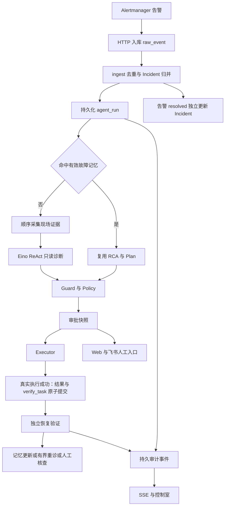

# 智能 OnCall Agent：简历与架构面试分析

核对日期：2026-09-14。事实基准为当前工作区源码、迁移、配置及测试，包括尚未提交的修改。本文面向用户指定的“5 年及以上架构师”定位；该定位不是对个人工作年限、职级或组织影响力的事实认证。

主文档覆盖项目识别、TOP 15 亮点、简历改写、岗位映射与面试准备；[S 级核心亮点说明](</Users/zxy/oncall agent/docs/resume-core-highlights.md>)和[系统优化专项文档](</Users/zxy/oncall agent/docs/resume-system-optimization.md>)分别承担新人导读与后续优化设计。推荐直接使用第五节的主项目版本。

**证据口径**：`【代码已实现】`说明仓库存在实现，不自动代表生产部署、个人主导或业务成效；`【强推导亮点】`说明机制可支持该价值，但未测量收益；`【可扩展设计】`只用于后续计划。S/A/B 是本项目中的简历推荐等级，L1–L4 是能力深度判断，不代表公司职级。本次只做源码与文档核验，不运行生产操作、付费模型或故障实验，不修改业务代码。

**个人贡献口径**：仓库不能证明每一段代码由谁设计或实现。下面“参与核心设计与实现”等词是建议措辞，使用前应按本人实际承担的模块取舍；不能据此改成“主导整体架构”。公司排序沿用用户 prompt 给定的岗位视角，不声称是各公司的官方录用标准。

## 一、项目技术画像

这是面向运维故障处置的 AI 应用与自动化平台项目。系统以 Incident 为中心，把 Alertmanager 告警接入、去重归并、现场证据采集、Eino ReAct 诊断、动作审批、Docker 执行和恢复验证连接起来，并通过 Web 控制室及飞书完成查看、追问和人工决策。核心对象包括告警、Incident、诊断 Run、审批快照、验证任务和故障记忆。

架构采用 Go 模块化单体，MySQL 同时保存业务事实与持久任务，React 前端嵌入服务；变更链路优先保证状态一致、范围正确与可审计。代码具有跨模块事务、故障恢复和隔离环境验收基础，生产部署规模、实际用户数及运维收益不确定。最大价值是把模型建议接入受约束、可验证的执行流程；最大短板是缺少真实模型效果评测及量化性能基线。适合突出 AI 应用、Agent/Workflow 和后端平台能力；可以讲数据库一致性，却不足以证明大规模分布式存储或模型底层推理优化经验。作为主项目讲执行安全与异常恢复，作为次项目讲 Agent 工程化和故障处置模块实现。

依据：[服务组装](</Users/zxy/oncall agent/cmd/server/main.go:43>)、[模块依赖](</Users/zxy/oncall agent/go.mod:1>)、[运行架构](</Users/zxy/oncall agent/docs/current-architecture.md:1>)、[历史验收边界](</Users/zxy/oncall agent/docs/execution-trust-verification.md:1>)。

## 二、业务背景重建

### 2.1 代码明确体现的业务事实

| 业务事实 | 代码与函数 | 表、接口或配置 | 简历程度与 JD | 风险边界 |
|---|---|---|---|---|
| 告警触发故障处置 | [服务路由](</Users/zxy/oncall agent/cmd/server/main.go:266>)、`NewAlertmanagerWebhook` | `POST /webhook/alertmanager`、`raw_event`、`alert`、`incident` | 可直接写；后端平台、AI 自动化 | 未证明生产告警量或降噪比例 |
| 根据现场信息分析故障 | [诊断组装](</Users/zxy/oncall agent/cmd/server/main.go:242>)、`NewReasoner`、`NewPipeline` | `agent_run`、`agent_run_step`、`diagnose.budget` | 可直接写；Agent、Workflow | 未证明 RCA 准确率；现场证据不等于向量 RAG |
| 变更需要执行约束与审批 | [Policy 组装](</Users/zxy/oncall agent/cmd/server/main.go:134>)、`NewPolicy`、`NewExecutor` | `approval`、`execution_context`、`plan_hash` | 重点写；AI 安全、平台治理 | 当前受控变更工具主要是容器重启 |
| 执行后独立检查恢复情况 | [验证 Worker](</Users/zxy/oncall agent/internal/diagnose/verification_worker.go:81>)、`RunOnce` | `verify_task`、`next_check_at`、`deadline_at` | 重点写；可靠性、状态机 | `/health` 通过只覆盖绑定的健康范围 |
| 相同故障复用已验证经验 | [故障记忆组装](</Users/zxy/oncall agent/cmd/server/main.go:166>)、`memory.NewStore` | `fault_memory`、`fault_cmd_history` | 可写；Agent 应用成本与反馈闭环 | 是 MySQL 指纹匹配，不是语义检索或训练 |
| Web 与飞书围绕同一事件协作 | [回调](</Users/zxy/oncall agent/internal/notify/feishu/callback_business.go:146>)、`CardAction` / `MessageReceive` | `approval`、`conversation_message`、`im_binding` | 可写；AI 产品化、平台 | Web 是可信网络匿名操作面，不能宣称企业 RBAC |

### 2.2 可强推导的业务诉求

| 推导诉求 | 为什么能推导 | 可写边界 | 适配 JD | 不可夸大点 |
|---|---|---|---|---|
| 防止重复告警触发重复处理 | 存在指纹、快照、归并与事务队列 | 设计去重与归并机制 | 后端、平台 | 不能写告警下降某百分比 |
| 防止模型建议直接变成危险变更 | LLM 工具只读，后续存在 Guard/Policy/审批 | 分离模型推理与动作授权 | Agent、AI 架构 | 不能写杜绝所有幻觉或所有误操作 |
| 避免失败重试再次产生副作用 | 执行结果与验证任务原子提交，未知执行转人工 | 处理外部动作与数据库之间的不确定窗口 | 可靠性、平台 | 不保证 Docker/MySQL exactly-once |
| 减少重复排障工作 | 记忆命中绕过证据采集和 LLM | 同类故障复用已验证结论 | AI 应用 | 缺少总体命中率与成本节省数据 |
| 降低人工获取进度的成本 | 持久事件、SSE、控制室、飞书卡片 | 提供可追踪的处理进度与人工入口 | 平台、AI 产品化 | 人效提升程度未测量 |

### 2.3 不确定的业务背景

| 不确定点 | 缺少的证据 | 对岗位判断的影响 | 面试中的保守说法 |
|---|---|---|---|
| 是否用于生产、服务多少团队 | 发布记录、业务部署及用户使用数据 | 不能证明运营规模或生产 ownership | “当前代码和隔离环境验收能证明这些机制，生产使用范围需另补材料。” |
| 是否具备强 SLA、大流量能力 | SLA、容量基线、压测、故障统计 | 不能主打高可用或高吞吐成效 | “尚未建立容量与时延基线。” |
| 每个模块的个人贡献 | 职责分工、评审记录、可归属变更 | 不能推导主导、带团队和跨团队影响力 | 只讲本人能解释并举证的设计和修改 |
| 模型诊断是否稳定有效 | 带标签故障集、多模型离线评测和真实反馈 | AI 架构效果论据不足 | “已有结构与安全约束测试，尚无诊断质量量化结论。” |
| “小时级降到分钟级”是否成立 | 同口径人工基线、起止定义、足够样本 | 旧简历的收益结论不可直接沿用 | “实现自动化处置流程，暂不报耗时改善比例。” |
| 是否覆盖企业权限与多租户 | 用户/租户模型、授权策略、隔离测试 | 平台成熟度有限 | “当前服务可信网络，Web 审计是 anonymous。” |

## 三、系统全景扫描

### 3.1 入口、模块与主链路

真实调用形态是 `HTTP Handler → service / worker → incident 纯规则与 store 事务 → MySQL / 工具 Client / LLM`。没有强行统一成七层架构：运行态直接使用若干 `store` 对象，`incident` 包承载状态与执行范围规则；前端 DTO 单独裁剪。`Pipeline` 是显式 Go 编排，不是通用 DAG/DSL 执行平台。

| 模块 | 职责 | 主要文件 |
|---|---|---|
| 启动与 API | 配置、依赖组装、单 listener、静态前端 | [main.go](</Users/zxy/oncall agent/cmd/server/main.go:43>) |
| ingest / incident | 告警标准化、指纹、归并、状态及准入规则 | [worker.go](</Users/zxy/oncall agent/internal/ingest/worker.go:1>)、[incident.go](</Users/zxy/oncall agent/internal/incident/incident.go:1>) |
| diagnose / llm / tools | 证据、ReAct、工具注册、输出契约及规则检查 | [pipeline.go](</Users/zxy/oncall agent/internal/diagnose/pipeline.go:1>)、[reasoner.go](</Users/zxy/oncall agent/internal/llm/reasoner.go:1>) |
| approval / verification | 审批裁决、执行领取、持久验证 | [executor.go](</Users/zxy/oncall agent/internal/approval/executor.go:1>)、[verification_worker.go](</Users/zxy/oncall agent/internal/diagnose/verification_worker.go:81>) |
| store / memory | MySQL 事务、持久任务、历史经验 | [models.go](</Users/zxy/oncall agent/internal/store/models.go:1>)、[store.go](</Users/zxy/oncall agent/internal/memory/store.go:1>) |
| conversation / notify / web | Incident 问答、飞书绑定与审批、实时控制室 | [service.go](</Users/zxy/oncall agent/internal/conversation/service.go:1>)、[IncidentRoom.tsx](</Users/zxy/oncall agent/web/src/pages/IncidentRoom.tsx:49>) |

### 3.2 数据、异步任务和外部依赖

MySQL 是系统自身的业务库。`raw_event` 保存接入队列；`alert / last_alert / incident / incident_alert` 保存告警历史、当前快照及成员关系；`agent_run / agent_run_step` 保存诊断和审计；`approval / verify_task` 保存执行申请及后续检查；`fault_memory / fault_cmd_history` 保存故障经验；`incident_event / incident_problem / conversation_message / im_binding / integration_event_receipt / llm_model_selection` 支撑协作与运行配置。两张旧 Web 会话表仅是尚未删除的历史结构，不能据此认定仍有登录功能。

没有独立 MQ；MySQL 状态、索引、行锁与条件更新承担持久任务协调。后台有摄入、诊断、审批到期扫描、执行、验证和对话六类 Worker。内存 channel 用于唤醒，不能当持久消息来源。任务的恢复方式取决于副作用：只读诊断可重新处理，结果未知的变更动作转人工核查。

外部依赖包括 Prometheus、Alertmanager、blackbox-exporter、Docker Engine、OpenAI-compatible 模型服务及可选飞书 API。PostgreSQL、Redis、Sub2API 是受观测目标或其依赖；不能把 Redis 写成该项目的队列或缓存中心。故障记忆以 MySQL 精确指纹查询实现，不是向量库。

依据：[迁移索引](</Users/zxy/oncall agent/migrations/011_queue_admission_indexes.sql:1>)、[数据库入口](</Users/zxy/oncall agent/internal/store/db.go:20>)、[部署配置](</Users/zxy/oncall agent/docker-compose.dev.yml:1>)、[观测配置](</Users/zxy/oncall agent/prometheus.yml:1>)。

### 3.3 治理、AI 能力与工程质量边界

| 维度 | 当前可确认的能力 | 未发现足够证据或实际边界 |
|---|---|---|
| AI | ReAct、Function Calling、RCA/Plan 输出契约、模式预算、故障记忆、只读问答 | 没有向量 RAG、embedding、rerank、MCP、多 Agent 协作、DSL、AI Coding 产品功能 |
| Workflow | 固定流程、持久队列、步骤审计、事务终态、受限重诊 | 不是任意节点自动续跑，也不是通用工作流引擎 |
| 安全 | L1 只读工具暴露、参数约束、目标白名单、快照 Hash、TTL、执行复验、预采证据及审计脱敏 | 动态工具结果回喂缺少统一脱敏；没有 Web 个人认证/授权/CSRF，飞书白名单不保护 Web |
| 可观测 | 步骤/事实事件、问题记录、token usage、计数器及队列深度、SSE | 没有完整分布式 trace 或分阶段性能基线；现有 Prometheus 配置未抓服务自身 `/metrics` |
| 工程质量 | 单测、MySQL 集成、事务故障注入、竞态用例、迁移脚本、Playwright、CI 配置 | 本次未重跑；真实付费模型测试、线上 CI 成果不可推导 |
| 存储 | 关系模型、复合索引、事务隔离、迁移、任务恢复 | 没有分片、副本协议、存储引擎、分布式一致性协议 |
| 推理性能 | 应用层调用次数、轮次/输出预算控制 | 没有量化、CUDA/Triton、RDMA、GPU profiler、推理框架优化 |

[历史验收记录](</Users/zxy/oncall agent/docs/execution-trust-verification.md:5>)记载 745 个 Go 测试/子测试和 53 项前端测试通过，以及隔离真实依赖实验。这是已有记录，不是本轮复测结果，也不能用测试数替代效果、容量或个人贡献证据。服务指标实现见 [metrics.go](</Users/zxy/oncall agent/internal/metrics/metrics.go:19>)；Web 身份边界见 [main.go](</Users/zxy/oncall agent/cmd/server/main.go:198>)。

## 四、TOP 15 项目亮点

排序优先考虑工程难度、证据强度和面试可展开性，避免把常规功能全部评为 S。H 编号在全文一致；S 级为 H1–H4。没有证据支撑 L4 的跨团队影响力，故不评 L4。

### H1：审批快照与执行前范围复验

1. **亮点级别：S。** 直接涉及 AI 建议转为真实变更时的安全边界。
2. **资深度：L3。** 设计跨 Policy、审批、数据库领取与 Executor 的一致契约。
3. **分类：** AI 应用、Workflow、安全治理、一致性。
4. **结论：**【代码已实现】；降低误执行风险是机制价值，未经量化。
5. **主导度建议：** 参与核心设计与实现；个人设计责任需另行举证。
6. **简历表述：** 参与运维变更审批链路设计，以不可变执行快照绑定工具参数、目标范围、演练模式及验证配置，结合内容 Hash 和执行前复验约束审批后的配置与故障范围漂移。
7. **技术拆解：** 审批时看到的计划与执行时环境可能不同。Policy 生成明确的执行上下文，规范化 JSON 后计算 SHA-256；执行领取事务检查内容、TTL、Incident 状态及当前成员，再条件更新为 executing。价值是让“批准什么”和“执行什么”有可检查的契约；代价是环境变化可能使旧审批失效，需要重新诊断或审批。
8. **代码证据：** [Policy.Decide](</Users/zxy/oncall agent/internal/approval/policy.go:69>)及快照构造（同文件 97 行）；[PlanHash](</Users/zxy/oncall agent/internal/incident/execution.go:91>)、绑定校验（163 行）、成员范围（204 行）；[ClaimApprovalExecution](</Users/zxy/oncall agent/internal/store/execution.go:59>)；[Executor](</Users/zxy/oncall agent/internal/approval/executor.go:130>)。核心表 `approval`，字段 `plan_hash / execution_context / expires_at / status`；关键配置为 `approval.dry_run`、Docker allowlist、验证窗口。
9. **架构价值：** 校验不是孤立的入参检查，而是跨时间、跨模块保持同一授权内容，解决批准与使用之间的变化问题。
10. **理论映射：** 可映射为 TOCTOU 防护、不可变命令快照和条件状态迁移；Hash 是内容一致性检查，不是身份签名，也不能硬套零信任平台或分布式共识。
11. **JD 映射：** AI/Agent 看模型权限边界；平台看可审计操作契约；分布式/存储看本地事务设计的可迁移基础；RAG 与底层 AI 性能不适配。
12. **公司视角：** 字节可讲 Tool 安全；阿里讲核心链路约束；腾讯讲操作风险；Google 讲不可变契约与简化；Amazon 讲故障处置边界；Binance 讲状态一致性，但不包装成交易风控。
13. **三层追问：** Hash 到底包含哪些字段？审批后 Docker 配置变化怎么办？领取等待锁期间加入新的故障成员会怎样？
14. **回答建议：** 从具体的旧计划失效场景讲起，沿快照构造、展示、裁决、领取走一遍；解释为什么执行前必须查当前事实。只说“加签防篡改”显得浅，也不符合此处 Hash 的性质。
15. **风险提示：** 当前闭环围绕指定 Sub2API 容器、`Sub2APIDown` 和 `docker_restart`；没有任意 Shell、多动作自动执行或企业级 Web RBAC。
16. **反吹牛审查：** 面试官可要求指出领取 CAS 与范围复验的事务顺序。第三层弱点是混淆当前读、普通快照读和个人授权，或误认为 Hash 能认证操作者。
17. **能写 / 不要写：** 能写“审批快照、执行复验、范围约束”；不要写“杜绝所有误操作、零风险自动运维、密码学身份认证”。

### H2：执行、恢复验证与告警恢复分别建模

1. **亮点级别：S。** 可用具体失败场景解释完整闭环。
2. **资深度：L3。** 拆分不同来源、不同时间尺度的业务事实。
3. **分类：** Workflow、可靠性、状态机、AI 应用。
4. **结论：**【代码已实现】。
5. **主导度建议：** 参与核心设计与实现。
6. **简历表述：** 将变更执行与恢复验证解耦，使用持久验证任务在限定窗口内检查目标健康，分别记录执行、验证和告警恢复状态，并对失败与不可判定结果采用不同处置路径。
7. **技术拆解：** Docker 返回成功不代表业务已恢复；健康检查成功也不代表全部告警已解除。真实执行成功后创建 `verify_task`，独立 Worker 检查 `/health`，得到 passed/failed/inconclusive；Incident 仍按成员告警是否全部 resolved 归结。这样执行 Worker 不必等待整个验证窗口，代价是前后端必须展示多种状态。
8. **代码证据：** [FinishExecution](</Users/zxy/oncall agent/internal/store/execution.go:127>)、创建验证任务（184 行）；[Verifier](</Users/zxy/oncall agent/internal/diagnose/verify.go:24>)；[VerificationWorker.RunOnce](</Users/zxy/oncall agent/internal/diagnose/verification_worker.go:81>)、窗口裁决（166 行）；[FinalizeVerification](</Users/zxy/oncall agent/internal/store/verification.go:102>)；[Incident 恢复判断](</Users/zxy/oncall agent/internal/store/incident.go:195>)。关键字段 `next_check_at / deadline_at / claimed_at / last_result_json`。
9. **架构价值：** 解决“命令已接受”“观测符合条件”“业务事件恢复”被错误合并的问题，使重试、UI 与记忆更新有真实依据。
10. **理论映射：** 可映射长任务分阶段状态机、异步观察和三态结果；不应叫通用 Saga 回滚，本系统没有自动撤销 Docker restart。
11. **JD 映射：** AI/Agent 看工具执行后的反馈约束；平台看异步任务与人工接管；分布式方向可讨论副作用不确定性；存储引擎与模型性能不适配。
12. **公司视角：** 字节讲 Agent 反馈；阿里讲业务终态；腾讯讲状态不误报；Google 讲事实模型；Amazon 讲 operational correctness；Binance 讲外部依赖失败的语义边界。
13. **三层追问：** 为什么执行成功不能标记恢复？验证窗口结束但没有新鲜观测怎么办？进程重启后如何保持原截止时间并拒绝旧领取结果？
14. **回答建议：** 用“重启成功，但服务还没就绪”的例子串联三个状态；说明窗口内超时或无法观测继续检查；到期只有新鲜且已持久化的不健康观测能支持失败，否则判为不可判定。不要把“加重试”当完整答案。
15. **风险提示：** 直接健康检查只验证审批绑定的范围；`inconclusive` 不自动重诊、不降级记忆。不能把测试环境 `/health` 成功推导成所有业务功能恢复。
16. **反吹牛审查：** 让候选人解释“迟到 200”与旧 `claimed_at` 的处理。第三层薄弱点是把超时当失败、把取消当终态或不断延长截止时间。
17. **能写 / 不要写：** 能写“持久验证、有界窗口、执行与恢复解耦”；不要写“重启后自动保证恢复、任何故障自愈、固定秒级恢复”。

### H3：MySQL 持久工作流与关键事务一致性

1. **亮点级别：S。** 最适合展开数据库并发与外部副作用问题。
2. **资深度：L3。** 事务边界覆盖业务决策、状态、后续任务和审计。
3. **分类：** 一致性、Workflow、数据访问、工程治理。
4. **结论：**【代码已实现】；多实例能力不在结论内。
5. **主导度建议：** 参与核心设计与实现。
6. **简历表述：** 基于 MySQL 持久任务和条件状态迁移串联诊断、审批与验证，在关键成员范围事务中结合 Incident 父锁与事务级 READ COMMITTED，并原子提交关键结果，约束并发范围变化与故障恢复过程中的状态分裂。
7. **技术拆解：** 计划应进入审批却只记录诊断成功，或真实执行成功却没有验证任务，都会割裂流程。实现将 Run 与审批、执行结果与验证任务、验证终态与后续效果分别原子提交；范围检查用父 Incident 锁协调成员写入，并在相关事务使用 READ COMMITTED 避免锁前查询固定旧读视图。副作用调用在数据库事务之外，落库失败只重试提交结果；进程崩溃造成结果未知时转人工。
8. **代码证据：** [lockApproval](</Users/zxy/oncall agent/internal/store/execution.go:39>)、[ClaimApprovalExecution](</Users/zxy/oncall agent/internal/store/execution.go:59>)及事务选项（123 行）；[CompleteRun](</Users/zxy/oncall agent/internal/store/runstep.go:75>)及隔离级别（205 行）；[FinalizeVerification](</Users/zxy/oncall agent/internal/store/verification.go:102>)及隔离级别（247 行）；[成员写入锁](</Users/zxy/oncall agent/internal/store/rawevent.go:200>)；[结果持久化重试](</Users/zxy/oncall agent/internal/approval/executor.go:187>)。
9. **架构价值：** 核心是对“哪些事实必须一起出现”的明确取舍，以及将数据库一致性与外部系统不确定性分开处理。
10. **理论映射：** 本地事务、CAS、租约与幂等提交；可以讨论至少一次处理带来的重复问题，但不能把整条执行链称为 exactly-once、TCC、Raft 或跨 Docker/MySQL 分布式事务。
11. **JD 映射：** 后端/平台最直接；Agent 看可恢复的执行容器；分布式/存储可迁移的是事务与故障分析能力，非存储系统研发；AI 性能无关。
12. **公司视角：** 字节讲 Agent 后端稳定性；阿里讲核心状态一致；腾讯讲恢复与故障注入；Google 讲不变量与简化；Amazon 讲故障窗口；Binance 讲并发与幂等，不虚构金融业务。
13. **三层追问：** 为什么不在事务内调用 Docker？为何拿到行锁仍可能读到旧范围？动作成功但写库结果不明时怎么恢复？
14. **回答建议：** 画出数据库提交点和网络调用之间的窗口；说明 READ COMMITTED 与父锁分别解决什么问题。只说“加锁、开事务、重试”会暴露没有理解边界。
15. **风险提示：** 单实例运行是明确约束。诊断任务恢复不等于每个节点从中断点精确续跑；通知在提交后发送，不具备必达承诺。
16. **反吹牛审查：** 指向 [范围竞态用例](</Users/zxy/oncall agent/internal/store/execution_scope_race_test.go:216>)，要求解释两个事务的时序。第三层薄弱点是混淆隔离级别、锁顺序、领取失效与业务幂等。
17. **能写 / 不要写：** 能写“事务一致性、条件迁移、故障恢复、幂等结果提交”；不要写“分布式事务平台、多实例可靠调度、端到端恰好一次”。

### H4：证据驱动的 ReAct 与只读工具边界

1. **亮点级别：S。** 是 AI 岗位最直接的项目入口。
2. **资深度：L3。** 将非确定性推理嵌入确定性的业务约束流程。
3. **分类：** Agent、Tool Use、Workflow、AI 应用。
4. **结论：**【代码已实现】。
5. **主导度建议：** 参与核心设计与实现。
6. **简历表述：** 基于 Eino ReAct 构建证据驱动的故障诊断，输出包含证据引用的根因分析及结构化计划，仅向模型开放只读工具，并通过确定性 Guard、Policy 和审批链路约束变更行为。
7. **技术拆解：** 程序先准备关键现场，模型通过只读工具补充观察，解析生成的 RCA/Plan 后进入业务规则。`react.NewAgent` 负责推理和工具循环；流程本身由 Go `Pipeline` 编排。收益是模型保留分析能力，执行权限仍由代码控制；代价是修复范围受现有工具和规则约束。
8. **代码证据：** [Reasoner.Diagnose](</Users/zxy/oncall agent/internal/llm/reasoner.go:94>)、ReAct 构造（108 行）、结果契约（169 行）、L1 工具适配（234 行）；[Registry.ForLLM](</Users/zxy/oncall agent/internal/tools/registry.go:108>)；[Pipeline](</Users/zxy/oncall agent/internal/diagnose/pipeline.go:107>)与安全步骤（188、213 行）；[Questioner](</Users/zxy/oncall agent/internal/llm/questioner.go:51>)。
9. **架构价值：** 能解释模型、工具和业务状态三者的职责，而不是只有一段 API 调用与 Prompt。
10. **理论映射：** ReAct、结构化输出契约、最小权限、确定性工作流；不能写成 Multi-Agent 协同、Eino Graph、Plan-Execute-Replan 框架或 MCP 接入。
11. **JD 映射：** 强适配 AI 应用、Agent、Tool Use、固定 Workflow；RAG 缺少文档/向量检索；平台方向强调边界；分布式存储和底层推理性能不适配。
12. **公司视角：** 字节讲 Agent 产品化；阿里讲 AI 接入业务约束；腾讯讲工具安全与可定位；Google 讲职责边界；Amazon 讲能操作且可接管的流程；Binance 讲 AI 后端受控工具链。
13. **三层追问：** ReAct 每轮输入输出是什么？模型返回非法 JSON 或申请写工具怎么办？如何证明根因分析质量且避免以安全测试代替效果评测？
14. **回答建议：** 按 Evidence → Message → tool call → Tool Result → RCA/Plan → Guard 的真实数据流讲；模型契约解析失败最多做有限修复，不声称结果一定正确。只背 ReAct 定义而说不清业务接点显得浅。
15. **风险提示：** 当前未建立带标签的真实模型诊断 Eval；Questioner 与 Reasoner 是不同业务入口，不等于互相协作的多 Agent。
16. **反吹牛审查：** 面试官可让你列出实际模型可调用的工具以及工具结果如何进入下一轮。第三层薄弱点是说不清输出结构验证、语义正确性和授权判断的区别。
17. **能写 / 不要写：** 能写“Eino ReAct、证据驱动诊断、只读 Tool Use、固定流程编排”；不要写“多智能体平台、通用 RAG、MCP、模型自学习、诊断准确率提升 X%”。

### H5：通过恢复验证约束的故障记忆

1. **亮点级别：A。** 复用机制明确，收益缺少整体统计。
2. **资深度：L3。** 价值在于召回、授权、验证与失效的闭环，而非缓存查表本身。
3. **分类：** Agent Memory、成本治理、Workflow。
4. **结论：**【代码已实现】；总体成本改善属于【强推导亮点】。
5. **主导度建议：** 负责模块实现与优化，前提是符合实际贡献。
6. **简历表述：** 实现基于故障指纹、置信度和 TTL 的修复经验复用，命中时绕过证据采集与 LLM，保留安全审批和恢复验证，并按验证结果写入或降级记忆。
7. **技术拆解：** 相同已知故障不必重复推理，但旧方案可能过时。指纹精确查询，TTL 从最近成功时间判断；重诊不走记忆召回；命中仍过 Guard/Policy。新记忆写入还要求高置信度等条件，失败可降级。代价是覆盖面窄，必须谨慎定义相同故障与有效期。
8. **代码证据：** [指纹规则](</Users/zxy/oncall agent/internal/incident/execution.go:228>)；[Lookup](</Users/zxy/oncall agent/internal/memory/store.go:33>)；[数据库查询](</Users/zxy/oncall agent/internal/store/memory.go:33>)；[命中旁路](</Users/zxy/oncall agent/internal/diagnose/pipeline.go:119>)；[写回效果准备](</Users/zxy/oncall agent/internal/diagnose/verification_worker.go:197>)及门槛（217、250 行）；[命中测试](</Users/zxy/oncall agent/internal/diagnose/pipeline_test.go:486>)。表 `fault_memory`，字段 `confidence / last_success / ttl_sec`。
9. **架构价值：** 不把一次模型回答直接存为可信知识，而是将可复用性绑定到受控执行和观测结果。
10. **理论映射：** 经验证结果复用、TTL 失效及反馈降级；不是 embedding 检索、RAG、参数训练或智能体自主学习。
11. **JD 映射：** AI 应用成本治理与 Agent Memory；平台方向可讲经验资产失效；数据访问是关系查询，不是存储架构；不属于模型推理优化。
12. **公司视角：** 字节讲调用治理；阿里讲复用与失效；腾讯讲坏记忆处理；Google 讲正确性约束；Amazon 讲已知问题处置；Binance 讲重复诊断控制。
13. **三层追问：** 什么字段定义同一故障？命中后为何还要验证？观察不到恢复时会不会错误地降级或刷新 TTL？
14. **回答建议：** 分清“候选经验”和“执行许可”，用两个同指纹但目标状态变化的案例讲边界；谈命中路径少一次完整诊断，不虚构总体节省。
15. **风险提示：** 当前为精确指纹匹配，无召回质量数据；写入并非所有 passed 都无条件进行。
16. **反吹牛审查：** 问为何重诊绕开记忆，以及不可判定时是否更新记忆。薄弱点是误把验证通过当任意经验永久正确。
17. **能写 / 不要写：** 能写“故障经验复用、置信度门槛、TTL、验证反馈”；不要写“向量知识库、自学习知识系统、降低成本 80%”。

### H6：告警去重、版本留存与时间窗归并

1. **亮点级别：A。** 比普通入库接口更有工程深度，业务成效未量化。
2. **资深度：L3。** 涉及告警历史、当前快照、Incident 归属与诊断触发的一致性。
3. **分类：** 事件处理、平台、一致性。
4. **结论：**【代码已实现】；降噪价值为【强推导亮点】。
5. **主导度建议：** 参与核心设计与实现。
6. **简历表述：** 基于告警指纹和内容哈希实现重复通知去重与变更版本留存，按标签及时间窗归并 Incident，并将事件处理、关联更新和诊断入队纳入同一事务。
7. **技术拆解：** 相同告警会重复通知，同一故障又可能产生多个告警。指纹确定告警身份，内容哈希判断是否追加版本，归并键与时间窗确定 Incident；成员关系幂等插入。方案保留变更历史，避免重复创建处理任务；代价是依赖标签质量，窗口需要符合实际故障时间尺度。
8. **代码证据：** [CreateRawEvent](</Users/zxy/oncall agent/internal/store/rawevent.go:73>)、[ApplyRawEvent](</Users/zxy/oncall agent/internal/store/rawevent.go:114>)、[applyAlert](</Users/zxy/oncall agent/internal/store/rawevent.go:152>)；[GroupKey](</Users/zxy/oncall agent/internal/ingest/correlate.go:54>) / `Correlator.Assign`（73 行）；[Incident 关联](</Users/zxy/oncall agent/internal/store/incident.go:74>)与诊断入队（237 行）。表 `raw_event / alert / last_alert / incident_alert`。
9. **架构价值：** 将身份去重、内容版本与故障归并拆成不同规则，保持“重复通知”和“业务新变化”的区别。
10. **理论映射：** 幂等接入、事件归并、历史与快照分离；不是 LLM 根因关联，也不是完整 Event Sourcing。
11. **JD 映射：** 平台事件接入与可靠后端；AI/Workflow 的触发基础；可迁移到消息处理，但未证明高吞吐；RAG、存储引擎、底层 AI 性能不适配。
12. **公司视角：** 字节讲 AI 任务触发；阿里讲状态与归并；腾讯讲重复告警治理；Google 讲身份模型；Amazon 讲告警处置体验；Binance 讲幂等事件处理。
13. **三层追问：** 指纹与内容哈希分别解决什么？重复成员是否增加告警计数？处理一半写库失败后怎样避免部分关联？
14. **回答建议：** 对比“完全相同告警”“同身份内容变化”“不同告警同故障”三个输入；再说明事务 hook 如何将归并和入队包在同一提交内。只说“Redis 去重”既浅也与代码不符。
15. **风险提示：** 不能写智能语义聚类、告警下降百分比；`raw_event` 到 Incident 没有完整的数据库直接关联字段。
16. **反吹牛审查：** 面试官可要求解释 `last_alert` 更新和 `incident_alert` 插入条件。第三层弱点是把去重当历史数据全部丢弃，或不知道归并窗口边界。
17. **能写 / 不要写：** 能写“指纹去重、内容版本、规则归并、事务入队”；不要写“AI 根因聚类、无限吞吐、完全无重复消息”。

### H7：统一诊断准入、冷却与重诊预算

1. **亮点级别：A。** 约束多入口的任务冲突，能解释真实失败场景。
2. **资深度：L3。** 将不同入口的业务准入收敛为同一事务规则。
3. **分类：** Workflow、并发协调、平台治理。
4. **结论：**【代码已实现】。
5. **主导度建议：** 负责模块实现与优化。
6. **简历表述：** 收敛告警触发、人工重诊与自动重诊的任务准入，基于 Incident 活跃状态、处理互斥、冷却窗口和重诊链预算限制重复处理，预算耗尽后记录人工核查问题与升级事件。
7. **技术拆解：** 一个 Incident 正在审批或验证时，新诊断可能生成矛盾计划。`RequestRun` 在事务内校验 Incident 及活跃 Run/Approval/Verify；人工入口有冷却，自动入口校验 `retry_of` 链与后继，最多两次重诊。收益是多入口共享相同规则；代价是同 Incident 采用保守串行处置。
8. **代码证据：** [RequestRun](</Users/zxy/oncall agent/internal/store/runrequest.go:46>)、[requestRun](</Users/zxy/oncall agent/internal/store/runrequest.go:66>)、人工冷却（93 行）、[checkActiveProcessing](</Users/zxy/oncall agent/internal/store/runrequest.go:142>)、[checkRetryBudget](</Users/zxy/oncall agent/internal/store/runrequest.go:170>)；[预算拒绝转人工](</Users/zxy/oncall agent/internal/store/verification.go:224>)。
9. **架构价值：** 防护作用于完整业务周期，不仅是 HTTP 层按钮防连点，因此告警、Web、API 与重诊入口遵守相同不变量。
10. **理论映射：** 业务互斥、准入控制、有界重试；不是请求 singleflight、集群限流器或分布式调度平台。
11. **JD 映射：** 后端平台、Agent/Workflow 执行治理；分布式方向只能讲可迁移的并发分析；不适配 RAG 质量或模型计算性能。
12. **公司视角：** 字节讲 Agent 调度约束；阿里讲重复操作治理；腾讯讲有限失败路径；Google 讲规则单一来源；Amazon 讲人工接管；Binance 讲并发状态冲突。
13. **三层追问：** 为什么执行中不能重诊？人工冷却与自动重诊预算有什么区别？缺失父 Run 或同时请求后继时怎么办？
14. **回答建议：** 先列“同一事件不能同时跑两个处理周期”的不变量，再讲锁、查询、创建顺序；不要声称已解决所有多实例竞争。
15. **风险提示：** 这是业务限流，不是全局 QPS 防护；冷却和重诊次数是策略上限，不是性能指标。
16. **反吹牛审查：** 问 `active_processing` 与 `cooldown` 分别返回什么、为何不同。薄弱点是把两次重诊说成任意工具失败都重试两次。
17. **能写 / 不要写：** 能写“统一准入、有界重诊、冷却、人工升级”；不要写“分布式任务引擎、请求折叠、智能无限自愈”。

### H8：Web 与飞书共享处置事实和人工入口

1. **亮点级别：A。** 产品化价值明确，但本身不代表企业平台规模。
2. **资深度：L2。** 重点是入口复用与状态一致，而非界面数量。
3. **分类：** AI 产品化、平台、实时交互。
4. **结论：**【代码已实现】。
5. **主导度建议：** 负责模块实现与优化。
6. **简历表述：** 打通 React 控制室与飞书审批、Incident 问答，复用后端审批与对话服务；通过持久事件和支持游标续传的 SSE 展示诊断、执行和验证进度。
7. **技术拆解：** 不同操作面若各存状态，容易显示不一致或绕过审批。两端使用相同 Incident/Approval/Conversation 数据；飞书事件以 receipt 去重并绑定消息线程；SSE 按事件 ID 从数据库续取。收益是接入层不重复实现业务裁决；代价是数据库轮询、IM 网络失败与 UI 刷新仍需处理。
8. **代码证据：** [共享服务注入](</Users/zxy/oncall agent/cmd/server/main.go:205>)；[CardAction](</Users/zxy/oncall agent/internal/notify/feishu/callback_business.go:146>)、[MessageReceive](</Users/zxy/oncall agent/internal/notify/feishu/callback_business.go:226>)；[SSE 处理](</Users/zxy/oncall agent/internal/api/stream.go:80>)；[前端订阅](</Users/zxy/oncall agent/web/src/api.ts:616>)、[IncidentRoom](</Users/zxy/oncall agent/web/src/pages/IncidentRoom.tsx:130>)。表 `incident_event / im_binding / integration_event_receipt / conversation_message`。
9. **架构价值：** 核心在于多入口共享事实和操作服务，防止聊天入口形成另一条未受约束的执行路径。
10. **理论映射：** 持久事件投影、游标续传、渠道适配；不是事件溯源平台或端到端实时消息必达系统。
11. **JD 映射：** AI 应用产品化、后端平台、实时交互；无 RAG 检索与底层 AI 性能；不证明分布式消息系统建设。
12. **公司视角：** 字节讲可用的 AI 操作界面；阿里讲平台可运营；腾讯讲状态一致；Google 讲渠道边界；Amazon 讲用户处置路径；Binance 讲实时诊断界面。
13. **三层追问：** 两端审批是否调用同一服务？SSE 断线如何恢复？卡片重复回调或已批准后再次点击怎么办？
14. **回答建议：** 指出 `approval.Decide` 是共享裁决入口，再讲 receipt 与 `Last-Event-ID`；对通知失败保守说明提交后发送，不保证必达。只说“WebSocket 实时推送”与实际 SSE 不符。
15. **风险提示：** Web 操作身份为 anonymous，飞书 operator allowlist 不保护 Web。SSE 是轮询数据库后推送，不是 LLM token 流。
16. **反吹牛审查：** 让候选人解释浏览器重连时游标来自哪里。薄弱点是误把 SSE 等同 WebSocket，或把飞书权限当全站认证。
17. **能写 / 不要写：** 能写“共享审批、Incident 问答、SSE 续传、事件回调去重”；不要写“企业统一身份、双端消息必达、跨地域强实时”。

### H9：多源证据预采与输入治理

1. **亮点级别：A。** 可作为 H4 的具体实现支撑。
2. **资深度：L2。** 多源适配与输入边界；单独不足以证明整体架构能力。
3. **分类：** AI 输入治理、可观测数据、Tool Use。
4. **结论：**【代码已实现】。
5. **主导度建议：** 负责模块实现与优化。
6. **简历表述：** 整合告警快照、PromQL、系统指标、服务健康、数据库及容器现场，统一记录来源、状态与时间，并在进入模型前执行脱敏、长度限制和外部文本边界处理。
7. **技术拆解：** 模型需要相对完整的现场，单个依赖失败又不能变成虚构的正常数据。Collector 返回结构化 EvidenceItem，保留缺失/降级信息；Render 输出标注外部观测文本。当前按顺序采集，代价是多次独立网络等待累加，截断还可能丢失关键尾部信息。
8. **代码证据：** [七类采集器组装](</Users/zxy/oncall agent/cmd/server/main.go:121>)；[EvidenceItem](</Users/zxy/oncall agent/internal/diagnose/evidence.go:36>)、[BuildEvidence](</Users/zxy/oncall agent/internal/diagnose/evidence.go:65>)、[Render](</Users/zxy/oncall agent/internal/diagnose/evidence.go:78>)、`finishItem`（110 行）；[Sanitize](</Users/zxy/oncall agent/internal/diagnose/sanitize.go:10>)。关键配置 `diagnose.evidence.timeout_seconds / log_max_lines`。
9. **架构价值：** 把不可信观测、缺失状态和模型提示分开，使推理能解释依据；优势来自完整数据契约，而非采集器数量。
10. **理论映射：** 适配器、数据边界、输入最小化；不是 RAG 文档索引、并行多 Agent、上下文语义压缩或完整防注入证明。
11. **JD 映射：** AI 工程化、Agent 上下文、运维平台；RAG 仅有“上下文准备”的可迁移经验；不适配 GPU 或存储内核。
12. **公司视角：** 字节讲模型上下文；阿里讲业务数据整合；腾讯讲可定位采集失败；Google 讲数据契约；Amazon 讲证据质量；Binance 讲观测接入。
13. **三层追问：** 为什么预采而不是全靠模型找工具？缺失证据怎么表示？哪些调用能并行、并行后总超时和结果顺序如何保持？
14. **回答建议：** 区分已做的顺序采集和未来有界并行建议；解释减少模型探索调用的结构性价值，但不要声称证据必然毫秒级就绪。
15. **风险提示：** 脱敏和 Prompt 分界是有限保护，不能写“彻底防止注入”。未实现的分层压缩不能从设计文档搬到简历。
16. **反吹牛审查：** 要求指出 `BuildEvidence` 的循环。第三层薄弱点是说已并行但源码串行，或无法解释截断标记的用途。
17. **能写 / 不要写：** 能写“多源证据、脱敏、来源标注、单项限长”；不要写“语义压缩、并行采集优化、完整 RAG”。

### H10：模型选择、推理预算与协议适配

1. **亮点级别：A。** 工程能力明确，模型效果与节省数据缺失。
2. **资深度：L2。** 模型调用层治理，不上升到模型服务架构。
3. **分类：** LLM 应用治理、配置、调用成本控制。
4. **结论：**【代码已实现】；成本改善仅能克制推导。
5. **主导度建议：** 负责模块实现与优化。
6. **简历表述：** 按告警等级控制诊断模式与 ReAct 步数，支持服务端白名单内的模型切换、选择持久化及在途请求隔离，并适配工具调用回合的 reasoning 回传协议。
7. **技术拆解：** 不同严重度需要不同预算，模型切换不能暴露凭据或破坏正在执行的请求。配置支持 full/light/skip；Factory 缓存客户端，切换后新请求使用新客户端，在途保留原引用；选择写入 MySQL，启动恢复。代价是全局选择而非按请求的智能路由，协议兼容范围需逐模型验证。
8. **代码证据：** [RouteMode](</Users/zxy/oncall agent/internal/incident/incident.go:52>)；[maxSteps](</Users/zxy/oncall agent/internal/llm/reasoner.go:83>)；[Factory.SelectModel](</Users/zxy/oncall agent/internal/llm/factory.go:32>)、`Build`（79 行）；[ModelSwitcher.Initialize](</Users/zxy/oncall agent/internal/llm/model_switcher.go:101>)与 `Select`（145 行）；[echoThinking](</Users/zxy/oncall agent/internal/llm/thinking.go:51>)。表 `llm_model_selection` 只保存模型 ID。
9. **架构价值：** 将运行选择、秘密配置和执行中的调用生命周期分开；亮点是治理边界，不是换模型按钮。
10. **理论映射：** 配置白名单、不可变客户端引用、应用层预算；不是多模型负载均衡、自动路由、KV Cache 或推理引擎调优。
11. **JD 映射：** AI 应用、Agent 成本与兼容性；平台配置治理；不适配底层 AI 性能、分布式存储或 RAG 评测。
12. **公司视角：** 字节讲模型迭代；阿里讲配置可控；腾讯讲在途稳定性；Google 讲生命周期；Amazon 讲开销约束；Binance 讲调用治理。
13. **三层追问：** 切换对正在执行的任务是否生效？哪些参数来自浏览器？reasoning 是结果知识还是调用协议的一部分？
14. **回答建议：** 讲清模型 ID、BaseURL/API Key 与角色预算的不同来源，明确切换是人工选择；不把 provider 的 thinking 参数说成自主研发推理算法。
15. **风险提示：** 最大步数和输出上限不等于整次输入 token 的精确硬预算；已有设计中的工作记忆压缩尚未完整落地。
16. **反吹牛审查：** 面试官可追问客户端缓存失效时在途引用的行为。第三层弱点是把全局开关当请求级路由，或不知道工具回合为何要保留 reasoning。
17. **能写 / 不要写：** 能写“运行时模型选择、预算控制、兼容协议适配”；不要写“多模型调度平台、模型推理优化、智能降本 X%”。

### H11：审计步骤、业务事实与控制室投影

1. **亮点级别：A。** 超过普通日志打印，重点是记录与展示的业务语义。
2. **资深度：L2。** 与 H2/H3 合讲更能体现 L3 深度。
3. **分类：** 可观测性、审计、平台。
4. **结论：**【代码已实现】。
5. **主导度建议：** 参与治理与演进。
6. **简历表述：** 围绕 Incident、Run、Approval 建立步骤审计与事实事件，控制室基于持久化执行和验证状态生成流程视图，避免将步骤完成误展示为业务恢复。
7. **技术拆解：** 执行日志、业务事实和当前问题用于不同查询。`agent_run_step` 记录步骤，`incident_event` 记录事实，`incident_problem` 记录待处理问题；执行/验证投影读取持久状态，不能只依赖最近事件窗口。代价是要维护明确事件语义与脱敏投影。
8. **代码证据：** [Pipeline.withStep](</Users/zxy/oncall agent/internal/diagnose/pipeline.go:406>)、[AppendIncidentEvent](</Users/zxy/oncall agent/internal/store/event.go:52>)、[OpenIncidentProblem](</Users/zxy/oncall agent/internal/store/problem.go:129>)；[controlRoomFlowNodes](</Users/zxy/oncall agent/internal/api/controlroom.go:196>)，其中 223 行后读取持久动作/验证状态；[DTO](</Users/zxy/oncall agent/internal/api/dto.go:149>)。
9. **架构价值：** 统一“发生了什么”和“现在处于什么状态”的对应关系，支撑排障与人工判断；不是单纯把日志显示到页面。
10. **理论映射：** 审计记录与读侧投影；不是完整 CQRS/Event Sourcing，也不是不可篡改审计系统。
11. **JD 映射：** AI 应用可解释执行、平台可运营；数据访问方向可讲读模型；不代表存储引擎、RAG Eval 或模型性能。
12. **公司视角：** 字节讲 Agent 过程可见；阿里讲可运营；腾讯讲故障定位；Google 讲事实语义；Amazon 讲运维可追踪；Binance 讲状态审计。
13. **三层追问：** Step 与 Event 有什么区别？最近事件窗口移出后如何展示验证终态？旧 Run 的动作能否影响新 Run 的流程图？
14. **回答建议：** 用“诊断完成但动作尚未执行”的界面例子解释，给出持久状态作为事实来源的代码。不要把 audit 称为模型思维过程记录。
15. **风险提示：** 未发现完整 raw_event→Incident 的持久关联；不能宣称任意原始请求都可端到端回放。摘要经过截断，不是全量原文归档。
16. **反吹牛审查：** 让候选人解释事件分页超过 20 条后的恢复状态。薄弱点是用时间线中的最后一步当作所有业务终态。
17. **能写 / 不要写：** 能写“步骤审计、事实事件、状态投影”；不要写“全链路无损回放、不可篡改审计、完整分布式追踪”。

### H12：围绕竞态和事务失败的分层验证

1. **亮点级别：A。** 具有 L3 价值的测试针对不变量与失败窗口，而非测试数量。
2. **资深度：L3。** 验证方案反映对事务、并发、外部副作用的理解。
3. **分类：** 工程治理、可靠性、验证体系。
4. **结论：**【代码已实现】测试与脚本；本轮未执行。
5. **主导度建议：** 参与治理与演进。
6. **简历表述：** 围绕审批竞争、故障范围变化、事务回滚及进程恢复设计分层验证，结合独立 MySQL 集成测试、故障注入和前端状态契约测试检查执行链路关键不变量。
7. **技术拆解：** Mock 难以验证数据库隔离与行锁时序，前端测试也不能代替后端一致性检查。使用真实 MySQL、SQL 触发器故障注入、并发测试与隔离依赖实验分别覆盖风险；代价是环境准备和维护成本增加，部分用例缺少 DSN 会跳过。
8. **代码证据：** [Web/飞书竞态](</Users/zxy/oncall agent/internal/api/approval_mysql_test.go:279>)、[范围锁等待竞态](</Users/zxy/oncall agent/internal/store/execution_scope_race_test.go:216>)、[执行/验证事务回滚](</Users/zxy/oncall agent/internal/store/execution_failure_test.go:31>)、[验证效果原子性](</Users/zxy/oncall agent/internal/store/verification_effects_test.go:38>)；[CI](</Users/zxy/oncall agent/.github/workflows/ci.yml:127>)、[前端边界说明](</Users/zxy/oncall agent/web/tests/README.md:1>)、[隔离实验](</Users/zxy/oncall agent/tests/acceptance/experiment.md:1>)。
9. **架构价值：** 能以可重复场景验证设计决策，不只展示“happy path 能跑”。需要本人能解释注入点和断言，否则只能说参与测试实现。
10. **理论映射：** 故障注入、并发回归、分层验证；不是完整混沌工程平台或生产演练体系。
11. **JD 映射：** 平台可靠性与 AI 工程质量；可迁移到分布式测试思路；工程正确性测试不等于诊断 Eval，也不是性能 Benchmark。
12. **公司视角：** 字节讲 Agent 发布验证；阿里讲核心流程回归；腾讯讲质量治理；Google 讲不变量验证；Amazon 讲故障演练思路；Binance 讲一致性异常测试。
13. **三层追问：** 哪些测试必须使用真实 MySQL？如何保证竞态确实发生在锁等待之后？测试跳过、成功和历史通过如何区分？
14. **回答建议：** 选一个先失败再修复的范围竞态，说明注入时序、断言和设计修正；引用历史记录时注明时间和环境，不把过去通过说成本轮通过。
15. **风险提示：** CI 文件存在不等于 GitHub 托管运行成功；Mock LLM 不能证明根因正确；53/745 属历史记录且 Go 包括子测试。
16. **反吹牛审查：** 面试官可追问“注入 SQL 错误后哪些表必须一起回滚”。薄弱点是只会报覆盖率或用例数，不知道可证明与不可证明的范围。
17. **能写 / 不要写：** 能写“竞态回归、事务故障注入、隔离集成测试”；不要写“100% 覆盖所有故障、生产零事故、自动化效果评测已完成”。

### H13：执行契约升级与旧审批离线退役

1. **亮点级别：A。** 可作为系统演进的具体案例。
2. **资深度：L3。** 升级不仅改表，还处理旧业务状态的可信边界。
3. **分类：** 数据迁移、生命周期、工程治理。
4. **结论：**【代码已实现】；上线推广范围不确定。
5. **主导度建议：** 参与治理与演进。
6. **简历表述：** 针对执行契约升级设计旧审批离线退役与启动只读检查，对缺少快照的历史活跃审批分类处理，保留审计并避免补造验证结果。
7. **技术拆解：** 旧审批没有新的执行上下文，直接迁移默认值会制造虚假的授权事实。维护命令将旧 pending/approved 退役为 expired，将结果未知的 executing 转为 failed/manual_check；现代快照不受影响。启动仅检查 schema、索引及旧活跃状态；代价是要求停机维护，不能宣称无损滚动升级。
8. **代码证据：** [CheckExecutionReady](</Users/zxy/oncall agent/internal/store/execution_upgrade.go:18>)、[RetireLegacyApprovals](</Users/zxy/oncall agent/internal/store/execution_upgrade.go:58>)；[维护命令](</Users/zxy/oncall agent/cmd/retire-approvals/main.go:1>)；[升级测试脚本](</Users/zxy/oncall agent/tests/migrations/execution-upgrade.sh:1>)；迁移 [009](</Users/zxy/oncall agent/migrations/009_approval_execution_context.sql:1>)、[010](</Users/zxy/oncall agent/migrations/010_verify_task.sql:1>)、[011](</Users/zxy/oncall agent/migrations/011_queue_admission_indexes.sql:1>)。
9. **架构价值：** 处理版本变化时的数据语义与业务责任，而非仅加字段；可解释为何不能凭默认值认可历史动作。
10. **理论映射：** 显式迁移、保守历史状态处理、启动前置条件；不是自动在线 schema migration 或跨版本无停机兼容平台。
11. **JD 映射：** 平台演进与后端数据治理；存储岗位可讲迁移基础，但没有存储引擎研发；AI 岗讲执行安全升级；性能/RAG 不适配。
12. **公司视角：** 字节讲安全迭代；阿里讲版本演进；腾讯讲历史数据风险；Google 讲兼容契约；Amazon 讲运行手册；Binance 讲未知状态不被篡改成成功。
13. **三层追问：** 为什么不给旧审批补快照？升级中断后能否重跑？旧 executing 与旧 approved 为什么不能采用同一终态？
14. **回答建议：** 强调“无法重建的事实不能补造”，再解释逐条事务和重跑边界；不要用“自动迁移无感知”包装明确需要停机的方案。
15. **风险提示：** 没有 migration version 表和完整自动迁移编排；需要停 server/外部写入并备份，不能把启动只读检查当升级执行器。
16. **反吹牛审查：** 让候选人说明 modern snapshot 如何排除。第三层薄弱点是把 DDL 成功等同业务升级完成，或忽略外部动作历史不确定性。
17. **能写 / 不要写：** 能写“旧状态退役、只读启动检查、可重跑维护”；不要写“零停机迁移、自动回滚外部动作、全历史兼容”。

### H14：模块化单体、严格配置与嵌入式发布

1. **亮点级别：A。** 有清晰取舍，不能单凭分包就评整体架构主导。
2. **资深度：L2。** 与持久流程和交付验证一起讲才有更深价值。
3. **分类：** 系统设计、配置治理、部署。
4. **结论：**【代码已实现】；减少运维复杂度属于【强推导亮点】。
5. **主导度建议：** 参与核心设计与实现。
6. **简历表述：** 采用 Go 模块化单体承载 API 与后台任务，复用 MySQL 保存业务与队列状态，结合严格配置校验和 React 静态资源嵌入完成统一交付。
7. **技术拆解：** 当前范围不需要拆微服务或新增消息集群。`main` 显式组装各模块，外部依赖由接口接入；YAML 拒绝未知键及无效时长；前端先构建再 go:embed。收益是部署与调试路径较短；代价是单进程共享故障域，扩展吞吐与多实例需要新的设计。
8. **代码证据：** [run](</Users/zxy/oncall agent/cmd/server/main.go:43>)及服务路由（263 行）；[Load](</Users/zxy/oncall agent/internal/config/config.go:221>)、`KnownFields(true)`（255 行）、`validate`（393 行）；[web/embed.go](</Users/zxy/oncall agent/web/embed.go:10>)；[前端构建命令](</Users/zxy/oncall agent/web/package.json:1>)。
9. **架构价值：** 价值在于能说明为何按当前业务选择更少依赖和明确边界；普通 Controller/Service 分层本身不是高级亮点。
10. **理论映射：** 模块化单体、组合根、接口隔离；不是微服务、DDD 完整体系、独立平台 SDK 或低代码引擎。
11. **JD 映射：** 后端架构与平台交付基础；AI 项目工程化；分布式方向只作为演进起点，不能写已支持水平扩展；AI 性能不适配。
12. **公司视角：** 字节讲快速交付的边界；阿里讲配置与迭代；腾讯讲可维护性；Google 讲复杂度取舍；Amazon 讲简化运维；Binance 讲简明的服务运行路径。
13. **三层追问：** 为什么暂时不用 Kafka/微服务？前端代码更新后为何必须重编译 Go？出现吞吐瓶颈时会先拆哪里、依据什么？
14. **回答建议：** 以现有负载未知、运维成本与状态一致需求解释选择；未来先测队列等待及数据库压力，再讨论拆分。不能把“没有压测”说成“单体已支撑极高并发”。
15. **风险提示：** 同一库只运行一个 server；Compose 主要启动基础依赖，服务跑宿主机；不能写完整容器编排或 K8s 高可用。
16. **反吹牛审查：** 询问现有失败域和多实例启动可能造成什么问题。第三层薄弱点是只会说“单体简单”，不能明确牺牲的弹性与隔离性。
17. **能写 / 不要写：** 能写“模块化单体、依赖收敛、严格配置、嵌入式交付”；不要写“云原生高可用平台、微服务治理体系、自动弹性伸缩”。

### H15：进程指标与持久队列深度

1. **亮点级别：B。** 基础治理项，不建议占简历核心六条。
2. **资深度：L1。** 常规计数器和文本端点本身不足以证明高级性能治理。
3. **分类：** 可观测性、工程基础。
4. **结论：**【代码已实现】有限指标；完整观测闭环属于【可扩展设计】。
5. **主导度建议：** 参与治理与演进。
6. **简历表述：** 补充告警处理、诊断、审批与验证计数及待处理队列深度，为运行状态排查提供基础指标。
7. **技术拆解：** 使用原子计数器与 scrape 时计算的 gauge，输出 Prometheus 文本格式。无需新增完整观测依赖，代价是缺少延迟分布、数据库连接池、模型/工具维度及成本指标；当前抓取配置也未包含自身服务。
8. **代码证据：** [Inc / RegisterGauge / Write](</Users/zxy/oncall agent/internal/metrics/metrics.go:19>)，指标名（59 行）；[队列深度注册](</Users/zxy/oncall agent/cmd/server/main.go:183>)；[prometheus.yml](</Users/zxy/oncall agent/prometheus.yml:1>)。
9. **架构价值：** 当前价值有限，只能作为其他稳定性设计的辅助证据；补齐采集、诊断、基线和改进验证后才可能形成更完整治理亮点。
10. **理论映射：** 计数器与瞬时 gauge；不能映射为完整 SLO、分布式 tracing 或自动化性能诊断平台。
11. **JD 映射：** 平台基础卫生项；AI 应用观测起点；不足以支持 AI 性能、存储性能或大规模集群治理。
12. **公司视角：** 六家公司都可把它视作工程基础；按用户给定视角，字节/Binance 可接应用观测，阿里/腾讯接运行治理，Google/Amazon接改进基线，但都不应单独包装成高级成果。
13. **三层追问：** counter 重启后怎么办？gauge 抓取是否访问数据库？如何从现在的指标定位慢在哪一阶段？
14. **回答建议：** 承认目前只能反映事件数量与排队情况；后续先补 scrape、阶段耗时和基准再做优化。只说“已接 Prometheus，监控很完善”会夸大。
15. **风险提示：** 未有延迟或吞吐基线，不报告性能改善；指标存在不代表实际已被抓取或告警。
16. **反吹牛审查：** 让候选人指出 oncall-agent 的 scrape job；目前配置没有。薄弱点是混淆“监控业务目标”和“监控 Agent 自身”。
17. **能写 / 不要写：** 能写“基础指标、队列深度”；不要写“完善观测闭环、自动定位所有瓶颈、SLA 达标”。

## 五、最适合写进架构师简历的 8 条

推荐项目名：**智能 OnCall Agent：故障诊断与受控处置系统**。技术栈写为 **Go、GoFrame、Eino、ReAct、MySQL、React、Prometheus、Docker、飞书开放平台** 即可。技术栈不沿用旧简历中的向量 RAG、MCP、Multi-Agent 和 Plan-Execute-Replan；当前代码不能证明这些能力仍然存在。

以下是基于仓库的写法建议。“参与”不代表已经核实个人贡献；最终应只保留本人实际参与且能讲清的内容。H 编号用于对应第四节证据，正式简历删除编号。各岗位版本是同一项目的取舍，不应全部堆进一份简历。

### 5.1 5 年及以上架构师通用版：精选 8 条

1. **H1｜执行授权一致性。** 参与故障处置审批链路设计，将动作参数、执行模式、目标与验证规则固化为不可变快照，通过内容 Hash、审批有效期和执行前状态复验，防止审批内容与实际执行范围发生偏离。
2. **H2｜执行与恢复判定。** 参与拆分动作执行、恢复验证与告警生命周期，利用持久验证任务记录检查窗口和结果；对执行结果未知的中断场景转人工核查，避免直接重试外部变更动作。
3. **H3｜持久工作流与事务边界。** 参与基于 MySQL 实现持久任务编排，将诊断与审批、执行结果与验证任务、验证结论与后续处置分别纳入事务，在关键成员范围事务中结合 Incident 父行锁和 READ COMMITTED 维护跨模块状态一致性。
4. **H4｜Agent 工程化。** 参与基于 Eino ReAct 构建现场证据诊断链路，通过只读工具暴露、结构化 RCA/Plan 契约和确定性规则校验，将模型建议接入可审计的故障处置流程。
5. **H5｜故障经验复用。** 参与实现基于故障指纹的高置信 TTL 记忆，复用通过恢复验证的诊断与方案；命中时跳过证据采集和模型诊断，同时保留执行校验、审批与恢复验证。
6. **H7｜统一诊断准入。** 参与统一告警触发、人工重诊和失败重诊的准入规则，围绕活跃任务互斥、人工冷却和重诊预算控制重复处理及失败循环。
7. **H8｜人工协作入口。** 参与打通 Web 控制室与飞书审批、问答入口，以同一 Incident、审批和对话记录为事实来源，通过持久事件与 SSE 展示处理进度和待人工介入事项。
8. **H12｜关键异常验证。** 参与建立 MySQL 事务故障注入、执行范围竞态及前端契约测试，覆盖任务终态原子提交、旧验证领取失效和执行内容漂移等关键异常路径。

### 5.2 AI 应用架构师版

- 参与将现场证据采集、Eino ReAct 诊断及结构化 RCA/Plan 输出接入 OnCall 场景，以只读 Tool Use 和规则校验约束模型能力边界。〔H4、H9〕
- 参与连接模型建议与审批执行流程，通过不可变执行快照、内容 Hash 和执行前复验，落实 AI 建议到外部变更之间的授权边界。〔H1〕
- 参与以独立恢复验证结果驱动故障记忆更新及有限重诊，使模型建议、执行事实和健康结论形成可追踪的反馈流程。〔H2、H5、H7〕
- 参与实现 Web/飞书故障问答及人工审批入口，结合模型白名单、诊断预算和调用记录，完善 AI 应用的交互与运行治理。〔H8、H10〕

### 5.3 Agent / RAG / Workflow 架构师版

此版本适配 **Agent / Workflow 子方向**；若 JD 的核心是 RAG，需另有真实检索项目或补齐检索与评测后再使用。

- 参与构建 Eino ReAct 诊断 Agent，以只读工具、调用轮次预算和结构化输出约束实现基于现场证据的故障分析。〔H4〕
- 参与实现“诊断—规则检查—审批—执行—验证”的固定工作流，以 MySQL 持久任务和事务提交连接各阶段状态。〔H1、H2、H3〕
- 参与将经过验证的高置信诊断沉淀为 TTL 故障记忆，按精确指纹复用方案；复用路径仍执行授权校验，失败重诊绕过记忆。〔H5、H7〕
- 参与支持 Incident 上下文问答、步骤审计与人工介入，区分只读推理失败、动作结果未知和验证不确定的处理方式。〔H2、H8、H11〕

### 5.4 平台架构师版

- 参与围绕 Incident 统一诊断、审批、执行与恢复验证的业务状态，使用持久任务、父行锁和事务终态提交维护跨模块一致性。〔H2、H3〕
- 参与设计可追踪的执行授权流程，将审批快照、目标绑定、有效期和执行复验纳入同一控制路径，限制配置及事件范围变化带来的执行风险。〔H1〕
- 参与统一自动触发与人工操作的诊断准入，支持活跃处理互斥、人工冷却和有限重诊，明确失败转人工的边界。〔H7〕
- 参与建设 Web/飞书共用的故障控制室，并通过迁移检查、旧审批退役与关键竞态测试支持系统演进。〔H8、H12、H13〕

### 5.5 分布式系统 / 存储架构师版：仅作可迁移能力表达

**该项目不建议主打分布式存储架构师版本。** 以下四条体现关系数据库一致性、任务恢复与数据演进能力，可作为相关岗位的辅助项目；不能代替分片、副本或存储引擎经验。

- 参与以 MySQL 维护业务状态与持久任务，在 Incident 父行锁下串行化关键状态变更，结合 READ COMMITTED 读取等待锁期间提交的新成员状态。〔H3〕
- 参与将执行结果、验证任务及相关审计记录纳入原子提交，并用结果内容校验处理重复提交，明确外部动作与数据库之间的不确定窗口。〔H2、H3〕
- 参与告警指纹、历史记录、当前快照和 Incident 归并链路，实现事务内防重与关联状态维护。〔H6〕
- 参与执行授权数据迁移与旧审批退役，配合启动前检查和隔离 MySQL 竞态测试验证升级后的状态约束。〔H12、H13〕

### 5.6 AI 性能优化架构师版本的适用性

**该项目不建议主打 AI 性能优化架构师版本，未发现模型量化、算子优化、通信优化或推理框架优化证据。** 模型白名单切换、调用轮次限制和故障记忆属于应用层模型调用治理；不能替换为“推理加速”“KV Cache 优化”或“模型性能优化”。

### 5.7 推荐直接使用的主项目版本

**智能 OnCall Agent：故障诊断与受控处置系统**

**技术栈：** Go、GoFrame、Eino、ReAct、MySQL、React、Prometheus、Docker、飞书开放平台。

**项目简介：** 面向运维故障处理场景，串联告警接入、现场证据采集、Agent 诊断、动作审批、受控执行与恢复验证，通过 Web 控制室及飞书支持进度查看、故障追问和人工决策。

- 参与基于 Eino ReAct 实现现场证据诊断，结合只读工具、结构化 RCA/Plan 输出和确定性规则校验，将模型建议接入可审计的运维流程。
- 参与设计不可变审批快照，将动作参数、执行模式、目标与验证规则绑定，通过内容 Hash、有效期及执行前复验防止授权内容漂移。
- 参与拆分动作执行、恢复验证与告警生命周期，使用持久验证任务跟踪健康检查；执行中断且结果未知时转人工核查，避免直接重复变更。
- 参与基于 MySQL 编排持久任务，通过 Incident 父行锁与事务提交，保障诊断与审批、执行结果与验证任务、验证结论与后续处置的一致性。
- 参与实现高置信 TTL 故障记忆，复用经过恢复验证的诊断与方案；命中时跳过模型诊断，同时保留授权校验、审批与验证流程。
- 参与打通 Web 控制室与飞书问答、审批入口，共享 Incident 和审批事实，通过持久事件与 SSE 呈现处理进度及人工介入事项。

使用边界：当前受控动作绑定单个 Sub2API 容器的 `docker_restart`，默认 `dry_run=true`、自动执行关闭，服务为单实例。简历无需逐条堆入这些细节，但面试不能把这段描述扩展为“多系统全自动自愈平台”。

### 5.8 次项目版本

**智能 OnCall Agent｜Go / Eino / MySQL**

- 参与 Eino ReAct 故障诊断模块，基于现场证据、只读工具和结构化结果生成诊断与处置建议。
- 参与审批执行与恢复验证流程，通过执行快照、持久任务和事务提交约束变更范围并记录处置结果。
- 参与故障记忆和 Web/飞书协作入口，实现同类故障经验复用、进度查看及人工审批。

## 六、最适合面试展开的 8 条

这八题优先考察决策依据和失败语义。对所有指标追问，统一原则是：先给代码能证明的行为，再说明尚无同口径量化结果；历史测试记录只能证明其中列出的场景，不能证明吞吐、诊断准确率或生产 SLA。

### 6.1 H1：批准之后，为什么执行前还要复验？

- **问题与考点：** “人已经点了同意，为什么不直接执行？”考察授权对象、时间间隔内的状态变化和检查与使用之间的竞态。
- **三层回答：** 第一层说明审批固定工具、参数、模式和健康验证范围；第二层解释 Hash 证明内容一致，而 TTL、当前配置与成员复验检查现在是否仍可执行，两者不能互相替代；第三层讲并发新增/恢复告警时先锁 Incident 再锁审批，并在 READ COMMITTED 下重新读成员，领取提交后才执行外部动作。
- **浅回答与边界：** 只说“加了 Hash 防篡改”无法解释授权是否过期。最佳深度是讲清 `ClaimApprovalExecution` 的锁顺序、失效分支及领取事务；不能声称锁住 Docker 或消除所有外部状态变化。
- **定位与指标：** [PlanHash](</Users/zxy/oncall agent/internal/incident/execution.go:91>)、[领取与复验](</Users/zxy/oncall agent/internal/store/execution.go:59>)。可说“有内容漂移与范围竞态测试”，不报误操作下降比例。
- **JD 映射与薄弱环节：** 强对应 AI Tool 授权和平台变更治理；可迁移到数据库一致性，不能证明分布式存储或 AI 底层性能。第三层最容易暴露的是把领取前一致性说成外部动作的全程原子性。

### 6.2 H2：重启命令返回成功，就算故障恢复了吗？

- **问题与考点：** “执行成功、健康恢复、告警 resolved 有什么区别？”考察事实建模、超时语义与副作用重试风险。
- **三层回答：** 第一层说明三种事实分别保存；第二层讲真实执行结果与 `verify_task` 同事务提交，由独立 Worker 按快照检查健康；第三层讲结果落库失败时只重试持久化，进程中断留下的 `executing` 转人工，验证超时或证据不足可为 `inconclusive`，不能一律当修复失败。
- **浅回答与边界：** “失败就重试”“HTTP 200 就关闭告警”都过浅。深挖到部分成功、未知结果与最后一次有效观测即可；当前验证是绑定目标 `/health`，不能说覆盖业务全功能。
- **定位与指标：** [执行与持久化](</Users/zxy/oncall agent/internal/approval/executor.go:130>)、[中断恢复](</Users/zxy/oncall agent/internal/store/execution.go:223>)、[验证裁决](</Users/zxy/oncall agent/internal/diagnose/verification_worker.go:164>)。没有真实 MTTR 基线，不说“小时级降到分钟级”。
- **JD 映射与薄弱环节：** 对应 AI 动作反馈、工作流可靠性、平台故障处置；不是 Docker/MySQL exactly-once，也不是模型性能优化。第三层需讲清为什么只读检查能重新领取，变更动作不能直接重放。

### 6.3 H3：为什么用 MySQL 做任务队列，事务到底包住什么？

- **问题与考点：** “为什么没有引入 MQ？父行锁锁的是什么？”考察依赖取舍、聚合边界和数据库并发语义。
- **三层回答：** 第一层说明当前是单实例、任务规模未证明，业务状态与任务都在 MySQL；第二层列出三个事务边界，并解释没有子任务时仍能锁父 Incident，避免‘查无活跃任务后各自插入’；第三层说明先查询审批身份再等待父锁时，REPEATABLE READ 的旧快照可能看不到等待期间的新成员，因此相应事务显式 READ COMMITTED。
- **浅回答与边界：** “数据库天然强一致”“用了事务就不会错”无法解释实际边界。最佳深度是能画出并发执行时序；若谈扩容，只能作为设计延展，先提出容量基线与任务所有权问题。
- **定位与指标：** [统一父锁](</Users/zxy/oncall agent/internal/store/runrequest.go:46>)、[锁顺序说明](</Users/zxy/oncall agent/internal/store/execution.go:39>)、[范围竞态测试](</Users/zxy/oncall agent/internal/store/execution_scope_race_test.go:44>)。当前无队列吞吐和锁等待基线。
- **JD 映射与薄弱环节：** 强对应后端平台与 Workflow 一致性；是数据库应用能力，不是自研消息中间件、分布式数据库或存储引擎。第三层容易暴露的是忽略 DB 事务无法包住外部 Docker 操作。

### 6.4 H4：怎样保证模型编出危险工具名也不能执行？

- **问题与考点：** “限制写在 Prompt 里还是代码里？”考察 Agent 工具权限、模型输出不可信和应用边界。
- **三层回答：** 第一层说明 Eino ReAct 接入现场证据，输出 RCA/Plan；第二层说明 Registry 与 Agent 适配层只暴露 L1 工具，变更计划只是数据，后续由 Guard/Policy/审批处理；第三层讲非法 JSON 仅修正一次，仍失败保留步骤与 token 审计但不使用方案，并区分日志中的不可信文本与程序授权。
- **浅回答与边界：** “Prompt 告诉模型不要乱操作”没有安全保证。可深入 Tool 参数、超时、截断与契约解析；不能把 Prompt 规则说成完整注入防御，也不能称 ReAct 为 Multi-Agent。
- **定位与指标：** [ReAct 与契约重试](</Users/zxy/oncall agent/internal/llm/reasoner.go:94>)、[L1 导出](</Users/zxy/oncall agent/internal/tools/registry.go:108>)、[工具不可越级测试](</Users/zxy/oncall agent/internal/llm/reasoner_test.go:329>)。有结构测试不等于 RCA 准确率评测。
- **JD 映射与薄弱环节：** 直接对应 Agent、Tool Use 和 LLM 应用工程化；只与平台执行控制相关，不对应存储架构或模型推理优化。第三层最容易被追问到尚缺的离线故障集、效果指标和模型版本记录。

### 6.5 H5：故障记忆为什么能跳过模型，又为什么不能跳过审批？

- **问题与考点：** “什么结论能进入记忆？命中后还检查什么？”考察缓存有效性、经验污染和成本与准确性的取舍。
- **三层回答：** 第一层说明按精确故障指纹查高置信 TTL 记忆；第二层说明写回依赖真实执行后的恢复验证、符合条件的原始诊断及未改写的 Guard，命中只是复用建议，不产生授权；第三层讲 TTL 以上次验证成功为基准，失败后降级记忆，重诊绕过记忆，防止同一错误经验持续命中。
- **浅回答与边界：** “做了 RAG 缓存”“命中过就直接重启”都与实现不符。最佳深度是说清写入、读取、失效、降级四条路径；精确指纹相同仍不证明根因相同。
- **定位与指标：** [Lookup](</Users/zxy/oncall agent/internal/memory/store.go:33>)、[命中分支](</Users/zxy/oncall agent/internal/diagnose/pipeline.go:119>)、[验证后副作用](</Users/zxy/oncall agent/internal/diagnose/verification_worker.go:195>)。可说“该命中分支不调用模型”，不能报总体成本节省或命中率。
- **JD 映射与薄弱环节：** 对应 Agent Memory、应用成本治理和反馈流程；存储层只是 MySQL 精确匹配，不是向量检索、模型训练或推理缓存。第三层要主动承认指纹粒度和经验过期仍需要效果评测验证。

### 6.6 H7：告警、人工重诊和自动重诊同时触发怎么办？

- **问题与考点：** “只对 pending Run 去重够不够？”考察跨入口准入规则、处理中间态和有限重试。
- **三层回答：** 第一层讲三种入口汇入 `RequestRun`；第二层说明活跃诊断、待审批/执行与未完成验证都算正在处理，父行锁下统一检查；第三层讲人工冷却与重诊链预算不同，重诊需校验父 Run 属于同一 Incident，防循环与重复后继，恢复失败后仍须满足准入条件。
- **浅回答与边界：** “加一个 mutex”“加唯一索引”不能完整回答跨表状态；最佳深度是能指出检查和插入为何必须在同一事务。不要扩展成已经支持集群调度。
- **定位与指标：** [准入](</Users/zxy/oncall agent/internal/store/runrequest.go:66>)、[活跃判断](</Users/zxy/oncall agent/internal/store/runrequest.go:142>)、[重诊预算](</Users/zxy/oncall agent/internal/store/runrequest.go:170>)。不报告警风暴下的保护容量。
- **JD 映射与薄弱环节：** 对应 Workflow 控制和平台防重复处理；可迁移到并发控制，不能代替高并发实战或存储经验，不对应 AI 底层性能。第三层重点是明确有限重诊不是通用 Plan-Execute-Replan。

### 6.7 H8：Web 和飞书都能审批，怎样避免双份状态？

- **问题与考点：** “卡片显示批准了，数据库写失败怎么办？断线后如何看进度？”考察事实来源、入口复用和交互失败处理。
- **三层回答：** 第一层讲两种界面使用同一 Incident、审批和问答服务；第二层讲审批裁决以 DB 提交为准，通知更新不反向改写已提交诊断；第三层讲 SSE 根据事件游标补读持久事件，飞书回调有事件回执处理，但跨外部消息 API 与本地 DB 不能宣称 exactly-once。
- **浅回答与边界：** “做了两个前端”“用了 SSE 所以实时可靠”过浅。最佳深度是分清业务事实与界面投影。当前 Web 是可信网络匿名操作面，不能说两入口统一企业身份和 RBAC。
- **定位与指标：** [飞书审批入口](</Users/zxy/oncall agent/internal/notify/feishu/callback_business.go:146>)、[共享问答](</Users/zxy/oncall agent/internal/conversation/service.go:85>)、[SSE 游标](</Users/zxy/oncall agent/internal/api/stream.go:152>)。无实时延迟测量时只说支持增量推送。
- **JD 映射与薄弱环节：** 对应 AI 产品化、人在回路和平台协作；并非独立高并发消息系统、分布式存储或推理性能。第三层会暴露 Web 身份、跨端消息提交窗口及运维访问边界。

### 6.8 H12：你怎样证明事务和恢复策略真的工作？

- **问题与考点：** “给一个正常测试发现不了、故障注入能发现的问题。”考察验证设计，而不是测试数量。
- **三层回答：** 第一层说明用隔离 MySQL 验证真实事务；第二层以拒绝 `verify_task` 插入为例，要求执行结果、审计和任务一起回滚，再以 stale claim 验证旧 Worker 无权提交新领取；第三层构造‘读审批身份—等待父锁—另一事务改变成员并提交’时序，断言执行申请失效而非误执行。
- **浅回答与边界：** “覆盖率很高”“全通过”没有解释测试 oracle。应讲清注入点、并发屏障、预期不变量与清理；不把隔离测试当作生产容灾或容量验收。
- **定位与指标：** [事务回滚注入](</Users/zxy/oncall agent/internal/store/execution_failure_test.go:31>)、[旧领取失效](</Users/zxy/oncall agent/internal/store/execution_failure_test.go:83>)、[真实成员竞态](</Users/zxy/oncall agent/internal/store/execution_scope_race_test.go:216>)。本轮仅阅读，未重跑；引用已有验收记录时需说明日期与环境。
- **JD 映射与薄弱环节：** 对应平台质量、Agent 执行可靠性与数据库并发验证；不能证明模型效果、存储引擎或 AI 性能。第三层最容易暴露的是测试依赖、场景范围和生产差异说不清。

## 七、按目标公司和 JD 重排的亮点清单

以下排序只采用用户 prompt 给定的岗位关注点，不代表这些公司的官方招聘标准，也不证明候选人已达到 Staff、架构师或方向负责人职级。没有提供具体招聘页面，因此应在实际投递时按真实 JD 再删减。

### 7.1 字节 AI / RAG / Agent / 数据智能方向：前 6 条

| 排名 | 亮点及适合原因 | 建议表述 | 不应表述 | 实际能力项 |
|---|---|---|---|---|
| 1 | H4：能说明 Agent 如何使用业务证据和工具 | 参与 ReAct 诊断与只读 Tool Use 工程化 | 多智能体协同完成复杂推理 | LLM、Agent、Tool |
| 2 | H1：把 AI 建议纳入可信执行流程 | 参与模型建议到变更审批的快照与复验设计 | 彻底杜绝幻觉误操作 | Tool 授权、Workflow |
| 3 | H2：动作之后有独立结果判断 | 参与执行、健康验证与告警状态解耦 | Agent 自动解决所有告警 | Workflow、业务反馈 |
| 4 | H5：能解释经验复用与失效机制 | 参与高置信 TTL 故障记忆及失败降级 | 建设高召回率向量 RAG | Agent Memory、调用治理 |
| 5 | H10：有应用层模型治理入口 | 参与模型白名单切换和诊断分档预算 | 智能多模型路由显著提高准确率 | LLM 配置与预算 |
| 6 | H8：体现 AI 能力接入用户工作场景 | 参与 Web/飞书故障问答与审批协作 | 无代码 AI 数据智能平台 | 人工介入、应用产品化 |

此排序适合 Agent/AI 应用子方向；RAG、数据分析、BI 和 Eval 仍是缺口，不随公司名自动变成已实现能力。

### 7.2 阿里增长 / 平台 / 核心链路方向：前 6 条

| 排名 | 亮点及适合原因 | 建议表述 | 不应表述 | 实际能力项 |
|---|---|---|---|---|
| 1 | H3：能展开跨模块状态一致性 | 参与 MySQL 持久任务和事务边界设计 | 高并发分布式任务平台 | 核心链路、一致性 |
| 2 | H1：执行控制规则集中且可审查 | 参与不可变审批与执行范围治理 | 企业级统一风控平台 | 规则化、变更治理 |
| 3 | H7：多个入口共用准入规则 | 参与统一诊断准入、冷却和有限重诊 | 秒杀级削峰限流 | 平台规则、稳定性 |
| 4 | H8：业务操作与协作入口统一 | 参与 Web/飞书故障控制室 | 支撑多业务线低代码运营平台 | 可操作性、平台入口 |
| 5 | H13：体现已有数据与新约束的演进 | 参与执行授权迁移检查与旧审批退役 | 零停机无损迁移 | 数据演进、风险治理 |
| 6 | H14：复杂度与部署路径可解释 | 参与模块化单体、严格配置及嵌入式前端发布 | 云原生微服务治理体系 | 可维护性、发布简化 |

该项目没有增长、营销或交易业务证据，只能对应表中的平台与核心链路能力。

### 7.3 腾讯稳定性 / 平台治理方向：前 6 条

| 排名 | 亮点及适合原因 | 建议表述 | 不应表述 | 实际能力项 |
|---|---|---|---|---|
| 1 | H1：约束审批后的内容与范围变化 | 参与执行授权快照与复验 | 完整企业安全与权限体系 | 安全边界、变更控制 |
| 2 | H2：对未知结果有保守处理 | 参与执行中断人工核查和独立验证 | 故障自动恢复、零人工介入 | 稳定性、失败语义 |
| 3 | H12：真实事务与竞态有验证入口 | 参与 MySQL 故障注入和竞态测试 | 经生产规模验证的高可用架构 | 工程质量 |
| 4 | H11：关键阶段留下结构化事实 | 参与执行与验证审计、事实 DTO 展示 | 全链路分布式追踪 | 审计、可定位性 |
| 5 | H7：多个入口受相同处理规则约束 | 参与活跃任务互斥和有限重诊 | 支撑海量请求的全局限流 | 规则一致、稳定性 |
| 6 | H13：旧数据不能绕过新安全约束 | 参与启动就绪检查和旧审批退役 | 完全自动在线兼容升级 | 长期维护、工程治理 |

权限表述限定在工具与飞书入口约束；不能掩盖 Web 匿名操作面的实际边界。

### 7.4 Google Staff / Senior+ 视角：前 6 条

| 排名 | 亮点及适合原因 | 建议表述 | 不应表述 | 实际能力项 |
|---|---|---|---|---|
| 1 | H2：把模糊的“成功”拆成可验证事实 | 参与拆分执行事实、恢复证据和告警状态 | 构建通用自愈基础设施 | 问题建模、复杂度控制 |
| 2 | H1：明确执行授权的不变量 | 参与快照绑定及领取前一致性复验 | 实现跨系统强一致 | 不变量、技术决策 |
| 3 | H3：可说明为什么当前选择单体和 MySQL | 参与持久任务编排与事务边界设计 | 大规模分布式系统架构负责人 | 取舍、数据一致性 |
| 4 | H13：演进时不让历史数据保留旧权限 | 参与旧审批退役与升级前检查 | 组织级技术战略与标准制定 | 生命周期、长期演进 |
| 5 | H12：能用可重复实验论证设计 | 参与事务故障与锁等待竞态验证 | 已证明全球规模可靠性 | 验证方法、工程严谨性 |
| 6 | H4：明确 AI 推理与执行权的分界 | 参与受工具边界约束的 ReAct 应用链路 | 构建 Agent 平台并影响多个团队 | AI 系统抽象 |

仓库只能支撑设计与实现深度。Staff 所要求的组织影响力、跨团队推动和业务结果，需要职责、评审、采用范围等独立事实补证。

### 7.5 Amazon Sr. SDE / SDE III 视角：前 6 条

| 排名 | 亮点及适合原因 | 建议表述 | 不应表述 | 实际能力项 |
|---|---|---|---|---|
| 1 | H2：用户关心恢复而非命令返回值 | 参与动作执行后的独立健康验证及人工核查 | 对业务恢复结果提供 SLA 保证 | 客户问题、运维质量 |
| 2 | H1：对改变系统状态的动作设清晰约束 | 参与审批快照、失效与执行复验 | 全面消除操作风险 | 风险决策、可靠交付 |
| 3 | H3：用少量依赖形成完整流程 | 参与以 MySQL 实现持久任务与一致性控制 | 自研分布式任务中间件 | 简化设计、可维护性 |
| 4 | H8：处理过程有可用的人工入口 | 参与控制室及飞书协作，呈现待处理事项 | 已显著提升团队整体人效 | 使用流程、问题闭环 |
| 5 | H12：可以复验关键失败情景 | 参与故障注入、范围竞态和契约测试 | 经充分生产验证的高可用系统 | 工程质量、运维准备 |
| 6 | H13：升级时考虑历史未完成动作 | 参与旧审批退役与迁移检查 | 无需停机的自动无损升级 | 演进责任、运维可操作性 |

可讲“本人对哪个模块的交付结果负责”，但 ownership、带教与评审推动不能由仓库结构自动推出。

### 7.6 Binance Senior Backend / AI Backend 视角：前 6 条

| 排名 | 亮点及适合原因 | 建议表述 | 不应表述 | 实际能力项 |
|---|---|---|---|---|
| 1 | H3：Go 后端中的事务和并发控制可深挖 | 参与父行锁与事务化任务状态设计 | 分布式交易强一致架构 | Go、DB、并发控制 |
| 2 | H1：防重复和授权内容一致性可迁移 | 参与审批 Hash、TTL 与执行复验 | 资产级风控与资金安全体系 | 幂等、变更边界 |
| 3 | H2：外部动作存在不确定窗口 | 参与结果提交重试与未知执行人工核查 | 跨系统 exactly-once | 失败处理、稳定性 |
| 4 | H7：多来源请求遵循同一准入约束 | 参与诊断去重、冷却与有限重诊 | 百万级消息调度 | 准入控制、后台任务 |
| 5 | H4：具备实际 AI 应用后端路径 | 参与 ReAct 工具调用与诊断输出契约 | 多 Agent 自主交易决策 | AI Backend、Tool Use |
| 6 | H11：执行过程与问题可关联查看 | 参与阶段审计、问题记录及控制室事实展示 | 全链路实时性能诊断平台 | 可观测性、可定位性 |

没有证据支持交易业务、微服务集群、Kafka/Redis 调优和高吞吐指标；这些不是本项目当前的卖点。

### 7.7 AI 应用架构师 JD：前 6 条

| 排名与亮点 | 对应 JD | 代码证据 | 简历表述 | 面试口径与风险 |
|---|---|---|---|---|
| 1｜H4 | LLM 应用架构、Agent、Tool Use | [Reasoner.Diagnose](</Users/zxy/oncall agent/internal/llm/reasoner.go:94>)、[Registry.ForLLM](</Users/zxy/oncall agent/internal/tools/registry.go:110>) | 参与现场证据驱动的 ReAct 诊断与只读工具调用 | 讲工具暴露、结构契约与失败路径；不说多 Agent、RAG 或模型训练 |
| 2｜H1 | 业务智能化、工具安全边界 | [ExecutionContext](</Users/zxy/oncall agent/internal/incident/execution.go:24>)、[ClaimApprovalExecution](</Users/zxy/oncall agent/internal/store/execution.go:59>) | 参与模型建议到变更动作的审批快照与复验设计 | 讲授权内容与当前状态的分别校验；不是完整企业权限平台 |
| 3｜H2 | Workflow、业务反馈与失败处理 | [FinishExecution](</Users/zxy/oncall agent/internal/store/execution.go:127>)、[VerificationWorker](</Users/zxy/oncall agent/internal/diagnose/verification_worker.go:81>) | 参与执行后独立验证、失败重诊与人工核查 | 讲 executed/passed/resolved 的差别；不说全自动自愈 |
| 4｜H3 | 工作流落地、跨模块一致性 | [RequestRun](</Users/zxy/oncall agent/internal/store/runrequest.go:46>)、[Pipeline 事务完成](</Users/zxy/oncall agent/internal/diagnose/pipeline.go:247>) | 参与 MySQL 持久任务和阶段结果原子提交 | 讲为何选单体与 DB；不是通用 DSL/DAG 引擎 |
| 5｜H5 | 上下文记忆、模型调用治理 | [Lookup](</Users/zxy/oncall agent/internal/memory/store.go:33>)、[命中分支](</Users/zxy/oncall agent/internal/diagnose/pipeline.go:119>) | 参与经过验证的故障方案复用及失效控制 | 讲写回条件、TTL、失败降级；不把精确匹配写成语义 RAG |
| 6｜H8 | 企业效率工具、产品化与人工介入 | [共享对话服务](</Users/zxy/oncall agent/internal/conversation/service.go:85>)、[飞书回调](</Users/zxy/oncall agent/internal/notify/feishu/callback_business.go:146>) | 参与 Web/飞书故障问答、审批及进度协作 | 讲同源事实和通知失败；不写低代码、BI、AI Coding 或带团队经验 |

### 7.8 AI 性能优化架构师 JD：不强行列 6 条

**未发现足够代码证据支持 AI 性能优化架构师方向。以下仅为可扩展设计或岗位差距分析。**

| 当前缺口 | 如果决定补齐，补在哪里 | 完成并取得证据后可形成的亮点 | 现在不能写成已实现的原因 |
|---|---|---|---|
| 应用链路性能基线 | 围绕 `diagnose`、`llm`、`tools` 和持久队列建立 Benchmark | 基于基线定位采集、排队、模型或工具阶段瓶颈 | 现有预算/usage/计数器不等于基准测试 |
| 真实推理服务观测 | 另建可控推理服务实验环境，记录硬件、模型、输入分布与 TTFT/TPOT/吞吐 | 推理服务 Benchmark 与端到端诊断 | 当前主要调用外部 OpenAI-compatible API，无法归因 GPU/模型内部瓶颈 |
| 模型/通信/计算层优化经验 | 需要独立推理框架、Profiler、量化或算子实验项目 | 仅在实际实现并量化取舍后描述具体优化 | 仓库无量化、GPU 算子、RDMA 或分布式推理通信实现 |

优先补应用 Benchmark，更符合本项目方向；为了岗位名引入一整套推理基础设施会显著扩大范围。当前项目不建议主打 AI 性能优化架构师岗位。

### 7.9 分布式 / 存储架构师 JD：保守重排的 6 条

**该项目更适合作为数据访问与平台工程项目，不建议包装成大规模分布式存储系统。** 目前也不能把精确故障匹配延展为专门的检索系统。

| 排名 | 可迁移能力与依据 | 建议表述 | 不应表述 | 面试准备 |
|---|---|---|---|---|
| 1｜H3 | 事务边界、父锁、隔离级别 | 参与 MySQL 工作流状态一致性设计 | 自研分布式一致性协议 | 画出锁等待与成员变更时序 |
| 2｜H2 | 数据提交和外部动作分界 | 参与外部执行结果持久化与失败恢复 | 实现跨资源原子事务 | 解释未知结果为何转人工 |
| 3｜H1 | 不可变授权数据与内容身份 | 参与执行快照及内容一致性复验 | 存储元数据服务架构 | 说明 Hash 不承担认证或共识 |
| 4｜H6 | 告警历史、快照、关联关系 | 参与告警防重及事务内归并 | 大规模搜索/存储索引优化 | 说明指纹与内容 Hash 的不同用途 |
| 5｜H13 | schema 演进、旧数据处置 | 参与迁移检查和旧审批退役 | 零停机在线分布式迁移 | 说明为何明确要求停机备份 |
| 6｜H12 | 数据库真实并发与故障验证 | 参与事务回滚与成员竞态测试 | 存储容灾、高可用验证 | 解释测试只覆盖声明的状态不变量 |

## 八、定向改写：最匹配的 6 条核心亮点

默认定位：**5 年及以上架构师，优先 AI 应用 / Agent Workflow / 后端平台岗位**。没有指定唯一公司，因此按这三个最匹配方向选 H4、H1、H2、H3、H5、H8；公司映射只说明与用户给定视角相关的能力。所有条目的个人主导度均是“参与核心设计与实现”的建议口径，代码只能证明机制存在，不能证明个人职责。

### 8.1 H4：受只读工具边界约束的 ReAct 诊断

#### 8.1.1 亮点分级

**S / L3 /【代码已实现】**。适配 AI 应用架构、Agent、Workflow；对应 LLM 应用架构、Tool Use、业务智能化 JD。建议贡献表述：参与核心设计与实现。依据：[Reasoner.Diagnose](</Users/zxy/oncall agent/internal/llm/reasoner.go:94>)、[agentTools](</Users/zxy/oncall agent/internal/llm/reasoner.go:236>)、[Registry.ForLLM](</Users/zxy/oncall agent/internal/tools/registry.go:110>)。

#### 8.1.2 简历表述

| 定位 | 推荐表述 |
|---|---|
| 5 年及以上架构师 | 参与基于现场证据的 Agent 诊断链路，通过工具权限、输出契约和规则校验连接模型分析与受控处置。 |
| AI 应用架构师 | 参与 Eino ReAct 诊断 Agent 工程化，以 L1 只读 Tool Use、结构化 RCA/Plan 和诊断预算约束模型调用。 |
| 平台架构师 | 参与将模型诊断接入故障平台，统一只读工具调用、超时与输出截断，分离模型分析和动作授权。 |
| 分布式 / 存储架构师 | 本亮点不作为该方向核心经历；可保留为业务上层 AI 集成说明。 |
| AI 性能优化架构师 | 不适合写成该方向已实现经历；轮次与输出预算属于应用层治理。 |

#### 8.1.3 为什么适合目标公司和 JD

对应用户给定的字节 AI、Binance AI Backend 及 AI 应用岗位视角：不仅调用模型，还把输入证据、工具权限、输出契约和失败路径接入业务。适配 Agent，未满足 RAG/Eval/DSL 等独立要求。

#### 8.1.4 高频追问

1. 第一层：Agent 到底调用哪些工具，RCA/Plan 有哪些约束？回答应指向 Registry 与结果结构。
2. 第二层：为什么不能只依赖 Prompt 禁止危险动作？回答应区分模型指令与代码授权。
3. 第三层：模型持续返回不合法 JSON、伪造工具名或引用日志中的恶意文本时分别怎么处理？回答应说明一次契约修正、只读工具面及未建立完整注入检测/Eval 的边界。

#### 8.1.5 反吹牛审查

验证问题：“把 `docker_restart` 写进模型 tool call，在哪个位置被阻断？”第三层薄弱处是说不清 LLM 实际工具列表、错误结果能否产生 Plan，以及缺少效果评测时如何证明诊断有用。

#### 8.1.6 能写 / 不要写

能写：ReAct、只读 Tool Use、输出契约、Agent 工程化、调用预算。不要写：多智能体、MCP、端到端 RAG、完整 Prompt/Eval 平台、推理加速、杜绝幻觉。

#### 8.1.7 风险提示

可写边界是“有机制与测试”；不能夸大诊断准确率及生产效果。AI JD 仍缺离线 Eval 和 Prompt/模型版本归档。面试应先讲工具权限与契约，再谈待补的质量评测。

### 8.2 H1：审批快照与执行范围复验

#### 8.2.1 亮点分级

**S / L3 /【代码已实现】**。适配 AI 应用、平台架构；对应 Tool 安全、Workflow 治理和核心链路一致性。建议贡献表述：参与核心设计与实现。依据：[ExecutionContext](</Users/zxy/oncall agent/internal/incident/execution.go:24>)、[PlanHash](</Users/zxy/oncall agent/internal/incident/execution.go:91>)、[领取事务](</Users/zxy/oncall agent/internal/store/execution.go:59>)。

#### 8.2.2 简历表述

| 定位 | 推荐表述 |
|---|---|
| 5 年及以上架构师 | 参与设计不可变审批快照，绑定动作参数、执行模式和验证范围，通过内容 Hash、TTL 与执行前复验维护授权一致性。 |
| AI 应用架构师 | 参与建立模型建议到外部变更的授权边界，将模型方案作为数据，交由规则、审批快照和执行复验决定是否操作。 |
| 平台架构师 | 参与审批执行控制模块，统一授权内容、目标绑定与失效处理，防止事件成员或配置变化后沿用旧审批。 |
| 分布式 / 存储架构师 | 可保守写“参与授权数据内容一致性与数据库并发复验”；不是分布式共识或存储元数据系统。 |
| AI 性能优化架构师 | 不适合写成该方向已实现经历。 |

#### 8.2.3 为什么适合目标公司和 JD

对应腾讯治理、阿里核心链路以及 AI Agent 工具安全：能讨论一个明确的不变量——执行内容必须与有效审批绑定的内容、范围相符。比只加审批按钮更有设计深度。

#### 8.2.4 高频追问

1. 第一层：快照包含什么，为什么验证 URL 也要绑定？说明批准的是完整处置语义。
2. 第二层：有 Hash 还要 TTL 和当前成员校验吗？说明内容身份与当前有效性不同。
3. 第三层：审批领取等待锁期间 Incident 成员发生变化，如何避免旧快照放行？说明父锁顺序、READ COMMITTED、锁内复验与外部执行窗口。

#### 8.2.5 反吹牛审查

验证问题：“审批时 `dry_run=true`，执行前配置改为 false，代码会怎么走？”薄弱处是把 Hash 说成签名、把校验说成覆盖了所有运行时竞态，或不理解目标变化的失效分支。

#### 8.2.6 能写 / 不要写

能写：不可变审批快照、内容 Hash、目标绑定、执行复验、事务领取。不要写：零误操作、企业级 RBAC、端到端密码学防篡改、跨系统强一致、主导整体安全架构。

#### 8.2.7 风险提示

当前动作范围受限，Web 无个人身份体系。可以强调工具授权和审批有效性，不能泛化成整个产品的身份与权限安全。面试需准备 `ValidateBinding` 与 `ValidateMembers` 的具体失败例子。

### 8.3 H2：执行事实、恢复验证与告警生命周期分离

#### 8.3.1 亮点分级

**S / L3 /【代码已实现】**。适配 AI 应用、Workflow、平台可靠性；对应业务反馈、失败恢复与运维治理。建议贡献表述：参与核心设计与实现。依据：[FinishExecution](</Users/zxy/oncall agent/internal/store/execution.go:127>)、[RecoverExecutingApprovals](</Users/zxy/oncall agent/internal/store/execution.go:225>)、[VerificationWorker](</Users/zxy/oncall agent/internal/diagnose/verification_worker.go:81>)。

#### 8.3.2 简历表述

| 定位 | 推荐表述 |
|---|---|
| 5 年及以上架构师 | 参与拆分执行结果、健康验证和告警状态，以持久验证任务处理恢复判断，对结果未知的变更中断转人工核查。 |
| AI 应用架构师 | 参与以独立健康验证约束 Agent 处置结果，并将验证结论用于记忆更新和有限重诊。 |
| 平台架构师 | 参与实现执行与验证解耦的处置流程，区分已执行、验证失败与证据不充分，避免错误重放变更动作。 |
| 分布式 / 存储架构师 | 可写“参与外部动作与数据库结果之间的不确定性处理”；不声称跨资源 exactly-once。 |
| AI 性能优化架构师 | 不适合写成该方向已实现经历。 |

#### 8.3.3 为什么适合目标公司和 JD

对应 Amazon 运维质量、Google 设计取舍和腾讯稳定性：区分用户真正需要的恢复结果与执行器返回值，并在自动化程度和误操作风险之间做出明确选择。

#### 8.3.4 高频追问

1. 第一层：`executed`、`passed`、`resolved` 分别代表什么？分别对应动作、观察与告警事实。
2. 第二层：为什么执行完成后不同步等待整个验证窗口？说明任务持久化、重启恢复与执行器职责边界。
3. 第三层：Docker 成功但数据库超时、进程又退出，如何处理？说明进程内只重试结果落库，中断未确认动作转人工；不能证明或安全重放已发生的副作用。

#### 8.3.5 反吹牛审查

验证问题：“健康接口暂时不可达，是 `failed` 还是 `inconclusive`，会不会触发错误重诊？”第三层薄弱处是混淆观测不可用、确认不健康与观测过期，或者让验证结果直接改成告警 resolved。

#### 8.3.6 能写 / 不要写

能写：独立验证、持久验证任务、结果未知转人工、有限重诊、失败语义。不要写：任意故障自动恢复、自动回滚、完全自愈、外部动作 exactly-once、MTTR 大幅下降。

#### 8.3.7 风险提示

健康验证只证明快照绑定的检查范围。没有生产故障样本与人工耗时基线，不能承诺修复成功率和时长收益。面试应以不确定结果与持久化失败为主讲异常。

### 8.4 H3：MySQL 持久工作流与跨模块事务一致性

#### 8.4.1 亮点分级

**S / L3 /【代码已实现】**。适配后端平台、AI Workflow；对应任务编排、数据一致性和设计取舍。建议贡献表述：参与核心设计与实现。依据：[统一准入与父锁](</Users/zxy/oncall agent/internal/store/runrequest.go:46>)、[执行事务](</Users/zxy/oncall agent/internal/store/execution.go:127>)、[验证事务](</Users/zxy/oncall agent/internal/store/verification.go:102>)。

#### 8.4.2 简历表述

| 定位 | 推荐表述 |
|---|---|
| 5 年及以上架构师 | 参与基于 MySQL 编排持久任务，以 Incident 父行锁和事务提交维护诊断、审批、执行及验证阶段的一致性。 |
| AI 应用架构师 | 参与将 Agent 诊断与执行流程落为持久任务和可审计状态，通过事务边界保证阶段结果与后续任务同步发布。 |
| 平台架构师 | 参与统一核心任务准入与结果提交，在单实例约束下使用 MySQL 完成持久调度，减少独立队列组件与双写复杂度。 |
| 分布式 / 存储架构师 | 可写“参与父行锁、READ COMMITTED 与关系数据库事务边界设计”；仅体现应用数据一致性。 |
| AI 性能优化架构师 | 不适合写成该方向已实现经历。 |

#### 8.4.3 为什么适合目标公司和 JD

对应阿里核心链路、Binance 后端和 Google 复杂度控制视角：可以解释为何现阶段不用更多中间件，以及怎样在较简单架构下保证关键不变量，而不是只展示组件数量。

#### 8.4.4 高频追问

1. 第一层：哪些队列与业务表共享事务？列出诊断/审批、执行结果/验证任务、验证结论/记忆与重诊。
2. 第二层：为什么不是只锁活跃 Run？说明当前无子行时无法建立互斥，而 Incident 父行存在。
3. 第三层：改成多实例后哪些恢复逻辑不安全？明确当前启动恢复和任务所有权依赖单实例，扩容要先补基准、租约/所有者隔离与相应竞态验证，属于未实现设计。

#### 8.4.5 反吹牛审查

验证问题：“READ COMMITTED 具体解决了哪段读取在等待父锁前形成旧视图的问题？”第三层薄弱处是把隔离级别当作通用性能开关，不会画出实际成员更新时序。

#### 8.4.6 能写 / 不要写

能写：MySQL 持久任务、事务边界、父行锁、条件更新、原子发布。不要写：分布式 MQ、通用 Workflow 引擎、分布式存储、Raft、TCC/Saga、已支持多活集群。

#### 8.4.7 风险提示

单实例和未建立容量基线是事实边界。DB 同时承担事实存储与任务调度，简化一致性但共享故障域、锁和 IO 压力；不能推导高可用或高吞吐。面试准备重点是三个事务边界与外部 IO 为什么在事务外。

### 8.5 H5：高置信 TTL 故障记忆与反馈控制

#### 8.5.1 亮点分级

**A / L3 /【代码已实现】**；“可减少重复诊断与模型调用成本”是机制支持的价值，整体收益属于未量化的强推导。适配 Agent、AI 应用；对应记忆、反馈和调用治理。建议贡献表述：参与核心设计与实现。依据：[记忆查询](</Users/zxy/oncall agent/internal/memory/store.go:33>)、[命中与绕过](</Users/zxy/oncall agent/internal/diagnose/pipeline.go:119>)、[写回条件](</Users/zxy/oncall agent/internal/diagnose/verification_worker.go:197>)。

#### 8.5.2 简历表述

| 定位 | 推荐表述 |
|---|---|
| 5 年及以上架构师 | 参与按故障指纹复用高置信 TTL 诊断记忆，将验证结果用于写回和失效控制，降低重复诊断路径上的处理工作。 |
| AI 应用架构师 | 参与 Agent 故障记忆机制，命中时复用 RCA/Plan 并跳过模型诊断，保留 Guard、Policy、审批与验证。 |
| 平台架构师 | 参与经过验证的故障处置经验复用，统一有效期、失败降级与重诊绕过规则，限制过期方案反复使用。 |
| 分布式 / 存储架构师 | 仅可写“参与 MySQL 精确指纹数据访问与有效期治理”；不能改称向量存储或分布式缓存。 |
| AI 性能优化架构师 | 不适合写成该方向已实现经历；减少调用次数不是优化模型推理内核。 |

#### 8.5.3 为什么适合目标公司和 JD

对应字节 Agent 与 AI 应用效果治理视角：有可落地的复用路径，也有失败反馈和失效机制。价值来自减少重复工作，但缺少命中率、误命中率和收益评测，故不评为 S。

#### 8.5.4 高频追问

1. 第一层：记忆保存什么，怎么查到？回答指纹、RCA、Plan、confidence 与成功时间。
2. 第二层：为什么记忆命中不直接执行，为什么 TTL 不是访问续期？回答授权独立、经验要受最近成功证据约束。
3. 第三层：同指纹出现不同根因，怎样发现错误复用？回答失败验证降级、重诊绕过与后续评测缺口，不能说当前已能从根本上避免误命中。

#### 8.5.5 反吹牛审查

验证问题：“哪些验证成功的 Run 仍然不能写记忆？”应能说出重诊、记忆命中、低置信或缺少明确未改写 Guard 等限制。薄弱处是不了解代码实际的高置信与写回条件，却泛称“自学习”。

#### 8.5.6 能写 / 不要写

能写：故障记忆、精确指纹、TTL、验证反馈、命中分支跳过模型。不要写：向量 RAG、自学习模型、强化学习、语义缓存、高召回率、节省成本某百分比。

#### 8.5.7 风险提示

模型自报 high confidence 不是经过校准的概率，健康检查通过也不证明根因解释一定正确。面试应讲清经验复用的工程条件，并主动说明下一步用标注故障集验证正确性。

### 8.6 H8：Web / 飞书共享事实的人工协作流程

#### 8.6.1 亮点分级

**A / L2 /【代码已实现】**。适配 AI 应用产品化、平台工程；对应业务接入、人在回路和协作入口。建议贡献表述：参与核心设计与实现。依据：[共享问答](</Users/zxy/oncall agent/internal/conversation/service.go:85>)、[飞书审批](</Users/zxy/oncall agent/internal/notify/feishu/callback_business.go:146>)、[SSE 增量事件](</Users/zxy/oncall agent/internal/api/stream.go:163>)。

#### 8.6.2 简历表述

| 定位 | 推荐表述 |
|---|---|
| 5 年及以上架构师 | 参与 Web 控制室与飞书审批、问答入口建设，以同一 Incident 与审批事实支持进度追踪和人工决策。 |
| AI 应用架构师 | 参与面向故障上下文的只读问答和人在回路流程，将 Agent 诊断、执行进度与待人工事项呈现在 Web/飞书。 |
| 平台架构师 | 参与跨入口复用审批及对话服务，通过持久事件、游标与 SSE 增量展示处理过程，避免界面各维护一份业务状态。 |
| 分布式 / 存储架构师 | 不作为该方向核心经历；可以说明持久事件投影与接口一致性，不包装成消息中间件。 |
| AI 性能优化架构师 | 不适合写成该方向已实现经历。 |

#### 8.6.3 为什么适合目标公司和 JD

对应 AI 应用产品化与 Amazon 端到端使用流程视角：用户能追问、批准并看到结果。单独的前后端接入仍是 L2，架构面试应与审批一致性结合，而不是把界面本身升为 L3/L4 平台成果。

#### 8.6.4 高频追问

1. 第一层：两个入口怎样关联同一 Incident 和审批？讲业务 ID、绑定与服务复用。
2. 第二层：为什么推送失败不回滚已经提交的诊断？讲事实提交与通知投影的边界。
3. 第三层：重复回调、卡片更新失败和 SSE 断线分别怎么处理？讲持久回执、已提交审批事实及事件游标，保守说明跨外部系统不提供 exactly-once。

#### 8.6.5 反吹牛审查

验证问题：“Web 操作记录是谁，飞书白名单是否也保护 Web？”真实答案必须说明 Web 为 anonymous，飞书约束只在飞书入口。第三层薄弱处是误称统一身份权限和完整多租户隔离。

#### 8.6.6 能写 / 不要写

能写：Web/飞书协作、共享审批事实、只读问答、SSE、增量事件、人工介入。不要写：企业统一认证、RBAC、多租户、通用低代码平台、大规模实时消息系统。

#### 8.6.7 风险提示

可写功能路径，不能推导用户规模和人效收益。公网企业平台 JD 会追问认证授权，必须承认当前可信网络匿名入口的限制；面试准备重点是两个入口的身份差异与业务事实共享方式。

## 九、S 级核心亮点专项文档

完整新人说明见 [S 级核心亮点文档](</Users/zxy/oncall agent/docs/resume-core-highlights.md>)。每项均覆盖一句话解释、业务背景、术语、入口、文件清单、逐步流程、数据流、设计理由、至少三项取舍、异常、简历版本、三层追问、核验问题、新人阅读路线与风险边界。

| 排名 | 对应亮点 | 事实强度 | 简历/面试价值 | 主要岗位与推荐写法 |
|---|---|---|---|---|
| S1 | H1 审批快照与执行复验 | 强 | 高 / 高 | AI/平台：把批准内容固化为可复验的执行契约 |
| S2 | H2 执行、验证、告警恢复分离 | 强 | 高 / 高 | Workflow/可靠性：区分动作结果和恢复事实 |
| S3 | H3 MySQL 持久工作流与事务一致性 | 强 | 高 / 高 | 高级后端/平台：围绕关键状态设计事务与故障恢复 |
| S4 | H4 证据驱动 ReAct 与只读工具边界 | 强 | 高 / 高 | AI/Agent：将模型建议接入受约束的业务流程 |

这里的 S 仅代表本项目内值得优先表达的亮点，不代表已达到某公司的 Staff/专家门槛。L3 指可深入讨论的系统设计问题；组织影响力、个人主导和生产规模仍需另外举证。

## 十、系统优化专项文档

完整设计见 [系统优化专项文档](</Users/zxy/oncall agent/docs/resume-system-optimization.md>)，包含 23 项方向扫描、7 个重点的九字段分析，以及十项具体补齐方案。

| 类型 | 本项目示例 | 简历表达 |
|---|---|---|
| 【代码已实现】 | SQL 持久任务、准入控制、故障记忆、工具限制、独立验证 | 写具体机制，不凭机制推导性能百分比 |
| 【强推导亮点】 | 减少重复推理、缩短执行器阻塞、降低运维依赖 | 写设计价值，说明缺少同条件基准 |
| 【可扩展设计】 | Eval、版本归档、应用 Benchmark、有界上下文、受控并行、按需缓存 | 作为后续方案，不混入已完成经历 |

静态审查发现的读放大与最新 Run 选择边界已给出源码路径和复现设计；本次没有执行复现实验，也没有修改相关代码。性能优化优先建立指标和基线，再选择一个对应主瓶颈的最小改动。已发现的正确性边界可以先用回归用例确认，不需要等到生产压测后才处理。

## 十一、最值得补充的 10 条能力

以下均为【可扩展设计】，详细的当前基础、伪代码、验收方法、公司/JD 映射和代价见 [优化专项第四节](</Users/zxy/oncall agent/docs/resume-system-optimization.md>)。这些是按价值排序的备选演进，不是要求一次性扩大产品范围。

| 顺序 | 建议 | 补充位置 | 为什么值得做 / 成果门槛 |
|---|---|---|---|
| 1 | 离线诊断与对话 Eval | llm、脱敏 testdata | 用带标签样本区分结构合法与诊断正确，保存失败明细与评测分母 |
| 2 | Prompt、模型、预算版本归档 | llm、Run 审计 | 让单次结果能归因到实际使用的版本，与第 1 项合成最小闭环 |
| 3 | 应用 Benchmark 与阶段/队列/DB 池指标 | metrics、worker、store | 为优化选择提供基线，保留环境、样本、误差和错误率 |
| 4 | 有界上下文读取与 Target 快照复用 | conversation、store、diagnose | 处理全量历史读取及最新 Run 选择边界，验证读取上界与语义正确性 |
| 5 | 独立 Collector 有界并行 | diagnose/evidence | 仅在 IO 等待确为瓶颈时实施，验证取消、顺序与并发上限 |
| 6 | 诊断/问答总期限和有限临时错误重试 | worker、llm | 控制慢调用与重试放大，先核对 SDK 的现有行为 |
| 7 | 按需缓存与合并 Prometheus 元数据请求 | tools/prometheus | 有重复负载证据再做，不缓存执行许可和恢复结论 |
| 8 | 到期验证有界批次调度 | verification_worker | 保持已有恢复语义，验证多个同时到期任务的等待时间 |
| 9 | 动态 Tool 回喂治理及按需资源授权 | llm/tools、api | 动态结果统一脱敏可独立优先补；身份/多租户扩展由真实使用范围触发 |
| 10 | 多观察者 SSE 共享唤醒 | api/stream、事件提交入口 | 有读放大基准再做，持久游标继续作为恢复依据 |

前三个实施包为：**离线 Eval + 版本归档 → 应用性能基线 → 有界读取与快照语义收敛**。动态工具回喂的敏感信息边界可先做最小修正与回归验证；它与长期平台权限设计不应捆绑。RAG、模型量化、分布式存储不属于当前产品必须补齐的功能。

## 十二、JD 差距分析

### 12.1 AI 应用架构师 JD 匹配度

| 维度 | 基于当前项目的判断 |
|---|---|
| 已匹配能力 | Eino ReAct、只读 Tool Use、结构化诊断契约、模型配置与预算、固定工作流、人工审批、恢复验证、故障记忆、Web/飞书业务入口。证据重点为 H1–H5、H8、H10。 |
| 部分匹配能力 | 有 Prompt、调用记录、token usage 与反馈动作，但还不是完整 Prompt 版本治理、效果 Eval 或自动优化体系；有确定性安全边界，但没有覆盖所有输入与业务权限的企业安全方案。 |
| 未发现证据的能力 | 向量 RAG、多 Agent 协作、DSL/低代码/无代码、AI Coding 产品能力、BI/报表分析、模型训练、真实效果基线及带团队/跨团队推动成果。 |
| 简历主打建议 | 主打“受控 Agent 诊断与处置”：用 H4 说明 AI 能力，用 H1/H2/H3 说明系统设计，再以 H5/H8 证明经验复用与实际使用流程。 |
| 面试风险 | 对“诊断是否准确、为什么是该模型、如何量化改善”尚缺评测论据；对“本人主导、团队采用范围”尚缺个人履历事实。 |
| 补齐建议 | 优先建设标注故障集、离线诊断 Eval 和 Prompt/模型版本归档，再建设分阶段 Benchmark；先证明已有 AI 流程有效，不为技术栈完整而立即扩展 RAG 或多 Agent。 |

### 12.2 Agent / RAG / Workflow JD 匹配度

| 维度 | 基于当前项目的判断 |
|---|---|
| 已匹配能力 | 单个 ReAct 诊断 Agent、只读问答、Tool Calling、诊断预算、持久阶段任务、人工介入、有限重诊和验证后的故障记忆。 |
| 部分匹配能力 | Workflow 有显式阶段、任务状态与恢复处理，但不是通用 DAG；Memory 有精确指纹复用，但不是语义检索；有契约测试和故障场景测试，但不是模型效果 Eval。 |
| 未发现证据的能力 | 文档接入—切片—embedding—向量召回—rerank—答案引用的完整 RAG 链路；多 Agent 调度；通用 Planner/Executor/Replanner；DSL 编辑及执行。 |
| 简历主打建议 | 项目定位写 Agent / Workflow。投 RAG-heavy JD 时，这个项目仅作为 Agent 工程化补充，不能把日志、现场证据或指纹记忆改名成 RAG。 |
| 面试风险 | 容易被追问召回策略、chunk 大小、向量库索引、rerank、召回评测，当前没有对应实现；也不能声称工作流支持任意节点续跑。 |
| 补齐建议 | 首先补 Agent Eval、版本化运行信息与错误分类；仅当确有运行手册检索需求时，再另行规划可引用、可评测的文档检索链路。后者属于【可扩展设计】。 |

### 12.3 AI 性能优化架构师 JD 匹配度

| 维度 | 基于当前项目的判断 |
|---|---|
| 已匹配能力 | 应用层有调用轮次/输出预算、故障记忆命中绕过模型、调用用量记录、工具超时和输出截断。这些本身不构成模型底层性能经验。 |
| 部分匹配能力 | 有链路阶段和计数器基础，后续可以形成应用性能诊断；尚缺规范的工作负载、性能基线、阶段延迟分布和优化前后对照。 |
| 未发现证据的能力 | 量化、稀疏化、KV Cache、Speculative Decoding、MoE 调度、推理 batching、CUDA/Triton/MLIR 算子、GPU Profiler、RDMA/NCCL/HCCL 通信或自动调优管线。 |
| 是否建议主打 | **当前项目不建议主打 AI 性能优化架构师岗位。** |
| 原因 | 调用外部模型 API 与优化推理框架的控制范围、瓶颈归因和验证方法不同；代码不足以证明模型、通信或计算层优化。 |
| 真正转向该方向需要补什么 | 先完成应用 Benchmark；若职业目标明确，再独立完成可控推理服务实验，记录模型与硬件、TTFT/TPOT/吞吐/显存基线，用 Profiler 定位瓶颈并验证一种具体优化及精度/资源代价。后半部分超出当前项目的自然范围。 |

### 12.4 分布式 / 存储架构师 JD 匹配度

| 维度 | 基于当前项目的判断 |
|---|---|
| 已匹配能力 | MySQL 表与索引、事务与父行锁、隔离级别、持久任务、故障恢复、数据迁移、执行内容一致性、真实数据库竞态验证。 |
| 部分匹配能力 | 有从跨模块数据一致性迁移到分布式设计的基础，但当前明确定义为单实例；有故障记忆数据访问，未形成专门的检索系统或多级缓存体系。 |
| 未发现证据的能力 | 分片、副本、Raft/Paxos、跨地域一致性、对象/文件存储、存储引擎、数据路由、多租户隔离、跨机房容灾、大容量实测及存储成本治理。 |
| 是否建议主打 | 不建议以本项目主打分布式存储架构师。平台后端岗位更合适；分布式岗位可将其作为一致性与失败处理的辅助项目。 |
| 原因 | “使用 MySQL 并正确设计事务”不等于“设计数据库或分布式存储”；单实例恢复也不等于集群高可用。 |
| 可迁移表达 | “参与基于关系数据库的任务状态一致性、执行结果持久化和升级治理”；面试延展到扩容时，明确租约/所有权、容量及恢复策略只是设计讨论。 |

## 十三、简历风险审查

### 13.1 高风险表述

| 高风险表述 | 风险原因 | 推荐替代表述 |
|---|---|---|
| 建设 RAG 知识库，提供企业知识问答 | 当前没有文档切片、embedding、向量召回与检索评测链路 | 基于现场证据进行故障诊断，并按精确指纹复用故障记忆 |
| 多 Agent 协同、Plan-Execute-Replan | 独立 Reasoner/Questioner 或失败重诊不等于多 Agent 调度、通用重规划 | Eino ReAct 诊断与固定处置工作流、有限重诊 |
| 统一 MCP 工具接入 | 当前 Registry/Function Calling 不等于 MCP 协议实现 | 统一注册只读工具与受控执行工具 |
| 从小时级降到分钟级、准确率提升、成本降低某比例 | 没有同口径基线、样本和测量结果 | 自动串联诊断、审批与验证；记忆命中分支跳过模型调用 |
| 全自动告警自愈、所有故障闭环 | 默认演练，自动执行关闭；真实动作及健康检查范围受限 | 面向特定故障场景的受控处置流程，保留人工核查入口 |
| 主导整体架构、平台负责人、带领团队落地 | 源码不能证明个人角色、决策范围和组织影响 | 参与本人实际承担模块的设计、实现或治理 |
| 分布式任务平台、分布式存储系统 | 当前是单实例模块化单体与 MySQL 持久任务 | 基于 MySQL 的持久任务编排和事务一致性 |
| 任务 exactly-once、外部动作绝不重复 | Docker 与 MySQL 没有跨资源原子提交 | 结果提交具备内容一致性校验，未知执行转人工，避免盲目重放 |
| 完整 RBAC、多租户、企业级权限体系 | Web 是 anonymous；飞书白名单范围有限 | 只读工具边界、执行目标绑定与飞书入口校验 |
| 所有 LLM 输入均统一脱敏 | 预采证据与审计有脱敏，但 LLM 直接调用工具的返回内容主要受超时和截断约束，Docker 日志仍可直接进入模型上下文 | 对预采证据与审计做脱敏；工具返回的统一脱敏仍需补齐 |
| 完整可观测体系、实时性能诊断平台 | 审计、计数器不等于分布式 trace 或阶段性能基线 | 阶段审计、故障问题记录、队列深度与控制室展示 |
| 模型推理优化、KV Cache/量化/算子优化 | 只控制应用请求与工具；无模型底层实现 | LLM 应用调用治理及故障记忆复用 |
| 零停机兼容升级 | 当前旧审批退役有显式停机备份要求 | 执行授权迁移检查与历史审批退役 |

工具直接返回的边界可核对 [executeLLMTool](</Users/zxy/oncall agent/internal/llm/tool_args.go:19>) → [ExecuteWithMetadata](</Users/zxy/oncall agent/internal/tools/registry.go:130>) → [registryTool.InvokableRun](</Users/zxy/oncall agent/internal/llm/reasoner.go:270>)；不能把预采证据脱敏扩展为全体 LLM 输入脱敏。

### 13.2 容易被追问露馅的点

| 技术点 | 面试官会怎么问 | 容易暴露的问题 | 防守方式 |
|---|---|---|---|
| 审批快照 | Hash 包含哪些字段？模式改了还执行吗？ | 只知道有 Hash，不知道语义绑定 | 展开 `ExecutionContext`、`PlanHash` 与 `ValidateBinding` |
| 数据库一致性 | 为什么用 READ COMMITTED，父锁锁住了什么？ | 泛讲事务，不懂旧读视图和无子行竞争 | 画 `lockApproval` 等待父锁期间成员变化的具体时序 |
| 结果未知 | Docker 成功后进程退出，重启会再执行吗？ | 把幂等提交等同于动作幂等 | 说明 `executing` 恢复转人工和进程内仅重试落库 |
| 恢复验证 | 超时、不可达、明确不健康为何不同？ | 用一个 failed 覆盖所有情况 | 讲 `passed/failed/inconclusive` 与 deadline、有效观测 |
| 记忆 | high confidence 是校准概率吗？命中为何还审批？ | 把缓存或模型标签包装成学习能力 | 解释写回条件与 TTL，承认指纹和效果评测边界 |
| RAG | chunk 如何切、向量索引是什么、召回率多少？ | 项目没有该链路 | 直接说明本项目是现场证据 Agent，不声称 RAG |
| 模型性能 | 具体改了哪个算子，Profiler 看到了什么？ | 把 token 限额叫推理优化 | 说明工作范围在 API 应用层，不报 GPU/模型层成果 |
| 工具输出安全 | Docker 日志里有凭据，直接 Tool 调用会统一脱敏吗？ | 把预采链路脱敏误当作全部模型输入保护 | 说明当前直接工具返回未统一脱敏，限制工具权限不等于限制输出敏感信息 |
| 双入口权限 | 飞书白名单能挡住 Web 写请求吗？ | 不知道 Web 匿名边界 | 主动说明两个入口身份机制不同，不能声称企业授权 |
| 测试结论 | 测试跑在哪里，哪些结果本次复验？ | 把历史记录当当前实测 | 指向历史验收与具体测试，明确本轮未执行测试 |
| 平台主导 | 谁提需求、谁评审、谁使用、你推动了什么？ | 仓库能力替代个人贡献事实 | 只讲本人可举证的设计、提交、评审与职责 |

### 13.3 主导度边界

| 亮点 | 推荐主导度表述 | 禁止表述 | 原因 |
|---|---|---|---|
| H1–H4 核心流程 | 参与核心设计与实现；如能另证职责，可写负责某一明确模块 | 主导整体架构、负责全链路架构 | 代码能证明设计，不能证明是谁做的 |
| H5/H7 经验和准入 | 参与故障记忆/准入模块实现与治理 | 主导 AI 效果平台、全局风控 | 当前范围明确且无组织层证据 |
| H8/H11 双入口与审计 | 参与控制室、问答、审批或事实展示模块 | 从 0 到 1 建设企业级 AI 平台 | 功能接入不等于平台化规模与采用范围 |
| H12 测试 | 参与关键竞态与事务故障场景验证 | 主导完整质量保障体系 | 有测试资产，不代表全部由本人建设或组织落地 |
| H13/H14 演进与发布 | 参与迁移治理、旧逻辑退役、配置与发布简化 | 主导技术战略、跨团队标准化 | 更适合作为具体演进/治理经历 |

“参与”也必须符合本人实际经历。建议补充可归属提交、设计评审或职责材料；不能因为简历希望更高级就自动升级为“负责”或“主导”。

### 13.4 JD 风险边界

| JD 方向 | 是否适合主打 | 风险原因 | 推荐表达 |
|---|---|---|---|
| AI 应用架构 | 推荐 | 仍缺效果 Eval 与生产收益论据 | 受控 Agent 诊断、工作流一致性和人工介入 |
| Agent / Workflow | 推荐 | 固定工作流，无多 Agent/通用 DAG | ReAct、Tool Use、持久状态与失败处理 |
| RAG 工程 / 架构 | 当前不宜单独主打 | 没有端到端检索实现 | 把本项目作为 Agent 应用补充 |
| 后端 / 平台架构 | 推荐 | 单实例、匿名 Web、规模未证明 | 事务一致性、执行安全、任务恢复和演进治理 |
| 分布式系统 | 辅助项目 | 无集群所有权、容灾及规模证据 | 数据库并发与外部副作用处理基础 |
| 存储架构 | 不推荐主打 | 没有存储系统核心研发 | 关系数据访问、索引和迁移治理 |
| AI 性能优化 | 不推荐主打 | 无模型、通信、计算层优化 | 只写应用调用治理，另以实际项目补足岗位能力 |

### 13.5 简历可写边界

| 可写 | 谨慎写 | 不建议写 |
|---|---|---|
| H1–H4 的具体机制与失败边界 | “提升稳定性/减少重复工作”作为设计价值，无量化结果 | 无基线的百分比、QPS、MTTR、准确率、命中率 |
| H5 的命中分支跳过模型和 TTL | Agent Memory；需说明精确指纹及写回条件 | RAG、自学习、训练、推理缓存优化 |
| H7 的活跃互斥、冷却、有限重诊 | 幂等/恢复；需限定对象与动作 | exactly-once、任意节点恢复、多实例高可用 |
| H8 的双入口协作与 SSE | 平台化；需限定为共用服务与业务事实 | 企业 RBAC、多租户、跨团队统一平台 |
| H12/H13 的测试与升级治理 | 可运行测试资产与历史验收；需说明环境 | 本轮未执行却写“全部测试通过” |
| 作为支撑的基础配置、日志、分页、CRUD | H15 基础指标、工具超时封装作为工程卫生 | 单独把普通日志、通用 CRUD 和简单配置作为架构师核心亮点 |
| 未来计划单列【可扩展设计】 | 已完成设计但未实现时写“设计了方案” | 把 Eval、Benchmark、上下文压缩或向量 RAG 写成已完成成果 |

## 十四、1 分钟项目介绍版本

以下每个正文不超过 250 字。第一人称贡献是面试表达模板，使用前按本人实际职责取舍；不是从仓库推断出的个人履历事实。

### 14.1 克制专业版

这是一个面向运维故障处理的智能 OnCall 系统，串联告警接入、现场证据采集、Agent 诊断、人工审批、执行与恢复验证。我参与诊断和处置流程的设计实现，重点处理审批内容漂移、执行结果不确定和重复诊断问题。系统用 MySQL 保存任务与审计，通过 Web 和飞书支持人工介入。项目价值是把模型建议接入受约束、可验证的业务流程，目前不宣称生产规模和量化收益。

### 14.2 更偏架构版

这个项目最核心的设计，是把模型建议、执行授权和恢复事实分开。我参与以 Incident 为中心组织诊断、审批和验证状态，用不可变快照绑定执行内容，以父行锁和事务维护阶段一致性。外部动作结果未知时转人工核查，只读验证则通过持久任务继续处理。我们选择单实例模块化单体和 MySQL，优先保证边界清晰与恢复语义，不为未验证的规模引入更多组件。

### 14.3 更偏业务结果版

这个系统服务于故障排查和处置流程：收到告警后整理现场证据，给出诊断与操作建议，由人审批，再检查实际恢复情况。我参与把这些步骤串起来，让使用者能在 Web 或飞书查看进展、追问和决策。对验证成功的高置信方案，系统按故障指纹复用；对执行结果不确定的情况保留人工核查。当前能证明流程和安全边界已实现，尚未用生产数据量化人效或恢复耗时改善。

### 14.4 AI 应用架构师版

这是一个把 Agent 用于 OnCall 处置的项目。我参与基于 Eino ReAct 的证据诊断，模型只使用只读工具并输出结构化 RCA 和 Plan；变更必须再经过规则、审批快照和执行校验。执行后独立验证健康状态，满足条件的方案写入故障记忆，失败则有限重诊或转人工。我的重点是模型能力与业务权限、持久状态和失败处理的结合；当前没有向量 RAG 或多智能体实现。

### 14.5 平台 / 分布式架构师版

项目采用 Go 模块化单体和 MySQL 持久任务。我参与诊断、审批、执行及验证的状态与事务设计，利用 Incident 父行锁统一准入，并把阶段结果与后续任务原子提交。最值得讨论的是数据库内一致性与外部动作不确定性如何分界，以及升级时如何退役旧审批。它体现平台后端的一致性和恢复设计，当前是单实例，不能把它当作大规模分布式存储项目。

当前项目不适合用 1 分钟介绍主打 AI 性能优化。

## 十五、5 分钟深挖版本

以下按面试中的讲述顺序组织，保留可以停下来画时序图的位置，不要求逐字背诵。涉及“我”的部分应替换为真实承担的模块。

### 15.1 项目背景与系统定位

“这个项目面向运维告警处理。收到告警后，人通常要查指标、容器和依赖状态，再决定是否操作。我参与的系统把这些步骤串起来：Agent 帮助整理证据和诊断，变更通过确定性规则及审批执行，之后独立检查恢复情况。它目前是面向特定目标的 AI 应用与后端平台，不是通用运维自愈平台。”

可接追问：为什么把 AI 放在诊断阶段？因为这部分需要综合多源信息，但变更授权不能交给不稳定的模型输出。

### 15.2 核心链路

“告警先持久化，后台完成指纹去重和 Incident 归并，再创建诊断任务。任务先尝试有效故障记忆；未命中就采集证据、调用 ReAct。结果经过 Guard 和 Policy，生成审批快照。审批通过后领取执行，真实执行结果与验证任务一起写入数据库。验证完成后再决定经验写回、有限重诊或人工核查。Web 与飞书围绕同一 Incident 查看和操作。”

可接追问：这是一条显式 Go 流程，不是 DSL；告警 resolved 的事实更新与健康验证独立。

### 15.3 我参与的模块

“我重点参与的是〔按实际选择：诊断工具边界、审批执行、事务状态、恢复验证〕。我会用一次具体改动说明自己的职责：问题是什么、原实现在哪、我改了哪个状态或事务边界、用什么测试证明它。”

这里应提供本人可核实的贡献实例，避免背下整个仓库后声称全部由自己设计。只有实际负责过的模块，才把“参与”换成“负责模块实现”。

### 15.4 第一个难点：批准的内容不应在执行前变样

“审批不是一个 approved 布尔值。我们把动作、参数、演练模式、目标和验证规则固化成快照并计算 Hash。执行前还要检查审批有效期、当前目标配置以及 Incident 成员有没有变化。这解决的是‘当时批准的操作’与‘现在准备执行的操作’是否还是同一件事。”

可在这里画一条竞态：审批读取身份后等待 Incident 父锁，摄入事务新增成员并提交，领取事务随后重新读成员。对应实现使用 READ COMMITTED 与一致锁顺序；它约束 DB 内领取时的事实，不锁住外部世界。

### 15.5 第二个难点：动作执行过，不代表故障恢复

“执行器返回成功，只能说明动作调用完成，所以我把执行事实和恢复验证分开。验证任务有检查窗口和持久状态；健康、不健康和证据不足对应不同结论。更关键的是 Docker 与 MySQL 没有同一个事务：动作返回之后写库失败，进程内只重试保存结果；进程退出导致结果未知时，恢复逻辑转人工，不直接再做一次变更。”

可接追问：这不是 exactly-once，也没有通用回滚；它用明确的不确定状态换取不盲目重复操作。

### 15.6 第三个难点：多入口不能各自维护处理状态

“告警、人工重诊和自动重诊共用准入。父 Incident 行提供稳定的串行化位置，即便还没有活跃子任务也能互斥；事务里检查诊断、审批执行和验证是否仍在进行，再决定入队。诊断与审批、执行结果与验证任务、验证结论与后续处置也分别原子提交，避免只完成一半。”

可接追问：人工冷却与自动重诊预算是不同规则；单实例恢复假设还未升级为集群租约与所有者隔离。

### 15.7 关键设计取舍与 AI 能力

“我们选择模块化单体和 MySQL 持久任务，是因为当前没有规模证据要求独立 MQ，放在同库更容易保证业务状态和任务一致。代价是数据库共享调度、事实存储与审计压力，后续要靠基准确定扩容时机。AI 侧是 Eino ReAct 与只读工具，Plan 只是数据；没有向量 RAG、多 Agent 或模型底层优化。”

可接追问：为什么不让模型直接重启？因为工具能力、授权有效性和模型推理应分别验证，历史经验也不能提高工具权限。

### 15.8 优化与工程治理

“目前最明确的应用优化是故障记忆。通过恢复验证且符合条件的高置信方案才进入记忆，命中时跳过证据采集和模型诊断，但仍走校验、审批和验证。过期或失败的经验不能无限沿用。质量验证上有 MySQL 事务故障注入、锁等待时成员变化的竞态测试和前端契约用例；我会讲具体不变量，不用测试数量代替效果。”

可接追问：命中分支不调用模型是代码事实，总体节省多少仍需要真实工作负载；本轮阅读没有重新执行测试。

### 15.9 风险边界与后续演进

“当前真实动作绑定单个 Sub2API 容器，默认演练、关闭自动执行，Web 使用可信网络下的匿名入口。接下来最值得补的是：先建立离线故障诊断 Eval 和版本归档，再补应用 Benchmark 与队列、阶段指标，最后依据基准做有界上下文与证据快照复用。没有测量前，我不会声称准确率、延迟或成本改善。”

可接追问：若平台要服务企业多团队，身份授权是另一个必须按真实场景补齐的缺口；不把目前工具等级当成企业权限体系。

### 15.10 与目标 JD 的匹配点

“如果岗位偏 AI 应用，我重点讲模型输出如何进入可验证的业务流程；偏平台后端，我重点讲状态不变量、事务边界与失败恢复。这些是项目能直接支持的能力。分布式存储和模型推理性能需要其他真实项目补证，我不会用本项目的 API 调用或数据库使用替代那些经验。”

## 十六、最终结论

| 问题 | 推荐结论 |
|---|---|
| 1. 最值得打的 3 张牌 | **受控执行授权 H1；可靠处置与事务边界 H2/H3；证据驱动的 Agent 工程化 H4。** 三者共同回答“模型提出建议后，系统怎样谨慎地做事并确认结果”。 |
| 2. 最不该硬吹的 3 个点 | **向量 RAG/多 Agent/MCP；大规模分布式存储或生产高可用；模型底层推理优化。** 旧简历中的“小时级降到分钟级”同样不能沿用，除非补齐实测。 |
| 3. 5 年及以上架构师怎么包装 | 围绕不变量、事务、外部副作用、失败恢复和技术取舍讲清核心模块。强调“为什么这样设计及代价是什么”，不要用组件数量和负责人头衔代替深度。 |
| 4. AI 应用架构师怎么包装 | 以 H4 为业务入口、H1/H2/H3 为可靠性支撑，H5/H8 展示复用与人工工作流程；把 Eval 和版本治理明确列为下一步。 |
| 5. Agent / RAG / Workflow 怎么包装 | 主打 ReAct、只读 Tool Use、固定工作流、持久状态和有限重诊。RAG 未实现，不使用“知识库检索平台”名称。 |
| 6. 平台架构师怎么包装 | 主打统一准入、审批执行、事务事实、双入口协作和迁移治理；平台化范围限定在当前故障处置流程。 |
| 7. 分布式 / 存储是否适合 | 不宜作为该方向主项目。保守表达为关系数据库一致性、持久任务、结果恢复、数据迁移等可迁移基础；没有分片、副本与存储内核经验。 |
| 8. AI 性能优化是否适合 | 不适合。当前控制的是模型 API 调用和应用流程，没有模型、通信、计算层优化及相应 Benchmark/Profiler 证据。 |
| 9. 只能写 3 条简历 | 推荐 H4“只读工具约束的 ReAct 诊断”、H1“不可变审批与执行复验”、H2/H3 合并为“持久验证与事务一致性，未知执行转人工”。这三条兼顾项目身份与架构深度。 |
| 10. 只能主讲 1 条 | **H1：审批快照与执行前复验。** 从一个“已批准的操作为什么不能立即执行”的具体问题，可以自然展开数据建模、Hash、TTL、锁顺序、隔离级别和安全边界。 |
| 11. 最优先补的 3 项 | **① 离线诊断 Eval + Prompt/模型版本归档；② 应用 Benchmark + 分阶段/队列指标；③ 有基准后再做有界上下文与证据快照复用。** 均为【可扩展设计】，不能现在写入已完成经历。 |
| 12. 最推荐投递方向排序 | **AI 应用后端/架构 → Agent / Workflow → 高级 Go 后端/平台架构 → 稳定性/运维自动化平台 → 分布式系统辅助项目。** RAG-heavy、存储内核和 AI 推理性能岗位应由其他真实经历补足。 |

交付前复核口径：项目能力、个人贡献、实测结果分别陈述；所有未来计划均标为建议；未把普通 LLM API 调用写成底层性能优化，也未把 MySQL 使用写成分布式存储。简历最终以第五节主项目版本为底稿，根据实际承担的模块删改。

## 十七、交付自检与证据限制

| 自检项 | 结果 |
|---|---|
| 1. 每条亮点是否有代码事实 | H1–H15 均给函数、路径或配置；收益另标推导 |
| 2. 是否可以回答代码在哪里 | 以当前工作区绝对文件链接和行号定位 |
| 3. 是否解释为什么这样设计 | 每个 TOP 亮点和 S 文档都有具体取舍 |
| 4. 是否提供真实量化结果 | 未编造；历史验收单独标明，不作为本轮测试 |
| 5. 无指标是否避免百分比和规模 | 是；源码上限和设计样例不作为业务成效 |
| 6. 是否夸大主导与规模 | 没有将个人角色或生产规模由源码推导出来 |
| 7. 是否混入模型底层性能经历 | 无；明确 API 应用治理与模型内核的区别 |
| 8. 是否把计划当实现 | 已实现、强推导、可扩展设计分别标识 |
| 9. 是否按 5 年及以上架构师筛选 | 使用 L1–L4 深度口径，推荐 L3 核心问题，不人为判 L4 |
| 10. 是否给第三层薄弱点 | TOP 15、面试 8 题、定向 6 条及 S 文档均覆盖 |
| 11. 是否有独立 S 级文档 | 4 项，按 17 字段展开 |
| 12. 是否照顾新人理解 | 使用术语表、例子、数据流和阅读顺序 |
| 13. 是否解释关键术语 | S 文档区分 Hash、TTL、CAS、租约、ReAct 等 |
| 14. 是否提供源码阅读顺序 | 每个 S 项给入口到规则、存储与测试的路径 |
| 15. 是否说明异常与流程 | 涵盖取消、DB 失败、外部结果未知、验证不可判定等 |
| 16. 优化是否区分当前与建议 | 独立优化文档按三类状态组织，恰好十条补齐设计 |
| 17. AI 应用 JD 是否匹配 | 主打 Agent/Tool/Workflow，效果 Eval 是缺口 |
| 18. AI 性能 JD 是否审查 | 不建议本项目主打，缺少模型/通信/算子依据 |
| 19. 分布式/存储 JD 是否克制 | 仅关系数据与一致性基础，不声称存储系统建设 |
| 20. API 调用是否被包装成推理优化 | 无；故障记忆和预算属于应用层治理 |

验证范围为源码静态核验、独立事实复核、文档完整性、标题层级及本地引用检查。本次没有重跑项目测试、模型评测或性能实验；仅新增本报告及两份关联文档。真实收益、上线范围、个人贡献材料仍需从实际经历补充，不能用文字优化替代证据。
