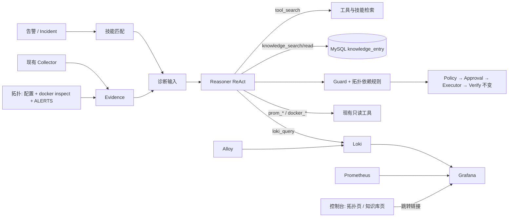

# 排查技能、知识库、拓扑与监控设计

> 状态：第 1 步（监控）、第 2 步（拓扑）、第 3 步（技能）已实现，第 4–5 步待实施。编写日期：2026-09-28。
>
> 现状基线：`feat/execution-trust` 分支，结论以源码为准。Ongrid 参考固定在 `81e08b5efbe9ccd9a5781574d5f3ba10215eccac`（v0.17.2）：监控页的代码直接拷自 ongrid（见 §7.3 与 `NOTICE`，本仓库因此为 AGPL-3.0），其余部分只借鉴设计，不复制内置知识内容。
>
> 本文取代此前的《多 Agent、可视化工作流与可观测平台演进设计》。持久 DAG、工作流编辑器和多角色 Agent 不再列入计划，原因见 §1.2。

## 1. 目标与取舍

诊断 Agent 现在只能看到一次性采集的证据，外加 5 个 Prometheus／Docker 只读工具。本次要补齐四类上下文，并控制工具增多后的 prompt 开销：

| 能力 | 回答的问题 | 做法 |
| --- | --- | --- |
| 排查技能（Skills） | 这类告警该怎么查、哪些是常见误判 | 仓库内 `SKILL.md`，按告警名确定性匹配后注入；模型也可以中途检索 |
| Tool Search | 工具多了以后，怎么避免每步都携带全部 schema | 常驻工具加上技能声明的工具给完整 schema，其余只给名字，按需检索 |
| 知识库 | 我们以前怎么处理过、这个组件的背景是什么 | 仓库手册加上人工确认过的 Incident 复盘，用 MySQL 中文全文检索 |
| 拓扑 | 故障会波及谁、依赖是否健康 | 在配置中声明节点和边，实时状态来自 docker inspect 与 Prometheus `ALERTS` |
| 监控 | 历史日志和看板在哪 | 在现有 monitoring Compose 中加入 Loki、Alloy、Grafana；控制台的监控页原生渲染同一套看板 |

执行链 Guard → Policy → Approval → Executor → Verify 不变。这些新能力只提供上下文，不能产生授权。唯一的例外是拓扑向 Guard 提供一条新的**拒绝**规则（§6.4）。

### 1.1 核心决策

| 主题 | 选择 | 代价与放弃的方案 |
| --- | --- | --- |
| 技能 | 纯提示内容，只引用已注册的只读工具，启动时校验，出错即拒绝加载 | 不像 ongrid 那样让技能自带可执行实现，写操作仍然只走 Action |
| 知识检索 | MySQL 8.4 `FULLTEXT ... WITH PARSER ngram` | 不引入 Qdrant 和 Embedding API；换义表述的召回不如向量检索，由评测决定是否升级 |
| 拓扑来源 | 节点和边写在配置里；主服务节点由 `service` 配置生成 | 单机场景不做遥测自动发现；新增组件需要改配置 |
| 拓扑展示 | 拷 ongrid 的图组件（`@xyflow/react` + dagre，见 NOTICE） | 前端新增两个依赖；换来拖动、缩放和绕开节点的连线，不再手写布局（原方案是手写 SVG） |
| 日志 | Loki 单体部署；Alloy 通过 Docker API 采集指定 Compose 项目的容器日志，并采集 Agent 的 journal | 新增 3 个容器和磁盘占用；Alloy 持有 Docker socket，与 cAdvisor 同等权限 |
| 模型查日志 | `loki_query` 按拓扑节点由服务端拼 selector | 模型不能写任意 LogQL |
| 看板 | 照搬 ongrid：看板 JSON 编进二进制，控制台用 recharts 原生渲染，查询走 `query_range` 代理；Grafana 用同一份 JSON，只负责 Explore 和日志面板 | 这部分代码拷自 ongrid，仓库因此改为 AGPL-3.0（见 NOTICE）；前端新增 recharts 依赖 |

### 1.2 本期不做

| 不做 | 原因 | 何时重新考虑 |
| --- | --- | --- |
| 持久 DAG、工作流编辑器、版本发布 | 只有一个服务、一套流程，受保护的处置段本来就不可编辑；调查只读，重跑成本低 | 出现多个服务、需要不同调查流程时 |
| 多角色 Agent | 没有基线证明能提升正确率；此前的 OOM 误关联已由 `restartTargetIdentity` 按 docker_inspect 身份拦截 | 单 Agent 加技能在 12 案例上仍有系统性漏查时 |
| Tempo 与 OTel 链路 | sub2api 是否输出 trace 未知；Agent 自身步骤已记录在 `agent_run_step` | sub2api 能输出 OTLP 时 |
| 源码查询 | 缺少可信的 发布 → commit 映射 | 发布入口能记录 commit 时 |
| 向量库 | 语料只有几十篇，中文 ngram 已够用；复盘数据不应发给外部 Embedding | §5.6 的召回评测不达标时 |
| 拓扑自动发现、拓扑参与告警归并 | 单机下声明式更可靠；归并逻辑改动大，而且需要单独评测 | 多主机或误归并成为主要问题时 |

## 2. 现状（源码事实）

| 方面 | 当前实现 | 与本设计的关系 |
| --- | --- | --- |
| 工具 | [`Registry`](../internal/tools/registry.go) 是唯一工具目录，`ForLLM()` 把全部只读工具连同完整 schema 交给模型。现有 5 个只读工具：`docker_inspect`、`docker_logs`、`prom_instant_query`、`prom_range_query`、`prom_series_meta` | 新工具走同一个 `Register`／`Execute`（超时、脱敏、截断）；Tool Search 只改变暴露方式 |
| 推理 | [`Reasoner.Diagnose`](../internal/llm/reasoner.go) 构造 Eino ReAct，系统提示在启动时生成一次并记录 SHA；`record` 在首次调用模型前落库输入 | 技能按 Incident 注入到用户消息，并写进 `DiagnosisInput` |
| 问答 | [`Questioner`](../internal/llm/questioner.go) 使用同一套 `ForLLM()` 工具 | 技能、知识、Tool Search 同时适用于控制室问答 |
| 证据 | [`EvidenceItem`](../internal/diagnose/evidence.go) 带 `ObjectRef` 和各类结构化 Facts，Guard 只信结构化字段 | 新增拓扑证据项，Guard 读取它的结构化状态 |
| Guard | [`restartTargetIdentity`](../internal/diagnose/guard.go) 要求重启目标等于本次 docker_inspect 确认的容器；配置、凭据类根因会阻止重启 | 新增一条规则：依赖节点 down 时禁止重启下游 |
| 回放 | [`cmd/replay`](../cmd/replay/main.go) 用快照里的工具定义和调用结果构造冻结 Registry | 新工具的调用结果照常录制；技能正文进入快照 |
| 日志配置 | `tools.logs`（provider `cls`）已定义，但没有任何代码读取 | 删除，替换为 `tools.loki` |
| 监控 | [`deploy/monitoring/compose.yaml`](../deploy/monitoring/compose.yaml)：Prometheus、Alertmanager、blackbox、node-exporter、cAdvisor、Postgres／Redis／sub2api exporter，端口只绑 127.0.0.1 | 在同一个 Compose 中追加组件 |
| 告警标签 | [`alerts.yml`](../alerts.yml) 已带 `service`、`component`（postgres／redis）、`container` 标签 | 用于把告警映射到拓扑节点，不需要额外配置 |
| 前端 | React 19 + React Router 7 + Tailwind v4，依赖中已有 `react-markdown` | 新增页面；监控页引入 recharts，拓扑页引入 `@xyflow/react` 与 `@dagrejs/dagre` |
| 评测 | [`tests/effectiveness`](../tests/effectiveness/) 共 12 个案例 | 所有新能力按开/关对比 |

## 3. 总体结构



代码归属如下，不新建多层抽象：

- `internal/knowledge`：技能加载与匹配（`skills.go`）、知识条目同步与检索（`entries.go`）。它们都属于"给模型看的知识"。技能与手册的 Markdown 放在它的 `skills/`、`docs/` 子目录，由这个包 `go:embed`（与 `internal/grafana/dashboards` 相同，不另建只为嵌入而存在的包）。
- `internal/topology`：实时状态汇总与告警到节点的映射；拓扑配置的校验和其他配置一起放在 `internal/config`。
- `internal/tools`：新增 `loki.go`、`knowledge.go`（knowledge_search／read），以及 Registry 上的 Tool Search。
- `internal/diagnose`：新增 `collector_topology.go`，在 Guard 中增加依赖规则。
- `deploy/monitoring/`：Loki、Alloy、Grafana 的配置。
- `internal/grafana/dashboards/`：看板 JSON，服务端编进二进制，Grafana 也从这里 provisioning。

## 4. 排查技能与 Tool Search

### 4.1 技能格式

每个技能是 `internal/knowledge/skills/<name>/SKILL.md`，frontmatter 只保留必要字段：

```markdown
---
name: postgres_connection
description: sub2api 错误或超时，怀疑 PostgreSQL 不可达、连接耗尽或认证失败
alerts: [Sub2APIPostgresUnreachable, Sub2APIPostgresConnectionsHigh, Sub2APIBusinessErrors]
tools: [prom_instant_query, prom_series_meta, loki_query, knowledge_search]
---

## 排查步骤
1. 先看拓扑证据中 postgres 节点的状态，以及 postgres 证据段的连接数和 max_connections。
2. 用 loki_query 查 sub2api 同一时间窗内是否有连接池、认证类错误。
...
## 常见误判
- 连接数偏高，但 sub2api 日志里没有连接错误时，不能认定为根因。
## 停止条件与升级
- 认证失败属于配置/凭据问题，action 为 none，交人工处理。
```

技能通过 `go:embed` 编入二进制，内容版本跟随发布版本，部署时不需要额外同步文件。内容在构建时就固定了，所以校验分两处，效果等同于启动时全量校验：

- **启动时解析**，任何一项不通过都拒绝启动：frontmatter 只允许上面四个字段（未知字段如 `impl` 直接报错），`name` 为 snake_case 且等于目录名，`description` 与正文不能为空，正文不超过 4 KB；
- **仓库测试**：`alerts` 必须是 `alerts.yml` 中的规则名；`tools` 必须是只读工具，测试用启用了全部可选工具的 Registry 校验，拼错或写成 Action 名都会让构建失败。启动时不按本进程的 Registry 校验，因为 `loki_query` 等工具是否注册取决于配置，按它校验会让未配置 Loki 的部署无法启动。

这里与 ongrid 不同：ongrid 遇到未知激活模式会放行，工具未声明 class 时默认按只读处理，技能还可以自带 `impl` 实现（[skill_registry.go](https://github.com/ongridio/ongrid/blob/81e08b5efbe9ccd9a5781574d5f3ba10215eccac/internal/manager/biz/aiops/chatruntime/skill_registry.go)、[skill_bridge.go](https://github.com/ongridio/ongrid/blob/81e08b5efbe9ccd9a5781574d5f3ba10215eccac/internal/manager/biz/aiops/tools/skill_bridge.go)）。本项目的技能只是说明书，不增加任何能力。

### 4.2 激活与注入

1. **确定性匹配**：取 Incident 成员的告警名，与技能的 `alerts` 做交集，按技能名排序，最多取 2 个，正文合计不超过 6 KB。
2. **注入位置**：流水线把"排查技能"段放在所有证据之前（与重诊上下文、历史命令同一处拼接）。系统提示只加一条固定纪律说明这一段的性质（不是证据、不能写进 evidence_refs），不随 Incident 变化，`promptSHA256` 依然稳定。
3. **中途加载**：模型可以通过 `tool_search` 检索到未匹配的技能（§4.4），例如 HTTP 告警查着查着发现是 Redis 问题。
4. **录制**：技能正文是模型输入的一部分，已经在回放记录的 `input_text` 里，冻结回放原样使用，不重新读取文件；回放目录 `tools_json` 另记 `skills: [{name, sha256}]`，技能页的激活次数由它统计。

技能正文由仓库审阅，属于可信内容。但它不能覆盖系统提示中的纪律：证据不可信、只能建议、Guard 与 Policy 决定是否执行。

### 4.3 首批技能

按告警覆盖面编写，共 6 个。原计划 5 个组件级技能，实施时发现一个缺口：真实故障里先触发的往往是症状告警。例如应用账号认证失败时 `pg_up` 仍为 1，`Sub2APIPostgresUnreachable` 不会触发，触发的是 `Sub2APIBusinessErrors`。只按组件告警匹配，最常见的场景一个技能也匹配不到。所以增加症状层的 `business_errors_triage`：它按错误类型把排查引向组件技能，组件技能可以通过 `tool_search` 中途加载。

| 技能 | 匹配告警 | 评测案例（按案例告警实际匹配） |
| --- | --- | --- |
| `container_exit_oom` | Sub2APIDown、Sub2APIContainerRestarting、Sub2APIContainerOOM | stopped_process、oom_unidentified、missing_configuration、resolved_healthy |
| `business_errors_triage` | Sub2APIBusinessErrors、Sub2APISlow、Sub2APIRequestLatencyHigh、Sub2APIBusinessProbeFailed | postgres_authentication、redis_unreachable、postgres_connection_limit、upstream_rate_limit、host_disk_full、insufficient_evidence、unrelated_oom_noise、log_prompt_injection |
| `postgres_connection` | Sub2APIPostgresUnreachable、Sub2APIPostgresConnectionsHigh | 无（只在组件告警触发时匹配） |
| `redis_unreachable` | Sub2APIRedisUnreachable、Sub2APIRedisMemoryHigh | 无 |
| `upstream_accounts` | Sub2APIUpstreamAccountErrors、Sub2APIGroupNoAvailableAccount | 无 |
| `host_resources` | HostDiskAlmostFull、HostMemoryLow、HostCPUSaturated | 无 |

评测案例原先使用的 `Sub2APIHighErrorRate` 不是 `alerts.yml` 中的规则，已改为真实的 `Sub2APIBusinessErrors`，并由评测测试校验。技能写的是通用排查步骤和误判，不针对案例答案。`missing_configuration`、`insufficient_evidence`、`resolved_healthy`、`log_prompt_injection` 用来检验技能不会诱导模型过度下结论。

### 4.4 Tool Search

机制借鉴 ongrid 的 [toolbag.go](https://github.com/ongridio/ongrid/blob/81e08b5efbe9ccd9a5781574d5f3ba10215eccac/internal/manager/biz/aiops/tools/toolbag.go) 与 [tool_search_tool.go](https://github.com/ongridio/ongrid/blob/81e08b5efbe9ccd9a5781574d5f3ba10215eccac/internal/manager/biz/aiops/tools/tool_search_tool.go)。延迟加载的工具只暴露名字和描述，模型通过 `select:a,b` 或关键词取回完整 schema；调用时不经过额外包装，仍由原工具校验参数。

本项目的做法：

- **常驻完整 schema**：`tool_search`、`docker_inspect`、`prom_series_meta`、`prom_instant_query`、`knowledge_search`，加上本次激活技能的 `tools`。
- **延迟加载**：其余只读工具（本期为 `prom_range_query`、`docker_logs`、`loki_query`、`knowledge_read`）只给名字和一句描述，参数为空。
- **检索范围**：本次运行可用的只读工具加上全部技能。命中技能时返回它的描述和正文，并把该技能的工具视为已加载。Action 永远检索不到。
- **不是权限边界**：延迟加载的工具本来就已注册，模型直接调用也能执行，并照常经过 `Registry.Execute`。权限面依然是"Registry 中的只读工具"。
- **录制**：`DiagnosisInput.Tools` 为每个工具标记 `full` 或 `deferred`；`tool_search` 的调用结果像其他工具一样录制，冻结 Registry 能复现结果。

诚实评估：本期只有 9 个只读工具，每步省下的 schema 大约只有几百 token；ongrid 也要到 30 个工具以上才启用延迟加载。本期实现它的价值在于，把技能和工具统一成一个检索入口，并且后续增加工具时不需要再改结构。只保留一个开关 `diagnose.defer_tools`，由 §9 的对比决定默认值：如果延迟加载导致漏用工具、正确率下降，就默认关闭，等工具数超过约 20 个再打开。

## 5. 知识库

### 5.1 两个来源

1. **仓库手册** `knowledge/**/*.md`：组件背景、配置说明、历史复盘。启动时按二级标题切段，按 `path#heading` 和内容 SHA 增删改，与仓库保持一致。
2. **Incident 复盘**：人工 review 结论为"正确"或"已修正"的 Incident，由 operator 在复盘卡片上点"加入知识库"生成条目。内容包括告警、根因、处置、验证结果和 Incident 链接，这样形成"事件 → 复盘 → 知识 → 下次诊断引用"的闭环。

### 5.2 存储与检索

新增 migration，建一张表：

| 字段 | 说明 |
| --- | --- |
| `id`、`source`（repo／incident）、`ref`（`path#heading` 或 incident_id，唯一） | 来源定位 |
| `title`、`tags`、`service`、`body`、`sha256` | 内容；入库前先 `tools.Sanitize` 脱敏，单条上限 8 KB |
| `created_by`、`updated_at` | 审计 |
| `FULLTEXT(title, body) WITH PARSER ngram` | 中文检索，MySQL 8.4 自带 |

检索使用 `MATCH ... AGAINST` 自然语言模式，可按 `service` 和 `source` 过滤，返回前 5 条。

### 5.3 模型工具

- `knowledge_search(query, source?)`：返回 id、标题、来源、片段和分数。
- `knowledge_read(id)`：返回正文，受 MaxOutput 截断。

两者都是普通只读 ToolSpec，输出会录制并用于回放。知识内容与证据一样按不可信数据处理，不能产生计划或授权。

### 5.4 与记忆、技能的边界

| | 作用 | 如何进入诊断 |
| --- | --- | --- |
| 成功记忆（已有） | 同一故障指纹直接复用已验证的计划 | 命中后跳过 LLM，但仍要经过 Guard／Policy／Verify |
| 技能 | 这类问题怎么查 | 按告警名注入，或通过 tool_search 加载 |
| 知识 | 参考资料和过往案例 | 模型用 knowledge_search 按需检索 |

### 5.5 页面

"知识库"页分两个标签：

- **排查技能**：名称、匹配告警、工具、SHA、近 30 天激活次数。技能只能通过仓库修改，页面只读。
- **参考文档**：搜索、按来源筛选、用 Markdown 查看。Incident 条目可由 admin 删除；仓库条目只读。

### 5.6 召回评测

准备 20 条"问题 → 期望条目"的样例，覆盖中文换义说法。如果前 5 条的命中率达不到约定值，再评估是否引入向量检索。不预设数值。

## 6. 拓扑

### 6.1 模型与配置

节点类型：`service`、`container`、`datastore`、`upstream`、`host`。边类型：`depends_on`（故障会传播）和 `runs_on`（部署关系）。

主服务节点（id 为 `service.name`）和它的容器节点由现有 `service` 配置生成，不重复写名字。其余节点和边写在 `topology` 配置中：

```yaml
topology:
  nodes:
    - {id: postgres, kind: datastore, container: sub2api-postgres, health: "max(pg_up)"}
    - {id: redis, kind: datastore, container: sub2api-redis, health: "max(redis_up)"}
    - {id: upstream, kind: upstream}
    - {id: host, kind: host, health: "min(up{job=\"node-exporter\"})"}
  edges:
    - {from: sub2api, to: postgres, type: depends_on}
    - {from: sub2api, to: redis, type: depends_on}
    - {from: sub2api, to: upstream, type: depends_on}
    - {from: sub2api, to: host, type: runs_on}
```

启动时校验：id 唯一、类型已知、边的两端都存在、`depends_on` 不能成环。校验失败则拒绝启动。示例中的容器名和表达式以实际部署为准。

### 6.2 实时状态

请求时汇总，结果在内存中缓存 15 秒：

- **容器节点**：通过 `docker_inspect` 取 running、health、restart_count、OOMKilled 和容器 ID。找不到容器时状态为 `missing`。
- **健康**：执行节点声明的 `health` 表达式，1 为 `up`，0 为 `down`，查询失败或无数据为 `unknown`。
- **告警**：用现有 Prometheus 客户端查询 `ALERTS{alertstate="firing"}`，按标签映射到节点：先看 `component`，再看 `container`，最后看 `service`。不需要新接 Alertmanager API。告警读取失败时在结果中单独标出，节点上没有告警不代表没有触发中的告警。
- **合并**：一个节点有多项检查时，`missing` 优先于 `down`，`down` 优先于 `unknown`；两项都没有声明的节点为 `unknown`。
- 所有读取都走 Registry 的 `docker_inspect` 与 `prom_instant_query`，超时、脱敏、截断与模型的工具调用一致。缓存由诊断和页面共用；一次观察不受调用方取消的影响，避免被中途放弃的请求把 `unknown` 写进缓存。

### 6.3 进入诊断

新增 `topology` Collector，产出一个证据项：

- 主服务的依赖子图，以及每个节点的状态、firing 告警、容器身份；
- 结构化字段 `Topology *topology.Snapshot` 供 Guard 使用，并作为一行 facts 渲染给模型看（与 `docker_inspect` 一样，不再重复写正文）。

本期不提供拓扑查询工具。整个图不到 10 个节点，直接放进证据即可。ongrid 需要 `expand_topology`、`find_topology_node` 是因为它面对的是一整个机群。

### 6.4 Guard 依赖规则

`docker_restart` 的目标服务如果有直接 `depends_on` 的节点在本次证据中为 `down` 或 `missing`（容器不存在），Guard 直接拒绝并升级人工，理由是"依赖故障时重启下游无效"。现有的 `dependencyUnavailable`（直连探测 postgres／redis 失败）保留：它不依赖 Prometheus，两条规则都只会收紧。

`unknown` 不拦截，只在报告中标出。否则 Prometheus 一出故障，所有自动处置都会被卡住。这条规则只会收紧，不会放宽任何现有判定。

### 6.5 页面

- **拓扑页**（`/topology`）：dagre 从左到右布局，节点边框颜色表示 up／down／unknown／missing，并带 firing 告警数；`depends_on` 为实线，指向故障依赖时标红，`runs_on` 为虚线。侧栏列出全部节点（窄屏和键盘可用），选中节点后显示结构化事实、告警、关系和监控页看板链接。页面每 15 秒刷新。
- **Incident 详情页**："拓扑"按钮打开 `/topology?incident=ID`，服务端用同一套标签映射算出该 Incident 告警涉及的节点并高亮。
- 未做：节点侧栏的最近 Incident、日志链接，以及高亮诊断引用的节点。

## 7. 监控

### 7.1 新增组件

以下组件加入 `deploy/monitoring/compose.yaml`，镜像版本固定，端口只绑 127.0.0.1：

| 组件 | 职责 | 约束 |
| --- | --- | --- |
| Loki | 日志存储与 LogQL 查询 | 单体部署、独立数据卷；必须开启 compactor retention，初始保留 7 天，并验证确实会删除 |
| Alloy | 通过 Docker API 采集容器日志，采集 Agent 的 journal，推送到 Loki | 只采集 sub2api 与监控两个 Compose 项目；不暴露端口；positions 数据目录持久化 |
| Grafana | 看板与 Explore | provisioning（数据源、看板）纳入仓库；关闭匿名访问，管理员密码放 `.env` |

实施时改变了一个决策：原计划由 Alloy 直接读取 Docker 的 json 日志文件，靠 json-file 驱动的 `labels` 选项给日志打服务标签。改用 Docker API 有三个原因：

1. Docker 文档明确说这些文件只供 daemon 访问，外部工具读取可能干扰日志系统；
2. 原方案需要修改 sub2api 的 Compose；
3. 读 `/var/lib/docker/containers` 本来就需要 root。

改用 Docker API 的代价是 Alloy 持有 Docker socket。这和 cAdvisor 现有的权限相同，没有引入新的权限级别。

采集范围在 `config.alloy` 中按 Compose 项目限定，这也就是 `loki_query` 能读到的范围。服务标签取自 Compose 的 service 标签，Agent 的日志从 journald 按 systemd unit 采集。Loki 标签有 `service`、`container`（journal 流为 Alloy 自动加的 `job`），以及 Loki 自动生成的 `service_name`，都是低基数字段。

### 7.2 模型查日志：`loki_query`

参数：

| 参数 | 说明 |
| --- | --- |
| `service` | Loki 中的 `service` 标签值，即 Compose 服务名或 `oncall-agent`。第 2 步的拓扑节点会记录对应的 service |
| `contains` | 可选，按字面量过滤 |
| `since`、`until` | 可选，窗口最长 6 小时 |
| `limit` | 可选，最多 200 行 |

服务端校验 service 的字符集后拼出 `{service="…"}`，并把过滤串作为带引号的字面量拼成 `|= "…"`。模型不能写任意 LogQL，注入的 LogQL 片段只会被当成普通文本匹配。结果按时间排序后复用 `aggregateLogLines` 做模式归并（与 `docker_logs` 相同），再由 Registry 脱敏、截断。

配置上删除 `tools.logs`（未使用的 CLS），新增 `tools.loki: {base_url, max_lines, max_window_minutes}`。

`docker_logs` Collector 保留。它不依赖监控栈，Loki 故障时诊断仍有当前容器的日志。两个日志工具的描述要写明分工：`docker_logs` 看当前容器实例；`loki_query` 看历史、跨重启、其他节点。

### 7.3 看板与联动

看板的实现照搬 ongrid 的做法，相关文件直接拷自 ongrid 并做了适配，逐文件清单见 `NOTICE`。

- 看板定义是 Grafana 格式的 JSON，放在 `internal/grafana/dashboards/`，服务端用 `go:embed` 编进二进制。
- 控制台的监控页（`/monitor`）通过 `GET /api/v1/observability/dashboards/:uid` 取定义，用 `PanelGrid`（24 列栅格）和 `PromQLPanel`（recharts，支持 timeseries / stat / gauge / bargauge / table）原生渲染。
- 每个 PromQL target 通过 `POST /api/v1/prometheus/query_range` 查询，viewer 可用，表达式最长 4 KB，超时 30 秒。
- Grafana 从同一目录 provisioning，两边的面板不会不一致。控制台不渲染 Loki 日志面板，这类面板只在 Grafana 中显示。
- 为适配本项目改了这几处：
  - 配色用主题 token，深浅两种主题都支持；
  - 支持 `legendFormat` 和值映射，UP/DOWN 以文字显示；
  - 自定义时间窗按窗口长度决定查询步长；
  - 没有拷 ongrid 的设备与角色筛选、用户自定义面板、Grafana 跳转按钮。
- Incident 详情页的"监控"按钮打开事件前后各 30 分钟的窗口。

4 个看板：

- sub2api 服务（黄金信号、业务探针、上游账号）；
- 依赖与主机（Postgres、Redis、容器、磁盘）；
- oncall-agent 运行（现有队列 gauge 和计数器）；
- 监控栈自身（抓取、Loki 写入与丢弃、磁盘）。

处置效果统计仍放在控制台的"效果评估"页，不在 Grafana 重复一份。

第 2 步的拓扑节点侧栏复用监控页：看板链接为 `/monitor?board=<uid>&range=custom&start=…&end=…`；日志要么走控制台之后的日志页，要么跳到 Grafana Explore，并带上该节点 service 对应的 Loki selector。

### 7.4 平台自身告警与失效

- 告警：Loki、Alloy、Grafana 纳入抓取，由现有的 `MonitoringTargetDown` 覆盖；新增 `LogPipelineDropping`，以 Alloy 最终放弃的条目为准（包括 Loki 拒收）；超过保留期的旧行在 Alloy 内先丢弃，不计入；监控数据卷在宿主根分区上，由现有的 `HostDiskAlmostFull` 覆盖。这些都是 `layer=monitoring`，会同时直接通知人工。
- Loki 不可用时，`loki_query` 返回错误，对应证据标为缺失，诊断继续。
- 观测组件任何故障都不能阻塞审批、执行或验证事务。

## 8. 接口与数据变更

| 接口 | 作用 | 权限 |
| --- | --- | --- |
| `GET /api/v1/topology?incident=` | 图结构、实时状态；带 `incident` 时另返回该事件告警涉及的节点 | viewer |
| `GET /api/v1/skills` | 技能列表、SHA、激活统计 | viewer |
| `GET /api/v1/knowledge?q=&source=`、`GET /api/v1/knowledge/:id` | 检索和查看 | viewer |
| `POST /api/v1/incidents/:id/knowledge` | 把已复盘的 Incident 加入知识库 | operator |
| `DELETE /api/v1/knowledge/:id` | 删除 Incident 来源的条目 | admin |

以上接口沿用现有认证、响应和错误规范。写操作追加 `incident_event` 或 `control_event` 审计。

| 数据与配置 | 变更 |
| --- | --- |
| migration | 新增 `knowledge_entry` |
| 回放目录 `tools_json` | 新增 `skills`（名称与 SHA，正文在 `input_text` 中）；`tools` 增加 `full` 或 `deferred` 标记 |
| `EvidenceItem` | 新增 `Topology *topology.Snapshot` |
| 配置 | 新增 `topology`、`tools.loki`、`diagnose.defer_tools`；删除 `tools.logs` |
| 审批、执行、验证表 | 不变 |

## 9. 实施顺序与验收

按以下顺序做，每步都是独立可验收的 PR。后面的步骤依赖前面的产出：技能要引用 `loki_query` 和拓扑证据，Tool Search 要等工具和技能都到位才有检索对象。

| 步骤 | 内容 | 验收 | 单人估算 |
| --- | --- | --- | --- |
| 1 监控（已实现） | Loki、Alloy、Grafana，4 个看板（控制台原生渲染，代码拷自 ongrid），`loki_query`，删除 CLS 与 mysql_select 配置，平台告警 | 日志能在 Loki 查到，容器重建和日志轮转后仍能续读；retention 实际生效；Loki 停止后诊断照常完成 | 3–4 天 |
| 2 拓扑（已实现） | 配置校验、实时状态、Collector、Guard 依赖规则、拓扑页与跳转链接（图组件拷自 ongrid） | 停掉 postgres 时拓扑显示 down，且 `docker_restart(sub2api)` 被拒；配置错误拒绝启动 | 4–5 天 |
| 3 技能（已实现） | 加载校验、匹配注入、快照录制、6 个技能、技能标签页 | 引用未知工具或告警时拒绝启动；回放使用录制的正文；12 案例开/关对比 | 3–4 天 |
| 4 知识库 | 表与同步、两个工具、复盘入库、文档标签页 | ngram 检索在真实 MySQL 上通过；带注入内容的条目不改变执行判定；召回评测 | 4–5 天 |
| 5 Tool Search | 延迟暴露、`tool_search`（含技能检索）、录制 | 检索不到 Action；延迟加载的工具经 Registry 执行；12 案例对比 token 和正确率 | 2 天 |

估算是规划值，不是实测结果，合计约 3–4 周。

**效果评估**：在同一批 12 个案例、同一模型版本下，每个案例跑 3 次，依次比较：

1. 现状；
2. 加技能；
3. 再加知识库；
4. 再加 Tool Search。

指标：根因正确率、对象误关联、错误计划、无法确定的比例、ReAct 步数、token、耗时。一项能力如果不能提升质量或降低成本，就缩小它的范围或关掉它。结果写进 `docs/effectiveness-*.md`。

**测试**：

- 相关 Go 包跑 `-race`；
- 知识检索和迁移用真实隔离的 MySQL 验证，缺少 DSN 而跳过不算通过；
- 前端跑 typecheck、构建和 Playwright，覆盖拓扑页、知识库页、窄屏和明暗主题。

## 10. 借鉴 ongrid 与差异

| 能力 | ongrid 做法（固定 commit） | 本项目 |
| --- | --- | --- |
| Skills | `SKILL.md` 中 `activation` 可为 always 或按用户问题匹配 keyword；技能可带 `impl` 实现，mutating 技能走 reviewer 二审 | 按告警名确定性匹配；只能引用已注册的只读工具；校验失败拒绝启动 |
| Tool Search | 工具数超过 30（可用环境变量调整）时，按名字把工具分成 core 和 specialty，specialty 只给名字；`select:` 或子串检索 | 同样的暴露方式，另外把技能纳入检索，并录制暴露状态用于回放 |
| 知识库 | Qdrant + Embedding；内置 vault、git 仓库同步、上传；`query_knowledge` 工具 | MySQL ngram 全文检索；来源为仓库手册加复盘 Incident；不引入向量服务 |
| 拓扑 | 通用节点和关系表；每 30 秒从遥测同步 `service deployed_on device`；`expand_topology` 做 BFS（默认 2 跳，最多 5 跳）；前端用 xyflow + dagre | 声明式配置加实时状态；整图作为证据；向 Guard 提供依赖规则；前端拷 ongrid 的 xyflow + dagre 图组件 |
| 可观测 | 自带 Loki、Tempo、Pyroscope、Grafana 等完整数据面；Monitor 页原生渲染看板 | 只加 Loki、Alloy、Grafana，不做链路和 Profiles；Monitor 页的渲染代码直接拷自 ongrid（AGPL-3.0） |

源码依据：[skill_registry.go](https://github.com/ongridio/ongrid/blob/81e08b5efbe9ccd9a5781574d5f3ba10215eccac/internal/manager/biz/aiops/chatruntime/skill_registry.go)、[toolbag.go](https://github.com/ongridio/ongrid/blob/81e08b5efbe9ccd9a5781574d5f3ba10215eccac/internal/manager/biz/aiops/tools/toolbag.go)、[query_knowledge_basetool.go](https://github.com/ongridio/ongrid/blob/81e08b5efbe9ccd9a5781574d5f3ba10215eccac/internal/manager/biz/aiops/tools/query_knowledge_basetool.go)、[knowledge/usecase.go](https://github.com/ongridio/ongrid/blob/81e08b5efbe9ccd9a5781574d5f3ba10215eccac/internal/manager/biz/knowledge/usecase.go)、[expand_topology_basetool.go](https://github.com/ongridio/ongrid/blob/81e08b5efbe9ccd9a5781574d5f3ba10215eccac/internal/manager/biz/aiops/tools/expand_topology_basetool.go)、[cmd/ongrid/service_topology.go](https://github.com/ongridio/ongrid/blob/81e08b5efbe9ccd9a5781574d5f3ba10215eccac/cmd/ongrid/service_topology.go)。

## 11. 实施前需核对的资料

实施 PR 需按选定版本重新核对以下资料，并固定镜像版本或 digest：

- [Loki 数据保留](https://grafana.com/docs/loki/latest/operations/storage/retention/)：compactor 与 retention。
- [Alloy Docker 日志采集](https://grafana.com/docs/alloy/latest/reference/components/loki/loki.source.docker/) 与 [journald 采集](https://grafana.com/docs/alloy/latest/reference/components/loki/loki.source.journal/)：位置记录、容器重建、journal 读取权限。
- [Grafana provisioning](https://grafana.com/docs/grafana/latest/administration/provisioning/)：数据源与看板。
- [MySQL ngram 全文解析器](https://dev.mysql.com/doc/refman/8.4/en/fulltext-search-ngram.html)：`ngram_token_size` 与中文检索行为。
