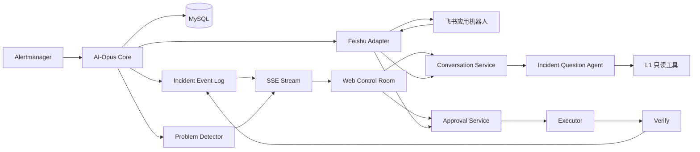
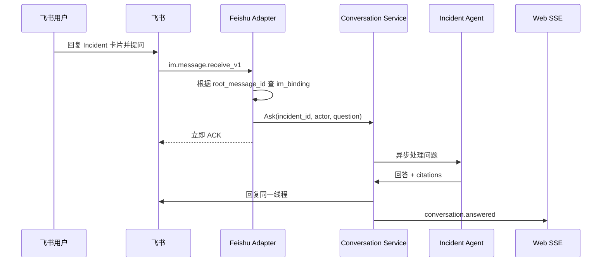

# Web 控制台与飞书协同接入实现方案

> 状态：Proposed
>
> 目标：为 AI-Opus 增加可实时观察、可回放、可询问、可审批的 Web 控制台，并将飞书接入为通知、审批与 Incident 对话入口。Web 与飞书共用同一套 Incident、Run、Approval、Conversation 状态，禁止形成两套独立流程。
> 当前 V1 实现：控制台公开读写，动作统一以 `anonymous` 审计；本文中的 OAuth、会话和 CSRF 段落保留为后续可选加固方案。

## 1. 背景

AI-Opus 当前已经具备以下后端闭环：

```text
Alertmanager
  → 摄入与去重
  → Incident 归并
  → Evidence 采集
  → LLM 诊断
  → Guard / Policy
  → Approval
  → Executor
  → Verify
  → Retry / Escalation / Memory
```

现有可观测与人工操作主要依赖：

- `/metrics`；
- Incident、Approval 查询 API；
- `agent_run` / `agent_run_step` 数据；
- IM webhook 文本通知；
- curl 审批命令；
- 服务端日志和数据库查询。

这些能力可以证明流程存在，但不能让值班人员快速回答以下问题：

- Agent 当前运行到哪一步；
- 哪个 Evidence Collector 失败；
- LLM 调用了哪些工具；
- Guard 为什么改写计划；
- Policy 为什么降级人工审批；
- 审批等待谁处理、何时过期；
- 动作执行后 Verify 为什么失败或不可判定；
- 当前问题是业务故障、Agent 故障还是外部依赖故障；
- 值班人员如何基于当前 Incident 继续询问 Agent。

本方案把 Web 定位为主控制台，把飞书定位为移动协同入口，两端使用同一业务服务和同一状态机。

## 2. 当前实现基线

### 2.1 已有能力

| 能力 | 当前实现 |
|---|---|
| Incident 列表和详情 | `internal/api/incident.go` |
| 手动重诊 | `POST /api/v1/incidents/{id}/diagnose` |
| Approval 列表和决策 | `internal/api/approval.go` |
| 审批状态机 | `internal/approval/service.go`、`internal/store/approval.go`、`internal/store/execution.go` |
| 执行和 Verify | `internal/approval/executor.go`、`internal/diagnose/verify.go` |
| Run 和 Step 持久化 | `internal/store/models.go` 中的 `AgentRun`、`AgentRunStep` |
| 出站 IM 通知 | `internal/notify/notifier.go` |
| 飞书通知 | 自定义机器人 webhook，当前只发送纯文本 |
| 进程指标 | `/metrics` |

### 2.2 主要缺口

- 没有 Run、Step、历史 Evidence 的正式查询 API；
- 没有跨摄入、诊断、审批、执行、Verify 的统一事件流；
- 没有当前问题读模型，无法稳定展示“Agent 存在的问题”；
- 没有 SSE 或其他实时状态推送；
- 没有 Incident 绑定的对话数据模型；
- 飞书仅能出站发送文本，不能接收互动卡片回调和用户问题；
- Web 浏览器不能安全使用共享 `AUTH_TOKEN` 完成审批；
- Approval 缺少持久化的决策时间、决策原因和决策来源；
- API 直接返回 Store Model，缺少稳定 DTO、分页和响应大小限制。

## 3. 目标与非目标

### 3.1 目标

1. Web 实时展示完整 Incident 流程和每个阶段的状态；
2. 显示当前开放问题、错误、阻塞原因和责任归属；
3. 支持查看 Run、Step、Evidence、工具调用、Guard、Policy 和 Verify；
4. 支持基于当前 Incident 询问 Agent，回答必须引用证据或 Run Step；
5. 支持 Web 和飞书审批，两个入口共用同一审批状态；
6. 支持飞书通知、互动卡片、消息线程问答和结果回流；
7. 支持服务重启后完整回放流程、对话、审批和问题；
8. 飞书或 Web 故障不能阻断核心诊断、执行和 Verify。

### 3.2 非目标

- 不让聊天直接执行任意工具；
- 不向 LLM 暴露 Docker Socket、数据库管理账号或任意 shell；
- 不新增 Redis、MQ 或独立事件总线；
- 不把 Langfuse 作为业务状态和审计的唯一来源；
- 不在第一阶段建设多租户、复杂 RBAC 或完整运营分析平台；
- 不让前端直连 MySQL、Prometheus、Docker、Redis 或 PostgreSQL；
- 不复制一套飞书专用 Approval 或 Conversation 状态机。

## 4. 总体架构



核心原则：

- MySQL 是业务事实的唯一权威来源；
- Web 和飞书只是 Adapter；
- 每个变更动作仍经过 Guard、Policy、Approval、Executor 和 Verify；
- 实时展示来自持久化事件，不依赖进程内日志；
- 对话只使用 L1 工具，不能直接获得执行权限。

## 5. 关键设计决策

| 决策 | 选择 | 原因 |
|---|---|---|
| 主操作入口 | Web | 完整时间线、Evidence 和问题定位不适合全部放在 IM 中 |
| 移动入口 | 飞书应用机器人 | 支持消息、互动卡片、按钮回调和用户身份 |
| 飞书模式 | 企业自建应用 | 自定义 webhook 不能满足双向交互和可靠审批 |
| 飞书回调 | HTTP Callback | 复用现有 Go HTTP 服务，不运行额外长连接进程 |
| 实时推送 | SSE | 当前需求以服务端向浏览器推送为主，复杂度低于 WebSocket |
| 事件存储 | MySQL | 保持现有单库设计，不引入 Redis/MQ |
| 前端 | React + TypeScript + Vite | 流程图、时间线、聊天和多面板交互需要组件化 |
| 部署 | 前端静态产物嵌入 Go 服务 | 同源部署，不增加 CORS 和独立前端服务 |
| 飞书客户端 | 官方 `oapi-sdk-go/v3` | Token、验签和加解密属于安全代码，不建议自行实现 |
| 深度 LLM Trace | Langfuse 可选 | 查看 prompt、completion、token；不承担业务审计 |

> 引入 `github.com/larksuite/oapi-sdk-go/v3` 属于新增依赖，进入实现阶段前需要确认。

## 6. 数据模型

### 6.1 `incident_event`

保存跨摄入、诊断、审批、执行、Verify、通知和对话的统一事件。

```sql
CREATE TABLE incident_event (
  id            BIGINT AUTO_INCREMENT PRIMARY KEY,
  incident_id   BIGINT       NOT NULL,
  run_id        BIGINT       NULL,
  approval_id   BIGINT       NULL,
  event_type    VARCHAR(64)  NOT NULL,
  phase         VARCHAR(32)  NOT NULL,
  status        VARCHAR(32)  NOT NULL,
  summary       VARCHAR(512) NOT NULL,
  payload_json  JSON         NULL,
  created_at    DATETIME(3)  NOT NULL,
  KEY idx_incident_event (incident_id, id),
  KEY idx_run_event (run_id, id),
  KEY idx_approval_event (approval_id, id)
);
```

事件示例：

```text
incident.created
incident.resolved
run.queued
run.started
run.succeeded
run.failed
collector.started
collector.completed
collector.failed
llm.started
llm.tool_called
llm.failed
guard.overridden
policy.degraded
approval.created
approval.approved
approval.denied
approval.expired
execution.started
execution.completed
execution.failed
verify.passed
verify.failed
verify.inconclusive
retry.scheduled
notification.sent
notification.failed
conversation.asked
conversation.answered
run.stalled
```

`agent_run_step` 继续保存诊断阶段的详细输入、输出、错误和时间；`incident_event` 保存跨模块状态和实时事件，不能复制完整 Evidence 原文。

### 6.2 `incident_problem`

保存当前仍需关注的问题，供 Web 问题面板和飞书升级通知使用。

```sql
CREATE TABLE incident_problem (
  id             BIGINT AUTO_INCREMENT PRIMARY KEY,
  incident_id    BIGINT       NOT NULL,
  run_id         BIGINT       NULL,
  code           VARCHAR(64)  NOT NULL,
  severity       VARCHAR(16)  NOT NULL,
  status         VARCHAR(16)  NOT NULL,
  summary        VARCHAR(512) NOT NULL,
  detail_json    JSON         NULL,
  first_seen_at  DATETIME(3)  NOT NULL,
  last_seen_at   DATETIME(3)  NOT NULL,
  resolved_at    DATETIME(3)  NULL,
  KEY idx_incident_problem (incident_id, status, severity),
  KEY idx_problem_code (code, status)
);
```

首版问题码：

```text
collector_missing
collector_failed
reasoner_timeout
reasoner_parse_failed
tool_repeated
tool_output_truncated
run_stalled
guard_overridden
policy_blocked
approval_near_expiry
execution_failed
verify_failed
verify_inconclusive
notification_failed
```

问题由确定性代码产生，不由 LLM 自由判断。

### 6.3 `conversation_message`

Incident 本身作为对话会话，不创建脱离 Incident 的全局 Chat Session。

```sql
CREATE TABLE conversation_message (
  id             BIGINT AUTO_INCREMENT PRIMARY KEY,
  incident_id    BIGINT       NOT NULL,
  run_id         BIGINT       NULL,
  reply_to_id    BIGINT       NULL,
  channel        VARCHAR(16)  NOT NULL,
  role           VARCHAR(16)  NOT NULL,
  actor_id       VARCHAR(128) NULL,
  actor_name     VARCHAR(128) NULL,
  content        TEXT         NOT NULL,
  tool_name      VARCHAR(128) NULL,
  tool_call_id   VARCHAR(128) NULL,
  status         VARCHAR(16)  NOT NULL,
  metadata_json  JSON         NULL,
  created_at     DATETIME(3)  NOT NULL,
  finished_at    DATETIME(3)  NULL,
  KEY idx_incident_message (incident_id, id),
  KEY idx_run_message (run_id, id)
);
```

字段语义：

- `channel`：`web`、`feishu`、`system`；
- `role`：`user`、`assistant`、`tool`、`system`；
- `status`：`queued`、`running`、`completed`、`failed`。

### 6.4 `im_binding`

将飞书消息或线程绑定到业务对象。

```sql
CREATE TABLE im_binding (
  id                BIGINT AUTO_INCREMENT PRIMARY KEY,
  provider          VARCHAR(16)  NOT NULL,
  chat_id           VARCHAR(128) NOT NULL,
  message_id        VARCHAR(128) NOT NULL,
  root_message_id   VARCHAR(128) NULL,
  thread_id         VARCHAR(128) NULL,
  incident_id       BIGINT       NOT NULL,
  run_id            BIGINT       NULL,
  approval_id       BIGINT       NULL,
  message_kind      VARCHAR(32)  NOT NULL,
  created_at        DATETIME(3)  NOT NULL,
  UNIQUE KEY uk_provider_message (provider, message_id),
  KEY idx_im_incident (incident_id, created_at)
);
```

### 6.5 `integration_event_receipt`

用于飞书事件去重。

```sql
CREATE TABLE integration_event_receipt (
  event_id       VARCHAR(128) PRIMARY KEY,
  provider       VARCHAR(16)  NOT NULL,
  event_type     VARCHAR(64)  NOT NULL,
  processed_at   DATETIME(3)  NOT NULL,
  result         VARCHAR(32)  NOT NULL
);
```

### 6.6 Approval 扩展字段

现有 `approval` 增加：

```sql
ALTER TABLE approval
  ADD COLUMN decided_at DATETIME(3) NULL,
  ADD COLUMN decision_reason TEXT NULL,
  ADD COLUMN decision_source VARCHAR(16) NULL;
```

决策来源：

```text
web
feishu
api
system
```

飞书批准记录：

```text
decided_by     = feishu:<open_id>
decision_source = feishu
```

## 7. 后端模块

```text
internal/
├── eventlog/
│   ├── service.go          # 事件追加、查询和订阅
│   └── types.go
├── problem/
│   ├── detector.go         # 确定性问题检测
│   └── service.go          # open/resolve 问题
├── conversation/
│   ├── service.go          # Ask、历史查询和消息状态
│   ├── worker.go           # 异步处理用户问题
│   ├── context.go          # Incident 上下文装配
│   └── reasoner.go         # 只读问答 Agent
├── notify/
│   ├── notifier.go         # 统一 Notification 接口
│   ├── renderer.go
│   └── feishu/
│       ├── client.go       # 飞书 SDK Adapter
│       ├── card.go         # Card 2.0 渲染
│       └── callback.go     # 回调解析与验签
├── api/
│   ├── controlroom.go
│   ├── run.go
│   ├── conversation.go
│   ├── stream.go
│   ├── auth_feishu.go
│   └── feishu_callback.go
└── store/
    └── ...                 # 新表 DAO，仍是唯一数据库访问边界
```

### 7.1 通知接口

当前 `Notifier` 有多个按场景划分的方法。建议收敛为一个深接口：

```go
type Notifier interface {
    Send(context.Context, Notification) (Delivery, error)
}
```

```go
type Notification struct {
    Kind       string
    IncidentID uint64
    RunID      *uint64
    ApprovalID *uint64
    Severity   string
    Title      string
    Summary    string
    Payload    any
}
```

`Notification.Kind`：

```text
incident_fired
diagnosis_completed
approval_required
approval_decided
execution_completed
verify_completed
escalation_required
problem_detected
```

业务层只描述通知事实，飞书和其他 provider 自己渲染格式。

## 8. Web API

### 8.1 查询接口

```text
GET /api/v1/incidents?status=&cursor=&limit=
GET /api/v1/incidents/{id}/control-room
GET /api/v1/incidents/{id}/events?after=
GET /api/v1/incidents/{id}/stream
GET /api/v1/incidents/{id}/runs
GET /api/v1/runs/{id}/steps
GET /api/v1/incidents/{id}/problems
GET /api/v1/incidents/{id}/conversation
GET /api/v1/approvals/{id}
```

`control-room` 返回一次页面首屏需要的聚合 DTO：

```json
{
  "incident": {},
  "current_run": {},
  "flow_nodes": [],
  "open_problems": [],
  "pending_approval": null,
  "recent_events": []
}
```

所有列表接口必须设置服务端最大 `limit`，使用 cursor 或稳定时间/id 分页。

### 8.2 操作接口

```text
POST /api/v1/incidents/{id}/questions
POST /api/v1/incidents/{id}/rediagnose
POST /api/v1/incidents/{id}/request-evidence
POST /api/v1/approvals/{id}/approve
POST /api/v1/approvals/{id}/deny
```

审批请求体：

```json
{
  "reason": "确认当前为单实例重启，允许执行"
}
```

### 8.3 飞书和登录接口

```text
POST /integrations/feishu/events
GET  /auth/feishu/start
GET  /auth/feishu/callback
POST /auth/logout
```

### 8.4 SSE

```text
GET /api/v1/incidents/{id}/stream
Accept: text/event-stream
Last-Event-ID: 12345
```

SSE 数据来自 `incident_event`，断线后从 `Last-Event-ID` 继续读取。服务端可以用短周期 MySQL 查询实现首版，不新增 MQ。

## 9. Web 前端

### 9.1 技术与部署

```text
React
TypeScript
Vite
React Router
原生 EventSource
```

不在首版引入重量级流程图库。主流程节点固定，可使用 SVG 或 CSS Grid 渲染。

构建结果放入 `web/dist`，通过 `go:embed` 嵌入 Go 二进制，同源访问 API，避免 CORS 和独立前端部署。

### 9.2 页面

#### Dashboard

展示：

- firing、candidate、resolved Incident 数；
- running、pending、failed Run；
- pending Approval；
- stalled Run；
- Verify failed / inconclusive；
- Evidence 源异常；
- 最近人工升级；
- 飞书通知失败。

Dashboard 读取业务 API，不让浏览器直接解析 `/metrics`。

#### Incident Control Room

```text
┌──────────────────────────────────────────────────────────┐
│ Incident 标题 / severity / status / impact / 当前问题     │
├───────────────────────────────┬──────────────────────────┤
│ 实时流程图                     │ 问题面板                 │
│ Alert → Evidence → Reasoner   │ Prometheus 不可达        │
│ → Guard → Policy → Approval   │ Verify 不可判定          │
│ → Execute → Verify            │ Approval 即将过期        │
├───────────────────────────────┼──────────────────────────┤
│ 事件时间线                     │ Evidence / Step 检查器    │
├───────────────────────────────┴──────────────────────────┤
│ 绑定当前 Incident 的 Agent 对话                           │
└──────────────────────────────────────────────────────────┘
```

每个流程节点显示：

- `queued`、`running`、`succeeded`、`degraded`、`failed`、`blocked`、`inconclusive`；
- 开始和结束时间；
- 耗时和超时阈值；
- 输入、输出摘要；
- 当前错误；
- 重试次数；
- 关联的 Step、Evidence、Approval；
- 当前责任方：Agent、人工或外部依赖。

#### Approvals

展示：

- pending 优先列表；
- tool、target、reason、risk、plan hash；
- 白名单、来源、影响范围、限频和可验证性；
- dry-run；
- 创建和过期时间；
- approved/denied/executed/failed 状态。

操作：

- 批准；
- 拒绝并填写原因；
- 要求补充证据；
- 打开关联 Incident 和 Run。

## 10. Incident Agent 对话

### 10.1 接口

```go
type Service interface {
    Ask(ctx context.Context, incidentID uint64, actor Actor, question string) (messageID uint64, err error)
}
```

### 10.2 上下文

只装配最小必要信息：

- Incident 当前状态；
- 最新 Run；
- Run Step 摘要；
- 当前开放问题；
- Approval 状态；
- 已脱敏 Evidence 摘要；
- 当前对话尾部；
- L1 只读工具。

### 10.3 回答契约

```json
{
  "answer": "当前主要问题是 Redis 连接失败",
  "citations": [
    {
      "kind": "run_step",
      "id": 42,
      "label": "redis collector"
    }
  ],
  "uncertainties": [
    "尚未获得 Redis AUTH 错误原文"
  ],
  "suggested_actions": [
    {
      "type": "collect_evidence",
      "target": "redis"
    }
  ],
  "needs_user_input": false
}
```

### 10.4 安全约束

- 对话只调用 L1 工具；
- 不接受任意 shell；
- 不从自然语言直接进入 Executor；
- 需要变更时只能生成结构化 Plan；
- Plan 继续经过 Guard、Policy、Approval、Executor 和 Verify；
- 工具调用有步数、token、输出和重复调用上限；
- 回答必须包含证据引用或明确说明证据不足。

## 11. 飞书接入

### 11.1 模式

使用飞书企业自建应用机器人，不使用自定义群机器人 webhook 作为主要通道。

原因：

- 自定义 webhook 适合单向通知；
- 互动卡片回调需要应用机器人；
- 用户消息事件需要应用机器人；
- 审批操作者必须从签名回调中取得真实 `open_id`。

### 11.2 配置

```yaml
notify:
  im:
    provider: feishu_app
    feishu:
      app_id: "${FEISHU_APP_ID}"
      app_secret: "${FEISHU_APP_SECRET}"
      verification_token: "${FEISHU_VERIFICATION_TOKEN}"
      encrypt_key: "${FEISHU_ENCRYPT_KEY}"
      chat_id: "${FEISHU_CHAT_ID}"
      web_base_url: "https://oncall.example.com"
```

密钥只通过环境变量或密钥系统注入。

### 11.3 最小权限与后台配置

应用需要：

- 启用机器人能力；
- 发布应用版本；
- 把机器人加入目标群；
- 机器人在群内具有发言权限；
- 开通 `im:message:send_as_bot`；
- 开通 `im:message:readonly`；
- 订阅 `card.action.trigger`；
- 订阅 `im.message.receive_v1`；
- 配置事件与回调 URL；
- 配置 Verification Token 和 Encrypt Key。

官方资料：

- [发送消息](https://open.feishu.cn/document/server-docs/im-v1/message/create)
- [获取 tenant_access_token](https://open.feishu.cn/document/server-docs/authentication-management/access-token/tenant_access_token_internal)
- [飞书事件与回调](https://open.feishu.cn/llms-docs/zh-CN/llms-events-and-callbacks.txt)
- [飞书卡片](https://open.feishu.cn/llms-docs/zh-CN/llms-feishu-card.txt)

### 11.4 Token 管理

飞书客户端负责：

- 使用 App ID 和 App Secret 获取 `tenant_access_token`；
- 在进程内缓存 token；
- 在到期前刷新；
- 不在日志中输出 token；
- API 业务错误只记录 code、msg 和 log id，不记录完整请求凭据。

### 11.5 卡片类型

#### Incident 触发卡片

包含：

- 严重度；
- Incident 标题；
- 影响范围；
- 告警数量；
- 当前状态；
- “打开 Web 作战台”链接。

#### 诊断完成卡片

包含：

- RCA；
- 置信度；
- 关键证据摘要；
- Guard/Policy 结果；
- 建议动作；
- 当前开放问题；
- Web 详情链接。

#### 待审批卡片

包含：

- action；
- target；
- reason；
- risk；
- dry-run；
- plan hash 摘要；
- 过期时间；
- Guard/Policy 原因。

按钮：

- 批准；
- 拒绝；
- 要求补证据；
- 查看详情。

按钮值只携带不可变引用：

```json
{
  "action": "approve",
  "approval_id": 123,
  "plan_hash": "..."
}
```

服务端不能相信卡片里的 tool、target 或 args，必须重新读取 Approval。

#### 执行和 Verify 卡片

包含：

- 执行结果；
- dry-run；
- 输出摘要；
- Verify passed、failed 或 inconclusive；
- 是否创建重诊；
- 当前开放问题；
- Web 时间线链接。

### 11.6 飞书回调

统一入口：

```text
POST /integrations/feishu/events
```

处理顺序：

1. 保留原始请求体；
2. 校验 `X-Lark-Request-Timestamp`、`X-Lark-Request-Nonce` 和 `X-Lark-Signature`；
3. 解密 payload；
4. 处理 URL verification challenge；
5. 按 `event_id` 去重；
6. 根据 `event_type` 分发；
7. 审批按钮调用现有 `ApprovalService.Decide`；
8. 追加 `incident_event`；
9. 更新飞书卡片；
10. Web SSE 接收同一业务事件。

约束：

- URL verification 在 1 秒内返回；
- 卡片回调在 3 秒内返回；
- 长时间任务只能入队后 ACK；
- 重复回调不能重复决策或重复执行；
- Approval 状态更新继续使用数据库条件更新。

### 11.7 飞书中询问 Agent

用户通过以下方式提问：

- 回复一张 Incident 卡片；
- 在对应消息线程中 @机器人；
- 输入 `incident #123 <问题>`。

流程：



无法解析 Incident 的消息不启动排障，机器人回复：

```text
请回复一张 Incident 卡片，或输入 “incident #123 你的问题”。
```

## 12. Web 身份与安全

浏览器审批不能使用共享 `AUTH_TOKEN`。

推荐通过同一个飞书应用提供 OAuth 登录：

- 服务端维护登录会话；
- 浏览器只持有 `HttpOnly + Secure + SameSite` Cookie；
- 操作者身份使用飞书 `open_id`；
- 可审批人员使用 allowlist；
- POST 请求校验 CSRF；
- 审批记录持久化真实操作者和来源。

现有 `AUTH_TOKEN` 继续用于：

- Alertmanager webhook；
- 自动化脚本；
- 非浏览器机器 API。

其他安全约束：

- App Secret、Encrypt Key、Access Token 不进入日志、数据库、前端或飞书消息；
- 飞书回调必须验签、解密和去重；
- Web 和飞书输入按不可信数据处理；
- HTML 全部转义并设置 CSP；
- 不允许任意 Markdown HTML；
- 不把 raw payload、完整 tool args 或凭据渲染给浏览器；
- 飞书和通知失败不改变诊断、执行或 Verify 的业务终态；
- Web 与飞书审批使用同一条件更新，先处理者成功，后处理者返回已决状态。

## 13. 实施阶段

### 阶段 A：可观测数据面

- 新增 `incident_event` 和 `incident_problem`；
- 在 Pipeline、Approval、Executor、Verify、Retry 和 Notify 中追加事件；
- 增加问题检测和问题 resolve；
- 增加 Run、Step、Event、Problem 查询 API；
- 增加 SSE 和断线续传；
- 状态变更和事件写入尽量在同一事务中完成。

完成标志：不依赖前端也能通过 API 完整回放 Incident。

### 阶段 B：Web 只读作战台

- Dashboard；
- Incident Control Room；
- 实时流程图；
- 事件时间线；
- 问题面板；
- Evidence 和 Step 检查器。

完成标志：能够实时看到 Agent 当前阶段、输入摘要、输出摘要和失败原因。

### 阶段 C：统一对话

- 增加 `conversation_message`；
- 增加 Conversation Worker；
- 增加 Web 对话；
- 回答引用 Run Step 和 Evidence；
- 支持结构化反问；
- 增加步数、token、输出和重复调用限制；
- 对话工具限制为 L1。

完成标志：值班人员能在 Incident 内询问当前结论和证据，不产生越权执行。

### 阶段 D：Web 身份与审批

- 飞书 OAuth 登录；
- 服务端会话；
- operator allowlist；
- CSRF；
- Web approve、deny、request-evidence；
- Approval 决策原因和来源审计。

完成标志：Web 审批使用真实飞书身份，不使用共享 Token。

### 阶段 E：飞书应用机器人

- 引入官方飞书 Go SDK；
- 实现 Card 2.0；
- 实现互动审批回调；
- 实现验签、解密和去重；
- 实现执行和 Verify 结果卡片更新；
- 保存 `im_binding`；
- 增加 Web 深链接。

完成标志：飞书和 Web 可以处理同一审批，状态实时一致。

### 阶段 F：飞书对话

- 订阅 `im.message.receive_v1`；
- 根据线程绑定 Incident；
- 飞书问题进入统一 Conversation Service；
- 回答回到同一飞书线程；
- 对话同步显示在 Web。

完成标志：同一 Incident 的 Web 与飞书对话历史一致。

阶段 A 完成后，Web 前端和飞书 Adapter 可以并行开发，因为两者只消费固定的后端服务接口。

## 14. 通知策略

飞书不能发送所有工具调用，否则会产生噪音。

默认推送：

- critical/high Incident 触发；
- 诊断完成；
- 待审批；
- 审批过期；
- 执行成功或失败；
- Verify failed / inconclusive；
- 自动重诊耗尽；
- 需要人工升级；
- 严重的 Agent 或通知问题。

仅在 Web 展示：

- 每个 Tool Call；
- 每个 Collector 的完整详情；
- token 和细粒度耗时；
- 截断后的 Evidence 原文；
- 普通 info/warning 事件。

飞书卡片始终提供 Web 详情链接。

## 15. 验收标准

1. `simulate` 触发 Incident 后，Web 在 2 秒内显示流程节点变化；
2. 停掉 Prometheus 后，Web 显示 `collector_failed`，而不是只显示 Run failed；
3. Web 能查看每个 LLM Tool Call、输入摘要、输出摘要、耗时和错误；
4. Web 提问后，Agent 回答包含 Run Step 或 Evidence 引用；
5. 飞书回复 Incident 卡片提问，回答同时出现在飞书线程和 Web；
6. pending Approval 同时出现在 Web 和飞书；
7. 从飞书批准后 Web 实时更新，从 Web 再次批准返回已处理；
8. 重复飞书回调不会重复决策和执行；
9. 审批后的 Plan 被篡改时 Executor 拒绝执行；
10. 执行和 Verify 结果同时回流 Web 与飞书；
11. 服务重启后流程、问题、对话和审批仍能完整回放；
12. 飞书不可用时诊断和执行不受影响，并产生 `notification_failed`；
13. IM、日志、前端和数据库中不存在 App Secret、Bearer Token、DSN 或密码；
14. Web 和飞书对话不能绕过 Guard、Policy、Approval 和 Verify；
15. URL verification 在 1 秒内响应，互动卡片回调在 3 秒内响应。

## 16. 风险与处理

| 风险 | 处理 |
|---|---|
| 事件表与业务状态不一致 | 状态更新与 Event Append 尽量共用事务；提供补偿扫描 |
| SSE 查询增加数据库压力 | 使用递增 id、索引、最大连接数和轮询间隔 |
| 飞书重复回调 | `event_id` 去重 + Approval 条件更新 |
| 飞书 API 限频 | 合并通知、重试退避、同 Incident 去重 |
| 卡片内容过大 | 飞书只发送摘要，完整内容放 Web |
| 飞书不可用阻塞主流程 | 通知失败独立记录，不改变业务终态 |
| Chat 产生越权计划 | L1 工具限制；动作必须重新进入 Guard/Policy |
| 前端显示敏感数据 | DTO 脱敏、HTML 转义、CSP、响应大小限制 |
| Web 与飞书状态竞争 | 所有决策调用同一个 Application Service 和 CAS 更新 |
| 引入飞书 SDK 增加依赖 | 只在 Feishu Adapter 使用，核心模块不依赖 SDK 类型 |

## 17. 开放决策

进入实现前需要确认：

1. 是否允许引入官方 `oapi-sdk-go/v3`；
2. Web 是否使用 React + TypeScript + Vite；
3. Web 登录是否第一阶段即接飞书 OAuth；
4. 生产环境飞书 HTTP Callback 的公网 HTTPS 域名；
5. 目标飞书群 `chat_id` 和可审批用户 allowlist；
6. 首版是否同时实现飞书线程问答，或先交付通知和审批卡片。

## 18. 结论

本方案不是给现有服务简单增加一个页面，而是先建立可持久化、可实时订阅、可回放的 Incident 事件数据面。

Web 是完整作战台，飞书是移动通知、审批和对话入口。两者必须共享：

```text
Incident
AgentRun
AgentRunStep
IncidentEvent
IncidentProblem
ConversationMessage
Approval
Executor
Verify
```

任何来自 Web 或飞书的变更动作都不能绕过现有安全闭环：

```text
Plan → Guard → Policy → Approval → Executor → Verify
```
